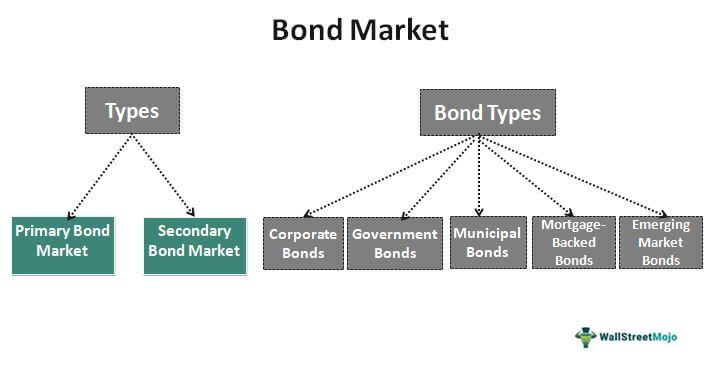

In today's fast-paced financial world, understanding different financial instruments and markets is essential for both seasoned investors and newcomers. The bond market is a significant component of the global economy, where debt securities like bonds are issued and traded. Bonds provide a mechanism for governments and corporations to raise funds for various initiatives and projects, making them integral to both macroeconomic stability and corporate finance. Unlike stocks, which represent ownership in a company, bonds are a form of debt, wherein the issuer is obligated to pay a specified interest rate over a given period and repay the principal amount upon maturity.

Algorithmic trading has increasingly influenced the way these securities are traded. Algorithmic trading, which uses computer algorithms and electronic trading systems to execute trade orders, has transformed financial markets by providing speed, accuracy, and unprecedented efficiency. This technological advancement has been a game-changer, particularly in terms of liquidity and market dynamics, challenging traditional trading methods. The algorithms facilitate rapid data analysis and decision-making processes, enabling traders to optimize their portfolios and exploit market inefficiencies swiftly.

Given these dynamics, understanding the mechanics and implications of algorithmic trading in the bond market is crucial. As the bond market continues to evolve with technological advancements, the role of algorithmic trading becomes increasingly significant. This article provides a comprehensive overview of the bond market, debt securities, and the role of algorithmic trading within this space. By exploring these aspects, investors can better prepare themselves to navigate the complex landscape of modern financial markets, positioning themselves strategically in a world where technology continues to reshape the rules of engagement.

## Table of Contents

## Understanding Financial Instruments in the Bond Market

Financial instruments are essential components of global financial markets, encapsulating a diverse array of assets including bonds, stocks, and derivatives. These instruments facilitate the transfer of capital between borrowers and lenders, allowing for efficient allocation of resources and risk management. Among these, bonds play a critical role as a type of debt security, where the issuer is obliged to repay the principal amount to the bondholder upon maturity, in addition to periodic interest payments, commonly known as coupon payments.

Bonds are structured financial agreements that serve as a vital means for issuers to raise capital. The terms of a bond are established in a legal document called an indenture, which specifies the bond's interest rate, maturity date, and payment schedule. The interest payment, or coupon, is typically expressed as a percentage of the bond's face value and is paid at predetermined intervals.

Key participants in the bond market include governments, corporations, and financial institutions, each with varying motives and requirements for issuing bonds. Governments issue bonds, such as Treasury bonds in the United States, to fund public projects and manage fiscal policies. These bonds are generally considered low-risk due to the government's authority to levy taxes and print currency, making them an attractive option for risk-averse investors.

Corporations issue bonds to support business operations, expansion projects, or refinance existing debts. Corporate bonds typically offer higher yields than government bonds, reflecting the additional credit risk assumed by investors. The creditworthiness of these bonds is assessed by rating agencies, providing investors with an indication of default risk.

Financial institutions, including banks and insurance companies, also engage in bond issuance to strengthen their [liquidity](/wiki/liquidity-risk-premium) positions and satisfy regulatory requirements. The bond market provides these institutions with a mechanism for managing their balance sheets while ensuring compliance with financial regulations.

In conclusion, financial instruments such as bonds are pivotal for the functionality and stability of financial markets. They enable parties to achieve their financial goals by facilitating resource transfer and risk distribution. Understanding the characteristics and differences between various types of bonds is crucial for investors to manage risk and optimize returns in their investment portfolios efficiently.

## The Role and Types of Debt Securities

Debt securities are a fundamental component of financial markets, essentially representing a promise by the issuer to repay the borrowed principal along with agreed-upon interest. These instruments are critical for both issuers and investors, serving as a means to raise capital and a vehicle for investment yield, respectively.

### Types of Debt Securities

1. **Government Bonds**: These are securities issued by national governments and are often considered low-risk investments due to the implied guarantee of the government's ability to meet its debt obligations. The most well-known are U.S. Treasuries, which include Treasury bills, notes, and bonds, each differing in terms of maturity and yield. For instance, U.S. Treasury bonds have maturities typically ranging from 10 to 30 years and pay semi-annual interest.

2. **Corporate Bonds**: Issued by companies as a way to raise capital for expansion, acquisitions, or other business activities, corporate bonds usually come with higher yields than government bonds to compensate for the increased risk. The risk level varies significantly across different corporations, often reflected in the bond's credit rating. High-yield bonds, or "junk bonds," offer even greater returns but come with higher risk.

3. **Municipal Bonds**: These are issued by states, cities, or other local government entities and are generally used to fund public projects such as infrastructure developments. An attractive feature of municipal bonds in the U.S. is that their interest payments are often exempt from federal income taxes, and sometimes state and local taxes, making them appealing to investors in high tax brackets.

4. **Mortgage-Backed Securities (MBS)**: These are a type of asset-backed security that is secured by a collection of mortgages. Investors in MBS are essentially lending money to homebuyers or owners, with the mortgage payments passing through to the security holders. The intricate structure of MBS can involve significant risk, particularly related to prepayment and interest rate fluctuations.

### Managing Risk and Return

Understanding the distinctions between these debt securities is crucial for portfolio management. Investors must assess various factors, including maturity, credit risk, [interest rate](/wiki/interest-rate-trading-strategies) sensitivity, and the specific tax implications associated with each security type. For example, government bonds might suit a risk-averse investor looking for stability, while corporate bonds could attract those seeking higher returns. Municipal bonds could provide tax advantages for certain investors, whereas MBS might appeal to those interested in higher yields with a willingness to accept complexity and risk.

Analyzing the yields and risks associated with these investments can involve complex calculations, often supported by financial modeling and statistical analysis. For example, calculating the current yield of a bond is a simple yet useful measure:

$$
\text{Current Yield} = \frac{\text{Annual Interest Payment}}{\text{Current Market Price}}
$$

More sophisticated models may be employed to assess risk and returns over longer periods or under varying economic scenarios, reinforcing the value of financial expertise in the management of debt securities.

## Algorithmic Trading in the Bond Market

Algorithmic trading employs automated systems to execute trading decisions using pre-programmed instructions. This practice, initially more common in stock markets, is increasingly reshaping bond markets, delivering enhanced speed and operational efficiency. In the bond market, the complex and often heterogeneous nature of debt instruments requires swift and informed decision-making, for which algorithms are particularly well-suited.

The automation inherent in [algorithmic trading](/wiki/algorithmic-trading) significantly boosts the ability to process large datasets rapidly. Unlike traditional trading methods, which rely heavily on human intuition and slower manual processes, algorithms can scan vast amounts of market data, identifying patterns and opportunities that may not be immediately visible to human traders. This ability to manage and interpret data is crucial, especially for bonds, where variables such as interest rates, credit ratings, and issuer-specific information must be quickly analyzed to make effective trading decisions.

Furthermore, algorithms are capable of executing trades far more quickly than manual processes. The speed of execution can be crucial in the bond market, where price fluctuations, although generally less volatile than in stock markets, can still impact profitability if not reacted to promptly. Algorithms can place hundreds or thousands of orders across multiple platforms and markets simultaneously, offering significant advantages in market responsiveness and timing.

In addition to fast execution, algorithms also enhance portfolio optimization strategies. They facilitate the continual assessment of a wide range of debt instruments across varied market conditions, optimizing for risk-adjusted returns. By continuously evaluating price movements, liquidity, and other key factors, algorithms help in dynamically rebalancing portfolios to achieve targeted financial goals.

Overall, algorithmic trading is a transformative force in bond markets, helping traders overcome the challenges associated with data [volume](/wiki/volume-trading-strategy) and complexity while capitalizing on fleeting market opportunities. The ongoing integration of algorithms into bond trading practices promises even greater efficiency improvements and operational enhancements in future financial landscapes.

## Benefits and Challenges of Algo Trading in Debt Securities

The integration of algorithmic trading within bond markets offers several benefits, notably enhancing liquidity, transparency, and market efficiency. Liquidity, or the ease with which a security can be bought or sold in the market without affecting its price, is crucial for the smooth functioning of bond markets. Algorithmic trading increases liquidity by enabling faster and more efficient trading processes, facilitating higher trading volumes, and reducing bid-ask spreads. This increased activity allows for quicker price discovery, ensuring that market prices more accurately reflect the underlying value of the securities being traded.

Transparency is another significant advantage brought about by algorithmic trading. The use of algorithms allows market participants to have improved access to real-time data, creating a more predictable and visible market environment. This transparency is beneficial for both individual and institutional investors as it reduces information asymmetry and supports more informed decision-making. Furthermore, algorithmic trading can contribute to enhanced market efficiency by processing vast amounts of data quickly, allowing for the execution of trades at optimal times and prices. This contributes to the reduction of transaction costs and errors associated with manual trading processes.

Despite these benefits, algorithmic trading in the bond market also presents several challenges. Market fragmentation is a notable issue, arising from the presence of multiple trading platforms and venues that can lead to inconsistent pricing and reduced liquidity in poorer connected markets. This fragmentation can hinder the seamless execution of trades and disrupt the continuity of the market.

Data inconsistencies pose another challenge, given the reliance on accurate and timely data for algorithmic trading strategies. Discrepancies in data sources or delays in data transmission can result in suboptimal trading decisions and increased risks. Moreover, technological barriers, such as the need for sophisticated infrastructure and high-speed connectivity, can limit the accessibility of algorithmic trading to smaller market participants, potentially creating disparities in market participation.

Addressing these challenges to fully harness the benefits of algorithmic trading requires advancements in data analytics to ensure data accuracy and timeliness. Improved data harmonization can aid in overcoming the fragmentation and inconsistency issues, thus supporting the smooth functioning of algorithmic strategies. Additionally, regulatory adaptations are necessary to maintain fair and transparent markets. Regulatory bodies need to continually update and enforce guidelines that accommodate new technologies while protecting market integrity and investor interests. By addressing these challenges, the bond market can benefit more extensively from the efficiencies and innovations that algorithmic trading promises.

## Future Prospects and Developments

The future of the bond market is poised for transformation, driven by technological advancements and the increasing integration of [artificial intelligence](/wiki/ai-artificial-intelligence) (AI). These elements are set to redefine trading strategies, market accessibility, and the overall landscape of bond trading.

Predictive analytics are expected to play a pivotal role in the evolution of the bond market. By utilizing sophisticated algorithms and AI-driven models, investors and financial institutions can analyze vast datasets to predict market trends and price movements with greater accuracy. This capability not only facilitates more informed decision-making but also enhances the ability to manage risks effectively. For instance, [machine learning](/wiki/machine-learning) models can be trained to identify patterns and behaviors in historical bond price data, potentially improving forecasting accuracy.

Data harmonization will be another critical development. Inconsistencies and fragmentation of data across different platforms and markets are ongoing challenges. Future technology aims to streamline and standardize data collection and analysis processes. By ensuring that data is accurate and consistent across the board, market participants can have a clearer and more unified view of market conditions. This clarity is essential for executing trades with confidence and efficiency.

As algorithmic trading becomes increasingly sophisticated, its role in the bond market will expand. Future algorithms are likely to incorporate machine learning and AI, enabling them to adapt and respond to market conditions in real time. This capability will allow for the execution of complex trading strategies that were once impossible, potentially leading to greater market efficiency and reduced transaction costs.

Investors and market participants who understand and adapt to these technological trends will be well-positioned to seize new opportunities in the bond market. Those who leverage AI and predictive analytics will gain a competitive edge, driving advancements in strategies and improving portfolio performance. However, it is equally important to remain vigilant regarding ethical considerations and regulatory compliance as technology continues to advance.

## Conclusion

The bond market remains a pivotal component of the financial ecosystem, offering diverse opportunities and challenges that require careful consideration by all market participants. As an essential avenue for governments, corporations, and financial institutions to secure funding, the bond market facilitates capital flow across various sectors of the economy. This interconnectivity underscores its significance in maintaining economic stability and growth.

Algorithmic trading is reshaping this landscape by introducing enhanced efficiency and innovation. By leveraging automated systems and sophisticated algorithms, market participants can execute transactions with unprecedented speed and accuracy. This surge in efficiency not only increases market liquidity but also improves price discovery, making the bond market more transparent and attractive to a broader range of investors. As algorithms continue to evolve, they promise further advancements in trade execution and risk management strategies, allowing investors to optimize their portfolios more effectively.

However, the rapid incorporation of technology in bond trading also presents new challenges. The complexities of algorithmic trading require a deep understanding of both financial markets and technological infrastructure. Additionally, market fragmentation and data inconsistencies need to be addressed to ensure fair trading practices. Regulators and market participants must work collaboratively to navigate these obstacles and capitalize on the opportunities algorithmic trading presents.

In conclusion, investors must stay informed about these changes to navigate bond market complexities effectively. Keeping abreast of technological advancements and regulatory developments is vital for identifying and exploiting growth potential within the bond market. As this sector continues to evolve, those equipped with the knowledge and tools to adapt swiftly will be best positioned to succeed in this dynamic financial landscape.

## References & Further Reading

[1]: Fabozzi, F. J., & Mann, S. V. (Eds.). (2005). ["The Handbook of Fixed Income Securities"](https://www.mhebooklibrary.com/doi/book/10.1036/9781260473902?contentTab=true). McGraw-Hill Education.

[2]: DeGennaro, R. P. (1990). ["Fixed-income analysis"](https://papers.ssrn.com/sol3/papers.cfm?abstract_id=380520). Financial Analysts Journal, 46(3), 41-52.

[3]: Gomber, P., Arndt, B., Lutat, M., & Uhle, T. (2011). ["High-frequency trading"](https://papers.ssrn.com/sol3/papers.cfm?abstract_id=1858626). Business & Information Systems Engineering, 3(2), 89-93.

[4]: Chordia, T., Roll, R., & Subrahmanyam, A. (2008). ["Liquidity and market efficiency"](https://www.sciencedirect.com/science/article/pii/S0304405X07001833). Journal of Financial Economics, 87(2), 249-268.

[5]: Tresch, R. W. (2002). ["Public Sector Economics"](https://books.google.com/books/about/Public_Sector_Economics.html?id=NiFHEAAAQBAJ). Palgrave Macmillan.