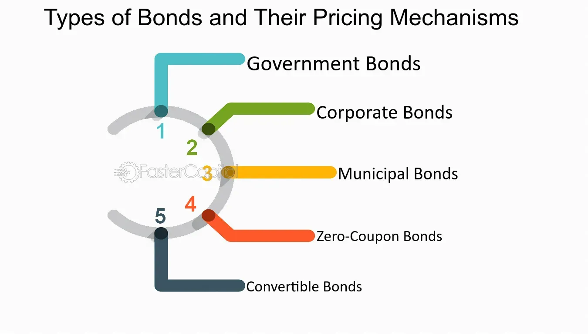

## Table of Contents

## What is a bond and how does it function in the financial market?

A bond is like a loan that you give to a government or a company. When you buy a bond, you are lending them money. In return, they promise to pay you back the amount you lent them, called the principal, on a specific date, known as the maturity date. They also agree to pay you interest regularly, usually every six months, until the bond matures. This interest is called the coupon.

In the financial market, bonds are important because they help governments and companies raise money to fund their projects or operations. For example, a city might issue bonds to build a new school, or a company might issue bonds to expand its business. Investors buy these bonds because they want a steady income from the interest payments and the safety of getting their money back at maturity. The price of a bond can go up or down depending on interest rates and the financial health of the issuer. If interest rates rise, new bonds will pay more interest, so the price of existing bonds usually falls. If the issuer's financial situation worsens, the bond's price might also drop because it's riskier.

## What are the basic components of a bond?

A bond has several basic parts that help you understand what you're getting into. The first part is the face value, which is the amount of money you'll get back when the bond matures. This is also called the par value. The second part is the coupon rate, which is the interest rate the bond pays. This tells you how much money you'll get every year as a percentage of the face value. The third part is the maturity date, which is when the bond will pay you back the face value.

Another important part of a bond is the issuer, which is the government or company that's borrowing the money from you. The bond's rating, given by agencies like Moody's or Standard & Poor's, tells you how safe the bond is. A higher rating means it's less risky. The yield is another key part, which is the return you get on your investment, taking into account the bond's price and coupon payments. Finally, the bond's price can change over time, and it's usually quoted as a percentage of the face value. If you buy a bond at a discount or premium, it affects your overall return.

## How is the price of a bond determined?

The price of a bond is determined by several factors, but the most important ones are interest rates and the bond's credit rating. When interest rates go up, new bonds come out with higher coupon rates, making older bonds with lower rates less attractive. So, to sell these older bonds, their prices have to go down. On the other hand, when interest rates go down, older bonds with higher rates become more valuable, and their prices go up. The bond's credit rating also affects its price. If the issuer's financial situation gets worse, the bond's rating might drop, making it riskier to own. When a bond is riskier, investors want a higher return, so the bond's price goes down.

Another factor that affects a bond's price is how long it has until it matures. Bonds that will mature soon are less affected by [interest rate](/wiki/interest-rate-trading-strategies) changes than bonds that will mature far in the future. This is because the sooner a bond matures, the sooner you get your money back, and you can reinvest it at the new interest rates. Also, the bond's coupon rate matters. If a bond has a high coupon rate, it pays more interest, which can make it more attractive even if interest rates rise a bit. All these factors together help determine the price of a bond in the market.

## What is the relationship between bond prices and interest rates?

Bond prices and interest rates have an opposite relationship. When interest rates go up, bond prices go down. This happens because new bonds are issued with higher interest rates, making older bonds with lower rates less attractive to investors. To sell these older bonds, their prices need to be lowered. On the other hand, when interest rates go down, bond prices go up. This is because older bonds with higher interest rates become more valuable compared to the new bonds with lower rates, so investors are willing to pay more for them.

The length of time until a bond matures also plays a role in this relationship. Bonds that will mature soon are less affected by changes in interest rates because investors will get their money back sooner and can reinvest it at the new rates. Bonds that have a long time until they mature are more sensitive to interest rate changes because investors have to wait longer to get their money back. So, understanding how interest rates and bond prices move in opposite directions is key to making smart decisions about buying and selling bonds.

## What are the different types of bond pricing mechanisms?

There are different ways to price bonds, and each method depends on what information you have and what you want to know. One common way is the present value method, which calculates what the bond's future payments are worth right now. You use the bond's coupon payments and the face value it will pay at maturity. You discount these payments back to today using the current interest rate, or yield. If the interest rate goes up, the present value of the bond goes down, and if the interest rate goes down, the present value goes up.

Another way to price bonds is the yield to maturity (YTM) method. This tells you the total return you'll get if you hold the bond until it matures. YTM takes into account the bond's current price, its coupon payments, and the face value at maturity. It's like an average rate of return, but it assumes you reinvest all the coupon payments at the same rate. If you buy a bond at a discount (below face value), the YTM will be higher than the coupon rate, and if you buy it at a premium (above face value), the YTM will be lower than the coupon rate.

The third method is the current yield, which is simpler but doesn't give you the whole picture. It's just the annual coupon payment divided by the bond's current market price. This method is quick and easy but doesn't consider the bond's price changes over time or the face value you'll get at maturity. It's useful for comparing the income from different bonds but doesn't tell you about the bond's total return like YTM does.

## How does the yield to maturity affect bond pricing?

Yield to maturity (YTM) is a big deal when it comes to figuring out how much a bond is worth. It's like the total return you'd get if you kept the bond until it matures. YTM takes into account the bond's current price, the interest payments you get along the way, and the face value you get back at the end. If you buy a bond for less than its face value, the YTM will be higher than the interest rate the bond pays because you're getting a good deal. But if you buy it for more than the face value, the YTM will be lower because you paid extra for it.

When the YTM goes up, the price of the bond goes down. This happens because if people can get a better return from new bonds, they won't want to pay as much for the old ones. On the flip side, if the YTM goes down, the price of the bond goes up. This is because the old bonds with higher interest rates look better compared to the new ones with lower rates, so people are willing to pay more for them. So, YTM is a key part of understanding how much a bond is worth and how its price might change over time.

## What role do credit ratings play in bond market pricing?

Credit ratings are like a report card for bonds. They tell investors how likely it is that the company or government that issued the bond will be able to pay back the money they borrowed. Agencies like Moody's, Standard & Poor's, and Fitch give these ratings. A high rating, like AAA or AA, means the bond is safe and the issuer is very likely to pay back the money. A low rating, like BB or below, means the bond is riskier and there's a bigger chance the issuer might not pay back the money. When a bond has a high credit rating, investors feel safer, so they're willing to pay more for it. But if the rating is low, investors want a higher return to take on the extra risk, which means the bond's price goes down.

These ratings can change over time based on how the issuer's financial situation changes. If a company starts doing better or the economy gets stronger, the rating might go up, which can make the bond's price go up too. But if the company starts struggling or the economy gets worse, the rating might go down, and that can make the bond's price drop. So, credit ratings are a big deal in the bond market because they help investors decide how much to pay for a bond and how much risk they're taking on.

## How do market conditions influence bond pricing?

Market conditions play a big role in deciding how much a bond is worth. One of the main things that affect bond prices is interest rates. When interest rates go up, new bonds come out with higher rates, making old bonds with lower rates less attractive. So, to sell those old bonds, their prices have to drop. On the other hand, if interest rates go down, old bonds with higher rates become more valuable, and their prices go up. Another thing that matters is how the economy is doing. If the economy is doing well, people might think that interest rates will go up soon, so bond prices might go down. But if the economy is struggling, people might think interest rates will stay low or even go down, which can make bond prices go up.

Credit ratings also change with market conditions. If a company or government is doing well, their credit rating might go up, making their bonds safer and more valuable. But if they're struggling, their rating might drop, making their bonds riskier and less valuable. Inflation is another factor. If people expect prices to go up a lot, they'll want a higher return from their bonds to make up for it, which means bond prices might go down. On the other hand, if inflation is low, bond prices might go up because the returns look better compared to rising prices. So, all these things together—interest rates, the economy, credit ratings, and inflation—help decide how much a bond is worth in the market.

## What is the difference between clean and dirty bond prices?

When you look at bond prices, you might see two different numbers: the clean price and the dirty price. The clean price is the basic price of the bond without counting any interest that has built up since the last time the bond paid interest. It's like the price tag on the bond itself. The dirty price, on the other hand, includes this built-up interest, which is called accrued interest. So, the dirty price is the total amount you'd actually pay if you bought the bond right now, including both the bond's value and the interest it has earned but hasn't paid out yet.

The reason we have these two prices is because bonds pay interest at certain times, usually every six months. If you buy a bond between these times, you'll get the next interest payment, but part of that payment will be for the time the previous owner held the bond. The dirty price makes sure that the seller gets paid for the interest they earned while they owned the bond, and the buyer pays for the bond plus that interest. So, the clean price is simpler and easier to compare between different bonds, while the dirty price gives you the full picture of what you'll actually pay.

## How are bond prices affected by inflation expectations?

Inflation expectations play a big role in deciding how much a bond is worth. When people think that prices will go up a lot in the future, they expect inflation to be high. This makes them want a higher return from their bonds to make up for the money they'll lose to inflation. So, if inflation expectations go up, bond prices usually go down. This is because investors want more interest to keep up with rising prices, and to offer that higher interest, the price of the bond has to drop.

On the other hand, if people think inflation will stay low or even go down, bond prices tend to go up. This is because the interest payments from the bond will be worth more in the future if prices aren't rising much. So, when inflation expectations are low, investors are happy to pay more for bonds because the returns look better compared to what they might lose to inflation. In short, inflation expectations and bond prices move in opposite directions: higher inflation expectations mean lower bond prices, and lower inflation expectations mean higher bond prices.

## What advanced models are used for bond pricing and valuation?

Advanced models for bond pricing and valuation help investors figure out how much a bond is worth in a more detailed way. One popular model is the discounted cash flow (DCF) model. This model looks at all the money the bond will pay out in the future, like interest payments and the face value at maturity, and figures out what those payments are worth right now. It does this by using a discount rate, which is usually based on the bond's yield to maturity or the market interest rate. If the discount rate goes up, the bond's price goes down because future payments are worth less today. If the discount rate goes down, the bond's price goes up because future payments are worth more today.

Another advanced model is the binomial model, which is good for pricing bonds that can be called back by the issuer before they mature. This model breaks down the bond's life into smaller time periods and looks at different possible paths for interest rates. At each step, it figures out the bond's value based on whether it's better to keep the bond or call it back. By working backward from the bond's maturity, the model can find the bond's value today. This model is more complicated but helps investors understand how changes in interest rates and the chance of the bond being called back can affect its price.

## How do global economic factors impact bond market pricing mechanisms?

Global economic factors have a big impact on how much bonds are worth. One big thing is what's happening in other countries' economies. If a big economy like the U.S. or China is doing well, it can make interest rates go up around the world. When interest rates go up, new bonds come out with higher rates, so old bonds with lower rates become less valuable, and their prices go down. On the other hand, if a big economy is struggling, interest rates might stay low or even go down, making old bonds with higher rates more valuable, and their prices go up. Another thing is how much people trust the money from different countries. If a country's money is seen as safe, investors might want to buy bonds from that country, pushing up the prices. But if a country's money is seen as risky, investors might not want those bonds, making their prices go down.

Exchange rates also play a role in bond pricing. If a country's money gets stronger compared to other countries, it can make their bonds more attractive to foreign investors because they'll get more of their own money back when they sell the bond or get interest payments. This can push up the bond's price. But if a country's money gets weaker, their bonds might not look as good to foreign investors, and the prices might go down. Also, big global events like wars, natural disasters, or pandemics can shake up the bond market. These events can make investors nervous and want to move their money to safer places, like bonds from strong, stable countries. This can push up the prices of those bonds, while bonds from countries seen as riskier might see their prices drop.

## What is the importance of accurate pricing in the bond market?

Bond prices are primarily determined by the present value of their future cash flows, which include periodic coupon payments and the final principal repayment. The price calculation employs the following formula:

$$
P = \sum_{t=1}^{N} \frac{C}{(1+y)^t} + \frac{F}{(1+y)^N}
$$

where $P$ is the bond price, $C$ is the coupon payment, $F$ is the face value, $y$ is the yield or required rate of return, and $N$ is the number of periods until maturity. This equation highlights that bond prices are inversely related to changes in interest rates—when interest rates rise, bond prices typically fall, and vice versa.

Interest rates play a significant role in bond pricing as they serve as the discount rate in the aforementioned formula. Changes in the prevailing interest rates can markedly affect the yield required by investors, thereby influencing bond prices. For instance, rising interest rates generally decrease the present value of future cash flows, reducing bond prices.

Credit ratings are another crucial [factor](/wiki/factor-investing) in determining bond prices. Credit rating agencies assess the creditworthiness of bond issuers, classifying bonds based on their risk of default. Higher-rated bonds, such as those rated AAA, are perceived as less risky and, hence, tend to trade at higher prices than lower-rated bonds given the same terms, because investors are confident in receiving future payments.

Accurate bond pricing directly impacts investment decisions and portfolio management. Investors rely on precise pricing to make informed buy/sell decisions and structure portfolios in alignment with their risk tolerance, investment objectives, and market expectations. Inaccurate bond pricing can mislead investors, potentially resulting in suboptimal investment choices, unexpected losses, and ineffective portfolio diversification.

The risks associated with inaccurate bond pricing are manifold. They include potential misvaluation of financial assets, leading to the allocation of capital based on erroneous assumptions. This mispricing can further result in unexpected [volatility](/wiki/volatility-trading-strategies) and risk exposure, adversely impacting both individual and institutional investors. In capital markets, systemic mispricing could undermine trust and lead to inefficiencies.

Technological advancements are enhancing the accuracy of bond pricing. Innovations such as [machine learning](/wiki/machine-learning) and [artificial intelligence](/wiki/ai-artificial-intelligence) enable the analysis of large datasets, capturing nuanced market signals and improving price forecasting models. Platforms leveraging real-time data and advanced analytics provide investors with more precise valuations. Blockchain technology also promises increased transparency and auditability in bond pricing and trading processes.

In conclusion, accurate bond pricing is critical for informed investment decisions, effective portfolio management, and maintaining market stability. Interest rates and credit ratings are primary factors influencing bond prices, while technological advancements are increasingly pivotal in achieving precision in pricing. The alignment of these elements facilitates the development of robust strategies for both institutional and individual market participants.

## References & Further Reading

[1]: Bergstra, J., Bardenet, R., Bengio, Y., & Kégl, B. (2011). ["Algorithms for Hyper-Parameter Optimization."](https://papers.nips.cc/paper/4443-algorithms-for-hyper-parameter-optimization) Advances in Neural Information Processing Systems 24.

[2]: ["Advances in Financial Machine Learning"](https://www.amazon.com/Advances-Financial-Machine-Learning-Marcos/dp/1119482089) by Marcos Lopez de Prado

[3]: ["Evidence-Based Technical Analysis: Applying the Scientific Method and Statistical Inference to Trading Signals"](https://www.amazon.com/Evidence-Based-Technical-Analysis-Scientific-Statistical/dp/0470008741) by David Aronson

[4]: ["Machine Learning for Algorithmic Trading"](https://github.com/stefan-jansen/machine-learning-for-trading) by Stefan Jansen

[5]: ["Quantitative Trading: How to Build Your Own Algorithmic Trading Business"](https://www.amazon.com/Quantitative-Trading-Build-Algorithmic-Business/dp/1119800064) by Ernest P. Chan