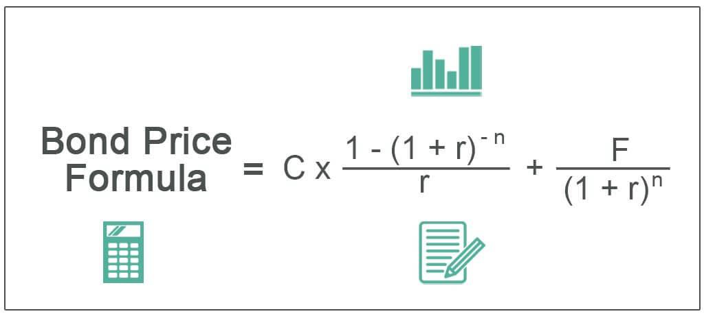

The financial instruments market encompasses a diverse array of assets, including equities, derivatives, currencies, and fixed-income securities such as bonds. These instruments facilitate the transfer of risk, liquidity provision, and capital allocation across the global financial system. Bonds, in particular, play a crucial role in this market, offering a mechanism for governments and corporations to raise capital and for investors to gain predictable income streams.

Pricing in the bond market is of paramount importance, as it directly influences the returns for investors and the cost of borrowing for issuers. Accurately pricing bonds requires an understanding of various factors, including interest rates, credit ratings, and macroeconomic conditions. These variables impact the yield and risk assessment of bonds, ultimately determining their market value and attractiveness to investors.



Algorithmic trading has emerged as a transformative force within the bond market, leveraging advanced computational models to execute trades at high speed and with precision. This technology enables the analysis and processing of large datasets, allowing for informed decision-making and optimized trading strategies. Algorithmic trading enhances market efficiency by increasing liquidity, lowering transaction costs, and reducing the potential for pricing errors.

This article aims to provide readers with a comprehensive understanding of the bond market's intricacies, focusing on the significance of accurate pricing and the role of algorithmic trading in shaping modern financial markets. It will explore the elements that influence bond pricing, the mechanics of algorithmic trading, and strategies for developing effective trading algorithms. Additionally, it addresses the challenges and emerging trends that impact the bond market's evolution and the potential future landscape of algorithmic trading. 

Accurate pricing and efficient trading strategies are vital for maintaining stable and transparent financial markets. As stakeholders strive for innovation, the adoption of advanced technologies and methodologies will be key to enhancing market efficiency and driving the bond market's continued growth and stability.

## Table of Contents

## Understanding Financial Instruments and the Bond Market

## Understanding Financial Instruments and the Bond Market

Financial instruments are contracts that create a financial asset for one entity and a financial liability or equity instrument for another. They can be broadly categorized into equity instruments, debt instruments, and derivatives. Common examples include stocks, bonds, futures, options, and swaps. Each serves different purposes in financial markets, providing mechanisms for raising capital, transferring risk, or facilitating trade and investment.

Bonds, as debt instruments, are a fundamental component of the financial market. They are essentially loans made by investors to borrowers, typically corporations or governments. The bond issuer promises to pay back the principal amount, called the face value, on a specified maturity date and, in most cases, to make periodic interest payments, known as coupons. Bonds are attractive to investors due to their relative stability and predictable returns compared to equities.

The global bond market is one of the largest financial markets, with an estimated size exceeding $100 trillion as of recent years. This market serves as a vital source for the funding of public and private sector activities. Government bonds, such as U.S. Treasuries, constitute a significant portion, providing critical benchmarks for other interest rates. Corporate bonds form another substantial segment, offering higher yields to compensate for higher default risks.

Key players in the bond trading ecosystem include governments, central banks, institutional investors, brokerage firms, and rating agencies. Governments and corporations issue bonds to fulfill funding needs, while institutional investors, like pension funds, mutual funds, and insurance companies, invest in them for income and diversification. Central banks often use bond transactions as part of monetary policy operations. Rating agencies assess creditworthiness, influencing bond pricing and demand.

The bond market faces various challenges and opportunities. Market participants must navigate [interest rate](/wiki/interest-rate-trading-strategies) fluctuations, which can significantly impact bond prices and the cost of borrowing. Credit risk remains a central concern, particularly in corporate bond markets. Technological advancements, including electronic trading platforms and data analytics, offer opportunities for improved price discovery and trade execution. Additionally, sustainable finance is gaining [momentum](/wiki/momentum), with green bonds offering a way to invest in environmentally beneficial projects, expanding the scope and appeal of bond investing.

Overall, the bond market remains integral to the global financial system, affecting economies and financial strategies worldwide. Its stability and growth are continually shaped by economic factors, regulatory environments, and technological progress.

## The Importance of Accurate Pricing in the Bond Market

Bond prices are primarily determined by the present value of their future cash flows, which include periodic coupon payments and the final principal repayment. The price calculation employs the following formula:

$$
P = \sum_{t=1}^{N} \frac{C}{(1+y)^t} + \frac{F}{(1+y)^N}
$$

where $P$ is the bond price, $C$ is the coupon payment, $F$ is the face value, $y$ is the yield or required rate of return, and $N$ is the number of periods until maturity. This equation highlights that bond prices are inversely related to changes in interest rates—when interest rates rise, bond prices typically fall, and vice versa.

Interest rates play a significant role in bond pricing as they serve as the discount rate in the aforementioned formula. Changes in the prevailing interest rates can markedly affect the yield required by investors, thereby influencing bond prices. For instance, rising interest rates generally decrease the present value of future cash flows, reducing bond prices.

Credit ratings are another crucial [factor](/wiki/factor-investing) in determining bond prices. Credit rating agencies assess the creditworthiness of bond issuers, classifying bonds based on their risk of default. Higher-rated bonds, such as those rated AAA, are perceived as less risky and, hence, tend to trade at higher prices than lower-rated bonds given the same terms, because investors are confident in receiving future payments.

Accurate bond pricing directly impacts investment decisions and portfolio management. Investors rely on precise pricing to make informed buy/sell decisions and structure portfolios in alignment with their risk tolerance, investment objectives, and market expectations. Inaccurate bond pricing can mislead investors, potentially resulting in suboptimal investment choices, unexpected losses, and ineffective portfolio diversification.

The risks associated with inaccurate bond pricing are manifold. They include potential misvaluation of financial assets, leading to the allocation of capital based on erroneous assumptions. This mispricing can further result in unexpected [volatility](/wiki/volatility-trading-strategies) and risk exposure, adversely impacting both individual and institutional investors. In capital markets, systemic mispricing could undermine trust and lead to inefficiencies.

Technological advancements are enhancing the accuracy of bond pricing. Innovations such as [machine learning](/wiki/machine-learning) and [artificial intelligence](/wiki/ai-artificial-intelligence) enable the analysis of large datasets, capturing nuanced market signals and improving price forecasting models. Platforms leveraging real-time data and advanced analytics provide investors with more precise valuations. Blockchain technology also promises increased transparency and auditability in bond pricing and trading processes.

In conclusion, accurate bond pricing is critical for informed investment decisions, effective portfolio management, and maintaining market stability. Interest rates and credit ratings are primary factors influencing bond prices, while technological advancements are increasingly pivotal in achieving precision in pricing. The alignment of these elements facilitates the development of robust strategies for both institutional and individual market participants.

## Algorithmic Trading: Revolutionizing the Bond Market

Algorithmic trading, also known as algo trading, refers to the use of computer algorithms to automate trading strategies. This approach involves leveraging complex mathematical models and high-speed data analysis to make trading decisions at speeds and volumes that are impossible for human traders alone. In the context of the bond market, [algorithmic trading](/wiki/algorithmic-trading) plays a pivotal role in enhancing trading efficiency and precision.

In the bond market, algorithms analyze various data inputs, such as interest rates, economic indicators, and market trends, to execute trades. These algorithms are designed to optimize trading performance by automatically executing buy or sell orders when predefined criteria are met. Algorithms can handle large volumes of data rapidly, making split-second decisions, which is crucial given the bond market's vastness and complexity.

The benefits of using algorithms for trading bonds are numerous. First, they significantly increase trading speed, allowing traders to capitalize on fleeting market opportunities. Second, algorithms reduce human error, which can be costly in high-stakes financial environments. Additionally, they enhance market efficiency by ensuring that prices reflect all available information, potentially reducing the bid-ask spread and transaction costs.

Algorithmic trading also impacts market [liquidity](/wiki/liquidity-risk-premium) and volatility. By providing consistent buy and sell orders, algorithms contribute to market liquidity, making it easier for participants to enter and [exit](/wiki/exit-strategy) positions without significantly affecting prices. However, there is a contentious debate over whether algo trading increases volatility. While some argue that high-frequency trading can exacerbate market swings, others suggest that improved [market making](/wiki/market-making) and liquidity dampen volatility.

Real-world examples of algorithmic trading success in the bond market include the use of machine learning algorithms to predict interest rate movements and optimize trading strategies. Firms such as BlackRock and JPMorgan have integrated sophisticated algo trading systems into their operations, leveraging technology to enhance decision-making and maintain a competitive edge in the marketplace.

Overall, algorithmic trading revolutionizes the bond market by bringing speed, efficiency, and data-driven precision to the forefront of trading activities. As technology continues to advance, the role of algorithmic trading in the bond market is likely to expand, further transforming the landscape of financial markets worldwide.

## Developing Effective Bond Market Algorithmic Trading Strategies

Developing effective bond market algorithmic trading strategies involves integrating advanced technologies and robust methodologies to optimize trade execution and enhance profitability. Key components and processes contribute to the sophistication and effectiveness of these strategies.

### Essential Components for Building Algorithmic Trading Models

Successful algorithmic trading models require a strong foundation composed of data collection, model selection, and parameter optimization. Data collection involves acquiring high-quality historical and real-time market data, essential for accurate modeling and decision-making. Model selection involves choosing appropriate algorithms that can efficiently process vast datasets to identify trading opportunities. Parameter optimization focuses on fine-tuning the model parameters to maximize performance while minimizing risk. These components ensure that the trading model is well-calibrated to adjust to market conditions.

### Backtesting and Validating Trading Algorithms for Bonds

Before deploying an algorithmic trading model, rigorous [backtesting](/wiki/backtesting) is needed to assess its performance under historical market conditions. This involves running the model against past market data to evaluate its predictive accuracy and risk profile. Performance metrics such as the Sharpe ratio, maximum drawdown, and alpha generation are crucial during this evaluation phase. The goal is to validate the strategy's effectiveness and ensure it can deliver robust results in various market scenarios.

Python is widely used for backtesting due to its comprehensive libraries and flexibility. An example code snippet for backtesting might look like this:

```python
import pandas as pd
import backtrader as bt

class BondStrategy(bt.SignalStrategy):
    def __init__(self):
        self.signal_add(bt.SIGNAL_LONG, lambda d: d.close[0] > d.close[-1])

data = bt.feeds.YahooFinanceData(dataname='AGG', fromdate=pd.Timestamp('2020-01-01'), todate=pd.Timestamp('2022-01-01'))
cerebro = bt.Cerebro()
cerebro.addstrategy(BondStrategy)
cerebro.adddata(data)
cerebro.run()
```

### Machine Learning and AI in Enhancing Trading Strategies

The integration of machine learning (ML) and artificial intelligence (AI) in bond market algorithms places a significant analytical edge in traders' hands. These technologies allow for the modeling of complex, non-linear relationships in market data, enabling the identification of subtle patterns and trends that traditional analysis might overlook. Algorithmic strategies can utilize techniques such as supervised learning for pattern recognition or [reinforcement learning](/wiki/reinforcement-learning) for continuous strategy improvement in changing market environments.

### Risk Management and Compliance in Algo Trading

Effective bond market algorithms incorporate comprehensive risk management frameworks to mitigate potential adverse impacts such as market risk, counterparty risk, and operational risk. Compliance with regulations is also critical, requiring traders to implement tools that ensure adherence to relevant legal and procedural standards. This includes maintaining algorithms that provide full traceability and auditing capabilities to satisfy regulatory scrutiny.

### Case Studies on Successful Bond Algo Trading Strategies

Several case studies shed light on successful implementations of bond market algorithmic trading strategies. For instance, large financial institutions have developed proprietary algorithms that leverage high-frequency trading to capitalize on inefficiencies in bond pricing. These strategies often integrate real-time data analytics to swiftly execute trades while maintaining a risk-balanced portfolio. Innovations such as clustering algorithms for segmentation and predictive modeling using AI have allowed firms to expand their trading reach while maintaining high levels of profitability and efficiency.

Overall, developing effective bond market algorithmic trading strategies requires a meticulous approach to model building, validation, and continuous enhancement through emerging technologies. These strategies, proficiently managed and regulated, offer a pathway to substantial improvements in trading precision and market dynamics understanding.

## Challenges and Future Trends in Bond Market Algorithmic Trading

Algorithmic trading in the bond market presents a series of challenges and opportunities, driving evolving trends that are reshaping the financial landscape. Despite its benefits, algorithmic trading faces several hurdles that traders and institutions must navigate. Key challenges include the complexity of accurately modeling the bond market's liquidity and unique characteristics, such as the diverse nature of bond instruments with varying maturities, credit ratings, and coupon structures. This complexity necessitates sophisticated algorithms capable of processing vast amounts of data to produce reliable trading signals. Given the illiquid nature of some bond markets, algorithms must adeptly adapt to ensure minimal market impact and avoid increasing volatility.

Regulatory considerations significantly impact algorithmic trading in bonds. Regulators worldwide strive to maintain market stability and protect investors, with frameworks like the EU’s Markets in Financial Instruments Directive II (MiFID II) establishing transparency and reporting requirements. These regulations mandate real-time data access and reporting, complicating compliance for algo traders. Moreover, firms must continually update their algorithms to align with evolving regulatory landscapes, which can be resource-intensive and require ongoing investment in technology and expertise.

Emerging trends in bond trading involve the integration of advanced technologies such as artificial intelligence (AI) and blockchain. AI enhances algorithmic trading by utilizing machine learning models that can learn from historical data and improve predictions. These models enable more precise pricing and risk assessment, fostering better decision-making. Meanwhile, blockchain technology promises to enhance transparency and efficiency in bond settlement processes, potentially reducing costs and time delays. Blockchain facilitates the tokenization of bonds, making digital assets a more prevalent trading instrument.

Looking to the future, the incorporation of AI and blockchain is set to accelerate, increasing the predictability and efficiency of trading algorithms. As AI models become more sophisticated, they are expected to handle increasingly complex datasets, producing more reliable outcomes. The adoption of blockchain could streamline bonding clearing and settlement, effectively creating a nascent market for digital bonds.

Digital bonds could significantly transform algo trading strategies. By standardizing bond characteristics and improving liquidity through tokenization, digital bonds can enable faster execution and more dynamic trading environments. This evolution may lead to more granular data analysis, real-time trading executions, and enhanced algorithmic efficiency. The potential benefits of digital bonds, such as increased transparency and automation, highlight an intriguing avenue for future growth in the algorithmic trading domain.

In conclusion, while the challenges in algorithmic trading within the bond market are significant, the strides made possible by AI, blockchain, and digital transformation provide compelling opportunities for innovation and efficiency. The ongoing evolution of this technology-dependent field necessitates that traders and institutions remain abreast of emerging trends and regulatory frameworks to leverage the full potential of algorithmic trading in bonds.

## Conclusion

The bond market plays a critical role in global finance, providing essential avenues for raising capital and managing investments. Accurate pricing in this market is vital, ensuring that both buyers and sellers can make informed and strategic decisions. With the advent of technological advancements, particularly algorithmic trading, the bond market has become more dynamic, offering increased efficiency and precision in trading activities. Algorithmic trading, which uses pre-programmed instructions for automated trading, has notably improved market liquidity and reduced volatility.

Looking forward, the evolution of financial instruments pricing and algorithmic trading in the bond market appears promising. As technology continues to advance, it is anticipated that pricing mechanisms will become even more sophisticated, integrating real-time data analytics and machine learning techniques. Such progress will likely lead to more accurate predictions and strategies, enhancing decision-making processes for investors and fund managers.

The bond market landscape is rapidly changing, driven by technological innovations and evolving market conditions. It is essential for stakeholders, including institutional investors, regulators, and technology providers, to embrace these changes. By adopting innovative trading strategies, they can leverage the benefits of increased efficiency, reduced transaction costs, and optimized portfolio management. 

There is a compelling call for continual investment in technology infrastructure and development. This investment is necessary to maintain market competitiveness, drive innovation, and sustain the integrity of the market. As the bond market's complexity grows, so does the need for advanced analytical tools and methodologies that deliver precise and reliable outcomes. Supporting ongoing technological advancements will help ensure that the bond market remains a robust and integral component of the global financial system.

## References & Further Reading

[1]: Bergstra, J., Bardenet, R., Bengio, Y., & Kégl, B. (2011). ["Algorithms for Hyper-Parameter Optimization."](https://papers.nips.cc/paper/4443-algorithms-for-hyper-parameter-optimization) Advances in Neural Information Processing Systems 24.

[2]: ["Advances in Financial Machine Learning"](https://www.amazon.com/Advances-Financial-Machine-Learning-Marcos/dp/1119482089) by Marcos Lopez de Prado

[3]: ["Evidence-Based Technical Analysis: Applying the Scientific Method and Statistical Inference to Trading Signals"](https://www.amazon.com/Evidence-Based-Technical-Analysis-Scientific-Statistical/dp/0470008741) by David Aronson

[4]: ["Machine Learning for Algorithmic Trading"](https://github.com/stefan-jansen/machine-learning-for-trading) by Stefan Jansen

[5]: ["Quantitative Trading: How to Build Your Own Algorithmic Trading Business"](https://www.amazon.com/Quantitative-Trading-Build-Algorithmic-Business/dp/1119800064) by Ernest P. Chan