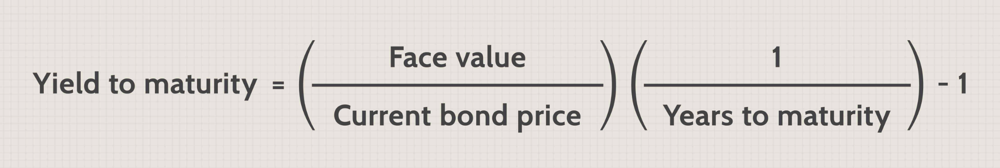

## Table of Contents

## What is bond maturity?

Bond maturity is when a bond reaches the end of its life. It's the date when the bond issuer has to pay back the money they borrowed to the person who bought the bond. This is important because it tells the investor how long they will have their money tied up in the bond.

When a bond matures, the investor gets back the face value of the bond. This is the amount the bond was worth when it was first issued. Sometimes, the bond might also pay interest regularly until it matures. Knowing the maturity date helps investors plan their finances and decide if the bond fits their investment goals.

## Why is the maturity date important for bond investors?

The maturity date is important for bond investors because it tells them when they will get their money back. When you buy a bond, you are lending money to the issuer, like a government or a company. The maturity date is when they promise to pay you back the full amount you lent them. Knowing this date helps investors plan their finances. They can figure out when they will have their money available again to use for other things or to reinvest.

Also, the maturity date helps investors match their investments with their financial goals. If someone needs their money back in a few years, they might choose a bond that matures around that time. On the other hand, if they can afford to wait longer, they might pick a bond with a later maturity date. This way, they can make sure their money is working for them until they need it back.

## What are the different types of bond maturity terms?

Bond maturity terms can be grouped into three main types: short-term, medium-term, and long-term. Short-term bonds usually mature in one to three years. They are good for people who want their money back quickly. Medium-term bonds mature in four to ten years. They are a middle ground for investors who can wait a bit longer but still want their money back within a reasonable time. Long-term bonds take more than ten years to mature. They are for people who can leave their money invested for a long time and are okay with waiting to get it back.

Each type of bond maturity term has its own benefits and risks. Short-term bonds are less risky because they mature quickly, but they usually offer lower interest rates. Medium-term bonds can offer a bit higher interest rates than short-term bonds because the money is tied up for longer. Long-term bonds often give the highest interest rates because investors have to wait the longest to get their money back. However, they are also the riskiest because a lot can change over many years, like interest rates or the financial health of the bond issuer.

## Can you explain the concept of a bond's term to maturity?

The term to maturity of a bond is how long it will be until the bond reaches its maturity date. This is the time from when you buy the bond until you get your money back from the issuer. It's important because it tells you how long your money will be tied up in the bond. If you buy a bond with a 5-year term to maturity, you will have to wait 5 years to get your money back, unless you sell the bond to someone else before it matures.

Different bonds have different terms to maturity. Short-term bonds might only last a year or two, while long-term bonds can go for 30 years or even more. The term to maturity affects how much interest you can earn and how risky the bond is. Shorter-term bonds are usually safer but offer less interest, while longer-term bonds can be riskier but might give you more interest because you're waiting longer to get your money back. Knowing the term to maturity helps you pick the right bond for your needs and how long you can wait to use your money again.

## What is a short-term bond and how does its maturity differ from long-term bonds?

A short-term bond is a type of bond that matures in a short amount of time, usually one to three years. When you buy a short-term bond, you are lending money to the issuer for just a little while. Because the money is tied up for a shorter time, these bonds are often seen as safer investments. They are good for people who want to get their money back quickly. However, because they are safer and the money is not locked up for long, short-term bonds usually offer lower interest rates compared to other types of bonds.

Long-term bonds, on the other hand, take much longer to mature, often more than ten years. When you invest in a long-term bond, you are agreeing to lend your money to the issuer for a long time. Because you have to wait longer to get your money back, long-term bonds are seen as riskier. A lot can change over many years, like interest rates or the financial health of the issuer. But because of this risk, long-term bonds usually offer higher interest rates to attract investors. They are better for people who can afford to wait a long time to get their money back and are looking for higher returns.

## How does the maturity of a bond affect its interest rate risk?

The maturity of a bond affects its interest rate risk a lot. Interest rate risk is the chance that the value of your bond will go down if interest rates go up. If you have a bond that matures soon, like a short-term bond, it has less interest rate risk. That's because you will get your money back quicker, so you won't be stuck with a bond that's worth less if interest rates rise. Short-term bonds are safer in this way.

On the other hand, if you have a bond that takes a long time to mature, like a long-term bond, it has more interest rate risk. If interest rates go up, the value of your long-term bond can drop a lot. That's because you have to wait a long time to get your money back, and during that time, new bonds might be issued with higher interest rates. So, long-term bonds are riskier when it comes to changes in interest rates, but they also usually offer higher interest rates to make up for that risk.

## What is a callable bond and how does its maturity work?

A callable bond is a type of bond where the issuer can decide to pay back the money early, before the bond's official maturity date. This means that the issuer can "call" the bond back if they want to. They usually do this when interest rates go down because they can then borrow money at a lower rate. For the person who bought the bond, this means they might get their money back sooner than they planned, but they might also lose out on future interest payments.

The maturity of a callable bond works a bit differently because of this early payback option. The bond still has a set maturity date, which is the latest date the issuer can pay back the money. But if the bond gets called early, the actual time until you get your money back could be shorter. When you buy a callable bond, you need to think about this possibility. It can affect how much interest you earn and how long you have your money tied up in the bond.

## Can you describe what happens when a bond reaches its maturity date?

When a bond reaches its maturity date, it means the bond has come to the end of its life. The issuer of the bond, whether it's a government or a company, has to pay back the money they borrowed from the person who bought the bond. This amount is called the face value or the principal. If you bought a bond for $1,000, you would get $1,000 back when it matures.

Sometimes, bonds also pay interest regularly before they mature. This interest is called a coupon, and it's like getting little payments while you wait for the bond to mature. When the bond finally reaches its maturity date, you get the last interest payment along with the face value. This is important for investors because it means they know exactly when they will get their money back and can plan their finances accordingly.

## What are zero-coupon bonds and how do they handle maturity?

Zero-coupon bonds are different from other bonds because they don't pay interest regularly. Instead, they are sold at a lower price than their face value, and when they mature, you get the full face value. For example, if you buy a zero-coupon bond for $800 with a face value of $1,000, you won't get any interest payments along the way. But when the bond matures, you will get the whole $1,000 back. The difference between what you paid and what you get at maturity is like the interest you earn.

When a zero-coupon bond reaches its maturity date, the process is simple. The issuer pays you the face value of the bond. Since there are no interest payments to keep track of, all you have to do is wait until the maturity date to get your money. This makes zero-coupon bonds a good choice for people who want to know exactly how much money they will have at a specific time in the future.

## How do bond ladders use different maturity dates to manage investment risk?

Bond ladders are a way to spread out the risk of investing in bonds by using different maturity dates. Imagine you have a bunch of bonds, and each one matures at a different time. Instead of putting all your money into one bond that matures in ten years, you split your money into several bonds that mature at different times, like one year, two years, three years, and so on. This way, you get some of your money back every year or every few years. If interest rates change or something happens to the bond issuer, you won't lose all your money at once because only part of your investment is affected.

By using bond ladders, you can manage risk better. If interest rates go up, the bonds that are about to mature can be reinvested at the new, higher rates. This means you can take advantage of better returns without having to wait for all your bonds to mature at the same time. Also, if you need money, you can use the bonds that are maturing soon instead of selling your long-term bonds at a loss. Bond ladders help you balance the need for safety and the chance to earn more, making your investment strategy more flexible and less risky.

## What are the tax implications of bond maturity for investors?

When a bond matures, investors need to think about taxes. If you bought a bond at a discount and it's worth more when it matures, you might have to pay taxes on the difference. This is called capital gains. For example, if you bought a zero-coupon bond for $800 and it matures at $1,000, you might have to pay taxes on the $200 gain. Also, if your bond paid interest along the way, you usually have to pay taxes on that interest every year, even if you didn't get the money yet. This is called accrued interest.

Some bonds, like municipal bonds, can have different tax rules. Interest from these bonds is often not taxed by the federal government, and sometimes not by the state government either. This can make them a good choice if you want to keep your taxes lower. But, if you sell a bond before it matures and make a profit, you might still have to pay capital gains tax on that profit. It's a good idea to talk to a tax advisor to understand all the tax rules for your bonds and how they might affect your money when they mature.

## How do changes in interest rates impact bonds nearing maturity?

When interest rates change, it can affect bonds that are close to their maturity date. If interest rates go up, new bonds will be issued with higher interest rates. This makes the older bonds, which have lower interest rates, less attractive to investors. So, if you want to sell your bond before it matures, you might have to sell it for less than you paid for it. But if you hold onto your bond until it matures, you will still get the full face value back. So, the closer a bond is to its maturity date, the less it is affected by changes in interest rates.

For example, if you have a bond that matures in a few months and interest rates go up, the value of your bond might drop a bit if you want to sell it early. But since you are getting your money back soon anyway, the impact is not as big as it would be for a bond that matures in many years. This is why bonds that are close to maturity are seen as safer when it comes to interest rate changes. They don't have as much time left for interest rates to affect their value before you get your money back.

## References & Further Reading

[1]: ["Bond Markets, Analysis, and Strategies"](https://books.google.com/books/about/Bond_Markets_Analysis_and_Strategies_ten.html?id=bQpNEAAAQBAJ) by Frank J. Fabozzi

[2]: ["High-Frequency Trading: A Practical Guide to Algorithmic Strategies and Trading Systems"](https://www.amazon.com/High-Frequency-Trading-Practical-Algorithmic-Strategies/dp/1118343506) by Irene Aldridge

[3]: ["Algorithmic Trading: Winning Strategies and Their Rationale"](https://www.amazon.com/Algorithmic-Trading-Winning-Strategies-Rationale-ebook/dp/B00CY5HC0U) by Ernest P. Chan

[4]: ["Fixed Income Analysis"](https://en.wikipedia.org/wiki/Fixed_income_analysis) by Barbara S. Petitt and Jerald E. Pinto

[5]: Treleaven, P., Galas, M., & Vidhi, M. (2013). ["Algorithmic Trading Review."](https://dl.acm.org/doi/10.1145/2500117) IEEE.

[6]: ["Interest Rate Markets: A Practical Approach to Fixed Income"](https://onlinelibrary.wiley.com/doi/book/10.1002/9781119200949) by Siddhartha Jha

[7]: Dacorogna, M. M., Gencay, R., Muller, U. A., Pictet, O. V., & Olsen, R. B. (2001). ["An Introduction to High-Frequency Finance."](https://www.sciencedirect.com/book/9780122796715/an-introduction-to-high-frequency-finance) Academic Press.