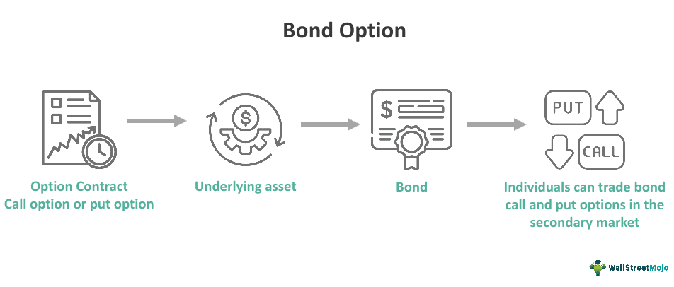

In the world of finance, financial instruments serve as vital tools for both investment and risk management. Among these instruments, financial derivatives, fixed income securities, bond options, and algorithmic trading stand out for their significant contributions to the financial ecosystem. Each component plays a distinct role in shaping market dynamics and providing various opportunities for investors and traders.

Financial derivatives are contracts whose value depends on the performance of underlying assets, indexes, or interest rates. Instruments such as futures, options, and swaps fall into this category, offering flexibility for hedging risks and speculating on price movements. These tools are integral for global financial markets, allowing participants to manage risk and enhance returns.



On the other hand, fixed income securities, like government and corporate bonds, provide regular, predictable returns. These instruments are favored by risk-averse investors seeking stability and consistent income. As low-risk investment vehicles, they play a crucial role in the economy by influencing interest rates and offering financing solutions for various entities.

Bond options, a subset of financial derivatives, provide the right but not the obligation to buy or sell bonds at predetermined prices before specified dates. These options offer additional tools for managing interest rate exposure and capitalizing on market shifts.

Algorithmic trading, utilizing computer programs to execute trades based on defined criteria, has revolutionized modern financial markets by increasing efficiency and reducing transaction costs. This technology-driven approach can be applied across various financial instruments, including derivatives, bonds, and equities, significantly impacting trading strategies.

Together, these financial instruments interconnect to form a sophisticated investment landscape. By understanding their fundamentals, investors and traders can make more informed decisions, achieve strategic goals, and manage risks effectively. This article will explore each of these areas comprehensively to underscore their importance in today's financial markets.

## Table of Contents

## Understanding Financial Derivatives

Financial derivatives are complex financial instruments primarily structured as contracts that derive their value from the performance of underlying entities, such as assets, indexes, or interest rates. These contracts, by their nature, facilitate various strategic financial applications including risk management, speculation, and yield enhancement.

The most prevalent types of financial derivatives are futures, options, and swaps, each serving distinct functions within financial markets:

1. **Futures** are standardized contracts obligating the buyer to purchase, or the seller to sell, a specified quantity of an underlying asset at a predetermined price at a designated future date. These instruments are traded on futures exchanges and are widely used to hedge against price fluctuations in commodities, interest rates, and currency exchange rates.

2. **Options** grant the holder the right, but not the obligation, to buy (call option) or sell (put option) an underlying asset at a predetermined price within a specified period. Options provide flexibility and are essential tools for hedging, as well as for strategies aiming at portfolio protection or leveraging.

3. **Swaps** are custom contracts through which two parties exchange financial instruments, typically cash flows based on notional principal amounts. The most common swap is the interest rate swap, wherein parties exchange fixed interest rate payments for floating ones, enabling firms to manage exposure to fluctuations in interest rates.

Financial derivatives are indispensable to the global financial market due to their ability to offer substantial flexibility and opportunities for strategic financial management. They allow market participants to tailor risk exposures according to their specific needs, thus playing a pivotal role in hedging against adverse market movements. For example, a company with international operations might use currency derivatives to hedge against foreign exchange risk, ensuring stable financial results despite exchange rate [volatility](/wiki/volatility-trading-strategies).

Moreover, derivatives are instrumental in speculation and [arbitrage](/wiki/arbitrage) strategies. Traders often use derivatives to speculate on future movements of market variables, such as stock prices or interest rates, with the intention of capitalizing on their predictions. Arbitragers might exploit price discrepancies between different markets or derivatives to achieve risk-free profits.

In addition to these applications, derivatives have significantly contributed to market efficiency by providing essential information through price discovery and by facilitating increased [liquidity](/wiki/liquidity-risk-premium). The transparent nature of future prices, for example, serves as a predictive signal for spot market prices, thus aiding both businesses and investors in decision-making processes.

In conclusion, financial derivatives are key instruments within the modern financial ecosystem, offering critical functions that include risk mitigation, price discovery, and the potential for enhanced investment returns. Their structured flexibility allows them to be adaptable tools in the financial strategy toolkit, providing both security through risk management and potential gain through strategic exploitation of market conditions.

## Exploring Fixed Income Securities

Fixed income securities are financial instruments that promise a return in the form of regular, fixed payments. These payments typically consist of periodic interest, known as coupon payments, and the repayment of the principal amount upon the security's maturity. Such securities can be issued by various entities, including governments, municipalities, and corporations.

Government bonds, such as U.S. Treasury bonds, are prominent examples of fixed income securities. These are considered very low-risk due to the government's backing, providing predictable returns and capital preservation. Similarly, corporate bonds are issued by companies seeking to raise capital, offering higher yields than government bonds but with a corresponding increase in risk.

Fixed income securities are particularly appealing to risk-averse investors looking for stable and predictable income streams. This characteristic makes them a popular choice for retirees or individuals seeking to preserve wealth while generating consistent returns. The predictability and lower volatility of these investments make them less risky compared to equities, which can experience significant price fluctuations.

The fixed income market plays a significant role in the economy, influencing interest rates and providing organizations with necessary funding mechanisms. Interest rates, which are largely determined by central banks, directly impact the pricing and yield of fixed income securities. For example, when interest rates rise, the prices of existing bonds typically decrease, as new issues offer higher yields. This inverse relationship is fundamental in the fixed income market.

The fixed income sector also provides crucial capital for government projects, corporate expansion, and infrastructure development. By issuing bonds, entities can obtain the financial resources needed for large-scale initiatives without resorting to banking loans or equity markets. This process facilitates economic growth and development while allowing investors to participate in these ventures indirectly.

Understanding the dynamics of fixed income securities is vital for investors aiming to build a diversified portfolio that balances risk and return. It allows them to harness the benefits of stable income and contribute to economic stability through capital allocation.

## The Role of Bond Options

Bond options, a subset of financial derivatives, are instruments that offer the holder the right, without any obligation, to buy or sell a bond at a predetermined price within a specific timeframe. These options are crucial tools for managing risks associated with [interest rate](/wiki/interest-rate-trading-strategies) fluctuations and for speculating on movements in bond prices. Understanding the mechanisms and applications of bond options is vital for investors operating in the fixed income markets, and here's why.

**Hedging and Speculation with Bond Options**

Bond options serve two primary purposes: hedging and speculation. Hedging involves the use of financial instruments to protect against potential losses due to unfavorable price movements. For instance, if an investor holds a portfolio of bonds and anticipates an interest rate hike, which generally leads to a decline in bond prices, they might purchase bond put options. These put options increase in value as the underlying bond prices decrease, thus offsetting potential losses in the bond portfolio.

Conversely, bond options can also be employed for speculation. Traders who predict future movements in interest rates can use bond call options to capitalize on their forecasts. For example, if an investor expects interest rates to fall, leading to higher bond prices, they may buy bond call options. If their prediction proves accurate, the rise in bond prices would result in the call options becoming more valuable.

**Risk Management and Market Opportunities**

The strategic use of bond options in a fixed income portfolio is often motivated by the need for effective risk management. Interest rate volatility poses a significant risk to bond investors. With bond options, investors can craft strategies that both safeguard their portfolios against adverse rate changes and exploit potential favorable movements.

Furthermore, bond options can be utilized to leverage market opportunities. By embedding bond option strategies within broader investment plans, investors can enhance returns while maintaining a structured approach to risk. For instance, an interest rate collar, which involves buying a put option and selling a call option on bonds, can create a band within which bond price movements have minimal impact on the portfolio's overall value.

**Conclusion**

In the intricate landscape of fixed income markets, bond options stand out as vital instruments for both hedging risks and seeking profit through speculative strategies. Their flexibility and versatility allow investors to tailor their approaches to meet specific financial objectives and market conditions. Understanding bond options and their role in portfolio management is indispensable for any investor aiming to navigate the nuances of fixed income markets effectively.

## Algorithmic Trading in Modern Markets

Algorithmic trading leverages computer programs to perform trades using pre-established parameters and computational algorithms. This technique is instrumental in modern financial markets, bringing enhanced efficiency and reduced transaction costs. It allows traders to execute high-frequency trading ([HFT](/wiki/high-frequency-trading-strategies)) strategies where large numbers of orders are sent to the market in fractions of a second. These strategies take advantage of small price discrepancies and can achieve significant cumulative profits by transacting thousands of trades rapidly.

Algorithmic trading applies to a wide spectrum of financial instruments, including derivatives, bonds, and equities. By automating the trading process, algorithms can analyze market conditions quicker than human traders. This automation enables the execution of trades based on complex strategies, incorporating a variety of market signals.

The integration of [artificial intelligence](/wiki/ai-artificial-intelligence) (AI) and [machine learning](/wiki/machine-learning) (ML) continues to drive the evolution of [algorithmic trading](/wiki/algorithmic-trading). These technologies allow for the development of adaptive algorithms capable of learning from historical data to predict future market movements. For example, machine learning models can process large datasets to identify patterns or trends that might elude traditional quantitative models. Python, with its robust libraries such as Pandas, Scikit-learn, and TensorFlow, is often used to develop these models. A basic example of a moving average crossover strategy in Python can be illustrated as follows:

```python
import pandas as pd
import numpy as np

# Load market data
data = pd.read_csv('market_data.csv')

# Calculate short and long moving averages
short_window = 40
long_window = 100

signals = pd.DataFrame(index=data.index)
signals['price'] = data['Close']
signals['short_mavg'] = data['Close'].rolling(window=short_window, min_periods=1).mean()
signals['long_mavg'] = data['Close'].rolling(window=long_window, min_periods=1).mean()

# Create signals
signals['signal'] = 0.0
signals['signal'][short_window:] = np.where(signals['short_mavg'][short_window:] > signals['long_mavg'][short_window:], 1.0, 0.0)   
signals['positions'] = signals['signal'].diff()

# Display the signals
print(signals)
```

In this example, trade signals are generated when a shorter moving average crosses above or below a longer moving average. This type of trading strategy exemplifies how algorithmic trading employs predefined rules for automated execution.

As technology progresses, the impact of algorithmic trading on market dynamics is considerable. It enhances market liquidity and tightens bid-ask spreads, making markets more efficient. However, it can also contribute to market volatility and systemic risks, as seen in events like the 2010 Flash Crash. Understanding these complexities is crucial for traders and regulators to mitigate potential adverse effects while maximizing the benefits of this technology in financial markets.

## Interconnection of Derivatives, Fixed Income, and Algo Trading

The intersection of financial derivatives, fixed income securities, bond options, and algorithmic trading creates a sophisticated investment landscape that serves as the foundation for modern portfolio management and risk mitigation strategies. These elements, when combined, offer a powerful toolkit for traders and investors aiming to optimize financial outcomes. 

Financial derivatives, such as futures, options, and swaps, provide mechanisms for transferring risk and speculating on future price movements. By themselves, derivatives offer considerable flexibility; however, when integrated into algorithmic trading systems, they enable the execution of complex, data-driven strategies. Algorithmic trading utilizes computer programs that execute trades based on specific criteria and is capable of processing vast amounts of market data in real-time, allowing for high-frequency trading and efficient price discovery. The ability to incorporate derivatives into these systems enhances their capability to manage multi-asset class strategies with precision. 

Fixed income securities, including government and corporate bonds, provide steady income streams and are pivotal in stabilizing portfolio returns. Bond options, a type of derivative, enable investors to hedge against interest rate risk or capitalize on bond market volatility. Algorithmic trading further augments these strategies by enabling rapid rebalancing and dynamic adjustments to portfolio allocations as market conditions change. Leveraging algorithms to execute trades involving bond options and other fixed income derivatives allows investors to optimize yield and manage interest rate exposures effectively.

Understanding how these financial tools interconnect is essential. For instance, traders might use derivatives to hedge positions in fixed income securities, while algorithmic trading helps in timing the market to enhance returns. A practical application could involve using a Python-based algorithm to assess market conditions and decide when to exercise a bond option, maximizing potential returns or minimizing risks. 

```python
import numpy as np

# Example: Simple strategy to exercise a bond option based on market interest rate movements
def should_exercise_bond_option(current_interest_rate, option_strike_rate):
    if current_interest_rate < option_strike_rate:
        return True  # Exercise the bond option
    else:
        return False

# Sample data
current_ir = 1.5  # Current interest rate in %
option_strike_ir = 2.0  # Option strike rate in %

exercise = should_exercise_bond_option(current_ir, option_strike_ir)
print(f"Exercise Bond Option: {exercise}")
```

This example demonstrates a simplified decision model, showing how algorithmic analysis can aid strategic financial decisions.

Ultimately, the effective integration of derivatives, fixed income securities, bond options, and algorithmic trading creates a robust framework for achieving strategic financial targets. For finance professionals, grasping these interconnections is vital for navigating the complexities of modern markets and achieving investment success.

## Conclusion

In the rapidly changing financial markets, knowledge of derivatives, fixed income, bond options, and algorithmic trading is indispensable for both investors and financial professionals. These financial instruments and strategies collectively provide a robust framework for developing innovative investment strategies and implementing comprehensive risk management solutions. By understanding and integrating these components into investment planning, individuals and institutions can better harness market opportunities while effectively mitigating potential risks.

The multifaceted nature of financial derivatives allows investors to hedge against risks, speculate on future price movements, or enhance their investment returns. For example, derivatives can be used strategically within portfolio management to offset potential losses from direct asset holdings. Meanwhile, fixed income securities, known for their relatively stable and predictable returns, represent a conservative investment choice, often serving as a bedrock for portfolios seeking lower risk exposure.

Bond options further enhance the fixed income market by providing additional flexibility to navigate interest rate fluctuations and bond price volatility. These options empower investors with the potential to either protect against or profit from movements within the bond market, providing another layer of risk management and opportunity.

Algorithmic trading, driven by advancements in technology such as artificial intelligence and machine learning, offers unprecedented efficiency and precision in executing trades. This technology-driven approach allows for the rapid analysis and execution of trades across diverse financial instruments, including derivatives and bonds, thereby optimizing trading strategies and capitalizing on fleeting market inefficiencies.

Ultimately, an integrated approach that combines these financial tools can lead to more resilient and versatile investment portfolios. By leveraging the strengths of each component—derivatives for flexibility, fixed income for stability, bond options for additional control, and algorithmic trading for precision—investors position themselves to adapt to the evolving financial landscape effectively. Staying informed and skilled in these areas not only secures a competitive advantage but also fosters long-term financial success in today's dynamic markets.

## References & Further Reading

[1]: Hull, J. C. (2012). ["Options, Futures, and Other Derivatives"](https://www.semanticscholar.org/paper/Options%2C-Futures%2C-and-Other-Derivatives-Hull/89bdee500c8623864fc9eb7a471546aa713acc44). Pearson Education.

[2]: Fabozzi, F. J. (2018). ["Bond Markets, Analysis, and Strategies"](https://books.google.com/books/about/Bond_Markets_Analysis_and_Strategies_ten.html?id=bQpNEAAAQBAJ). Pearson.

[3]: Aldridge, I. (2013). ["High-Frequency Trading: A Practical Guide to Algorithmic Strategies and Trading Systems"](https://www.wiley.com/en-us/High-Frequency+Trading%3A+A+Practical+Guide+to+Algorithmic+Strategies+and+Trading+Systems%2C+2nd+Edition-p-9781118343500). Wiley.

[4]: Lopez de Prado, M. (2018). ["Advances in Financial Machine Learning"](https://www.amazon.com/Advances-Financial-Machine-Learning-Marcos/dp/1119482089). Wiley.

[5]: Chan, E. P. (2008). ["Quantitative Trading: How to Build Your Own Algorithmic Trading Business"](https://github.com/ftvision/quant_trading_echan_book). Wiley.

[6]: Black, F., & Scholes, M. (1973). ["The Pricing of Options and Corporate Liabilities."](https://www.cs.princeton.edu/courses/archive/fall09/cos323/papers/black_scholes73.pdf) Journal of Political Economy, 81(3), 637-654.

[7]: Glasserman, P. (2004). ["Monte Carlo Methods in Financial Engineering"](https://link.springer.com/book/10.1007/978-0-387-21617-1). Springer.