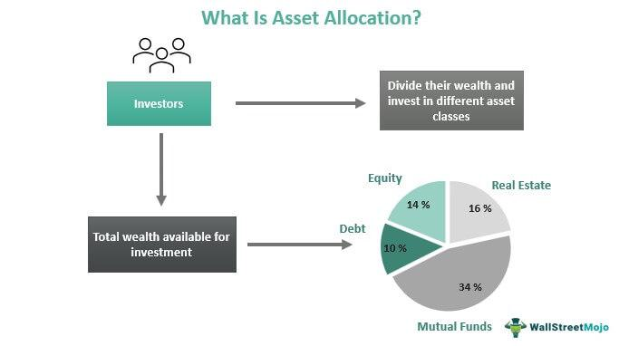

Investment in bond portfolios and the strategic allocation of assets play pivotal roles in the financial landscape, especially for investors utilizing algorithmic trading. Grasping the fundamentals of these subjects is essential for maximizing investment outcomes. This article highlights the interconnected nature of bond portfolio strategies, asset allocation, and algorithmic trading, emphasizing the potential for optimization in investment performance.

Bond portfolios are integral to investment strategies due to their ability to provide steady income and reduce overall volatility. A well-constructed bond portfolio typically includes a variety of bonds such as government bonds, corporate bonds, and inflation-protected securities. Each type serves a specific function: government bonds often offer stability and low risk, corporate bonds can provide higher yields albeit with increased risk, and inflation-protected securities shield against inflationary pressures. Diversifying across these bond types mitigates risks such as interest rate fluctuations and credit risks, safeguarding the investor's portfolio against market uncertainties.



Asset allocation refers to distributing investments across various asset classes, crucially balancing risk and return. Effective asset allocation involves strategic decisions that consider the investor's risk tolerance, investment objectives, and market conditions. In bond portfolios, asset allocation strategies like strategic and dynamic asset allocation are used to optimize asset distribution. This diversification across different asset classes enhances investment stability and performance by spreading risk and potential returns.

Algorithmic trading represents a game-changer in asset management by efficiently optimizing investment strategies in the bond markets. Algorithms are designed to execute trades based on pre-defined criteria, significantly enhancing the precision and speed of investment decisions. This approach eliminates emotional biases inherent in human decision-making, allowing investors to implement multiple strategies simultaneously without compromising accuracy.

The integration of algorithms in bond portfolio management offers numerous advantages, such as automated rebalancing and optimization. Machine learning algorithms play a crucial role in predicting market trends, providing valuable insights that inform bond investment decisions. Through case studies and historical data, the potential of algorithmic strategies in boosting bond portfolio performance becomes evident.

However, the adoption of algorithmic trading in bonds is not without challenges. Issues like overfitting, execution risk, and data quality can impede algorithmic performance. Understanding the regulatory landscape and adhering to ethical considerations are imperative. Strategies such as rigorous backtesting and continuous monitoring are essential to mitigate these risks, ensuring responsible and effective use of algorithmic trading.

Looking ahead, emerging trends such as AI and machine learning promise to reshape bond trading and asset allocation. Technologies like blockchain are poised to enhance transparency and efficiency within bond markets. Investors must stay informed about these advancements to adapt their strategies effectively, leveraging technology for superior investment outcomes.

This article underscores the necessity of a well-structured bond portfolio, highlighting asset allocation and algorithmic trading as tools for managing risk and return. Through ongoing learning and adaptation, investors can harness technological progression to refine their investment strategies and optimize performance.

## Table of Contents

## The Basics of Bond Portfolio Investment

Bond portfolio investment is a fundamental component of a diversified investment strategy. A well-structured bond portfolio typically comprises a mix of different types of bonds, each playing a unique role in achieving financial objectives while managing risk.

**Composition of a Bond Portfolio**

The composition of a bond portfolio can significantly impact its risk-return profile. Investors typically allocate their assets among various types of bonds to achieve diversification. One primary category is government bonds, known for their stability and low risk. These bonds are issued by national governments and are backed by their creditworthiness, often serving as a benchmark for risk-free investments. They provide investors with steady income through interest payments and are a staple in conservative portfolios.

Corporate bonds, issued by companies to raise capital, offer higher yields than government bonds due to the added risk associated with potential default. The yield on corporate bonds typically compensates investors for assuming the additional credit risk. Investors often diversify across different sectors and companies to mitigate individual credit risk and capitalize on varying yield spreads.

Another important category is inflation-protected securities, such as Treasury Inflation-Protected Securities (TIPS) in the United States. These bonds are designed to protect investors from inflation by adjusting the principal value according to inflation rates, thus preserving purchasing power.

**Role of Bonds in a Portfolio**

The role of bonds in a diversified investment portfolio centers around providing a stable income stream, preserving capital, and reducing overall [volatility](/wiki/volatility-trading-strategies). Bonds generally have an inverse correlation with equities, meaning that their value tends to rise when stock prices fall, offering a hedge against market downturns. This characteristic makes them an essential component for balancing equity risk and achieving long-term investment goals.

**Risks Associated with Bond Investments**

Despite their relatively stable nature compared to stocks, bond investments are not without risks. The two primary risks are [interest rate](/wiki/interest-rate-trading-strategies) risk and credit risk.

Interest rate risk arises from fluctuating interest rates, which inversely affect bond prices. When interest rates rise, existing bond prices fall because newer bonds offer higher yields, rendering the older bonds less attractive. Conversely, when interest rates decline, existing bonds with higher rates become more valuable. This relationship can be represented mathematically as:

$$
\Delta P \approx -D \times \Delta y
$$

where $\Delta P$ is the change in bond price, $D$ is the bond's duration, and $\Delta y$ is the change in yield. Duration measures the sensitivity of a bond’s price to changes in interest rates.

Credit risk, on the other hand, refers to the possibility that a bond issuer will default on its obligations, failing to make the required interest or principal payments. Credit ratings assigned by agencies like Moody's and Standard & Poor's help investors assess the creditworthiness of bond issuers. Lower-rated bonds typically offer higher yields to compensate for the increased risk of default.

By understanding bond portfolio composition, the types of bonds, and the inherent risks, investors can create a robust strategy that balances risk and return effectively. Diversification across various bonds helps mitigate these risks, enhancing the portfolio's stability and performance over time.

## Understanding Asset Allocation

Asset allocation refers to the process of distributing investments across various asset categories, such as stocks, bonds, and cash equivalents, to optimize the balance between risk and return in an investment portfolio. This strategy plays a critical role in investment management as it significantly influences the portfolio's overall performance. The core principle behind asset allocation is the belief that different asset classes exhibit distinct levels of risk and performance, responding differently to economic events. Therefore, an investor can manage risk more effectively by diversifying investments across a broad spectrum of asset classes.

In bond portfolios, specific asset allocation strategies such as strategic asset allocation and dynamic asset allocation are pivotal. Strategic asset allocation involves setting a baseline asset mix based on long-term goals, risk tolerance, and investment time horizon, typically maintaining a fixed proportion of bonds in the portfolio. For instance, an investor with a moderate risk tolerance might allocate 40% of their portfolio to bonds and 60% to stocks. Over time, as bonds or stocks outperform, the portfolio may deviate from its baseline allocation, necessitating periodic rebalancing to restore the original asset proportions.

Dynamic asset allocation, on the other hand, involves frequent adjustments to the asset mix in response to changing market conditions. This strategy allows investors to increase allocations to asset classes expected to perform well while reducing exposure to those likely to underperform. In bond portfolios, dynamic asset allocation might involve shifts between long-term and short-term bonds or between government and corporate bonds based on interest rate forecasts and economic indicators. This agility can enhance returns and mitigate risks in volatile markets.

Diversification remains a fundamental aspect of asset allocation, involving the distribution of investments across various asset classes to reduce risk. The incorporation of bonds into a diversified portfolio provides stability and predictable income, counterbalancing the volatility typically associated with equity investments. The risk reduction arises from the concept that different asset classes often have low correlations, meaning that when one asset class underperforms, another might perform well, thereby smoothing overall portfolio returns.

The impact of diversification on investment stability can be appreciated through the lens of the Modern Portfolio Theory (MPT), which quantitatively demonstrates that a well-diversified portfolio can achieve the same expected return as a less diversified portfolio but with lower risk. According to MPT, the expected return $E(R)$ of a portfolio is a weighted sum of the expected returns of its constituent assets, while the portfolio's variance $\sigma^2_p$, representing risk, depends on the variances of the constituent assets and their covariances.

Mathematically, the expected portfolio return is expressed as:

$$

E(R_p) = \sum_{i=1}^{n} w_i E(R_i) 
$$

where $w_i$ is the weight of asset $i$ in the portfolio, and $E(R_i)$ is the expected return of asset $i$.

The risk is captured by the portfolio variance:

$$

\sigma^2_p = \sum_{i=1}^{n} w_i^2 \sigma_i^2 + \sum_{i \neq j} w_i w_j \text{Cov}(R_i, R_j) 
$$

where $\sigma_i^2$ is the variance of asset $i$, and $\text{Cov}(R_i, R_j)$ is the covariance between the returns of assets $i$ and $j$.

Thus, effective asset allocation and diversification can lead to more stable investment outcomes, optimizing the trade-off between risk and return in bond portfolio management.

## Algorithmic Trading in Asset Management

Algorithmic trading involves the use of complex algorithms to make trading decisions based on predefined criteria, significantly impacting the precision and speed of investment strategies, particularly in bond markets. These algorithms can process vast amounts of data at speeds unimaginable for human traders, allowing for timely and accurate trade executions that align with specified investment goals.

Algorithms are programmed to evaluate multiple market indicators and execute trades without human intervention, ensuring decisions are made based on data-driven analysis rather than emotions. This automated process significantly reduces the likelihood of mistakes caused by emotional reactions to market fluctuations. By incorporating factors such as interest rates, market volatility, and economic indicators into their calculations, algorithms can optimize trade execution to capitalize on favorable market conditions while minimizing potential losses.

An example of an algorithm used in bond market trading might be a set of rules designed to capture yield spreads between different types of bonds. This could involve continuously monitoring yield differentials and executing trades when predefined thresholds are reached. The efficiency of such algorithms enables them to simultaneously manage multiple strategies—such as short-term yield curve [arbitrage](/wiki/arbitrage), long-term [carry](/wiki/carry-trading) trades, or event-driven opportunities—thereby optimizing the investment process.

Python, with its advanced libraries like NumPy and pandas for data manipulation, is commonly used to develop these trading algorithms. Here’s a basic example of how such an algorithm might be structured:

```python
import numpy as np
import pandas as pd

# Example bond data
bond_data = pd.DataFrame({
    'Bond': ['Bond A', 'Bond B', 'Bond C'],
    'Yield': [0.02, 0.025, 0.03],
    'Duration': [5, 7, 10]
})

# Define thresholds for trading algorithm
yield_threshold = 0.03
duration_threshold = 7

# Function to decide trades based on criteria
def trade_decision(data):
    decisions = []
    for index, row in data.iterrows():
        if row['Yield'] > yield_threshold and row['Duration'] < duration_threshold:
            decisions.append(f"Buy {row['Bond']}")
        else:
            decisions.append(f"Hold {row['Bond']}")
    return decisions

# Execute trade decisions
trade_decisions = trade_decision(bond_data)
print(trade_decisions)
```

The advantages of [algorithmic trading](/wiki/algorithmic-trading) extend beyond emotionless decision-making; they include the ability to simulate and backtest strategies against historical data, offering insights into their potential effectiveness under various market conditions. This capability allows traders to refine strategies and dynamically adapt them in real-time, enhancing performance and potentially increasing returns.

Moreover, algorithmic trading enables the management of multiple investment strategies simultaneously, allowing traders to diversify their approach across different assets and markets. This diversification can reduce risk and improve portfolio stability by balancing potential losses in one area with gains in another.

In conclusion, algorithmic trading in asset management provides a sophisticated tool for enhancing investment strategies, especially in the complex and dynamic bond markets. It offers precision, speed, and efficiency, helping investors to optimize their portfolios while minimizing risks associated with human error and emotional trading.

## Integration of Algorithms in Bond Portfolio Management

Algorithmic trading has revolutionized bond portfolio management by enabling automated rebalancing and optimization, thereby enhancing the precision and efficiency of investment strategies. Automated rebalancing ensures that bond portfolios remain aligned with predefined investment goals, adjusting the allocation based on shifts in market conditions without manual intervention. This continuous alignment is vital for maintaining the optimal risk-return profile that meets an investor's objectives.

Machine learning (ML) plays an instrumental role in predicting market trends, thereby informing bond investment decisions. By harnessing historical data, ML algorithms can identify patterns and correlations that might elude human analysis. For instance, ML models can predict interest rate movements or assess credit risk more accurately, which are crucial for bond valuation. Techniques such as time-series analysis and natural language processing (NLP) allow these algorithms to incorporate both quantitative data and qualitative insights from market reports or news articles.

Real-world cases exemplify the advantages of algorithmic strategies in bond portfolio management. For example, a financial institution might deploy a [machine learning](/wiki/machine-learning) algorithm to optimize its bond portfolio by predicting future price movements based on macroeconomic indicators and micro-level data such as issuer financials. Such an algorithm could continuously monitor these variables and adjust the portfolio dynamically to maximize returns while minimizing risk exposure.

Furthermore, algorithms can implement complex strategies that were previously difficult to execute due to their intricate calculations and rapid decision-making requirements. By processing large volumes of data quickly and accurately, algorithms provide a level of agility in the market that manual trading processes cannot match. This capability is particularly useful in the bond markets, where volatility can be influenced by various macroeconomic factors.

In summary, the integration of algorithmic trading into bond portfolio management delivers superior results through automated processes and the sophisticated application of machine learning techniques. This integration not only facilitates optimization and rebalancing but also leverages deep predictive analytics to enhance investment performance, providing a significant competitive edge.

## Challenges and Risks of Algorithmic Trading in Bonds

Algorithmic trading in bond markets offers significant advantages like enhanced precision and speed, but it also presents various challenges and risks that investors must carefully navigate. Key challenges include overfitting, execution risk, and data quality issues.

### Overfitting

Overfitting occurs when an algorithm becomes too tailored to historical data, resulting in models that perform well in [backtesting](/wiki/backtesting) but poorly in live trading. This scenario arises when the model captures noise instead of the underlying pattern. To mitigate this risk, practitioners can employ techniques like cross-validation and regularization. Additionally, maintaining a comprehensive out-of-sample testing period ensures the model's robustness across different market conditions.

### Execution Risk

Execution risk pertains to the potential slippage and increased transaction costs due to delays between the trade signal generation and its market execution. In highly liquid markets, these discrepancies may be minor, but in bond markets with lower [liquidity](/wiki/liquidity-risk-premium), they can significantly impact performance. Algorithms must be finely tuned to adapt to current market conditions and consider market impact costs. Implementing smart order routing and using liquidity-seeking algorithms can help alleviate execution risk.

### Data Quality Issues

The efficacy of algorithmic trading heavily relies on the quality and timeliness of data inputs. Inaccurate, incomplete, or delayed data can lead to suboptimal trading decisions. Establishing a rigorous data validation process and utilizing high-quality data sources are crucial steps to ensure reliability. Employing machine learning models with anomaly detection capabilities can help identify and correct data issues in real-time.

### Regulatory Requirements and Ethical Considerations

Algorithmic trading in bonds is governed by stringent regulatory requirements aimed at maintaining market integrity and preventing manipulative practices. Regulations such as the Markets in Financial Instruments Directive II (MiFID II) in Europe and the Dodd-Frank Act in the U.S. impose rigorous compliance standards. Ethical considerations also include the fair execution of trades, avoiding front-running, and ensuring that automation does not contribute to market instability. Firms must develop comprehensive compliance frameworks and ethical guidelines to align their trading activities with legal and moral standards.

### Strategies for Mitigating Risks

To mitigate these challenges, practitioners should incorporate rigorous backtesting and continuous monitoring into their trading systems. Backtesting involves simulating an algorithm's performance on historical data to assess its effectiveness and identify weaknesses. Continuous monitoring of algorithm performance helps detect and address issues promptly, ensuring consistent results. Automated alerts and dashboards can be employed for real-time monitoring and decision-making.

In conclusion, while algorithmic trading presents challenges, a thoughtful approach involving robust model validation, precise execution strategies, rigorous data management, and strict adherence to regulatory and ethical standards can significantly enhance risk management. These strategies can enable investors to capitalize on the benefits of algorithmic trading while minimizing associated risks.

## Future Trends in Bond Investment Strategies

Emerging technologies are progressively reshaping bond investment strategies, with [artificial intelligence](/wiki/ai-artificial-intelligence) (AI) and machine learning (ML) playing critical roles. These technologies enable more sophisticated analysis by identifying patterns and trends that might be invisible to human analysts. AI and ML are particularly beneficial in bond trading and asset allocation by enhancing predictive analytics and risk management. Algorithms can efficiently process large datasets to forecast interest rate changes, credit risks, and market liquidity, thus allowing for more informed investment decisions. These methods not only improve the precision of bond valuation but also optimize the allocation of assets, adjusting exposure dynamically in response to market shifts.

Blockchain technology's emergence further enhances bond market transparency and efficiency. By providing a decentralized ledger system, blockchain enables real-time settlement and verification of bond transactions, reducing the time and cost associated with traditional trading methods. This technology can streamline clearing and settlement processes, minimizing counterparty risks and enhancing transaction accuracy. As a result, blockchain could potentially transform the way bond issuances and settlements are conducted, providing a tamper-proof record that increases investor confidence.

Investor strategies are likely to evolve significantly as these technologies become more integrated into traditional finance. With AI and ML, investors may shift towards more quantitative strategies that leverage data-driven insights to gain competitive advantages. The ability to automate trading decisions based on algorithmic predictions could lead to more efficient management of complex bond portfolios, reducing the reliance on manual processes.

Additionally, blockchain's role in improving transparency might attract a broader range of participants to the bond markets, including those who were previously deterred by opaque operations and high transaction costs. As the technology becomes more widespread, investors might prioritize not just returns, but also the security and transparency offered by blockchain-enabled platforms.

Overall, the convergence of AI, ML, and blockchain heralds a new era in bond investment strategy, characterized by enhanced decision-making and operational efficiency. Investors are urged to stay informed and adaptable as these technologies continue to advance, offering novel opportunities and challenges in the evolving financial landscape.

## Conclusion

A well-structured bond portfolio serves as a cornerstone for managing both risk and return in an investment strategy. It allows investors to balance the potential for income generation with the imperative of preserving capital. Asset allocation plays a pivotal role in this context as it strategically distributes investments across various asset classes, including government, corporate, and inflation-protected bonds, to achieve a harmonious balance of risk and reward.

Algorithmic trading significantly enhances decision-making and execution in bond investments. By leveraging algorithms, investors can automate processes like rebalancing and optimization, ensuring rapid responses to market fluctuations and the timely execution of trades based on pre-set criteria. This not only improves the precision of investment decisions but also eliminates emotional biases that can cloud judgment.

The continuous evolution of technology emphasizes the need for investors to embrace ongoing learning and adaptation. As advancements in artificial intelligence, machine learning, and other technologies persist, investors are presented with new tools and methodologies to refine their strategies. Engaging with these technological developments ensures that investors remain competitive and can capitalize on efficiencies and insights that were previously inaccessible.

To effectively harness these tools, a commitment to rigorous backtesting, diligent monitoring, and adaptability is essential. This strategic approach provides the framework required to navigate the complexities of modern financial markets and optimize investment outcomes. As the financial landscape continues to evolve, the integration of technology into traditional bond investment strategies will likely become indispensable for achieving superior returns.

## References & Further Reading

[1]: ["Advances in Financial Machine Learning"](https://www.amazon.com/Advances-Financial-Machine-Learning-Marcos/dp/1119482089) by Marcos Lopez de Prado

[2]: ["Machine Learning for Algorithmic Trading"](https://www.amazon.com/Machine-Learning-Algorithmic-Trading-alternative/dp/1839217715) by Stefan Jansen

[3]: ["Quantitative Trading: How to Build Your Own Algorithmic Trading Business"](https://www.amazon.com/Quantitative-Trading-Build-Algorithmic-Business/dp/1119800064) by Ernest P. Chan

[4]: ["Evidence-Based Technical Analysis: Applying the Scientific Method and Statistical Inference to Trading Signals"](https://www.amazon.com/Evidence-Based-Technical-Analysis-Scientific-Statistical/dp/0470008741) by David Aronson

[5]: Fabozzi, F. J. (2012). ["Bond Markets, Analysis, and Strategies."](https://mitpress.mit.edu/9780262046275/bond-markets-analysis-and-strategies/) Pearson Education

[6]: Sharpe, W. F. (1994). ["The Sharpe Ratio."](https://web.stanford.edu/~wfsharpe/art/sr/SR.htm) The Journal of Portfolio Management

[7]: Bodie, Z., Kane, A., & Marcus, A. J. (2019). ["Investments."](https://www.mheducation.com/highered/product/Investments-Bodie.html) McGraw-Hill Education

[8]: ["The Handbook of Fixed Income Securities"](https://www.amazon.com/Handbook-Fixed-Income-Securities-Eighth/dp/0071768467) by Frank J. Fabozzi

[9]: Choudhry, M. (2010). ["An Introduction to Bond Markets"](https://onlinelibrary.wiley.com/doi/book/10.1002/9781118371961) John Wiley & Sons

[10]: Hiller, D., Jaffe, J., Jordan, B., & Ross, S. (2018). ["Corporate Finance."](https://www.amazon.com/Corporate-Finance/dp/1526848082) McGraw-Hill Education