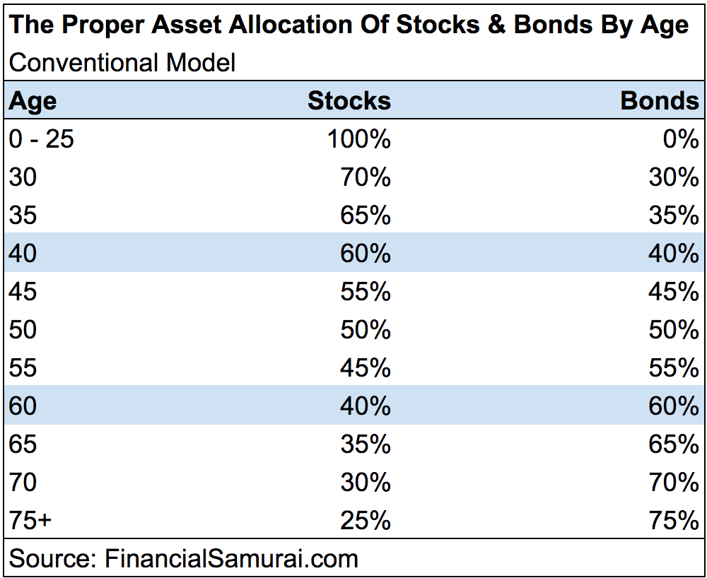

## Table of Contents

## What is a bond portfolio?

A bond portfolio is a collection of bonds that an investor owns. Bonds are like loans that you give to a company or government, and in return, they pay you back with interest over time. By having a bond portfolio, an investor can spread out their risk and possibly earn more money than if they just had one bond.

Just like you might have different types of fruits in a fruit basket, a bond portfolio can have different types of bonds. These can include government bonds, corporate bonds, and municipal bonds. Each type of bond has its own level of risk and reward. By choosing a mix of bonds, an investor can balance their risk and try to get the best return on their investment.

## Why is asset allocation important in bond investing?

Asset allocation is important in bond investing because it helps spread out risk. When you put your money into different types of bonds, like government bonds, corporate bonds, and municipal bonds, you're not putting all your eggs in one basket. If one type of bond doesn't do well, the others might still be okay, which can help protect your money.

It also helps you reach your financial goals. By choosing the right mix of bonds, you can balance how much risk you're willing to take with how much reward you want to get. For example, if you need steady income, you might choose more government bonds, which are usually safer. But if you're okay with taking more risk for a chance at higher returns, you might choose more corporate bonds. This way, asset allocation can help you build a bond portfolio that fits what you're looking for.

## What are the different types of bonds that can be included in a portfolio?

There are several types of bonds that can be included in a bond portfolio. One type is government bonds, which are issued by the government. These are often seen as very safe because the government is less likely to go bankrupt. Another type is corporate bonds, which are issued by companies. These can offer higher interest rates than government bonds, but they also come with more risk because companies can go out of business.

Another type of bond is municipal bonds, which are issued by local governments or cities. These bonds can be used to fund projects like building schools or roads. They often have tax benefits, which can make them attractive to investors. There are also international bonds, which are issued by foreign governments or companies. These can add diversity to a portfolio but also come with risks like changes in currency values.

Lastly, there are inflation-protected bonds, like Treasury Inflation-Protected Securities (TIPS) in the U.S. These bonds adjust their value based on inflation, which can help protect your money's buying power over time. Each type of bond has its own level of risk and reward, so choosing the right mix can help you build a strong bond portfolio.

## How does risk tolerance affect bond portfolio allocation?

Risk tolerance is how much risk you're okay with when you invest your money. It's important in deciding what kind of bonds you should have in your portfolio. If you have a low risk tolerance, you might want more government bonds because they are usually safer. They might not give you as much money back, but they're less likely to lose value. On the other hand, if you're okay with taking more risk, you might choose more corporate bonds. These can give you a higher return, but they're also more likely to lose value if the company doesn't do well.

Your risk tolerance can also change how much you spread out your investments. If you're very cautious, you might want a lot of different types of bonds to make sure you're protected if one type doesn't do well. But if you're comfortable with risk, you might not need as many different types of bonds. You might focus more on the ones that could give you the highest return, even if they're riskier. So, understanding your risk tolerance helps you pick the right mix of bonds for your portfolio.

## What is the role of duration in bond portfolio management?

Duration is a way to measure how sensitive a bond is to changes in interest rates. It tells you how long it will take to get back the price you paid for the bond, considering the interest payments you'll get along the way. If interest rates go up, the price of bonds usually goes down, and if interest rates go down, the price of bonds usually goes up. The longer the duration of a bond, the more its price will change when interest rates change. So, if you have a bond with a long duration, it's more sensitive to interest rate changes than a bond with a short duration.

In bond portfolio management, duration helps you manage risk. If you think interest rates are going to go up, you might want to have bonds with shorter durations in your portfolio. That way, if the price of your bonds goes down, it won't go down as much as it would with longer duration bonds. On the other hand, if you think interest rates are going to go down, you might want to have bonds with longer durations. That way, if the price of your bonds goes up, it can go up more than it would with shorter duration bonds. By choosing the right duration for your bonds, you can better handle changes in interest rates and protect your investment.

## How can diversification be achieved within a bond portfolio?

Diversification in a bond portfolio means spreading your money across different types of bonds. This can help lower your risk because if one type of bond doesn't do well, the other types might still be okay. You can diversify by including government bonds, which are usually safe, corporate bonds, which can offer higher returns but are riskier, and municipal bonds, which might have tax benefits. You can also add international bonds to your portfolio to spread your risk across different countries and currencies.

Another way to diversify is by looking at the length of time until the bonds mature. Some bonds, called short-term bonds, pay you back quickly, while others, called long-term bonds, take longer. By having a mix of short-term and long-term bonds, you can balance the risk and reward. Short-term bonds are less sensitive to changes in interest rates, while long-term bonds can be more sensitive but might offer higher returns. By choosing a good mix of different types and durations of bonds, you can build a strong and balanced bond portfolio.

## What are the common strategies for bond portfolio asset allocation?

One common strategy for bond portfolio asset allocation is called laddering. This means you buy bonds that mature at different times. Imagine you have bonds that pay you back in one year, three years, and five years. When the one-year bond pays you back, you can use that money to buy a new bond that matures in five years. This way, you always have bonds that are paying you back at different times, which can help you manage risk and keep a steady income coming in.

Another strategy is called barbell. This means you put your money into two different types of bonds: some that mature very soon and some that mature much later. For example, you might have half your money in bonds that pay you back in one year and the other half in bonds that pay you back in ten years. This can help you balance the safety of short-term bonds with the higher potential returns of long-term bonds. By using a barbell strategy, you can try to get the best of both worlds.

A third strategy is called bullet. With this strategy, you focus on bonds that all mature around the same time. For example, you might buy a bunch of bonds that all pay you back in five years. This can be good if you need a big chunk of money at a specific time, like when you retire. By choosing bonds that all mature at the same time, you can make sure you have a lot of money coming in when you need it. Each of these strategies can help you manage your bond portfolio in a way that fits your goals and how much risk you're okay with.

## How do interest rate changes impact bond portfolio allocation?

Interest rate changes can really affect your bond portfolio. When interest rates go up, the prices of bonds usually go down. This is because new bonds that are issued will have higher interest rates, making the older bonds with lower rates less attractive to investors. If you have a lot of bonds in your portfolio, and interest rates rise, the value of your whole portfolio could drop. To manage this, you might want to have more short-term bonds in your portfolio. Short-term bonds are less affected by interest rate changes because they pay you back sooner, so you can reinvest at the new, higher rates.

On the flip side, when interest rates go down, the prices of bonds usually go up. This happens because the older bonds with higher interest rates become more valuable compared to the new bonds with lower rates. If you think interest rates will go down, you might want to have more long-term bonds in your portfolio. Long-term bonds are more sensitive to interest rate changes, so their prices can go up more when rates drop. By adjusting your bond portfolio based on what you think will happen with interest rates, you can try to protect your money and maybe even make more of it.

## What is the impact of credit quality on bond portfolio performance?

Credit quality is how likely a bond issuer is to pay back the money they borrowed from you. If a bond has a high credit quality, it means the issuer is very likely to pay you back. These bonds are usually safer, but they might not give you as much money back as riskier bonds. On the other hand, if a bond has a low credit quality, it means there's a bigger chance the issuer might not pay you back. These bonds are riskier, but they can offer higher interest rates to make up for that risk. So, the credit quality of the bonds in your portfolio can affect how much risk you're taking and how much money you might make.

If you have a lot of high credit quality bonds in your portfolio, it's generally safer. You're less likely to lose money if the issuers can't pay you back. But, you might not earn as much interest as you would with lower credit quality bonds. If you have a lot of low credit quality bonds, you could earn more interest, but you're also taking on more risk. If some of the issuers can't pay you back, you could lose money. So, the mix of credit qualities in your bond portfolio can help you balance how much risk you're willing to take with how much reward you want to get.

## How can one use bond ladders in managing a bond portfolio?

A bond ladder is a way to manage your bond portfolio by buying bonds that pay you back at different times. Imagine you have bonds that mature in one year, three years, and five years. When the one-year bond pays you back, you can use that money to buy a new bond that matures in five years. This way, you always have bonds that are paying you back at different times. It's like having a steady stream of money coming in, which can help you manage your cash flow and reduce the risk of having all your bonds mature at the same time.

Using a bond ladder can also help you deal with changes in interest rates. When interest rates go up, the prices of your bonds might go down. But with a bond ladder, you only have a small part of your portfolio affected at any one time. When a bond matures, you can reinvest that money at the new, higher interest rates. If interest rates go down, the prices of your bonds might go up. Again, with a bond ladder, you can take advantage of this by reinvesting at different times. This way, you can balance the risk and reward in your bond portfolio and keep your money working for you over time.

## What are the advanced techniques for optimizing bond portfolio returns?

One advanced technique for optimizing bond portfolio returns is called duration management. This means you try to guess what will happen with interest rates and then choose bonds that will do well if your guess is right. If you think interest rates will go up, you might want to have more short-term bonds in your portfolio. Short-term bonds are less affected by interest rate changes, so if rates go up, the value of your portfolio won't drop as much. If you think interest rates will go down, you might want to have more long-term bonds. Long-term bonds are more sensitive to interest rate changes, so if rates go down, the value of your portfolio can go up more.

Another technique is called sector rotation. This means you move your money around to different types of bonds based on what's happening in the economy. For example, if you think the economy is going to grow a lot, you might want to have more corporate bonds in your portfolio. Corporate bonds can offer higher returns when the economy is doing well. If you think the economy might slow down, you might want to have more government bonds. Government bonds are usually safer and can help protect your money if things get tough. By moving your money around to different types of bonds, you can try to get the best returns based on what's happening in the world.

A third technique is called yield curve positioning. This means you look at the yield curve, which shows how much interest you can get from bonds that mature at different times. If the yield curve is steep, meaning long-term bonds offer a lot more interest than short-term bonds, you might want to have more long-term bonds in your portfolio. If the yield curve is flat, meaning the interest rates are about the same for short-term and long-term bonds, you might want to have a mix of both. By choosing the right place on the yield curve, you can try to get the best returns for your bond portfolio.

## How do macroeconomic factors influence bond portfolio asset allocation decisions?

Macroeconomic factors, like what's happening with the economy, can really change how you decide to set up your bond portfolio. If the economy is doing well and growing, you might want to put more money into corporate bonds. These bonds can give you higher returns when companies are making more money. But if you think the economy might slow down or even go into a recession, you might want to have more government bonds. Government bonds are usually safer and can help protect your money if things get tough.

Another big macroeconomic [factor](/wiki/factor-investing) is inflation. If inflation is high, meaning prices are going up a lot, you might want to have bonds that can protect your money from losing value. These are called inflation-protected bonds, like TIPS in the U.S. They adjust their value based on inflation, so your money keeps its buying power. On the other hand, if inflation is low, you might not need these special bonds as much and can focus on other types of bonds that might give you higher returns. By keeping an eye on these big economic trends, you can make smarter choices about what kinds of bonds to have in your portfolio.

## What are the basics of bond portfolio investment?

Bond portfolio investment is a fundamental component of a diversified investment strategy. A well-structured bond portfolio typically comprises a mix of different types of bonds, each playing a unique role in achieving financial objectives while managing risk.

**Composition of a Bond Portfolio**

The composition of a bond portfolio can significantly impact its risk-return profile. Investors typically allocate their assets among various types of bonds to achieve diversification. One primary category is government bonds, known for their stability and low risk. These bonds are issued by national governments and are backed by their creditworthiness, often serving as a benchmark for risk-free investments. They provide investors with steady income through interest payments and are a staple in conservative portfolios.

Corporate bonds, issued by companies to raise capital, offer higher yields than government bonds due to the added risk associated with potential default. The yield on corporate bonds typically compensates investors for assuming the additional credit risk. Investors often diversify across different sectors and companies to mitigate individual credit risk and capitalize on varying yield spreads.

Another important category is inflation-protected securities, such as Treasury Inflation-Protected Securities (TIPS) in the United States. These bonds are designed to protect investors from inflation by adjusting the principal value according to inflation rates, thus preserving purchasing power.

**Role of Bonds in a Portfolio**

The role of bonds in a diversified investment portfolio centers around providing a stable income stream, preserving capital, and reducing overall [volatility](/wiki/volatility-trading-strategies). Bonds generally have an inverse correlation with equities, meaning that their value tends to rise when stock prices fall, offering a hedge against market downturns. This characteristic makes them an essential component for balancing equity risk and achieving long-term investment goals.

**Risks Associated with Bond Investments**

Despite their relatively stable nature compared to stocks, bond investments are not without risks. The two primary risks are [interest rate](/wiki/interest-rate-trading-strategies) risk and credit risk.

Interest rate risk arises from fluctuating interest rates, which inversely affect bond prices. When interest rates rise, existing bond prices fall because newer bonds offer higher yields, rendering the older bonds less attractive. Conversely, when interest rates decline, existing bonds with higher rates become more valuable. This relationship can be represented mathematically as:

$$
\Delta P \approx -D \times \Delta y
$$

where $\Delta P$ is the change in bond price, $D$ is the bond's duration, and $\Delta y$ is the change in yield. Duration measures the sensitivity of a bond’s price to changes in interest rates.

Credit risk, on the other hand, refers to the possibility that a bond issuer will default on its obligations, failing to make the required interest or principal payments. Credit ratings assigned by agencies like Moody's and Standard & Poor's help investors assess the creditworthiness of bond issuers. Lower-rated bonds typically offer higher yields to compensate for the increased risk of default.

By understanding bond portfolio composition, the types of bonds, and the inherent risks, investors can create a robust strategy that balances risk and return effectively. Diversification across various bonds helps mitigate these risks, enhancing the portfolio's stability and performance over time.

## What is Understanding Asset Allocation?

Asset allocation refers to the process of distributing investments across various asset categories, such as stocks, bonds, and cash equivalents, to optimize the balance between risk and return in an investment portfolio. This strategy plays a critical role in investment management as it significantly influences the portfolio's overall performance. The core principle behind asset allocation is the belief that different asset classes exhibit distinct levels of risk and performance, responding differently to economic events. Therefore, an investor can manage risk more effectively by diversifying investments across a broad spectrum of asset classes.

In bond portfolios, specific asset allocation strategies such as strategic asset allocation and dynamic asset allocation are pivotal. Strategic asset allocation involves setting a baseline asset mix based on long-term goals, risk tolerance, and investment time horizon, typically maintaining a fixed proportion of bonds in the portfolio. For instance, an investor with a moderate risk tolerance might allocate 40% of their portfolio to bonds and 60% to stocks. Over time, as bonds or stocks outperform, the portfolio may deviate from its baseline allocation, necessitating periodic rebalancing to restore the original asset proportions.

Dynamic asset allocation, on the other hand, involves frequent adjustments to the asset mix in response to changing market conditions. This strategy allows investors to increase allocations to asset classes expected to perform well while reducing exposure to those likely to underperform. In bond portfolios, dynamic asset allocation might involve shifts between long-term and short-term bonds or between government and corporate bonds based on interest rate forecasts and economic indicators. This agility can enhance returns and mitigate risks in volatile markets.

Diversification remains a fundamental aspect of asset allocation, involving the distribution of investments across various asset classes to reduce risk. The incorporation of bonds into a diversified portfolio provides stability and predictable income, counterbalancing the volatility typically associated with equity investments. The risk reduction arises from the concept that different asset classes often have low correlations, meaning that when one asset class underperforms, another might perform well, thereby smoothing overall portfolio returns.

The impact of diversification on investment stability can be appreciated through the lens of the Modern Portfolio Theory (MPT), which quantitatively demonstrates that a well-diversified portfolio can achieve the same expected return as a less diversified portfolio but with lower risk. According to MPT, the expected return $E(R)$ of a portfolio is a weighted sum of the expected returns of its constituent assets, while the portfolio's variance $\sigma^2_p$, representing risk, depends on the variances of the constituent assets and their covariances.

Mathematically, the expected portfolio return is expressed as:

$$

E(R_p) = \sum_{i=1}^{n} w_i E(R_i) 
$$

where $w_i$ is the weight of asset $i$ in the portfolio, and $E(R_i)$ is the expected return of asset $i$.

The risk is captured by the portfolio variance:

$$

\sigma^2_p = \sum_{i=1}^{n} w_i^2 \sigma_i^2 + \sum_{i \neq j} w_i w_j \text{Cov}(R_i, R_j) 
$$

where $\sigma_i^2$ is the variance of asset $i$, and $\text{Cov}(R_i, R_j)$ is the covariance between the returns of assets $i$ and $j$.

Thus, effective asset allocation and diversification can lead to more stable investment outcomes, optimizing the trade-off between risk and return in bond portfolio management.

## References & Further Reading

[1]: ["Advances in Financial Machine Learning"](https://www.amazon.com/Advances-Financial-Machine-Learning-Marcos/dp/1119482089) by Marcos Lopez de Prado

[2]: ["Machine Learning for Algorithmic Trading"](https://www.amazon.com/Machine-Learning-Algorithmic-Trading-alternative/dp/1839217715) by Stefan Jansen

[3]: ["Quantitative Trading: How to Build Your Own Algorithmic Trading Business"](https://www.amazon.com/Quantitative-Trading-Build-Algorithmic-Business/dp/1119800064) by Ernest P. Chan

[4]: ["Evidence-Based Technical Analysis: Applying the Scientific Method and Statistical Inference to Trading Signals"](https://www.amazon.com/Evidence-Based-Technical-Analysis-Scientific-Statistical/dp/0470008741) by David Aronson

[5]: Fabozzi, F. J. (2012). ["Bond Markets, Analysis, and Strategies."](https://mitpress.mit.edu/9780262046275/bond-markets-analysis-and-strategies/) Pearson Education

[6]: Sharpe, W. F. (1994). ["The Sharpe Ratio."](https://web.stanford.edu/~wfsharpe/art/sr/SR.htm) The Journal of Portfolio Management

[7]: Bodie, Z., Kane, A., & Marcus, A. J. (2019). ["Investments."](https://www.mheducation.com/highered/product/Investments-Bodie.html) McGraw-Hill Education

[8]: ["The Handbook of Fixed Income Securities"](https://www.amazon.com/Handbook-Fixed-Income-Securities-Eighth/dp/0071768467) by Frank J. Fabozzi

[9]: Choudhry, M. (2010). ["An Introduction to Bond Markets"](https://onlinelibrary.wiley.com/doi/book/10.1002/9781118371961) John Wiley & Sons

[10]: Hiller, D., Jaffe, J., Jordan, B., & Ross, S. (2018). ["Corporate Finance."](https://www.amazon.com/Corporate-Finance/dp/1526848082) McGraw-Hill Education