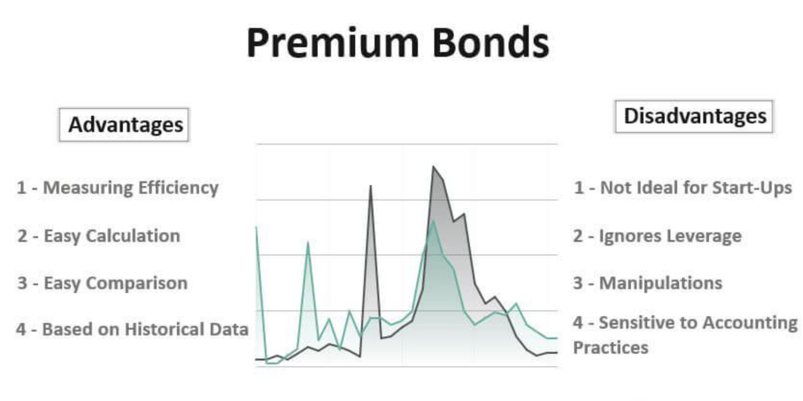

## Table of Contents

## What is a bond premium?

A bond premium is when a bond is sold for more than its face value. The face value, or par value, is the amount the bond issuer agrees to pay back when the bond matures. When investors buy a bond at a premium, they pay more than this amount. This usually happens when the bond's interest rate is higher than current market rates. Investors are willing to pay extra because the bond will give them a better return than newer bonds.

For example, imagine a bond with a face value of $1,000 and an interest rate of 5%. If the market interest rates drop to 3%, this bond becomes more attractive. Investors might be willing to pay $1,100 for it, which is a premium of $100. Over time, as the bond pays interest, the premium paid will affect the bond's yield. The yield is the total return an investor gets from the bond, considering both the interest payments and any gain or loss when the bond is sold or matures.

## How is a bond premium calculated?

A bond premium is calculated by finding the difference between what you pay for a bond and its face value. The face value is the amount the bond will be worth when it matures. If you pay more than the face value, that extra amount is the premium. For example, if a bond's face value is $1,000 and you buy it for $1,050, the premium is $50.

The reason a bond might sell at a premium is usually because its [interest rate](/wiki/interest-rate-trading-strategies) is higher than what's currently available in the market. People are willing to pay more for a bond that gives them a better return. So, if a bond pays 5% interest and new bonds only pay 3%, investors might pay more for the 5% bond. This premium affects the bond's yield, which is the total return you get from the bond, including interest and any gain or loss when you sell it or it matures.

## Why do bonds trade at a premium?

Bonds trade at a premium when their interest rate is higher than the interest rates of new bonds being issued. Imagine you have a bond that pays 5% interest every year. If new bonds start paying only 3% interest, your bond looks much better. People will want to buy your bond because it gives them more money. They are willing to pay more than the bond's face value to get that higher interest rate. This extra amount they pay is called the premium.

The bond's face value is what it will be worth when it matures. If you pay more than the face value, you've paid a premium. For example, if a bond's face value is $1,000 and you buy it for $1,050, the premium is $50. This premium affects the bond's yield, which is the total return you get from the bond. The yield includes the interest payments and any gain or loss when you sell the bond or it matures. So, even though you pay more upfront, the higher interest rate can make the bond a good investment.

## What are the advantages of buying bonds at a premium?

Buying bonds at a premium can be a good choice if the bond's interest rate is higher than what new bonds are offering. Imagine you buy a bond that pays 5% interest every year. If new bonds only pay 3%, your bond is worth more because it gives you more money. People are willing to pay extra for your bond because of the higher interest rate. This extra amount you pay is called the premium, and it can make your bond a better investment.

Even though you pay more upfront when you buy a bond at a premium, the higher interest payments can make up for it over time. If you keep the bond until it matures, you will get back the face value, which is less than what you paid, but the total interest you earn can still be more than what you would get from a new bond. So, if you believe interest rates will stay low or go down, buying a bond at a premium can be a smart move.

## What are the risks associated with bond premiums?

When you buy a bond at a premium, you pay more than its face value. This means that when the bond matures, you will get back less than what you paid. If you need to sell the bond before it matures, you might lose money if the bond's price has gone down. The bond's price can go down if interest rates go up, because people will want to buy new bonds with higher interest rates instead of your bond.

Another risk is that the bond's yield, which is the total return you get from the bond, might be lower than you expected. This happens because the premium you paid affects the yield. Even though you get higher interest payments, the extra money you spent on the premium can make the overall return less attractive. So, if interest rates go up or if you need to sell the bond early, buying at a premium can be risky.

## How does a bond's premium affect its yield to maturity?

When you buy a bond at a premium, you pay more than its face value. This means that the bond's yield to maturity, which is the total return you get if you hold the bond until it matures, will be affected. The yield to maturity takes into account the interest payments you receive and the difference between the price you paid and the face value you get back at maturity. Since you paid more than the face value, the extra amount you paid reduces the overall yield.

For example, if you buy a bond with a face value of $1,000 for $1,100, you will get back $1,000 when the bond matures. The $100 premium you paid means you will lose $100 at maturity. Even though you get interest payments along the way, the premium reduces the bond's yield to maturity. The higher the premium, the lower the yield to maturity, because you are essentially losing more money at the end.

## What is the impact of interest rate changes on bond premiums?

When interest rates change, it affects the price of bonds, including those sold at a premium. If interest rates go up, new bonds will have higher interest rates, making your bond with a lower interest rate less attractive. People will not want to pay a premium for your bond because they can get a better deal with new bonds. This means the price of your bond might go down, and you could lose money if you need to sell it before it matures.

On the other hand, if interest rates go down, your bond with a higher interest rate becomes more valuable. People will be willing to pay more for your bond because it gives them a better return than new bonds. This can make the premium on your bond even higher. So, changes in interest rates can make the premium on your bond go up or down, depending on whether rates are going up or down.

## How should investors consider bond premiums in their portfolio strategy?

When investors think about adding bonds to their portfolio, they need to consider how bond premiums might affect their overall strategy. Buying a bond at a premium means you pay more than its face value, which can be good if the bond's interest rate is higher than what new bonds are offering. This can give you more income over time, even though you pay more upfront. If you believe interest rates will stay low or go down, a bond at a premium can be a smart choice because it will keep giving you a higher return compared to new bonds.

However, there are risks to consider. If interest rates go up, the price of your bond might go down, and you could lose money if you need to sell it before it matures. Also, the premium you paid will lower the bond's yield to maturity, which is the total return you get if you hold the bond until it matures. So, when planning your portfolio, think about how long you plan to hold the bond and what might happen to interest rates. Balancing the potential for higher income against the risks of interest rate changes and the impact on yield can help you make a better decision about whether to buy bonds at a premium.

## What tax implications arise from investing in bonds at a premium?

When you buy a bond at a premium, you pay more than its face value. This can affect your taxes. The premium you paid can be amortized, which means you can spread out the cost of the premium over the life of the bond. This reduces the amount of interest income you report each year for tax purposes. Instead of reporting the full interest payment as income, you subtract a portion of the premium each year. This lowers your taxable income from the bond.

For example, if you buy a bond for $1,100 that has a face value of $1,000 and matures in 10 years, you can deduct $10 of the premium each year. If the bond pays $50 in interest annually, you would only report $40 as taxable interest income each year ($50 - $10). When the bond matures, you get back $1,000, which is less than what you paid, but you've already accounted for the premium in your taxes over the years. This way, you don't get a big tax hit when the bond matures.

## How do bond premiums compare to bond discounts in terms of investment strategy?

When you buy a bond at a premium, you pay more than its face value. This can be good if the bond's interest rate is higher than what new bonds are offering. You get more income over time, even though you pay more upfront. But there are risks. If interest rates go up, the price of your bond might go down. You could lose money if you need to sell it before it matures. Also, the premium you paid will lower the bond's yield to maturity, which is the total return you get if you hold the bond until it matures. So, if you think interest rates will stay low or go down, buying a bond at a premium can be a smart choice.

On the other hand, buying a bond at a discount means you pay less than its face value. This can be good if interest rates are expected to go down. When the bond matures, you get back more than you paid, which can make up for lower interest payments. But there are risks here too. If interest rates go up, the price of your bond might not go up as much as you hope. Also, the bond's yield to maturity will be higher because you paid less than the face value. So, if you think interest rates will stay the same or go up, buying a bond at a discount might be better.

In terms of tax implications, buying a bond at a premium lets you amortize the premium over the life of the bond, reducing your taxable interest income each year. When the bond matures, you get back less than you paid, but you've already accounted for the premium in your taxes. Buying a bond at a discount means you might have to pay taxes on the difference between what you paid and the face value when the bond matures, which is called capital gains. So, your choice between a premium and a discount bond depends on your view of interest rates, how long you plan to hold the bond, and how you want to manage your taxes.

## What advanced metrics should investors use to evaluate the true value of a bond premium?

When investors want to figure out if a bond premium is a good deal, they should look at a few advanced metrics. One important metric is the yield to maturity (YTM). This shows the total return you'll get if you hold the bond until it matures. When you pay a premium, the YTM will be lower than the bond's coupon rate because you're paying more than the face value. You can compare the YTM of the bond you're thinking about buying to other bonds to see if it's a good value. Another useful metric is the current yield, which is the annual interest payment divided by the bond's current market price. This helps you see how much income you're getting for the price you pay.

Another metric to consider is the duration of the bond. Duration measures how sensitive the bond's price is to changes in interest rates. A bond with a higher duration will lose more value if interest rates go up, which is something to think about if you're buying a bond at a premium. You should also look at the bond's convexity, which shows how the duration changes as interest rates change. A bond with positive convexity can be a better choice because it might not lose as much value if interest rates go up. By using these metrics, investors can get a better idea of whether a bond premium is worth it and how it fits into their overall investment strategy.

## How can institutional investors leverage bond premiums for strategic financial planning?

Institutional investors can use bond premiums to help with their financial planning by buying bonds that pay higher interest rates than what's available in the market. When they buy these bonds at a premium, they pay more than the bond's face value, but the higher interest payments can make up for it over time. This can be a good strategy if the investors think interest rates will stay the same or go down. By getting a higher income from the bonds, they can use that money for other investments or to meet their financial goals.

However, institutional investors also need to think about the risks. If interest rates go up, the price of the bonds they bought at a premium might go down. This could mean losing money if they need to sell the bonds before they mature. They should also consider how the premium affects the bond's yield to maturity, which is the total return they get if they hold the bond until it matures. By using advanced metrics like yield to maturity, current yield, duration, and convexity, institutional investors can make smarter choices about whether buying bonds at a premium fits into their overall financial plan.

## References & Further Reading

[1]: Bergstra, J., Bardenet, R., Bengio, Y., & Kégl, B. (2011). ["Algorithms for Hyper-Parameter Optimization."](https://papers.nips.cc/paper/4443-algorithms-for-hyper-parameter-optimization) Advances in Neural Information Processing Systems 24.

[2]: ["Advances in Financial Machine Learning"](https://www.amazon.com/Advances-Financial-Machine-Learning-Marcos/dp/1119482089) by Marcos Lopez de Prado

[3]: ["Evidence-Based Technical Analysis: Applying the Scientific Method and Statistical Inference to Trading Signals"](https://www.amazon.com/Evidence-Based-Technical-Analysis-Scientific-Statistical/dp/0470008741) by David Aronson

[4]: ["Machine Learning for Algorithmic Trading"](https://github.com/stefan-jansen/machine-learning-for-trading) by Stefan Jansen

[5]: ["Quantitative Trading: How to Build Your Own Algorithmic Trading Business"](https://www.amazon.com/Quantitative-Trading-Build-Algorithmic-Business/dp/1119800064) by Ernest P. Chan