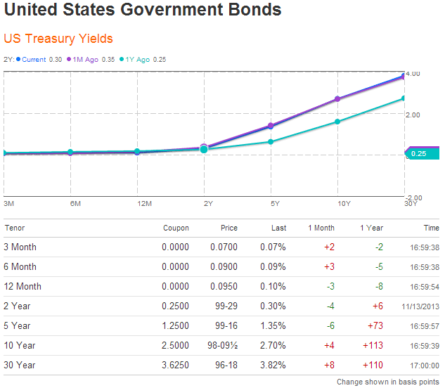

Bonds are a foundational component of the global investment landscape, offering a wide array of opportunities for diversification and income generation. As fixed-income securities, bonds are essentially loans made by investors to entities such as governments or corporations, which use the capital for various projects or operations. In return, bondholders receive periodic interest payments, known as coupons, along with the repayment of the bond's principal upon maturity.

Understanding bond prices and yields is crucial for navigating this critical segment of the financial market. Bond prices and yields are intertwined, where the yield is a function of the bond's interest payments relative to its market price. The inverse relationship between bond prices and yields means that as one increases, the other decreases. This dynamic is fundamental for investors aiming to optimize returns and manage risk effectively.



Algorithmic trading (algo trading) has emerged as a significant innovation in bond markets. By utilizing sophisticated technologies and data-driven methodologies, algo trading enhances trading efficiency, liquidity, and execution speed. It enables the analysis of vast data sets and market conditions, potentially leading to more informed investment decisions. In modern investment strategies, understanding the interaction between bond prices, yields, and algo trading is pivotal for crafting robust portfolios that can withstand market variances.

This article aims to explore these integral components of the bond market by dissecting how they interact and influence each other. We begin with a discussion on the fundamentals of bond prices and yields, followed by an examination of how inflation and interest rates impact these metrics. The role of algo trading in bond markets will be analyzed to highlight the technological advances shaping trading practices. Subsequently, the implications of algo trading on bond prices and yields will be investigated, supported by real-world examples and case studies. Finally, we will conclude with a reflection on future trends in the bond market, offering insights for investors to adapt and thrive in an evolving financial environment.

## Table of Contents

## Understanding Bond Prices and Yields

Bonds are fundamental financial instruments that represent a loan made by an investor to a borrower, typically a corporation or government. The bond price is the present value of its future cash flows, primarily consisting of periodic interest payments (coupons) and the principal amount (face value) upon maturity. The yield of a bond, on the other hand, reflects the return an investor expects to earn if the bond is held until maturity. 

### Determination of Bond Prices and Yields

The price of a bond can be mathematically expressed using the formula:

$$
\text{Price} = \sum_{t=1}^{n} \frac{C}{(1 + r)^t} + \frac{F}{(1 + r)^n}
$$

Where:
- $C$ is the coupon payment,
- $F$ is the face value of the bond,
- $r$ is the discount rate or yield,
- $n$ is the number of periods until maturity.

The bond yield, particularly the yield to maturity (YTM), is the discount rate ($r$) that equates the bond's present value of future cash flows to its market price. Yields are often expressed as annual percentages and can also be calculated using iterative numerical methods.

### The Inverse Relationship Between Prices and Yields

There exists an inverse relationship between bond prices and yields. This means that as bond prices rise, yields fall, and vice versa. This relationship can be attributed primarily to the fixed nature of a bond's coupon payments. If interest rates in the market increase, newer bonds will be issued with higher coupon rates, making existing bonds with lower coupon rates less attractive, thus reducing their price. Conversely, if interest rates decrease, existing bonds with higher coupon rates become more valuable, driving up their prices.

### Factors Influencing Bond Prices and Yields

Several factors influence bond prices and yields:

1. **Interest Rates**: As previously noted, changes in interest rates have a direct impact on bond prices and yields. Central banks often adjust policy rates to control economic activity, which in turn influences market interest rates.

2. **Inflation Expectations**: Inflation erodes the purchasing power of future cash flows from bonds. When inflation expectations rise, bond yields tend to increase to compensate investors for this erosion, causing bond prices to fall.

3. **Credit Risk**: The perceived risk of default by the bond issuer can affect bond prices. Bonds issued by entities with higher credit risk often trade at lower prices and higher yields to compensate for the increased risk.

4. **Supply and Demand Dynamics**: Market supply and demand forces for bonds also play a crucial role in determining their prices and yields. Economic conditions that increase demand for fixed-income securities can lead to higher bond prices and lower yields.

### Real-World Examples

Consider a scenario where the Federal Reserve announces an increase in interest rates. Existing bonds with lower coupon rates become less attractive as new, higher-yielding bonds enter the market. Consequently, the prices of existing bonds decline to bring their effective yields in line with current market rates.

Alternatively, in times of economic uncertainty, investors may flock to government bonds perceived as safe investments, driving up prices and consequently pushing down yields. An example of this was observed during the financial crisis of 2008, where U.S. Treasury bonds saw substantial inflows, resulting in elevated prices and historically low yields.

In conclusion, bond prices and yields are foundational concepts in finance, shaped by market dynamics, economic indicators, and investor perceptions. Understanding these metrics is crucial for effective investment decision-making and risk management.

## The Role of Inflation and Interest Rates

Inflation expectations significantly impact bond prices and yields due to the intrinsic relationship between inflation and interest rates. When investors anticipate higher inflation, they often demand higher yields on bonds to compensate for the erosion of purchasing power. Conversely, when inflation expectations are low, bond yields tend to decrease as the demand for fixed-income securities increases. This inverse relationship between bond prices and yields becomes evident as bond prices fall when yields rise in response to inflationary pressures.

Central banks play a crucial role in shaping interest rates and, consequently, influencing the bond market. Central banks, such as the Federal Reserve in the United States or the European Central Bank in the Eurozone, use monetary policy tools to control inflation and stabilize their economies. One primary tool is the manipulation of interest rates. By setting the benchmark interest rates, central banks influence borrowing costs throughout the economy. When central banks raise interest rates to combat inflation, bond yields generally increase, leading to a drop in bond prices. Conversely, lowering interest rates to stimulate economic growth can result in lower bond yields and higher bond prices.

Historical instances provide valuable insights into how changes in interest rates have significantly affected bond markets. During the late 1970s and early 1980s, many advanced economies experienced high inflation, prompting central banks to dramatically increase interest rates. For example, the U.S. Federal Reserve, under Chairman Paul Volcker, raised the federal funds rate to unprecedented levels, leading to a subsequent reduction in inflation but also causing a sharp decline in bond prices due to the elevated yields required by investors. 

A more recent example occurred in the aftermath of the 2008 financial crisis. In response to the economic downturn, central banks worldwide implemented aggressive monetary policies, including lowering interest rates to near-zero levels and engaging in quantitative easing. This led to a sustained period of low yields and rising bond prices, reflecting the influence of monetary policy on bond markets. However, as economies recovered and inflationary pressures started to build, central banks began to gradually increase interest rates, signaling the end of the ultra-low [interest rate](/wiki/interest-rate-trading-strategies) environment. This shift put upward pressure on bond yields and downward pressure on bond prices, illustrating the ongoing interplay between inflation, interest rates, and bond markets.

## Algorithmic Trading in Bond Markets

Algorithmic trading, commonly referred to as algo trading, involves the use of computer algorithms to automate trading strategies, executing orders at effective prices and speeds unattainable by human traders. In bond markets, where trades involve debt securities issued by corporations or governments, algo trading plays a crucial role in enhancing trade execution and market efficiency.

### Application in Bond Markets

In bond markets, [algorithmic trading](/wiki/algorithmic-trading) is used to handle large volumes of trades, manage the complexities of bond pricing, and respond to rapid changes in market conditions. By employing sophisticated algorithms, traders can quickly assess bond valuations, predict price movements, and execute orders within milliseconds. This is especially important in the vast and diverse bond market, which includes government bonds, corporate bonds, muni bonds, and more, each with distinct characteristics and risk profiles.

### Technologies and Methodologies

One of the key methodologies utilized in bond algo trading is [machine learning](/wiki/machine-learning). Machine learning algorithms can digest vast datasets to uncover patterns, assess credit risks, and forecast interest rate movements. These algorithms learn from historical data and adapt to new data in real-time, providing predictive analytics that are crucial for making informed trading decisions.

**Example of a Simple Machine Learning Model in Python:**

```python
from sklearn.linear_model import LinearRegression
import numpy as np

# Sample data: Historical bond prices and interest rates
bond_prices = np.array([[100], [102], [101], [105], [110]])
interest_rates = np.array([2.5, 2.3, 2.4, 2.2, 2.0])

# Initialize the model
model = LinearRegression()

# Fit the model
model.fit(bond_prices, interest_rates)

# Predict future interest rate based on bond price
predicted_rate = model.predict([[108]])

print(f"Predicted Interest Rate for Bond Price 108: {predicted_rate[0]:.2f}%")
```

High-frequency trading ([HFT](/wiki/high-frequency-trading-strategies)), a subset of algorithmic trading, stands out in bond markets for its ability to execute a large number of orders at extremely fast speeds. Technologies like low-latency networks and co-located servers near exchange facilities allow traders to minimize delays and capitalize on short-lived market fluctuations. HFT firms leverage these technologies to engage in strategies like [market making](/wiki/market-making), where they profit from the bid-ask spread by continuously buying and selling securities.

### Advantages of High-Frequency Trading

High-frequency trading in bond markets offers several benefits, including improved [liquidity](/wiki/liquidity-risk-premium) and tighter bid-ask spreads. By increasing the number of market participants and the speed of executions, HFT enhances market depth and efficiency. This, in turn, results in lower transaction costs for investors and reduced tracking errors for fund managers.

HFT also contributes to quicker price discovery, as the high [volume](/wiki/volume-trading-strategy) of trades reflects the assimilation of information into bond prices effectively. In rapidly evolving markets, the ability to adapt swiftly to new information presents a distinct advantage, aiding in the stabilization of prices and providing resilience against market shocks.

Nonetheless, the rapid rise in algo trading and high-frequency techniques raises questions about market [volatility](/wiki/volatility-trading-strategies) and the potential for systemic risks. As such, it is essential for regulators to continuously monitor these technologies to safeguard market integrity and protect investors.

## Impact of Algo Trading on Bond Prices and Yields

Algorithmic trading (algo trading) has become a significant force in financial markets, including the bond market. It utilizes algorithms, or sets of pre-defined instructions, to perform trading activities at high speeds and frequencies. Algo trading influences various aspects of bond markets, notably liquidity, volatility, and pricing efficiency, while also introducing specific challenges.

### Liquidity and Volatility
Algo trading enhances liquidity in bond markets by increasing the number and volume of transactions. By executing trades quickly and efficiently, algorithms can ensure more continuous and tighter bid-ask spreads, thereby improving market liquidity. A study by Hendershott et al. (2011) highlighted how algorithmic trading increases liquidity by continually providing two-sided markets, even in times of uncertainty.

While liquidity generally improves, algo trading can also increase volatility under certain market conditions. In less liquid markets, rapid execution and volume increase can exacerbate price swings. An algorithm-driven flash crash in a less structured trading environment can lead to significant volatility, as seen during the 2010 Flash Crash.

### Bond Pricing Efficiency
Algorithmic trading enhances pricing efficiency by quickly incorporating new information into bond prices. Computers can process vast amounts of data and execute complex strategies that adjust to information releases and economic data faster than human traders. This rapid reaction helps market prices reflect true values more accurately. The speed of algo trading often reduces [arbitrage](/wiki/arbitrage) opportunities since price discrepancies are resolved quickly.

To illustrate, Python code could be used to simulate simple bond arbitrage strategies enabled by algo trading. A pseudocode example might be:

```python
# Example of algorithmic trading for bond arbitrage
def bond_arbitrage(current_price, predicted_price, threshold):
    if abs(predicted_price - current_price) > threshold:
        if predicted_price > current_price:
            return "Buy Bond"
        else:
            return "Sell Bond"
    return "No trade"
```

### Risks and Challenges
The rise of algo trading presents specific risks and challenges. One major concern is the potential for algorithms to malfunction, leading to disruptive trading behavior, often referred to as a "rogue algorithm." Such incidents can cause rapid market shifts, impacting not just bond prices but the broader financial system.

Market participants also worry about the transparency and fairness of algo trading. The speed and complexity of these strategies can disadvantage traditional investors who rely on slower, fundamental-based trading tactics. Moreover, the concentration of algo trading in the hands of a few large firms raises concerns about market power and the potential for manipulative practices.

Furthermore, regulatory challenges arise as technology outpaces current financial laws. Regulators struggle to keep up with the rapid developments in algo trading, seeking to ensure that these technologies do not undermine market stability.

In conclusion, while algo trading brings numerous benefits to bond markets—such as increased liquidity and improved pricing efficiency—it also introduces potential risks. Efficiently managing these challenges is crucial for maintaining market stability as algo trading continues to evolve.

## Case Studies and Real-World Examples

Algorithmic trading has significantly impacted the bond markets, evidenced by various case studies and real-world examples. The shift from traditional trading methods to complex algorithms has led to notable changes in liquidity, pricing efficiency, and market dynamics.

One significant case involves the U.S. Treasury bond market. Post the 2008 financial crisis, the adoption of algorithmic trading accelerated, driven by regulatory changes and technological advancements. This period saw a rise in high-frequency trading (HFT), which utilizes algorithms to execute a large number of orders at extremely rapid speeds. A study by the U.S. Treasury Department and other regulatory bodies found that HFT accounted for nearly half of the trading volume in the Treasury market by the mid-2010s.[^1] This introduced increased liquidity and tighter bid-ask spreads, enhancing market efficiency. However, it also raised concerns about potential systemic risks, including flash crashes—sudden price drops due to tumultuous algorithmic interactions.

An example illustrating these risks is the October 2014 "Flash Rally" in the U.S. Treasury market. Within minutes, Treasury yields saw an unexplained significant drop followed by a rapid recovery. Further analysis suggested that automated trading contributed to this volatility, as algorithms reacted to market conditions and each other's actions without the intervention of human judgment.[^2] This incident highlighted the importance of monitoring and potentially regulating algorithmic activities to prevent such rapid fluctuations.

In the corporate bond market, algorithmic trading has been slower to gain prominence but is steadily increasing. The primary barrier has been the market's fragmented nature, where bonds are traded over-the-counter (OTC) rather than on centralized exchanges. Recent advancements in electronic trading platforms have facilitated algorithmic trading's expansion. For instance, platforms like Tradeweb and MarketAxess have integrated technologies allowing for more automated trading strategies, thus improving pricing transparency and execution speed.[^3]

Additionally, machine learning techniques are being increasingly used to predict bond prices and optimize trading strategies. Quants employ these algorithms to analyze vast datasets, identifying patterns and trends that might not be immediately apparent to human traders. These models can adapt to new information and market environments, offering a dynamic approach to bond trading.

Lessons from these case studies emphasize the dual-edged nature of algorithmic trading in bond markets. On the one hand, it presents clear benefits in terms of efficiency and cost reduction. On the other hand, it introduces challenges in market stability and complexity. The key takeaway for future investment strategies is the need for robust risk management frameworks and regulatory measures to ensure these systems do not inadvertently amplify risks.

The evolution of algorithmic trading in bonds suggests an ongoing trend toward more integrated use of data analytics and machine learning. Investors and firms looking to capitalize on these technologies must remain vigilant about their systems' potential impacts, maintaining a balance between innovation and caution to improve market outcomes sustainably.

[^1]: "The Evolution of Trading in the US Corporate Bond Market," Congressional Research Service.
[^2]: "Joint Staff Report: The U.S. Treasury Market on October 15, 2014," U.S. Department of the Treasury.
[^3]: "Algorithmic Trading in the Fixed Income Markets," Bank for International Settlements.

## Conclusion and Future Trends

Understanding bond prices, yields, and the growing influence of algorithmic trading is essential for modern investors. Bond prices and yields are inversely related, influenced by factors such as interest rates, inflation expectations, and market conditions. Yield $Y$ is typically calculated as $Y = \frac{C}{P}$, where $C$ is the annual coupon payment and $P$ is the current price of the bond. This mathematical relationship underscores the importance of economic indicators and central bank policies in shaping bond markets.

Algorithmic trading has transformed the landscape by leveraging advanced technologies like machine learning and high-frequency trading (HFT) to enhance market efficiency and liquidity. However, it also brings challenges, such as increased volatility and potential systemic risks. Historical patterns have shown that shifts in interest rates, driven by policy changes, have significant impacts on bond prices and yields, offering valuable lessons for the future.

Looking ahead, technology will continue to reshape bond markets. The integration of AI and machine learning will likely deepen, improving predictive analytics and trading strategies. Moreover, global economic changes, including varying interest rates across economies and geopolitical shifts, will influence bond markets. For investors, understanding these dynamics is crucial. Diversification, staying informed about technological advancements, and monitoring central bank policies are key strategies to successfully navigate this evolving market. Adopting a proactive approach to risk management, by using tools like stop-loss orders or engaging in hedging strategies, can further enhance resilience in the face of market volatility. As algorithmic trading becomes more sophisticated, ethical considerations and regulatory frameworks will also play a pivotal role in ensuring market stability and fairness.

## References & Further Reading

[1]: Hendershott, T., Jones, C. M., & Menkveld, A. J. (2011). ["Does Algorithmic Trading Improve Liquidity?"](https://onlinelibrary.wiley.com/doi/full/10.1111/j.1540-6261.2010.01624.x) The Review of Financial Studies, 24(3), 1595-1624.

[2]: Joint Staff Report: The U.S. Treasury Market on October 15, 2014. U.S. Department of the Treasury. Available at: https://www.treasury.gov/press-center/press-releases/Documents/Joint_Staff_Report_Treasury_10-15-2015.pdf

[3]: "The Evolution of Trading in the US Corporate Bond Market," Congressional Research Service. Available at: https://fas.org/sgp/crs/misc/R45177.pdf

[4]: BIS. (2016). ["Electronic Trading in Fixed Income Markets"](https://www.bis.org/publ/mktc07.pdf). Committee on the Global Financial System Papers, No. 55, Bank for International Settlements.

[5]: Lopez de Prado, M. (2018). ["Advances in Financial Machine Learning."](https://www.amazon.com/Advances-Financial-Machine-Learning-Marcos/dp/1119482089) Wiley. 

[6]: Chan, E. P. (2009). ["Quantitative Trading: How to Build Your Own Algorithmic Trading Business."](https://github.com/ftvision/quant_trading_echan_book) Wiley.

[7]: Jansen, S. (2020). ["Machine Learning for Algorithmic Trading."](https://github.com/stefan-jansen/machine-learning-for-trading) Packt Publishing.

[8]: Fabozzi, F. J., & Mann, S. V. (2005). ["The Handbook of Fixed Income Securities."](https://www.mhebooklibrary.com/doi/book/10.1036/9781260473902?contentTab=true) McGraw-Hill Education.