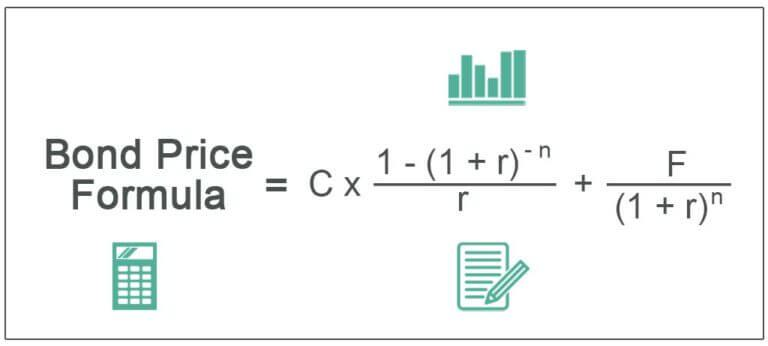

Financial instruments are vital components of the global financial ecosystem, forming the backbone of investment strategies for individuals, corporations, and governments alike. These instruments, which include equities, bonds, and derivatives, serve various purposes such as raising capital, hedging risks, and facilitating transfers of financial risks. Among these, bonds stand out as a fundamental tool in investing due to their relatively stable nature and predictable income streams, offering a haven for risk-averse investors seeking to preserve capital while generating steady returns.

Bonds, as debt securities, represent loans made by investors to borrowers, typically governments or corporations. They play a crucial role in diversified portfolios by balancing the higher-risk equities with lower-risk, income-generating assets. This characteristic renders bonds an indispensable element in effective investment strategies, giving investors the ability to tailor their risk preferences.

In recent years, the financial markets have witnessed a significant transformation with the advent of algorithmic trading. This technological advancement relies on complex mathematical models and algorithms to execute trades at speeds and frequencies far surpassing any human capability. Algorithmic trading has revolutionized how financial markets operate by increasing trade efficiency, reducing transaction costs, and minimizing human error. This shift has fundamentally altered trading landscapes, influencing how investment decisions are made across various asset classes, including bonds.

The intersection of bond pricing and algorithmic trading represents a significant evolution in financial markets. Algorithmic trading has introduced new methods for assessing and predicting bond prices, leveraging vast datasets and advanced analytics to optimize trading strategies. These algorithms can incorporate real-time data to analyze price movements, interest rate changes, and economic indicators, which influence bond valuations.

In conclusion, the introduction of algorithmic trading into bond markets is a testament to the dynamic nature of financial markets. The evolving relationship between bond pricing and algorithmic trading promises to enhance the accuracy of market predictions and improve investment outcomes. Subsequent sections of this article will further explore the complexities of financial instruments, the intricacies of bond markets, and the technological innovations shaping modern trading strategies.

## Table of Contents

## Understanding Financial Instruments

Financial instruments are assets that can be traded in the financial markets. They serve as channels for capital flow and are essential for the diversification and risk management of investment portfolios. These instruments provide a structured way for investors to realize returns on their capital, facilitating both individual and institutional financial goals.

**Types of Financial Instruments**

Financial instruments are typically categorized into three main types: equities, bonds, and derivatives. Equities represent ownership interests in a company and include common and preferred stocks. They provide investors with voting rights and potential dividends but typically involve higher risk due to their sensitivity to market fluctuations.

Bonds are debt instruments where the issuer promises to pay the holder a specified sum of interest over a defined period and to return the principal at maturity. Bonds are perceived as relatively stable investments compared to equities because they offer fixed income and have a higher claim on assets in the event of liquidation. Types of bonds include government bonds (issued by national governments), corporate bonds (issued by companies), and municipal bonds (issued by states, cities, or other governmental entities).

Derivatives are contracts whose value is derived from underlying assets, such as stocks, bonds, commodities, indexes, or currencies. Common derivatives include options, futures, and swaps. They are used primarily for hedging risk or for speculative purposes.

**Significance of Bonds**

Bonds play a critical role in investment portfolios because they provide a stable source of income and can act as a hedge against the [volatility](/wiki/volatility-trading-strategies) of equities. They are particularly significant for risk-averse investors and those seeking predictable returns. Due to their relatively lower risk, bonds are often utilized in diversified portfolios to balance the risk-return profile.

**Classification of Financial Instruments**

Traditionally, financial instruments were classified based on their nature, such as debt or equity. However, with the evolution of financial markets, modern classifications have emerged that consider factors such as [liquidity](/wiki/liquidity-risk-premium), marketability, and potential for income generation. Nowadays, financial instruments can also be categorized based on their complexity, ranging from simple instruments like treasury bills to complex products such as collateralized debt obligations (CDOs).

**Regulatory Considerations**

The trading of financial instruments is subject to various regulatory frameworks intended to ensure transparency, fairness, and efficiency in the markets. Regulatory bodies, such as the U.S. Securities and Exchange Commission (SEC), the European Securities and Markets Authority (ESMA), and others, establish rules regarding disclosure, trading practices, and the financial health of market participants. Recent regulatory efforts have increasingly focused on managing the risks associated with complex derivatives and [algorithmic trading](/wiki/algorithmic-trading), emphasizing the importance of compliance in maintaining market integrity.

In summary, financial instruments are integral to the financial markets, providing options for income generation, diversification, and risk management. Understanding their types, classifications, and regulatory environment is crucial for informed investing and effective financial strategy development. The stable nature of bonds makes them particularly valuable for mitigating risk and ensuring consistent returns, serving as a foundational component for many investment strategies.

## Investment Bonds: A Closer Look

Investment bonds are debt securities issued by various entities, including governments, corporations, and municipalities, to raise capital. Investors who purchase bonds lend money to the issuer in exchange for periodic interest payments, known as coupons, and the return of the bond's face value at maturity. Bonds play an integral role in financial portfolios by providing a relatively stable source of income and serving as a risk management tool.

### Types of Bonds

1. **Government Bonds**: These are issued by national governments and are considered to be low-risk investments due to the backing provided by the government. Examples include U.S. Treasury bonds, British gilts, and Japanese government bonds.

2. **Corporate Bonds**: Issued by companies to fund operations, expansion, and other capital needs. Corporate bonds generally offer higher yields than government bonds due to a relatively higher risk.

3. **Municipal Bonds**: These are issued by city or regional governments and agencies to finance public projects like schools, highways, and hospitals. They often come with tax advantages, making them attractive for certain investors.

### Benefits of Investing in Bonds

Bonds offer a predictable income stream through regular interest payments, which can be attractive to retirees or those seeking stable cash flow. They also serve as a risk management tool by diversifying a portfolio and reducing volatility, as bond prices often move inversely to stock prices.

### Bond Pricing and Influencing Factors

Bonds are generally priced at their face value upon issuance but can trade in secondary markets, where their prices fluctuate. The price of bonds is influenced by:

- **Interest Rates**: An inverse relationship exists between bond prices and interest rates. If interest rates rise, the price of existing bonds typically falls because new issues offer higher yields.
- **Credit Rating**: The issuing entity's creditworthiness plays a significant role in bond pricing. Higher-rated bonds are deemed safer and are priced higher with lower yields, compared to lower-rated bonds.
- **Time to Maturity**: The longer the maturity period, the more susceptible a bond is to interest rate risk, affecting its price.

The price of a bond can be estimated using the present value of future cash flows, described by the formula:

$$

P = \sum_{t=1}^{T} \frac{C}{(1 + r)^t} + \frac{F}{(1 + r)^T} 
$$

where $P$ is the price of the bond, $T$ is the time to maturity, $C$ is the coupon payment, $F$ is the face value, and $r$ is the discount rate.

### Historical Bond Market Trends and Performance

Historically, bonds have been seen as a safer, more conservative investment compared to equities. During periods of market instability, investors often flock to bonds, particularly government bonds, contributing to their reputation as safe havens. For example, during the financial crisis of 2008, bond markets experienced higher inflows as investors sought safety away from volatile equity markets.

The performance of the bond market can vary widely depending on economic conditions, inflation expectations, and changes in [interest rate](/wiki/interest-rate-trading-strategies) policies set by central banks. Over the long term, bonds typically offer lower returns than equities but provide more consistent payouts, which can cushion portfolios during economic downturns.

In conclusion, investment bonds form an essential part of financial portfolios, offering benefits such as income generation and risk diversification. Understanding the factors that affect bond pricing and past market trends can aid investors in making informed decisions to optimize their portfolios.

## Algorithmic Trading in Financial Markets

Algorithmic trading refers to the use of computer programs to execute financial securities orders automatically according to predetermined criteria. This form of trading has seen significant growth, reshaping today's financial markets by enhancing trading efficiency and accuracy.

Technological advancements have been pivotal in the proliferation of algorithmic trading. The dramatic increase in computational power, combined with the expansion of financial data availability, has provided the necessary environment for sophisticated trading algorithms to thrive. High-frequency trading ([HFT](/wiki/high-frequency-trading-strategies)) is a notable form, characterized by rapid trade execution, often in milliseconds, thanks to advancements in telecommunications and the development of low-latency networks.

Algorithmic trading offers several advantages, primarily speed and efficiency. By automating trading processes, algorithms can execute large volumes of trades at much faster rates than human traders. This speed reduces the time taken to respond to market fluctuations, potentially leading to more favorable trade outcomes. Additionally, automation minimizes human error, improving the consistency of trading decisions and allowing for sophisticated strategies that might be challenging to manage manually.

Despite its benefits, algorithmic trading presents several risks and challenges. The reliance on technology introduces the potential for system failures and technical issues, which can lead to significant financial losses. Algorithms may also exhibit undesirable behaviors under unforeseen market conditions, leading to erratic trading patterns that could destabilize markets. Furthermore, the rapid pace and opaque nature of some algorithmic strategies raise concerns about market manipulation and the fairness of trading practices.

In the bond market, several popular algorithms illustrate the application of algorithmic trading. For instance, VWAP (Volume Weighted Average Price) algorithms aim to execute orders close to the average price throughout a trading session, reducing the market impact of large trades. TWAP (Time Weighted Average Price) algorithms, on the other hand, execute trades in equal parts over specified time intervals, providing consistency in execution over time. Additionally, algorithms incorporating [machine learning](/wiki/machine-learning) techniques are becoming increasingly popular, using historical data to predict market trends and optimize trading strategies.

Algorithmic trading continues to evolve, integrating more advanced analytics and [artificial intelligence](/wiki/ai-artificial-intelligence). As the financial markets increasingly embrace machine-driven trade implementation, the importance of balancing innovative algorithmic strategies with robust risk management and ethical considerations becomes paramount.

## The Intersection of Bond Pricing and Algo Trading

Algorithmic trading has significantly transformed the landscape of bond pricing by introducing sophisticated computational techniques that enhance pricing accuracy and decision-making efficiency. Traditionally, bond pricing relied on manual calculations and human judgment, which often led to inefficiencies and potential pricing discrepancies. However, the integration of algorithmic trading methods has revolutionized this process by automating price discovery and execution.

The impact of big data and machine learning on bond market strategies is profound. Big data provides traders with an extensive [volume](/wiki/volume-trading-strategy) of information that can be analyzed to detect patterns, trends, and outliers that influence bond prices. Machine learning algorithms can process this data to develop predictive models that anticipate price movements and volatility. For example, supervised learning models like regression analysis and decision trees are employed to correlate bond prices with macroeconomic variables, credit ratings, and market sentiment. This automated analysis allows traders to formulate more accurate and timely bond market strategies.

The role of artificial intelligence (AI) extends beyond pattern recognition to include adaptive learning. AI systems can dynamically adjust trading strategies in response to changing market conditions. These systems can analyze historical bond market data to identify cyclical trends and anomalies, adapting portfolios to optimize returns while controlling risk. For instance, [reinforcement learning](/wiki/reinforcement-learning) algorithms can be used to simulate various market scenarios and refine trading tactics without human intervention.

Several case studies highlight the effectiveness of algorithmic trading in bond investment decisions. For instance, certain financial institutions have developed proprietary algorithms that integrate quantitative models with real-time data feeds to enhance the pricing of complex fixed-income securities. These algorithms have successfully reduced transaction costs and improved liquidity in market-making operations. Furthermore, quantitative hedge funds employ machine-driven strategies that leverage algorithmic trading to identify [arbitrage](/wiki/arbitrage) opportunities in the bond market, enhancing their overall performance.

Despite its advantages, algorithmic trading in bond markets raises ethical and regulatory concerns. The potential for market manipulation, where algorithms might intentionally or unintentionally create false price signals, is a significant issue. Regulators are increasingly focusing on oversight mechanisms to monitor algorithmic activities and ensure market stability. Moreover, transparency challenges arise from the opacity of certain algorithmic processes, which can make it difficult for regulators to fully understand and assess the impact of these technologies on market dynamics.

Algorithmic trading continues to reshape bond pricing methodologies, offering unprecedented precision and adaptability. However, as these technologies evolve, both market participants and regulators must remain vigilant to address the potential risks that accompany such advances, thereby ensuring sustainable and fair market practices.

## Future Trends and Innovations

Emerging trends in the development of financial instruments largely revolve around technological integration and innovative strategies that enhance efficiency and transparency. A significant trend is the increasing use of machine learning algorithms and artificial intelligence in bond pricing strategies. These technologies enable the processing of vast amounts of market data swiftly, identifying patterns that could be imperceptible to human analysts. The application of predictive analytics in this context could provide more accurate bond valuations and better risk management frameworks.

The potential for blockchain technology and decentralized finance (DeFi) to transform traditional bond markets is profound. Blockchain can offer increased transparency and security in bond transactions through its immutable ledger. Smart contracts, which are self-executing contracts with terms directly written into code, could automate coupon payments and redemption processes, thereby reducing the need for intermediaries and minimizing transaction costs. With the rise of tokenized bonds, where bonds are represented as tokens on a blockchain, we could witness a democratization in bond markets, allowing greater access to a broader base of investors.

As technologies advance, investor behavior and market dynamics are expected to evolve. Investors may increasingly rely on data analytics and algorithm-driven insights to make more informed decisions. This could lead to a shift from traditional buy-and-hold strategies to more dynamic investment approaches where rebalancing decisions are made in real-time based on algorithmic signals. Furthermore, advancements in natural language processing (NLP) may offer insights into market sentiment analysis, potentially affecting bond pricing and trading strategies.

The future regulatory landscape surrounding algorithmic trading and bond investments is likely to adapt in response to these innovations. Regulators may focus on ensuring that algorithmic trading practices do not contribute to market volatility or manipulation. Enhanced scrutiny and transparency in algorithmic strategies may be expected, alongside the creation of guidelines that promote fair competition and protect investors. Additionally, regulations may increasingly address concerns related to data privacy and cybersecurity, particularly as financial markets become more interconnected through digital platforms.

## Conclusion

In summarizing the exploration of financial instruments, bond pricing, and algorithmic trading, it becomes evident that these elements are integral to modern finance. Financial instruments, including bonds, serve as essential tools for investors aiming to balance risk and return in their portfolios. Bonds, in particular, offer a stable investment avenue with the potential for income generation and risk management. The advent of algorithmic trading has introduced a new dimension to financial markets, significantly enhancing the speed and efficiency with which trades are executed. This innovation has also transformed bond pricing strategies, integrating complex algorithms with big data and machine learning to optimize investment decisions.

Staying abreast of technological advancements and market trends is crucial for investors and financial professionals. As financial markets become increasingly technology-driven, understanding the mechanics and implications of these technologies ensures more informed and strategic investment choices. The integration of artificial intelligence in predicting market trends underscores the necessity of embracing these advancements.

Investors and financial professionals are encouraged to adopt innovative strategies to optimize their portfolios. By leveraging the power of algorithmic trading and the insights derived from big data, they can position themselves advantageously within the ever-evolving financial landscape. The potential for blockchain and decentralized finance to transform traditional markets highlights the dynamic nature of these changes.

Ultimately, the evolution of financial markets presents abundant opportunities. As technologies advance, so too does the capacity for financial tools and strategies to adapt and thrive. The future regulatory landscape will also play a pivotal role in shaping these developments, with the potential to further refine the use of algorithms in trading and investment. As such, remaining informed and agile is not just beneficial but necessary for success in the financial ecosystems of tomorrow.

## References & Further Reading

[1]: Bergstra, J., Bardenet, R., Bengio, Y., & Kégl, B. (2011). ["Algorithms for Hyper-Parameter Optimization."](https://papers.nips.cc/paper/4443-algorithms-for-hyper-parameter-optimization) Advances in Neural Information Processing Systems 24.

[2]: ["Advances in Financial Machine Learning"](https://www.amazon.com/Advances-Financial-Machine-Learning-Marcos/dp/1119482089) by Marcos Lopez de Prado

[3]: ["Evidence-Based Technical Analysis: Applying the Scientific Method and Statistical Inference to Trading Signals"](https://www.amazon.com/Evidence-Based-Technical-Analysis-Scientific-Statistical/dp/0470008741) by David Aronson

[4]: ["Machine Learning for Algorithmic Trading"](https://github.com/stefan-jansen/machine-learning-for-trading) by Stefan Jansen

[5]: ["Quantitative Trading: How to Build Your Own Algorithmic Trading Business"](https://www.amazon.com/Quantitative-Trading-Build-Algorithmic-Business/dp/1119800064) by Ernest P. Chan