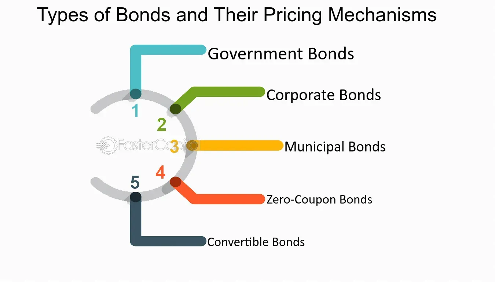

## Table of Contents

## What is a bond and why is it important to understand its pricing?

A bond is like a loan that you give to a company or government. When you buy a bond, you are lending them money, and in return, they promise to pay you back the amount you lent them, called the principal, on a specific date, called the maturity date. They also pay you interest regularly, usually every six months, until the bond matures. The interest you get is called the coupon.

Understanding bond pricing is important because it helps you know how much your investment is worth at any time. Bond prices change based on things like interest rates, how safe the bond is, and how long it has until it matures. If interest rates go up, the price of your bond might go down, and if they go down, the price of your bond might go up. Knowing how these factors affect bond prices can help you make smarter choices about when to buy or sell bonds, and how to manage your investments to get the best returns.

## How does the face value of a bond affect its pricing?

The face value of a bond, also known as its par value, is the amount the issuer agrees to repay to the bondholder when the bond matures. It's like the original price of the bond. When you buy a bond, you might pay more or less than its face value depending on what's happening in the market. If you pay the face value, it means the bond's interest rate matches what people expect to earn from similar bonds at that time.

The face value affects the bond's pricing because it helps set the bond's coupon payments. The coupon is a percentage of the face value that the issuer pays you as interest. If the bond's price in the market goes above the face value, it's selling at a premium, which usually happens when interest rates drop. If the price falls below the face value, it's selling at a discount, which can happen when interest rates rise. Understanding this relationship helps you see why a bond's price might change over time and how it relates to the money you'll get back when the bond matures.

## What are the key components of a bond that influence its price?

The price of a bond is influenced by several key components. The first is the bond's face value, which is the amount the issuer promises to pay back when the bond matures. If you buy a bond for more than its face value, it's at a premium, and if you buy it for less, it's at a discount. The coupon rate, which is the interest you get, is another important part. It's a percentage of the face value and is paid regularly. If the coupon rate is higher than what new bonds are offering, the price of your bond might go up because it's more attractive to investors.

Another component is the bond's maturity date, which is when the bond expires and the issuer pays back the face value. Bonds that mature sooner are usually less risky and might have lower prices than bonds that take longer to mature. The credit rating of the issuer also matters. If people think the issuer might not be able to pay back the bond, the price might go down. Lastly, interest rates in the market can change bond prices. If interest rates go up, new bonds will offer higher coupons, making older bonds with lower coupons less valuable, so their prices might drop. If interest rates go down, the opposite happens.

## How do interest rates impact bond pricing?

Interest rates have a big impact on bond prices. When interest rates go up, new bonds come out with higher coupon rates. This makes the older bonds with lower coupon rates less attractive to people, so their prices go down. Imagine you have a bond that pays 3% interest, but now you can buy a new bond that pays 4%. You'd probably want the new bond, so the price of your old 3% bond would drop because fewer people want it.

On the other hand, when interest rates go down, the opposite happens. If new bonds are offering lower coupon rates, the older bonds with higher rates become more valuable. For example, if you have a bond that pays 4% interest and new bonds are only paying 3%, people will want your bond more. This demand can push the price of your bond up. So, interest rates and bond prices move in opposite directions: when rates go up, bond prices go down, and when rates go down, bond prices go up.

## What is the difference between a bond's coupon rate and yield to maturity?

The coupon rate of a bond is like the interest rate it promises to pay you every year. It's a fixed percentage of the bond's face value. For example, if you have a bond with a face value of $1,000 and a coupon rate of 5%, you'll get $50 every year until the bond matures. The coupon rate stays the same no matter what happens to the bond's price in the market.

The yield to maturity (YTM) is different because it looks at the total return you can expect if you hold the bond until it matures. It takes into account not just the coupon payments but also the difference between the price you paid for the bond and its face value at maturity. If you buy a bond for less than its face value, the YTM will be higher than the coupon rate because you'll get a bit more when the bond matures. If you buy it for more than the face value, the YTM will be lower than the coupon rate. So, YTM gives you a better idea of the bond's overall profitability over time.

## How is the present value of future cash flows used in bond pricing?

The present value of future cash flows is really important when figuring out how much a bond is worth. Think of it like this: if someone promises to give you money in the future, like the coupon payments and the face value of a bond, you need to know what that money is worth today. This is because money you get now is usually more valuable than money you get later. To find the present value, you use a discount rate, which is kind of like the interest rate you could earn if you invested your money elsewhere. You take each of the future payments, like the coupons and the face value, and figure out how much they're worth now by using this discount rate.

For example, if you have a bond that pays $50 every year for 10 years and then gives you back $1,000 at the end, you'd calculate the present value of each of those $50 payments and the $1,000 payment. If the discount rate is 5%, you'd see how much $50 a year from now is worth today, then how much $50 two years from now is worth today, and so on, until you get to the $1,000 at the end. You add all those present values together, and that's how you get the bond's price. This way, you can compare the bond's price to what it's really worth to you today, helping you decide if it's a good investment.

## What role do credit ratings play in determining bond prices?

Credit ratings are like report cards for bonds. They tell you how likely it is that the company or government that issued the bond will be able to pay you back. If a bond has a high credit rating, like AAA, it means the issuer is seen as very safe and likely to pay back the money they owe. This makes the bond more attractive to investors, so its price might go up. On the other hand, if a bond has a low credit rating, like BB or lower, it means there's a higher chance the issuer might not be able to pay back the money. This makes the bond riskier, so its price might go down because fewer people want to buy it.

These ratings are important because they help investors decide which bonds to buy. If you're looking for a safe place to put your money, you might choose a bond with a high credit rating, even if it means a lower return. But if you're willing to take more risk for a chance at a higher return, you might go for a bond with a lower credit rating. The price of a bond changes based on what people think about its credit rating, so keeping an eye on these ratings can help you understand why a bond's price might go up or down.

## How does the bond's duration affect its sensitivity to interest rate changes?

The duration of a bond is a measure of how sensitive its price is to changes in interest rates. It's like a time measure that tells you how long it takes for the bond's cash flows, like the coupon payments and the face value at maturity, to pay back the price you paid for the bond. Bonds with longer durations are more sensitive to interest rate changes. This means if interest rates go up, the price of a long-duration bond will drop more than the price of a short-duration bond. On the other hand, if interest rates go down, the price of a long-duration bond will go up more than the price of a short-duration bond.

Think of it like this: if you have a bond that will pay you back over many years, any change in interest rates will affect all those future payments. So, a small change in interest rates can make a big difference in the bond's price. But if your bond is going to mature soon, the impact of interest rate changes is smaller because there are fewer future payments to worry about. That's why investors pay close attention to a bond's duration when they're thinking about how interest rate changes might affect their investments.

## What are the different types of bond pricing models and how do they work?

Bond pricing models help figure out how much a bond is worth by looking at different things like interest rates, how safe the bond is, and when it will pay you back. One common model is the Present Value Model. This model says that the price of a bond is the total of all its future payments, like the coupons and the face value, but you have to figure out what those future payments are worth today. You do this by using a discount rate, which is kind of like the interest rate you could earn if you put your money somewhere else. If the discount rate is high, the bond's price will be lower because the future payments are worth less today. If the discount rate is low, the bond's price will be higher.

Another model is the Yield to Maturity Model. This model looks at the total return you'd get if you held the bond until it matures. It takes into account the bond's coupon payments and the difference between what you paid for the bond and what you'll get back at the end. If you bought the bond for less than its face value, the yield to maturity will be higher than the coupon rate because you'll get a bit more when the bond matures. If you bought it for more than the face value, the yield to maturity will be lower than the coupon rate. This model helps you see if the bond is a good investment by comparing its yield to other investment options.

There's also the Zero-Coupon Bond Model, which is simpler because these bonds don't pay coupons. Instead, they're sold at a discount and pay you the face value when they mature. The price of a zero-coupon bond is just the present value of its face value, discounted back to today using the market interest rate. This model is useful for understanding how much you should pay for a bond that doesn't give you regular interest payments but gives you a big payout at the end.

## How do market conditions and economic factors influence bond pricing?

Market conditions and economic factors play a big role in deciding how much a bond is worth. When the economy is doing well, people might feel more confident and want to invest in riskier things like stocks, which can make bond prices go down because fewer people want to buy them. But if the economy is shaky, people might look for safer places to put their money, like bonds, which can push bond prices up. Interest rates are another big [factor](/wiki/factor-investing). If the central bank raises interest rates, new bonds will offer higher coupon rates, making older bonds with lower rates less attractive, so their prices might drop. If interest rates go down, the opposite happens, and older bonds with higher rates become more valuable, pushing their prices up.

Inflation also affects bond prices. When inflation goes up, the money you get from bond coupons might not be worth as much, so bond prices can go down. But if inflation is low, the money you get from bonds keeps more of its value, which can make bond prices go up. Another thing to think about is the credit rating of the bond issuer. If the economy is doing badly, some companies or governments might have a harder time paying back their bonds, which can lower their credit ratings and make their bond prices drop. So, keeping an eye on these economic factors can help you understand why bond prices might change and make better choices about when to buy or sell bonds.

## What are the advanced techniques used in bond valuation, such as the use of yield curves?

Advanced techniques in bond valuation often involve using yield curves, which show how interest rates change over time for bonds with different maturity dates. A yield curve helps investors see the relationship between the bond's yield and its time to maturity. If the yield curve is upward sloping, it means longer-term bonds have higher yields than shorter-term ones, which is normal when the economy is expected to grow. But if the yield curve is flat or even inverted, with longer-term yields lower than shorter-term ones, it might mean people expect the economy to slow down or even go into a recession. By looking at the yield curve, investors can guess where interest rates are headed and adjust their bond investments accordingly, buying or selling bonds to take advantage of expected changes in bond prices.

Another advanced technique is using the binomial interest rate tree model. This model helps predict how interest rates might change in the future and how those changes would affect bond prices. It works by imagining that interest rates can go up or down at each step until the bond matures. By calculating all the possible paths interest rates could take, the model gives you a range of possible bond prices, helping you see how risky the bond might be. This can be really useful for pricing bonds with features like callable or putable options, where the issuer or the investor can decide to end the bond early under certain conditions. Understanding these advanced techniques can help investors make smarter decisions about which bonds to buy and when to buy or sell them.

## How can investors use bond pricing mechanisms to manage risk and optimize their investment portfolios?

Investors can use bond pricing mechanisms to manage risk and optimize their investment portfolios by understanding how different factors like interest rates, credit ratings, and economic conditions affect bond prices. For example, if an investor expects interest rates to rise, they might choose to invest in shorter-duration bonds because these are less sensitive to interest rate changes. This way, they can reduce the risk of their bond prices dropping significantly. On the other hand, if they expect interest rates to fall, they might go for longer-duration bonds to take advantage of the potential price increase. By keeping an eye on the yield curve, investors can also predict future interest rate movements and adjust their bond holdings to either protect against losses or maximize gains.

Another way investors can manage risk is by diversifying their bond investments across different types of bonds, such as government bonds, corporate bonds, and municipal bonds, each with different credit ratings and maturities. This diversification can help spread out the risk, so if one type of bond performs poorly, the others might balance it out. Additionally, investors can use advanced bond valuation techniques like the binomial interest rate tree model to better understand the potential risks and rewards of their bond investments. By carefully analyzing these factors and using bond pricing mechanisms wisely, investors can build a more resilient and optimized investment portfolio that aligns with their risk tolerance and financial goals.

## What is a closer look at investment bonds?

Investment bonds are debt securities issued by various entities, including governments, corporations, and municipalities, to raise capital. Investors who purchase bonds lend money to the issuer in exchange for periodic interest payments, known as coupons, and the return of the bond's face value at maturity. Bonds play an integral role in financial portfolios by providing a relatively stable source of income and serving as a risk management tool.

### Types of Bonds

1. **Government Bonds**: These are issued by national governments and are considered to be low-risk investments due to the backing provided by the government. Examples include U.S. Treasury bonds, British gilts, and Japanese government bonds.

2. **Corporate Bonds**: Issued by companies to fund operations, expansion, and other capital needs. Corporate bonds generally offer higher yields than government bonds due to a relatively higher risk.

3. **Municipal Bonds**: These are issued by city or regional governments and agencies to finance public projects like schools, highways, and hospitals. They often come with tax advantages, making them attractive for certain investors.

### Benefits of Investing in Bonds

Bonds offer a predictable income stream through regular interest payments, which can be attractive to retirees or those seeking stable cash flow. They also serve as a risk management tool by diversifying a portfolio and reducing [volatility](/wiki/volatility-trading-strategies), as bond prices often move inversely to stock prices.

### Bond Pricing and Influencing Factors

Bonds are generally priced at their face value upon issuance but can trade in secondary markets, where their prices fluctuate. The price of bonds is influenced by:

- **Interest Rates**: An inverse relationship exists between bond prices and interest rates. If interest rates rise, the price of existing bonds typically falls because new issues offer higher yields.
- **Credit Rating**: The issuing entity's creditworthiness plays a significant role in bond pricing. Higher-rated bonds are deemed safer and are priced higher with lower yields, compared to lower-rated bonds.
- **Time to Maturity**: The longer the maturity period, the more susceptible a bond is to interest rate risk, affecting its price.

The price of a bond can be estimated using the present value of future cash flows, described by the formula:

$$

P = \sum_{t=1}^{T} \frac{C}{(1 + r)^t} + \frac{F}{(1 + r)^T} 
$$

where $P$ is the price of the bond, $T$ is the time to maturity, $C$ is the coupon payment, $F$ is the face value, and $r$ is the discount rate.

### Historical Bond Market Trends and Performance

Historically, bonds have been seen as a safer, more conservative investment compared to equities. During periods of market instability, investors often flock to bonds, particularly government bonds, contributing to their reputation as safe havens. For example, during the financial crisis of 2008, bond markets experienced higher inflows as investors sought safety away from volatile equity markets.

The performance of the bond market can vary widely depending on economic conditions, inflation expectations, and changes in [interest rate](/wiki/interest-rate-trading-strategies) policies set by central banks. Over the long term, bonds typically offer lower returns than equities but provide more consistent payouts, which can cushion portfolios during economic downturns.

In conclusion, investment bonds form an essential part of financial portfolios, offering benefits such as income generation and risk diversification. Understanding the factors that affect bond pricing and past market trends can aid investors in making informed decisions to optimize their portfolios.

## References & Further Reading

[1]: Bergstra, J., Bardenet, R., Bengio, Y., & Kégl, B. (2011). ["Algorithms for Hyper-Parameter Optimization."](https://papers.nips.cc/paper/4443-algorithms-for-hyper-parameter-optimization) Advances in Neural Information Processing Systems 24.

[2]: ["Advances in Financial Machine Learning"](https://www.amazon.com/Advances-Financial-Machine-Learning-Marcos/dp/1119482089) by Marcos Lopez de Prado

[3]: ["Evidence-Based Technical Analysis: Applying the Scientific Method and Statistical Inference to Trading Signals"](https://www.amazon.com/Evidence-Based-Technical-Analysis-Scientific-Statistical/dp/0470008741) by David Aronson

[4]: ["Machine Learning for Algorithmic Trading"](https://github.com/stefan-jansen/machine-learning-for-trading) by Stefan Jansen

[5]: ["Quantitative Trading: How to Build Your Own Algorithmic Trading Business"](https://www.amazon.com/Quantitative-Trading-Build-Algorithmic-Business/dp/1119800064) by Ernest P. Chan