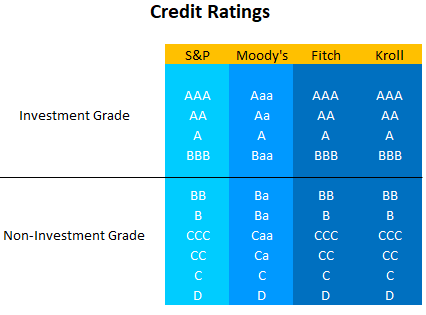

## Table of Contents

## What is a bond rating agency?

A bond rating agency is a company that looks at how safe or risky it is to invest in bonds. Bonds are like loans that people or companies can buy, and they want to know if they will get their money back. The agency gives a grade, called a rating, to each bond. A high rating means the bond is safe and likely to be paid back. A low rating means it's riskier and might not be paid back.

These agencies help investors make smarter choices. They study the financial health of the people or companies that issue the bonds. They look at things like how much money the issuer makes, how much debt they have, and if they have paid back loans in the past. Based on this information, the agency decides on the rating. Big bond rating agencies include Moody's, Standard & Poor's, and Fitch Ratings.

## What are the main functions of bond rating agencies?

Bond rating agencies have a few main jobs. One big job is to rate bonds. They look at the financial health of the people or companies that issue the bonds. They check things like how much money the issuer makes, how much debt they have, and if they have paid back loans before. Based on this, they give each bond a grade, called a rating. A high rating means the bond is safe and likely to be paid back. A low rating means it's riskier and might not be paid back.

Another job of bond rating agencies is to help investors make better choices. When investors want to buy bonds, they want to know if it's a good idea. The ratings from the agencies help them understand the risks. If a bond has a high rating, investors feel more confident about buying it. If it has a low rating, they might decide not to buy it or to ask for a higher [interest rate](/wiki/interest-rate-trading-strategies). This way, bond rating agencies play a big role in the bond market by giving important information to investors.

## Who are the major bond rating agencies?

The main bond rating agencies are Moody's, Standard & Poor's (S&P), and Fitch Ratings. These three are the biggest and most well-known in the world. They rate bonds from different countries and companies, helping investors know if a bond is safe to buy or not.

Moody's, S&P, and Fitch look at a lot of information to decide on their ratings. They check how much money a company makes, how much debt it has, and if it has paid back loans in the past. Based on this, they give each bond a grade. A high grade means the bond is safe, and a low grade means it's riskier.

These agencies are important because they help people make smarter choices about where to put their money. When someone wants to buy a bond, they can look at the rating to see if it's a good idea. This makes the bond market work better because everyone has more information.

## How do bond rating agencies determine ratings?

Bond rating agencies look at a lot of things to decide on a bond's rating. They start by checking the financial health of the company or government that issued the bond. This means looking at how much money they make, how much debt they have, and if they've paid back loans in the past. They also think about the economy and any special risks the issuer might face. All of this helps them figure out how likely it is that the bond will be paid back on time.

Once they have all the information, the agencies use special methods to come up with a rating. They might use numbers and formulas to make sure their ratings are fair and accurate. The rating they give can be a letter grade, like AAA or BBB, where AAA is the safest and BBB is riskier. This grade tells investors if the bond is a safe bet or if it might be a bit risky. By doing all this work, bond rating agencies help investors make better choices about where to put their money.

## What are the different rating scales used by bond rating agencies?

Bond rating agencies use different scales to show how safe or risky a bond is. The most common scales are from Moody's, Standard & Poor's (S&P), and Fitch Ratings. Moody's uses a scale that starts with Aaa for the safest bonds and goes down to C for the riskiest ones. S&P and Fitch use a scale that starts with AAA for the safest bonds and goes down to D for the riskiest ones. These scales help investors see at a glance how likely it is that they will get their money back.

Each agency's scale has different steps in between the highest and lowest ratings. For example, Moody's might go from Aaa to Aa1, Aa2, Aa3, and so on, while S&P and Fitch might go from AAA to AA+, AA, AA-, and so on. These steps show smaller changes in how safe a bond is. Even though the scales are a bit different, they all try to do the same thing: help investors understand the risk of buying a bond.

## What are the advantages of using bond rating agencies for investors?

Using bond rating agencies helps investors a lot. These agencies look at the financial health of the people or companies that issue bonds. They check how much money the issuer makes, how much debt they have, and if they've paid back loans before. This helps investors understand if a bond is safe to buy. If a bond has a high rating like AAA, it means it's very safe and likely to be paid back. If it has a low rating like C or D, it's riskier and might not be paid back. This information helps investors make smarter choices about where to put their money.

Another advantage is that bond rating agencies make the bond market work better. When investors know the ratings, they can compare different bonds easily. This helps them pick the best ones for their needs. Also, if a bond has a low rating, investors might ask for a higher interest rate to take on the extra risk. This can help keep the market fair and balanced. Overall, bond rating agencies give investors important information that makes investing in bonds easier and safer.

## How do bond ratings impact the cost of borrowing for issuers?

Bond ratings have a big effect on how much it costs for issuers to borrow money. When a bond gets a high rating like AAA, it means the bond is seen as very safe. Because it's safe, investors are happy to buy it without asking for a high interest rate. This means the issuer can borrow money at a lower cost. On the other hand, if a bond gets a low rating like C or D, it's seen as risky. Investors will want a higher interest rate to take on that risk, so the issuer has to pay more to borrow the money.

This difference in borrowing costs can be really important for issuers. If they have a high rating, they can save a lot of money on interest payments. This can help them invest in their business or pay for other things. But if they have a low rating, the high interest rates can make borrowing very expensive. This might limit what they can do or make it harder for them to grow. So, bond ratings not only help investors decide what to buy, but they also affect how much it costs for issuers to get the money they need.

## What role do bond rating agencies play in financial markets?

Bond rating agencies play a big part in financial markets. They look at how safe or risky it is to invest in bonds. Bonds are like loans that people or companies can buy, and they want to know if they will get their money back. The agencies give a grade, called a rating, to each bond. A high rating means the bond is safe and likely to be paid back. A low rating means it's riskier and might not be paid back. By doing this, bond rating agencies help investors make smarter choices about where to put their money.

These agencies also help keep the bond market working smoothly. When investors know the ratings, they can compare different bonds easily. This helps them pick the best ones for their needs. If a bond has a low rating, investors might ask for a higher interest rate to take on the extra risk. This can help keep the market fair and balanced. Overall, bond rating agencies give important information that makes investing in bonds easier and safer, and they affect how much it costs for issuers to borrow money.

## What criticisms have been leveled against bond rating agencies?

Bond rating agencies have been criticized for a few reasons. One big criticism is that they sometimes get things wrong. They might give a bond a high rating when it's actually risky, or a low rating when it's safe. This can lead investors to make bad choices. Another problem is that the agencies are paid by the same companies whose bonds they rate. This can make it seem like they might not be totally fair or independent. If they give a bad rating, the company might not hire them again.

Another criticism is that bond rating agencies were slow to change ratings during the 2008 financial crisis. They kept giving high ratings to risky mortgage-backed securities, which helped cause the crisis. People felt that if the agencies had been quicker to lower the ratings, the crisis might not have been so bad. Also, some say that there aren't enough different rating agencies. Most investors rely on just a few big ones, like Moody's, S&P, and Fitch. This can make the market less competitive and less fair.

## How have bond rating agencies responded to past criticisms and regulatory changes?

Bond rating agencies have tried to fix some of the problems people have pointed out. They know they need to be more accurate and fair. So, they have made their methods better and more clear. They also try to be quicker when they need to change a bond's rating. This is important because it helps investors know if a bond is getting riskier. Some agencies have also started to explain their ratings more, so people can understand why they gave a certain grade.

Regulators have made new rules to make bond rating agencies better. They want the agencies to be more independent and not just do what the companies paying them want. These rules also make the agencies share more information about how they decide on ratings. This helps everyone trust the agencies more. Even with these changes, some people still think bond rating agencies need to do more to be fair and accurate. But the agencies are working to improve and follow the new rules.

## What is the impact of bond rating agencies on financial stability and systemic risk?

Bond rating agencies have a big effect on financial stability and how risky the whole system is. They give grades to bonds that tell investors if a bond is safe or not. If the agencies make mistakes and give high grades to risky bonds, it can make the whole financial system less stable. For example, during the 2008 financial crisis, many risky mortgage-backed securities got high ratings. This made investors think they were safe, but when the crisis hit, these securities lost a lot of value and caused big problems. So, if bond rating agencies are not accurate, it can lead to more risk in the financial system.

To help with this, regulators have made new rules to make bond rating agencies better. They want the agencies to be more independent and share more information about how they decide on ratings. This is supposed to make the financial system more stable by making sure investors have good information. But even with these changes, some people still worry about the impact of bond rating agencies on financial stability. They think the agencies need to keep working to be fair and accurate so they don't cause more systemic risk.

## How might future technological advancements affect the operations and accuracy of bond rating agencies?

Future technology could change how bond rating agencies work and how accurate they are. New tools like [artificial intelligence](/wiki/ai-artificial-intelligence) and big data could help these agencies look at a lot more information faster. They could use AI to find patterns and risks that humans might miss. This could make their ratings more accurate and help them update ratings quicker when things change. Also, technology might let more people rate bonds, not just a few big agencies. This could make the market more fair and competitive.

But there are also worries about using new technology. If bond rating agencies start using AI and big data, they need to make sure these tools are fair and not biased. They also need to be clear about how they use technology so people can trust their ratings. If they don't do this right, it could make things worse instead of better. So, while technology could help a lot, it's important for bond rating agencies to use it carefully and responsibly.

## References & Further Reading

[1]: Bergstra, J., Bardenet, R., Bengio, Y., & Kégl, B. (2011). ["Algorithms for Hyper-Parameter Optimization."](https://papers.nips.cc/paper/4443-algorithms-for-hyper-parameter-optimization) Advances in Neural Information Processing Systems 24.

[2]: ["Advances in Financial Machine Learning"](https://www.amazon.com/Advances-Financial-Machine-Learning-Marcos/dp/1119482089) by Marcos Lopez de Prado

[3]: ["Evidence-Based Technical Analysis: Applying the Scientific Method and Statistical Inference to Trading Signals"](https://www.amazon.com/Evidence-Based-Technical-Analysis-Scientific-Statistical/dp/0470008741) by David Aronson

[4]: ["Machine Learning for Algorithmic Trading"](https://github.com/stefan-jansen/machine-learning-for-trading) by Stefan Jansen

[5]: ["Quantitative Trading: How to Build Your Own Algorithmic Trading Business"](https://www.amazon.com/Quantitative-Trading-Build-Algorithmic-Business-ebook/dp/B097QGPVND) by Ernest P. Chan

[6]: Cantor, R., & Packer, F. (1996). ["Determinants and Impact of Sovereign Credit Ratings."](https://www.newyorkfed.org/medialibrary/media/research/epr/96v02n2/9610cant.pdf) Economic Policy Review, 2(2), 37-53.

[7]: Partnoy, F. (2001). ["The Siskel and Ebert of Financial Markets?: Two Thumbs Down for the Credit Rating Agencies."](https://openscholarship.wustl.edu/cgi/viewcontent.cgi?article=1481&context=law_lawreview) Washington University Law Quarterly, 79(3), 619-712.

[8]: ["Standard & Poor's and Moody's etc Credit Ratings Definitions."](https://www.spglobal.com/ratings/en/about/understanding-credit-ratings) Investopedia.

[9]: Kothari, S.P., & Lester, R. (2020). ["The Role of Credit Rating Agencies in Capital Markets."](https://papers.ssrn.com/sol3/papers.cfm?abstract_id=1972354) Annual Review of Financial Economics, 12(1), 30-50.