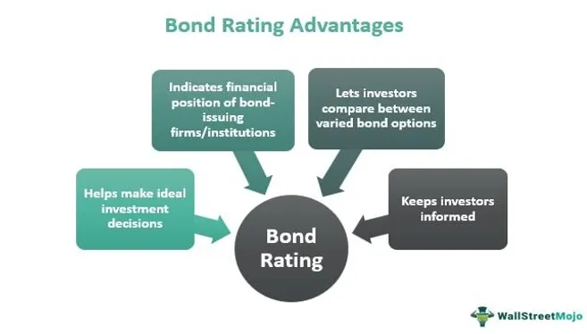

The financial markets represent a complex ecosystem where credit agencies, financial ratings, and bond ratings play integral roles in shaping investment landscapes. These entities and metrics are pivotal in facilitating informed investment decisions by evaluating and communicating the risk and creditworthiness associated with debt securities. This article examines how these critical elements interact with and influence algorithmic trading, an increasingly dominant fixture in modern financial markets.

As financial markets have evolved, the necessity for reliable risk assessment and valuation tools has grown. Credit agencies, such as Standard & Poor's, Moody's, and Fitch Ratings, offer standardized ratings that assess the credit risk associated with various financial instruments. These ratings not only guide investor decisions but also significantly impact interest rates and borrowing costs for corporations and governments alike. Understanding these methodologies and their implications is crucial for investors aiming to navigate complex financial environments effectively.



Moreover, bond ratings provide a detailed evaluation of a bond issuer's financial health and the likelihood of repayment, thereby serving as a benchmark for assessing investment risk. Ratings range from high-quality AAA to defaulted D, and they influence both institutional and individual investment strategies, especially in risk management. Despite debates over their objectivity, these ratings remain key to reducing research costs and making informed investment decisions.

Algorithmic trading, characterized by the use of sophisticated algorithms to execute trades, is increasingly leveraging information from credit and bond ratings. By incorporating this data, algorithmic models enhance precision and responsiveness in trading strategies, especially in volatile market conditions. This integration allows for rapid identification of opportunities and dynamic risk mitigation strategies.

In conclusion, understanding the interplay between credit agencies, ratings, and algorithmic trading offers valuable insights into investment strategies and outcomes. By contextualizing these interactions, investors can refine their approaches, leveraging ratings and automated trading to navigate the complexities of the modern financial landscape.

## Table of Contents

## Understanding Credit Agencies

Credit agencies, including Standard & Poor's (S&P), Moody's, and Fitch Ratings, are essential institutions in the financial landscape. These agencies are responsible for evaluating the creditworthiness of debt securities and their issuers, which significantly impacts financial markets.

The primary function of these agencies is to assign credit ratings to various entities, including corporations and governments. These ratings serve as a critical tool for assessing the risk associated with investing in debt instruments. Ratings range from high-grade (indicating low risk of default) to speculative-grade (indicating higher risk). For example, S&P and Fitch use a letter-based grading system that spans from AAA (indicating the highest credit quality) to D (indicating default status). Moody's uses a similar system with slight variations, such as Aaa to C.

Credit ratings profoundly affect interest rates and borrowing costs for debt issuers. Higher-rated entities typically benefit from lower interest rates on their borrowings due to perceived lower risk, which translates into reduced costs of capital. Conversely, lower-rated entities often face higher borrowing costs, reflecting higher perceived risk by investors.

The methodologies employed by credit agencies encompass a range of analyses. These include:

1. **Financial Analysis**: This involves examining financial statements to assess profitability, liquidity, and solvency. Key indicators such as debt-to-equity ratio, interest coverage ratio, and cash flow analysis are scrutinized.

2. **Industry Analysis**: Agencies evaluate the overall health and trends of the industry in which an issuer operates. This involves understanding competitive dynamics, regulatory environments, and potential growth opportunities or threats.

3. **Macroeconomic Analysis**: This broadens the scope to include the economic conditions that could impact an issuer's ability to meet their debt obligations. Factors such as GDP growth, inflation rates, and overall economic stability are considered.

Credit agencies must adhere to regulatory standards set by bodies such as the U.S. Securities and Exchange Commission (SEC). The SEC's oversight ensures these agencies operate with transparency and integrity, which is crucial for maintaining stability and confidence in financial markets. Regulatory frameworks mandate rigorous disclosure practices and conflict-of-interest management, designed to safeguard the objectivity of the rating process.

In summary, credit agencies play a pivotal role in providing a structured assessment framework for credit risk, influencing important financial decisions by investors, corporations, and governments globally. Their ratings inform strategies and risk assessments, contributing to the stability and efficiency of financial markets.

## Financial Ratings and Bond Rating Agencies

Bond rating agencies are essential players in the financial markets because they provide independent assessments of an issuer's financial health and its likelihood of repaying debt obligations. Their evaluations are critical for investors who must gauge the risk associated with various bond issuances. Ratings assigned by these agencies generally range from 'AAA', indicating a very high credit quality, to 'D', signifying that a bond is in default. These ratings not only affect institutional investment strategies but also guide individual investors in risk management.

Investment decisions are heavily influenced by bond ratings, as these ratings are integral to assessing the default risk of bonds. Higher-rated bonds are perceived as safer investments, which typically translates to lower yields. Conversely, lower-rated bonds offer higher yields to compensate investors for the increased risk of default. Institutional investors, in particular, rely on these ratings to align their portfolios with their risk tolerance and investment mandates. By providing insights into creditworthiness, bond ratings play a crucial role in capital allocation and financial stability.

Despite facing critiques, bond rating agencies significantly reduce the research costs for investors. Criticisms often center on potential conflicts of interest and their historical failures—such as during the 2008 financial crisis—where ratings were accused of being overly optimistic. However, the information provided by these agencies remains invaluable. They offer a standardized measure that enables investors to compare the credit risk of different issuers quickly and efficiently, which contributes to market transparency and efficiency.

The methodologies employed by bond rating agencies encompass both quantitative and qualitative assessments. Quantitatively, they might use financial ratios and models to evaluate the repayment capacity of the issuer. For example, metrics such as the debt-to-equity ratio or interest coverage ratio can provide insights into the issuer's leverage and ability to meet interest obligations. Qualitatively, factors like management quality, industry position, and macroeconomic conditions are considered. This holistic approach ensures a comprehensive analysis of potential credit risks.

Overall, bond rating agencies play an indispensable role in financial markets. Their ability to measure and communicate credit risk helps facilitate informed decision-making for both institutional and individual investors.

## Algorithmic Trading in Financial Markets

Algorithmic trading has become an integral element of modern financial markets, utilizing sophisticated algorithms to execute trades with minimal human intervention. By automating trading activities, algorithmic strategies can rapidly respond to dynamic market conditions. One of the key inputs for these algorithms is the data produced by credit and bond ratings. These ratings offer invaluable insights into the risk profile of different securities, thereby informing the decision-making processes of algorithmic traders.

The incorporation of data from credit agencies allows traders to optimize their investment strategies. For instance, algorithmic models can integrate credit ratings to assess the creditworthiness of issuers, which in turn influences the pricing and selection of financial instruments such as bonds. These algorithms often employ a combination of quantitative techniques, such as statistical models and [machine learning](/wiki/machine-learning), to enhance the precision of trade predictions and execute orders based on real-time data. In particularly volatile markets, the use of up-to-the-minute credit rating information can be critical for risk management and strategy adjustment.

While [algorithmic trading](/wiki/algorithmic-trading) offers substantial benefits in terms of speed and accuracy, it also presents challenges. One major challenge is ensuring that the algorithms correctly interpret credit rating data. Algorithms must be robust enough to discern nuanced shifts in creditworthiness that could affect market conditions. This requires sophisticated data parsing and normalization techniques to transform unstructured credit reports into actionable trading signals. It is crucial to continuously validate and update algorithms to ensure they adapt to any changes in rating methodologies or market environments.

Complex mathematical models underpin many algorithmic trading systems, which often include optimization problems and stochastic calculus. Python, with libraries such as NumPy and pandas, is frequently used to implement these models. For example, a trader might use Python to code a simple algorithm that triggers buy or sell orders based on credit rating changes:

```python
import pandas as pd

# Sample credit rating data
data = {
    'Ticker': ['AAA', 'BBB', 'CCC'],
    'Rating': [3, 2, 1],  # Numerical representation of ratings
}

ratings_df = pd.DataFrame(data)

def trading_decision(ticker, rating):
    if rating >= 2:  # Example threshold for trading decision
        return f"Buying {ticker}"
    else:
        return f"Selling {ticker}"

ratings_df['Decision'] = ratings_df.apply(lambda row: trading_decision(row['Ticker'], row['Rating']), axis=1)
print(ratings_df)
```

This simple model illustrates the basic concept, although real-world trading algorithms are vastly more complex and must consider a multitude of factors beyond ratings.

Overall, the synergy between algorithmic trading and credit/bond ratings offers potent capabilities for investment strategies, albeit with the need for continuous market monitoring and model refinement to account for the intricacies of financial data.

## Benefits and Criticisms of Credit and Bond Ratings

Credit and bond ratings are integral to the financial markets, offering a standardized means of assessing investment risks. These ratings, issued by credit agencies such as Standard & Poor's, Moody's, and Fitch Ratings, serve as benchmarks for investors to evaluate the creditworthiness of debt securities and their issuers. By assigning ratings, these agencies facilitate a more efficient functioning of financial markets, helping investors make informed decisions and thereby enhancing market stability.

The benefits of credit and bond ratings are manifold. Primarily, they provide investors with a crucial insight into the relative risk associated with different investments, thereby enabling a more structured and organized financial market. Investors often rely on these ratings to gauge the default risk, which directly influences borrowing costs and interest rates for both corporate entities and governments. The standardized nature of these ratings helps streamline investment processes, reducing the need for individual investors to conduct comprehensive credit analyses on every potential investment.

However, criticisms of credit and bond rating agencies persist, often centered around potential conflicts of interest inherent in their business models. These agencies are typically paid by the issuers of the securities they rate, raising questions about their objectivity. Additionally, historical shortcomings have been noted, notably their failure to foresee financial crises such as the 2008 housing market crash. Such oversights have led to skepticism regarding the reliability of ratings during periods of financial turbulence.

Despite these criticisms, the value of credit and bond ratings in promoting transparency cannot be underestimated. They provide a common language for interpreting financial stability and credit risk, helping coordinate market participants' expectations. By reducing information asymmetry, ratings contribute to a more transparent and efficient market environment.

Investors must understand that while credit and bond ratings are powerful tools for assessing risk, they should not rely exclusively on them. Incorporating ratings into a broader investment strategy, alongside other financial analyses and market data, can result in a more comprehensive evaluation of investment opportunities. Thus, acknowledging both the strengths and limitations of these ratings is key to leveraging them effectively in investment decisions.

## The Synergy of Ratings and Algorithmic Trading

The dynamic intersection of credit ratings and algorithmic trading offers significant opportunities alongside notable challenges, fundamentally altering traditional investment strategies. Integrating credit ratings into algorithmic models results in enhanced trading strategies that are more sophisticated and adaptive. By leveraging ratings data, these algorithms can identify and respond to market dynamics with increased precision, thereby optimizing investment decisions.

Technological advancements have largely facilitated the integration of real-time credit rating data into trading algorithms. This seamless incorporation allows for immediate reactions to changes in credit ratings, potentially identifying trading opportunities or risks faster than traditional methods. For instance, an algorithm can be programmed to adjust its trading parameters automatically upon detecting a downgrade in a credit rating, which can be crucial for managing risks in volatile markets.

Python, a popular language for algorithmic trading, can be used to automate responses to credit rating changes. A simple example of such automation might involve using APIs provided by credit rating agencies to fetch real-time data and adjust a trading strategy accordingly. Here is a basic Python script illustrating this concept:

```python
import requests

def fetch_rating_data(issuer):
    # Hypothetical API call to get rating data
    response = requests.get(f'https://api.creditratings.com/{issuer}/rating')
    return response.json()

def adjust_trading_strategy(rating):
    if rating == 'AAA':
        print("Maintain current investment level.")
    elif rating in ['AA', 'A']:
        print("Consider diversifying portfolio.")
    elif rating in ['BBB', 'BB']:
        print("Reduce exposure or hedge positions.")
    else:
        print("Re-evaluate investment or exit position.")

issuer = "CompanyXYZ"
current_rating = fetch_rating_data(issuer)["rating"]
adjust_trading_strategy(current_rating)
```

The future is likely to see an increased reliance on AI-driven models that exploit the vast amounts of data, including credit ratings, to make trading predictions even more accurate. Machine learning techniques can discern complex patterns in credit ratings over time, suggesting potential market movements. Such advancements can be anticipated to generate trading strategies that are not only more tailored but also adaptable, providing a competitive edge in the market.

Challenges persist, such as ensuring algorithms correctly interpret rating data and execute the appropriate trading actions. Additionally, the risk of over-reliance on automated systems underscores the need for ongoing human oversight. Nevertheless, the synergy between credit ratings and algorithmic trading remains an evolving field, promising significant benefits for investors willing to navigate its complexities.

## Conclusion

In the interconnected world of finance, credit agencies, ratings, and algorithmic trading are integral components influencing investment landscapes. The interplay of these elements is crucial as investors seek to refine their strategies for enhanced effectiveness. Understanding this relationship enables market participants to navigate complex financial terrains more adeptly, integrating diverse data sources to optimize decision-making processes.

The continuous evolution of credit ratings and algorithmic trading strategies significantly impacts financial markets, presenting both opportunities and challenges. As these components evolve, they reshape the dynamics of market operations, creating new avenues for growth while simultaneously posing potential risks. For instance, algorithmic trading allows for rapid market response, leveraging real-time credit ratings to adjust positions and manage risk efficiently.

Despite facing criticisms over issues such as conflicts of interest and historical misjudgments during financial crises, credit ratings maintain their importance. They offer a standardized measure of financial health, promoting market transparency and reducing asymmetrical information, which is crucial for orderly market functioning. This transparency aids in improving investor confidence and facilitates more informed investment choices.

Looking ahead, the merging of data analysis, ratings, and automated trading models is poised to further redefine investment paradigms. Technological advancements, particularly in [artificial intelligence](/wiki/ai-artificial-intelligence) and machine learning, enable the integration of multifaceted data streams, fostering innovative trading strategies. As these technologies continue to develop, they promise to enhance the accuracy and responsiveness of financial models, leading to more agile and anticipatory investment approaches. This synergy not only highlights the potential for refined risk management but also underscores the transformative impact of sophisticated analytical methods in shaping future financial landscapes.

## References & Further Reading

[1]: Bergstra, J., Bardenet, R., Bengio, Y., & Kégl, B. (2011). ["Algorithms for Hyper-Parameter Optimization."](https://papers.nips.cc/paper/4443-algorithms-for-hyper-parameter-optimization) Advances in Neural Information Processing Systems 24.

[2]: ["Advances in Financial Machine Learning"](https://www.amazon.com/Advances-Financial-Machine-Learning-Marcos/dp/1119482089) by Marcos Lopez de Prado

[3]: ["Evidence-Based Technical Analysis: Applying the Scientific Method and Statistical Inference to Trading Signals"](https://www.amazon.com/Evidence-Based-Technical-Analysis-Scientific-Statistical/dp/0470008741) by David Aronson

[4]: ["Machine Learning for Algorithmic Trading"](https://github.com/stefan-jansen/machine-learning-for-trading) by Stefan Jansen

[5]: ["Quantitative Trading: How to Build Your Own Algorithmic Trading Business"](https://www.amazon.com/Quantitative-Trading-Build-Algorithmic-Business-ebook/dp/B097QGPVND) by Ernest P. Chan

[6]: Cantor, R., & Packer, F. (1996). ["Determinants and Impact of Sovereign Credit Ratings."](https://www.newyorkfed.org/medialibrary/media/research/epr/96v02n2/9610cant.pdf) Economic Policy Review, 2(2), 37-53.

[7]: Partnoy, F. (2001). ["The Siskel and Ebert of Financial Markets?: Two Thumbs Down for the Credit Rating Agencies."](https://openscholarship.wustl.edu/cgi/viewcontent.cgi?article=1481&context=law_lawreview) Washington University Law Quarterly, 79(3), 619-712.

[8]: ["Standard & Poor's and Moody's etc Credit Ratings Definitions."](https://www.spglobal.com/ratings/en/about/understanding-credit-ratings) Investopedia.

[9]: Kothari, S.P., & Lester, R. (2020). ["The Role of Credit Rating Agencies in Capital Markets."](https://papers.ssrn.com/sol3/papers.cfm?abstract_id=1972354) Annual Review of Financial Economics, 12(1), 30-50.