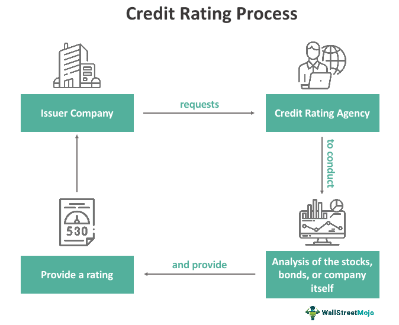

## Table of Contents

## What is a bond rating?

A bond rating is like a grade given to a bond, which is a type of loan that people or companies can buy. It tells you how safe or risky it is to invest in that bond. Agencies like Moody's, Standard & Poor's, and Fitch give these ratings. They look at things like how likely the borrower is to pay back the money and how well the economy is doing.

These ratings are important because they help people decide if a bond is a good investment. A high rating, like AAA, means the bond is very safe and the borrower is likely to pay back the money. A low rating, like D, means the bond is risky and the borrower might not pay back the money. So, if you see a bond with a high rating, you might feel more confident about investing in it.

## Why are bond ratings important?

Bond ratings are important because they help people decide if a bond is a good investment. Imagine you're lending money to someone. You'd want to know if they're likely to pay you back, right? That's what bond ratings do. They tell you how safe or risky it is to lend money to a company or government by giving the bond a grade. A high rating, like AAA, means the bond is very safe and the borrower is likely to pay back the money. A low rating, like D, means the bond is risky and the borrower might not pay back the money.

These ratings also help set the [interest rate](/wiki/interest-rate-trading-strategies) on bonds. If a bond has a low rating, the borrower has to offer a higher interest rate to attract investors because it's riskier. On the other hand, a bond with a high rating can have a lower interest rate because it's safer. This way, bond ratings help make sure that the interest rate matches the risk, which is fair for both the borrower and the investor. So, bond ratings are a key tool for making smart investment choices.

## Who assigns bond ratings?

Bond ratings are assigned by special companies called rating agencies. The most well-known ones are Moody's, Standard & Poor's (S&P), and Fitch. These agencies look at a lot of information about the company or government that wants to borrow money by issuing a bond. They check how much money the borrower makes, how much debt they already have, and how the economy is doing. After looking at all this, the agencies give the bond a rating.

The rating tells investors how safe or risky it is to buy the bond. A high rating, like AAA, means the bond is very safe and the borrower is likely to pay back the money. A low rating, like D, means the bond is risky and the borrower might not pay back the money. Investors use these ratings to decide if they want to buy the bond. If the rating is high, more people might want to buy it because it's safer. If the rating is low, the borrower might have to offer a higher interest rate to attract investors.

## What are the main categories of bond ratings?

Bond ratings are split into two big groups: investment grade and speculative grade. Investment grade bonds are seen as safer bets. They have ratings from AAA to BBB- (using Standard & Poor's scale). If a bond gets an investment grade rating, it means the company or government borrowing the money is likely to pay it back. These bonds are popular with people who want a safer place to put their money.

On the other hand, speculative grade bonds, also called junk bonds, are riskier. They have ratings from BB+ to D. These bonds are for people who are okay with taking more risk because they might get a higher return. If a bond is rated in this group, it means there's a bigger chance the borrower might not pay back the money. So, investors need to be careful and think about how much risk they're willing to take.

## How does the bond rating process work?

The bond rating process starts when a company or government wants to borrow money by issuing a bond. They go to a rating agency like Moody's, Standard & Poor's, or Fitch and ask for a rating. The agency then looks at a lot of information about the borrower. They check things like how much money the borrower makes, how much debt they already have, and how the economy is doing. The agency also looks at the bond itself, like how long the borrower has to pay back the money and what the interest rate is. After looking at all this, the agency gives the bond a rating.

The rating tells investors how safe or risky it is to buy the bond. A high rating, like AAA, means the bond is very safe and the borrower is likely to pay back the money. A low rating, like D, means the bond is risky and the borrower might not pay back the money. The rating helps investors decide if they want to buy the bond. If the rating is high, more people might want to buy it because it's safer. If the rating is low, the borrower might have to offer a higher interest rate to attract investors. This way, the bond rating process helps make sure that the interest rate matches the risk, which is fair for both the borrower and the investor.

## What factors are considered in the bond rating process?

When a rating agency like Moody's, Standard & Poor's, or Fitch looks at a bond, they consider many things about the company or government that wants to borrow money. They check how much money the borrower makes and how much debt they already have. They also look at the economy to see if it's doing well or not. The agency wants to know if the borrower can pay back the money they want to borrow. They also look at the bond itself, like how long the borrower has to pay back the money and what the interest rate is.

All these things help the agency decide if the bond is safe or risky. If the borrower makes a lot of money and doesn't have too much debt, the bond might get a high rating like AAA. This means it's very safe. But if the borrower doesn't make much money or has a lot of debt, the bond might get a low rating like D. This means it's risky. The rating helps investors decide if they want to buy the bond. If the rating is high, more people might want to buy it because it's safer. If the rating is low, the borrower might have to offer a higher interest rate to attract investors.

## How often are bond ratings reviewed and updated?

Bond ratings are usually checked and updated every year or when something big happens. Rating agencies like Moody's, Standard & Poor's, and Fitch look at the bond again to see if the company or government can still pay back the money. If the borrower's situation changes a lot, like if they make more money or get into more debt, the rating might change too.

Sometimes, the rating can change in the middle of the year if something really important happens. For example, if the economy gets worse or if the borrower has a big problem, the rating agency might look at the bond again and change the rating right away. This helps investors know if the bond is still safe or if it has become more risky.

## What is the difference between investment grade and speculative grade bonds?

Investment grade bonds are seen as safer bets. They have ratings from AAA to BBB- (using Standard & Poor's scale). If a bond gets an investment grade rating, it means the company or government borrowing the money is likely to pay it back. These bonds are popular with people who want a safer place to put their money. The interest rates on these bonds are usually lower because they're less risky.

On the other hand, speculative grade bonds, also called junk bonds, are riskier. They have ratings from BB+ to D. These bonds are for people who are okay with taking more risk because they might get a higher return. If a bond is rated in this group, it means there's a bigger chance the borrower might not pay back the money. So, investors need to be careful and think about how much risk they're willing to take. The interest rates on these bonds are usually higher to attract investors despite the higher risk.

## How do changes in bond ratings affect bond prices and yields?

When a bond's rating changes, it can make the bond's price go up or down. If the rating goes up, it means the bond is seen as safer. More people might want to buy it, so the price goes up. If the rating goes down, it means the bond is seen as riskier. Fewer people might want to buy it, so the price goes down. This is because investors want to be paid more for taking on more risk.

Changes in bond ratings also affect the bond's yield, which is like the interest rate you get for lending money. If the rating goes up and the price goes up, the yield goes down. That's because the interest payment stays the same, but you're paying more for the bond. If the rating goes down and the price goes down, the yield goes up. That's because the interest payment stays the same, but you're paying less for the bond. So, a higher yield can make the bond more attractive to investors who are willing to take on more risk.

## What are some criticisms or limitations of the bond rating system?

Some people say that bond rating agencies can make mistakes. They might give a bond a high rating when it should be lower, or the other way around. This happened a lot during the 2008 financial crisis when many bonds got high ratings but then failed. Also, rating agencies can be slow to change their ratings. It might take them a long time to lower a rating even when a company is in trouble. This can make it hard for investors to know the real risk of a bond.

Another problem is that rating agencies get paid by the companies that want their bonds rated. This can make it seem like the agencies might give better ratings to keep their customers happy. It's a bit like a restaurant reviewing itself. Also, there are only a few big rating agencies, like Moody's, Standard & Poor's, and Fitch. This means they have a lot of power, and it can be hard for new agencies to start up and compete. So, while bond ratings are helpful, they're not perfect and investors should be careful and do their own research too.

## How do global bond rating agencies differ in their methodologies?

Global bond rating agencies like Moody's, Standard & Poor's (S&P), and Fitch use different ways to rate bonds, but they all look at things like how much money the borrower makes, how much debt they have, and how the economy is doing. Moody's uses a scale that goes from Aaa to C, where Aaa is the safest and C is the riskiest. They focus a lot on how likely the borrower is to pay back the money and also look at the economy. S&P uses a scale from AAA to D, with AAA being the safest and D being the riskiest. They look at the same things but might weigh them differently. Fitch also uses a scale from AAA to D and looks at similar factors, but they might put more focus on the borrower's ability to pay back the money in different economic situations.

Even though these agencies look at similar things, they might come up with different ratings for the same bond. This is because each agency has its own way of deciding how important each [factor](/wiki/factor-investing) is. For example, one agency might think the economy is more important than another agency does. This can make it confusing for investors, but it also gives them more information to think about. So, investors often look at ratings from more than one agency to get a better idea of how safe or risky a bond is.

## What role do bond ratings play in regulatory and investment decisions?

Bond ratings help people who make rules and people who invest money. When governments make rules about how much risk banks can take, they often look at bond ratings. If a bond has a high rating, like AAA, it's seen as safe. So, banks might be allowed to buy more of these bonds. But if a bond has a low rating, like D, it's seen as risky. Banks might not be allowed to buy as many of these bonds because the government wants to keep them safe.

Investors also use bond ratings to make choices. If someone wants to invest in a bond, they'll look at the rating to see if it's safe or risky. A high rating means the bond is likely to pay back the money, so more people might want to buy it. A low rating means it's riskier, so fewer people might want to buy it unless they get a higher interest rate. This way, bond ratings help investors decide where to put their money and help make sure that the interest rate matches the risk.

## What are the processes involved in unpacking financial assessments?

Financial assessments are fundamental evaluations that determine an entity's financial health and provide insights into its performance and stability. These assessments are vital tools for both internal management and external stakeholders, offering a detailed picture of financial condition and growth potential. 

Key components of financial assessment encompass various performance indicators, namely profitability, [liquidity](/wiki/liquidity-risk-premium), solvency, and efficiency ratios:

1. **Profitability Ratios**: These measure an entity's ability to generate income relative to revenue, assets, or equity. Common profitability ratios include the net profit margin, return on assets (ROA), and return on equity (ROE). These ratios provide insights into how efficiently a company is using its resources to generate profit. For instance, ROA is calculated as:
$$
   \text{ROA} = \frac{\text{Net Income}}{\text{Total Assets}}

$$

2. **Liquidity Ratios**: These ratios assess an entity’s capacity to cover its short-term obligations with its most liquid assets. Key liquidity ratios are the current ratio and the quick ratio. The current ratio can be expressed as:
$$
   \text{Current Ratio} = \frac{\text{Current Assets}}{\text{Current Liabilities}}

$$

3. **Solvency Ratios**: These evaluate a company’s ability to meet its long-term obligations, reflecting financial stability. Debt to equity ratio and interest coverage ratio are examples. The debt to equity ratio is given by:
$$
   \text{Debt to Equity Ratio} = \frac{\text{Total Liabilities}}{\text{Shareholder's Equity}}

$$

4. **Efficiency Ratios**: These ratios determine how well a company utilizes its assets and liabilities internally. Examples include asset turnover and inventory turnover ratios. 

Financial assessments are beneficial for multiple purposes. For internal management, these assessments guide strategic planning and operational improvements by identifying areas that require optimization. They offer a framework for setting and evaluating financial objectives, thus facilitating effective resource allocation and cost management. For external investors, financial assessments provide essential information for making informed investment decisions. They serve as indicators of a company's financial stability and growth prospects, thereby affecting investor confidence and potential investment interest.

Mastering financial assessment techniques enables stakeholders to enhance decision-making processes and protect financial interests. By regularly performing these assessments, entities can proactively manage risks, improve financial performance, and increase transparency. This comprehensive evaluation approach ensures the alignment of financial goals with overall business strategy, promoting sustainable growth and competitive advantage in the marketplace.

## References & Further Reading

[1]: [Moody's Investors Service](https://www.moodys.com/) - Provides information on credit ratings and research covering debt instruments and securities.

[2]: Standard & Poor's (S&P) Ratings Services - A major credit rating agency providing analysis and information about bonds, credit trends, and financial studies.

[3]: Fitch Ratings - Offers insights and information related to credit ratings and the creditworthiness of various entities and securities.

[4]: ["Handbook of Credit Risk Management: Originating, Assessing, and Managing Credit Exposures"](http://dspace.vnbrims.org:13000/xmlui/bitstream/handle/123456789/4696/The%20Handbook%20of%20Credit%20Risk%20Management%20Originating%2C%20Assessing%2C%20and%20Managing%20Credit%20Exposures.pdf?sequence=1) by Sylvain Bouteillé and Diane Coogan-Pushner.

[5]: ["Algorithmic Trading and DMA: An Introduction to Direct Access Trading Strategies"](https://www.semanticscholar.org/paper/Algorithmic-trading-%26-DMA-%3A-an-introduction-to-Johnson/aa5de1ab883d5e23b6651faa7c1807586d688e4b) by Barry Johnson.

[6]: ["Advances in Financial Machine Learning"](https://www.amazon.com/Advances-Financial-Machine-Learning-Marcos/dp/1119482089) by Marcos Lopez de Prado.

[7]: ["Quantitative Trading: How to Build Your Own Algorithmic Trading Business"](https://www.amazon.com/Quantitative-Trading-Build-Algorithmic-Business/dp/1119800064) by Ernest P. Chan.