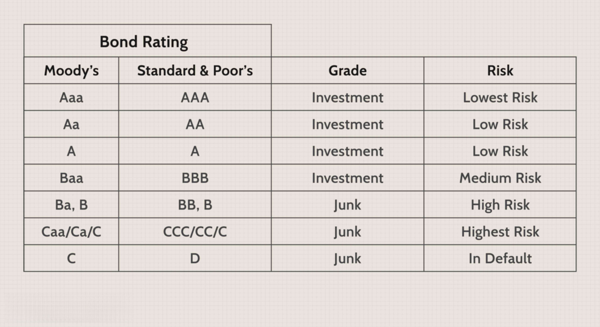

Investing in the financial markets is a sophisticated endeavor that demands a thorough understanding of diverse instruments and strategic approaches. This article aims to equip investors with a comprehensive understanding of key components such as investment analysis, bond ratings, and algorithmic trading, which are imperative in crafting successful investment strategies. 

Investment analysis serves as a foundational step, enabling investors to make informed decisions by evaluating financial statements, market trends, and investor behavior. Bond ratings offer critical insights into the creditworthiness of bonds, influencing investment risk and potential returns, thereby guiding investors in bond selection. Algorithmic trading, driven by advanced technology, is revolutionizing the investment landscape by providing enhanced speed, accuracy, and cost efficiency in trading activities.

In today's digital age, technology plays a transformative role in investment practices, offering sophisticated tools and software that enhance decision-making processes. By integrating these elements—investment analysis, bond ratings, and algorithmic trading—investors can refine their strategies and optimize returns.

This article sets the stage for a deeper understanding of how these components interact and contribute to effective investment strategies, ultimately empowering investors to navigate the complexities of the financial markets successfully.

## Table of Contents

## Investment Analysis: A Crucial Step for Investors

Investment analysis is a fundamental component of the investment process, serving as the foundation for making informed decisions aimed at maximizing returns and minimizing risks. It involves evaluating a range of factors, including economic conditions, company performance, and market trends, to determine the viability or profitability of an investment opportunity.

### Types of Investment Analysis

1. **Fundamental Analysis:** 
   Fundamental analysis involves examining economic indicators, industry conditions, and financial statements to assess a company's intrinsic value. Analysts evaluate metrics like earnings per share (EPS), price-to-earnings (P/E) ratio, and revenue growth. The goal is to identify securities that are undervalued or overvalued compared to their market price.

2. **Technical Analysis:** 
   This method focuses on historical market data, such as price movements and [volume](/wiki/volume-trading-strategy), to predict future price trends. Technical analysts use charts and indicators like moving averages and the Relative Strength Index (RSI) to make short-term trading decisions, operating under the belief that historical patterns will repeat.

3. **Quantitative Analysis:** 
   Quantitative analysis employs mathematical and statistical models to evaluate investment opportunities. Using algorithms and large data sets, analysts identify patterns or trends that might not be visible through traditional methods. This approach is often used for risk management and to automate trading strategies.

### Role of Financial Statements, Market Trends, and Investor Psychology

Financial statements, such as balance sheets, income statements, and cash flow statements, provide crucial insights into a company's health and performance. Understanding these documents helps investors gauge a business's profitability, [liquidity](/wiki/liquidity-risk-premium), and operational efficiency.

Market trends shed light on macroeconomic conditions and investor sentiment, both of which can influence asset prices. Capturing these trends allows investors to adjust their strategies according to prevailing economic cycles.

Investor psychology, often encapsulated in the concept of market sentiment, acknowledges that emotions such as fear and greed can drive market fluctuations. Behavioral finance recognizes these patterns and suggests strategies to counteract potential biases.

### Tools and Software for Analyzing Investments

Numerous tools and software platforms support investment analysis. Programs like Bloomberg Terminal and Reuters Eikon provide comprehensive data analytics, financial news, and peer analysis. Online platforms like Yahoo Finance and Google Finance offer accessibility to financial data and trend monitoring tools. Moreover, software such as MATLAB and Python libraries (e.g., Pandas, NumPy) enable the development of custom quantitative models.

### Examples of Successful Investment Analysis

Successful investment analysis often leads to profitable decisions. For instance, Warren Buffett's investment in Coca-Cola in the late 1980s relied heavily on [fundamental analysis](/wiki/fundamental-analysis). By recognizing the company's strong brand and growth potential relative to its market price, Buffett secured a substantial return on investment.

Similarly, quantitative hedge funds such as Renaissance Technologies have harnessed advanced algorithms to deliver consistent returns by identifying statistical [arbitrage](/wiki/arbitrage) opportunities across global markets.

In summary, investment analysis is a comprehensive process incorporating various methodologies and tools to assess potential investment opportunities. By combining fundamental, technical, and quantitative analyses with modern software tools, investors can enhance their ability to make profitable decisions in the ever-evolving financial marketplace.

## Understanding Bond Ratings and Their Impact

Bond ratings play a critical role in financial markets by providing a standardized assessment of a bond issuer's creditworthiness. These ratings influence investor decisions by offering insights into the risk associated with a bond. Typically assigned by recognized credit rating agencies, bond ratings affect the perceived risk and expected returns of bond investments.

### Credit Rating Agencies and Their Scales

The major credit rating agencies include Standard & Poor's (S&P), Moody's Investors Service, and Fitch Ratings. Each of these agencies utilizes a distinct rating scale to evaluate the credit quality of bond issuers. For instance:

- **Standard & Poor's**: Uses a scale from 'AAA' (highest credit quality) to 'D' (in default).
- **Moody's**: Employs a similar scale ranging from 'Aaa' to 'C'.
- **Fitch Ratings**: Aligns closely with the S&P scale, using 'AAA' to 'D'.

These ratings provide a quick reference for assessing a bond's risk level, influencing not only investor decisions but also the interest rates an issuer may need to offer. Higher rated bonds (AAA, Aaa) are perceived as lower risk compared to those rated BBB or below, which are often termed 'junk bonds'.

### Implications on Investment Risk and Returns

Different bond ratings suggest varying levels of default risk:

- **Investment-Grade Bonds**: Typically rated BBB-/Baa3 or higher, these bonds are considered lower risk and often offer lower yields as compensation for this reduced risk.
- **Non-Investment Grade Bonds (High-Yield or Junk Bonds)**: Rated below BBB-/Baa3, they carry higher risk but offer higher yields, potentially leading to higher returns.

Higher bond ratings generally indicate that the bond issuer is financially stable and less likely to default. Consequently, these bonds often have a lower yield compared to lower-rated bonds, reflecting their decreased risk.

### Impact of Rating Changes

Changes in bond ratings can significantly influence market perceptions and bond pricing. A downgrade can lead to increased perceived risk, prompting investors to demand higher yields or sell off holdings, which can reduce the bond's price. Conversely, an upgrade can enhance the bond's attractiveness, leading to price appreciation and potentially lowering the yield.

The formula to determine a bond's yield based on its price is given by:

$$
\text{Yield} = \frac{\text{Coupon Payment}}{\text{Current Price}}
$$

Thus, if the price of a bond decreases due to a downgrade, the yield increases, reflecting higher risk compensation demanded by the market.

### Utilizing Bond Ratings in Investment Strategies

Investors can use bond ratings as a tool to align their portfolios with their risk tolerance and investment goals. By analyzing the risk-return profile suggested by bond ratings, investors can make informed decisions about including specific bonds in their portfolio. Investment-grade bonds might suit those seeking stability, while high-yield bonds may appeal to investors willing to accept higher risk for the possibility of greater returns.

In conclusion, understanding bond ratings and their influence on market dynamics allows investors to strategically integrate them into their decision-making process, optimizing for risk management and return objectives.

## Algorithmic Trading: Revolutionizing the Investment Landscape

Algorithmic trading is a method of executing orders using automated and pre-programmed trading instructions to account for variables such as time, price, and volume. This form of trading leverages the power of computers to transact a large number of orders at speeds and frequencies that are impossible for human traders. Algorithmic trading has become increasingly significant in the financial markets as it enhances trading processes by providing improved liquidity and market depth, while decreasing transaction costs.

There are various types of algorithms used in trading, each serving distinct purposes. Some common types include:

1. **Trend-Following Algorithms**: These algorithms are designed to trade based on market trends. They attempt to capitalize on the momentum of rising or falling markets by using indicators like moving averages or channel breakouts.

2. **Arbitrage Algorithms**: Arbitrage strategies exploit price differences between identical or similar financial instruments across different markets or forms. Arbitrage algorithms quickly identify and capitalize on these discrepancies, which are typically short-lived.

3. **Mean Reversion Algorithms**: This approach is based on the assumption that asset prices will revert to their mean or average value over time. Algorithms are programmed to detect price divergence from the mean and execute trades accordingly.

4. **Market-Making Algorithms**: These provide liquidity to the markets by simultaneously posting both buy and sell orders for financial instruments. Profit is made on the bid-ask spread of these markets.

5. **Execution-Based Algorithms**: These are used to execute large orders without causing significant price impact. Techniques such as Volume Weighted Average Price (VWAP) and Time Weighted Average Price (TWAP) fall into this category.

Algorithmic trading offers numerous advantages, including enhanced speed and accuracy, which are critical in financial markets where prices fluctuate rapidly. Algorithms can process multiple market variables and execute trades within milliseconds, significantly reducing the impact of market [volatility](/wiki/volatility-trading-strategies). Furthermore, the automation of trading strategies leads to reduced transaction costs by minimizing manual involvement and errors.

Despite these advantages, [algorithmic trading](/wiki/algorithmic-trading) is not without its challenges and risks. The complexity of algorithms makes them susceptible to programming errors and system failures. Market disruptions, such as the infamous "flash crash" of 2010, demonstrate the potential impact of algorithmic trading errors on financial stability. Additionally, algorithms may contribute to increased market volatility and reduced transparency.

Examining successful algorithmic trading applications can illustrate their potential. One notable case is that of Renaissance Technologies' Medallion Fund, which has consistently outperformed the market through sophisticated algorithms that execute trades based on complex statistical models and data analysis.

Overall, algorithmic trading has revolutionized the investment landscape by enabling faster and more efficient market transactions. However, its implementation requires careful consideration of associated risks and challenges to ensure that the advantages are fully realized without compromising the stability and fairness of financial markets.

## Integrating Analysis, Ratings, and Trading for Optimal Strategies

Investment analysis, bond ratings, and algorithmic trading can be combined to form comprehensive strategies that maximize returns and manage risks effectively. By integrating these components, investors can develop a more nuanced understanding of financial markets, refine their decision-making processes, and improve overall portfolio performance.

Investment analysis involves evaluating financial statements, market trends, and investor psychology to assess potential investment opportunities. When combined with bond ratings, which provide a measure of credit risk based on assessments by major credit rating agencies, investors can better understand the risk-return profile of different securities. Algorithmic trading further enhances this process by providing the speed and precision needed to execute trades based on predefined criteria, allowing investors to capitalize on market opportunities with greater efficiency.

Technology plays a crucial role in integrating these elements. Advanced tools and platforms facilitate the seamless combination of investment analysis, bond ratings, and algorithmic trading into a unified strategy. Examples of such platforms include Bloomberg Terminal and Thomson Reuters Eikon, which offer comprehensive data analysis tools, real-time market information, and algorithmic trading capabilities.

Aligning investment goals with integrated strategies requires a clear understanding of the investor's risk tolerance, financial objectives, and market outlook. By considering these factors, investors can develop strategies that balance potential returns with acceptable levels of risk. For instance, an investor seeking steady income might prioritize high-rated bonds in their portfolio, while those targeting capital appreciation may incorporate equity analysis and algorithmic trading to capture market trends.

Best practices for leveraging these elements in investment portfolios include continuous monitoring of market developments, regular re-evaluation of investment goals, and staying informed about technological advancements in trading and analysis. Investors should adopt a dynamic approach, adjusting their strategies to reflect changes in the economic environment and the introduction of innovative tools. By doing so, they can maintain a competitive edge and optimize their investment outcomes.

In summary, integrating investment analysis, bond ratings, and algorithmic trading allows investors to create robust strategies that enhance decision-making and maximize returns. By leveraging technology and maintaining a flexible approach, investors can stay ahead of market trends and capitalize on evolving opportunities.

## Conclusion

The financial markets continuously evolve, demanding that investors remain agile and informed. This article explored crucial components of successful investment strategies, including investment analysis, bond ratings, and algorithmic trading. A key takeaway is the significance of continuous learning and adaptability. In an environment where market conditions and technologies change rapidly, staying informed is paramount. Investors should actively seek and utilize available tools and resources to remain competitive and responsive to market trends.

The impact of technology on investment practices is profound and undeniable. It enhances the efficiency and accuracy of analysis and execution, offering investors new avenues for optimizing their strategies. Algorithmic trading, in particular, exemplifies how technological advancements can revolutionize trading by increasing speed and reducing costs.

Investors are encouraged to explore the opportunities that these components present. Investment analysis, bond ratings, and algorithmic trading are not just isolated practices but can be integrated to form cohesive strategies that align with specific investment goals. By doing so, investors can position themselves to capitalize on opportunities and navigate the complexities of financial markets effectively. This approach ensures that they are not only reacting to changes but also anticipating and shaping the future of their investments.

## References & Further Reading

[1]: ["Bond Rating Agencies and Their Role in the Financial System"](https://papers.ssrn.com/sol3/papers.cfm?abstract_id=3192475) - Federal Reserve Bank of St. Louis

[2]: ["The Handbook of Credit Risk Management"](https://onlinelibrary.wiley.com/doi/pdf/10.1002/9781119203551.fmatter) by Sylvain Bouteille and Diane Coogan-Pushner

[3]: ["Investment Valuation: Tools and Techniques for Determining the Value of Any Asset"](https://archive.org/details/investmentvaluat0000damo_n6k9) by Aswath Damodaran

[4]: ["Algorithmic Trading: Winning Strategies and Their Rationale"](https://www.amazon.com/Algorithmic-Trading-Winning-Strategies-Rationale-ebook/dp/B00CY5HC0U) by Ernest P. Chan

[5]:["Fundamentals of Investment Management"](https://archive.org/details/fundamentalsofin0000hirt_x1i2) by Geoffrey A Hirt, Stanley B. Block