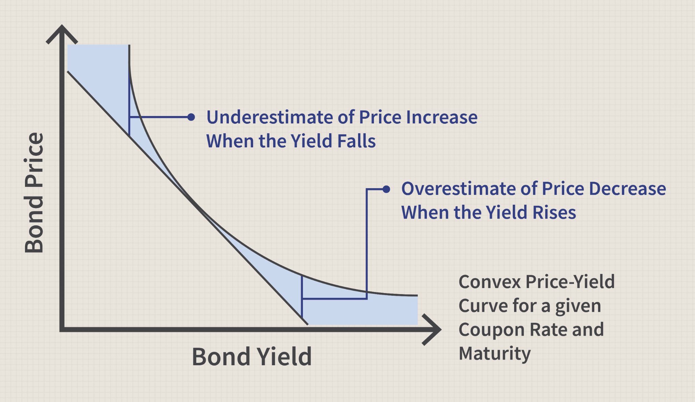

## Table of Contents

## What is a bond resolution?

A bond resolution is a document that a government or a company creates when they want to borrow money by issuing bonds. It outlines all the important details about the bond, like how much money they want to borrow, the interest rate they will pay, and when the money needs to be paid back. This document is very important because it helps investors understand what they are investing in and what they can expect in return.

When a government or company decides to issue bonds, they need to get approval from their governing body or shareholders. The bond resolution is presented to them for approval. Once it is approved, the bond can be issued and sold to investors. This process helps ensure that everyone involved understands the terms and agrees to them before any money changes hands.

## How does a bond resolution work?

A bond resolution is like a set of rules that a government or company makes when they want to borrow money by selling bonds. It tells everyone how much money they want to borrow, what interest rate they will pay, and when they will pay the money back. This document is important because it helps people who might buy the bonds understand exactly what they are getting into. Before the bonds can be sold, the people in charge, like a city council or company shareholders, need to say yes to the bond resolution. This makes sure everyone agrees on the plan before any money is borrowed.

Once the bond resolution is approved, the government or company can start selling the bonds to investors. The bond resolution acts as a promise that the borrower will follow the rules they set out. This makes investors feel more confident about lending their money. If everything goes according to plan, the borrower will use the money they raised to do things like build roads or expand their business, and then they will pay back the investors with interest over time.

## What are the key components of a bond resolution?

A bond resolution has several important parts that help everyone understand the plan for borrowing money. The first part is the amount of money that needs to be borrowed. This tells investors exactly how much money the government or company wants to raise. The next part is the [interest rate](/wiki/interest-rate-trading-strategies), which is how much extra money the borrower will pay back to the investors for lending them the money. This rate can be fixed or change over time, depending on what the bond resolution says.

Another key part is the repayment schedule, which tells when the borrowed money needs to be paid back. This can be spread out over many years, and it's important for investors to know when they will get their money back. The bond resolution also includes any special rules or conditions that the borrower must follow, like using the money for a specific project or meeting certain financial goals. These rules help make sure the borrower uses the money responsibly.

The last important part is the approval process. Before the bonds can be sold, the bond resolution needs to be approved by the people in charge, like a city council or company shareholders. This approval step makes sure everyone agrees with the plan before any money changes hands. Once approved, the bond resolution acts as a promise that the borrower will follow all the rules they set out, giving investors confidence in lending their money.

## Who typically issues a bond resolution?

A bond resolution is usually issued by a government or a company that wants to borrow money. Governments, like cities or states, issue bond resolutions when they need money for big projects, like building schools or fixing roads. Companies also issue bond resolutions when they want to grow their business or need money for new projects. Both governments and companies have to follow certain steps and get approval before they can sell the bonds.

The people who need to approve a bond resolution depend on who is issuing it. For a government, it might be the city council or state legislature that needs to say yes to the bond resolution. For a company, it's usually the board of directors or shareholders who have to approve it. Once approved, the bond resolution becomes a promise that the government or company will use the borrowed money correctly and pay it back on time.

## What is the purpose of a bond resolution in municipal finance?

In municipal finance, a bond resolution is a document that a city or town creates when they want to borrow money by selling bonds. The purpose of the bond resolution is to explain all the important details about the borrowing, like how much money they need, the interest rate they will pay, and when they will pay the money back. This document helps everyone understand what the city or town plans to do with the money and how they will pay it back.

The bond resolution also needs to be approved by the city council or another governing body before the bonds can be sold. This approval step makes sure that everyone agrees with the plan and that the city or town will use the money responsibly. Once approved, the bond resolution acts as a promise to the investors that the city or town will follow the rules they set out, which helps build trust and confidence in the borrowing process.

## How does a bond resolution differ from a bond ordinance?

A bond resolution and a bond ordinance are both used by governments to borrow money by selling bonds, but they have some differences. A bond resolution is a document that outlines all the details of the borrowing, like how much money is needed, the interest rate, and the repayment schedule. It's like a plan that the government makes and needs to be approved by the city council or another governing body before the bonds can be sold.

On the other hand, a bond ordinance is a law that a government passes to allow them to issue bonds. It's more formal and can take longer to pass because it goes through a legislative process. While a bond resolution is more like a detailed plan that can be approved relatively quickly, a bond ordinance sets the legal framework for the borrowing and can include more general rules about how the bonds will be issued and managed. Both are important, but they serve slightly different purposes in the process of borrowing money through bonds.

## What legal requirements must be met for a bond resolution to be valid?

For a bond resolution to be valid, it must meet certain legal requirements set by the government or the company's governing body. First, the bond resolution needs to be approved by the right people, like a city council for a municipality or a board of directors for a company. This approval step is important because it makes sure everyone agrees with the plan to borrow money. The bond resolution also needs to follow any laws or rules that apply to borrowing money, like state or federal regulations that control how bonds can be issued.

Another important legal requirement is that the bond resolution must clearly explain all the details of the borrowing. This includes how much money is being borrowed, the interest rate, and the repayment schedule. The document should also include any special conditions or rules that the borrower must follow, like using the money for a specific project. By meeting these legal requirements, the bond resolution becomes a valid and trustworthy document that investors can rely on when deciding to buy the bonds.

## How can a bond resolution impact the financial strategy of an organization?

A bond resolution can have a big impact on an organization's financial strategy because it helps them plan how to borrow money. When a government or company decides to issue bonds, they need to think about how much money they need and what they will use it for. The bond resolution helps them set the interest rate and repayment schedule, which affects their future budgets. By planning these details carefully, the organization can make sure they have enough money for important projects and can pay back the borrowed money without too much trouble.

The bond resolution also helps the organization show investors that they have a good plan for using the borrowed money. When investors see a clear and well-thought-out bond resolution, they feel more confident about lending their money. This can make it easier for the organization to get the money they need at a lower interest rate. By managing the bond resolution well, the organization can improve their financial strategy and make sure they can keep growing and doing important work.

## What are the potential risks associated with bond resolutions?

When a government or company makes a bond resolution, they are promising to pay back the money they borrow with interest. But there are risks involved. One big risk is that the organization might not be able to pay back the money on time. This can happen if they don't make enough money or if something unexpected happens, like an economic downturn. If they can't pay back the bonds, it can hurt their reputation and make it harder to borrow money in the future.

Another risk is that the interest rates might change. If the interest rates go up after the bonds are issued, the organization might have to pay more money than they planned. This can make their financial situation tighter and force them to cut back on other spending. Also, if the bond resolution is not clear or if the organization doesn't follow the rules they set out, it can lead to legal problems or unhappy investors. All these risks need to be thought about carefully when making a bond resolution.

## How do bond resolutions facilitate infrastructure projects?

Bond resolutions help cities and states build things like roads, schools, and bridges by letting them borrow money. When a city wants to start a big project, they make a bond resolution that says how much money they need and how they will pay it back. This plan needs to be approved by people like the city council. Once it's approved, the city can sell bonds to investors who lend them the money. This way, the city can start building right away without having to wait to save up all the money first.

The bond resolution also makes sure that everyone knows what the city plans to do with the money. It tells investors exactly when they will get their money back and how much interest they will earn. This makes investors feel safe about lending their money because they know the city has a good plan. By using bond resolutions, cities can make their communities better by building important things that everyone can use.

## What role do bond resolutions play in public-private partnerships?

Bond resolutions help make public-private partnerships work by letting the government borrow money to start big projects with private companies. When a city or state wants to work with a private company to build things like hospitals or highways, they create a bond resolution. This document says how much money they need, what interest they will pay, and when they will pay it back. The bond resolution needs to be approved by people like the city council before the government can sell bonds to investors. This way, the government can get the money they need to start the project right away.

The bond resolution also makes sure that everyone knows how the money will be used and how the project will be managed. It sets clear rules for the partnership, like who is responsible for what and how the money will be paid back. This helps build trust between the government, the private company, and the investors. By using bond resolutions, public-private partnerships can get the funding they need to build important projects that help the community.

## How have bond resolutions evolved in response to economic changes?

Bond resolutions have changed a lot over time because of economic ups and downs. When the economy is doing well, governments and companies might feel more confident about borrowing money. They can offer lower interest rates in their bond resolutions because investors are more willing to lend money. But when the economy is not doing so well, like during a recession, they might have to offer higher interest rates to attract investors. This makes the bond resolutions more detailed and careful, with more rules to make sure the money is used wisely.

Also, new rules and laws have been made to keep bond resolutions safe and fair. After big economic problems, like the financial crisis in 2008, governments started to put more rules in place to protect investors. These rules make bond resolutions longer and more complex, but they also make them more trustworthy. Now, bond resolutions often have to include more information about how the money will be used and how the organization plans to pay it back, even if the economy changes again.

## References & Further Reading

[1]: ["The Handbook of Fixed Income Securities"](https://www.amazon.com/Handbook-Fixed-Income-Securities-Ninth/dp/1260473899) by Frank J. Fabozzi

[2]: ["Algorithmic Trading: Winning Strategies and Their Rationale"](https://books.google.com/books/about/Algorithmic_Trading.html?id=WAlFDwAAQBAJ) by Ernest P. Chan

[3]: ["Fabozzi's Bond Markets, Analysis, and Strategies"](https://books.google.com/books/about/Bond_Markets_Analysis_and_Strategies_ten.html?id=bQpNEAAAQBAJ) by Frank J. Fabozzi

[4]: ["Market Liquidity: Theory, Evidence, and Policy"](https://academic.oup.com/book/55158) by Thierry Foucault, Marco Pagano, and Ailsa Röell

[5]: ["High-Frequency Trading: A Practical Guide to Algorithmic Strategies and Trading Systems"](https://www.ahmetbeyefendi.com/wp-content/uploads/2020/07/High-Frequency-Trading-Irene-Aldridge.pdf) by Irene Aldridge

[6]: Duffie, D. (2010). ["Asset Price Dynamics with Slow-Moving Capital."](https://www.darrellduffie.com/uploads/1/4/8/0/148007615/duffieafapresidentialaddress2010.pdf) The Journal of Finance, 65(4), 1237-1267.

[7]: Bank for International Settlements. (2016). ["Electronic trading in fixed income markets."](https://www.bis.org/publ/mktc07.pdf) Markets Committee.