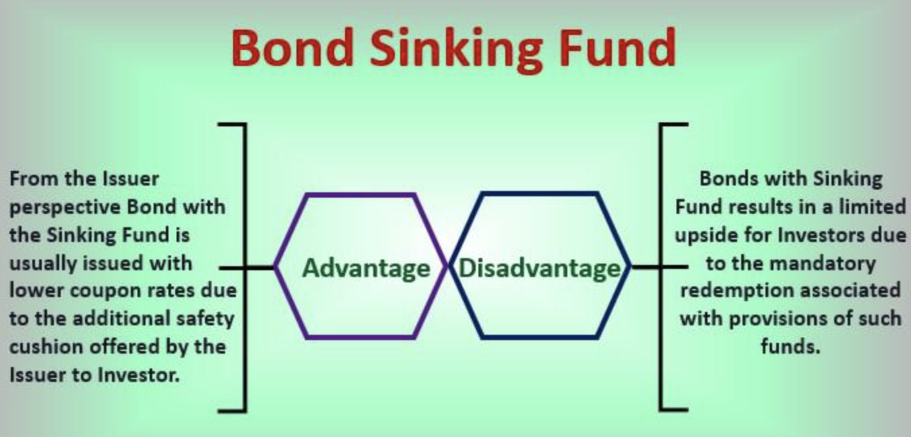

## Table of Contents

## What is a bond sinking fund?

A bond sinking fund is a way for companies or governments to set aside money over time to pay back a bond when it matures. When a bond is issued, the issuer promises to pay back the borrowed money on a specific date. To make sure they can do this, they might create a sinking fund. This fund works like a savings account where the issuer puts money in regularly, so when the bond matures, they have enough money to pay back the bondholders.

Using a sinking fund can be good for both the issuer and the bondholders. For the issuer, it helps them manage their debt better because they are saving up money gradually instead of having to come up with a large sum all at once. For bondholders, it can make the bond safer because they know the issuer is actively saving money to pay them back. However, if the issuer doesn't manage the fund well, there could still be risks.

## Why do companies establish bond sinking funds?

Companies set up bond sinking funds to make sure they can pay back the money they borrowed when their bonds come due. Instead of having to find a big amount of money all at once, they save a little bit at a time. This makes it easier for them to manage their money and not worry about where they'll get the funds when the bond matures. It's like putting money into a piggy bank regularly so that when the time comes, they have enough to cover the cost.

Having a sinking fund also makes the bonds more attractive to investors. When people buy bonds, they want to know they'll get their money back. If a company has a sinking fund, it shows they are planning ahead and taking steps to ensure they can repay their debt. This can make investors feel more secure and more likely to buy the bonds, which helps the company raise the money it needs.

## How does a bond sinking fund work?

A bond sinking fund is like a savings plan that a company or government sets up to pay back money they borrowed from bondholders. When they issue bonds, they promise to return the money on a certain date. To make sure they have the money when that date comes, they put some money into the sinking fund regularly. It's like saving a little bit every month so that when the bond matures, they have enough money to give back to the people who bought the bonds.

Having a sinking fund helps the company manage its money better. Instead of worrying about finding a large amount of money all at once, they can save gradually. This makes it easier for them to handle their finances. It also makes bondholders feel safer because they know the company is actively saving money to pay them back. This can make the bonds more attractive to investors, helping the company raise the money it needs more easily.

## What are the benefits of a bond sinking fund for bondholders?

A bond sinking fund is good for people who buy bonds because it makes their investment safer. When a company sets up a sinking fund, it means they are putting money aside regularly to pay back the bondholders when the bond matures. This shows that the company is planning ahead and trying to make sure they can return the money they borrowed. This can make bondholders feel more secure because they know the company is working to have the money ready when it's needed.

Having a sinking fund can also make the bonds more attractive to investors. When people are deciding whether to buy a bond, they want to know they will get their money back. If a bond has a sinking fund, it tells investors that the company is taking steps to manage their debt well. This can lead to more people wanting to buy the bonds, which can help the company raise money more easily. In the end, it's a win-win situation: the company can manage its money better, and bondholders feel more confident about their investment.

## What are the potential drawbacks of a bond sinking fund for issuers?

Setting up a bond sinking fund can be tricky for the company that issues the bonds. It means they have to put money into the fund regularly, which can be hard if they are having money problems. If they don't have enough cash to keep up with the payments, they might have to find other ways to get money, like borrowing more or selling assets. This can put extra pressure on their finances and make things more complicated.

Another issue is that the money in the sinking fund might not grow as fast as they need it to. If they put the money in safe places like bank accounts or government bonds, it might not earn much interest. This means they might not have enough money in the fund when the bond matures, especially if inflation goes up or if they need to pay back a lot of money at once. So, while a sinking fund can help manage debt, it also comes with its own set of challenges for the company.

## How is a bond sinking fund typically funded?

A bond sinking fund is usually funded by the company or government that issued the bonds. They put money into the fund regularly, often on a set schedule like every month or every year. This money comes from the company's profits or from money they set aside specifically for this purpose. It's like saving a little bit of their earnings to make sure they have enough when the bond needs to be paid back.

Sometimes, the company might use other ways to add money to the sinking fund. They could sell some of their assets or take out another loan to put money into the fund. This can help them keep up with the payments if they don't have enough cash from their regular earnings. The important thing is that they keep adding to the fund so they can pay back the bondholders when the bond matures.

## Can you explain the difference between a mandatory and an optional sinking fund?

A mandatory sinking fund is something a company has to do. When they issue bonds, they promise to put money into the sinking fund on a regular schedule, like every month or every year. They don't have a choice about it; they must do it because it's part of the deal they made with the people who bought the bonds. This helps make sure they have enough money to pay back the bondholders when the bond comes due.

An optional sinking fund, on the other hand, is something a company can choose to do. They might decide to set up a sinking fund to help manage their money better, but they don't have to. If they want, they can skip putting money into it or even stop the fund altogether. This gives them more flexibility, but it also means they might not have the money ready when the bond matures if they don't keep up with the payments.

## What impact does a bond sinking fund have on a company's financial statements?

A bond sinking fund affects a company's financial statements in a few ways. On the balance sheet, you'll see the sinking fund as an asset. This is because the money in the fund is something the company owns. It's like having cash set aside for a special purpose. On the other hand, the company also has a liability because they owe money to the bondholders. The sinking fund helps reduce this liability over time as the company puts money into it.

On the income statement, the payments into the sinking fund are not usually shown as expenses. Instead, they might be recorded as a use of cash in the cash flow statement, under financing activities. This shows that the company is using its cash to pay down its debt. Over time, as the company adds money to the fund, it can make the company's financial position look stronger because they are actively working to pay back what they owe.

## How do bond sinking funds affect the yield and price of bonds?

A bond sinking fund can make the bond more attractive to investors, which can affect its yield and price. When a company sets up a sinking fund, it shows they are planning to pay back the money they borrowed. This makes the bond safer for investors because they know the company is saving up to return their money. Because the bond is safer, investors might be willing to accept a lower yield, which means the company can offer a lower [interest rate](/wiki/interest-rate-trading-strategies) on the bond. This can make the bond's price go up because more people want to buy it.

On the other hand, if the sinking fund is managed well, it can also affect the bond's price directly. Sometimes, the company can use the money in the sinking fund to buy back some of the bonds before they mature. If they do this, there are fewer bonds out there, which can make the remaining bonds more valuable and drive up their price. But if the company doesn't manage the fund well, or if they have to use a lot of their money to keep up with the payments, it might make investors worry and push the bond's price down.

## What are the tax implications of a bond sinking fund for both the issuer and the bondholder?

For the company that issues the bonds, a sinking fund can have some tax benefits. The money they put into the sinking fund is usually not considered an expense, so it doesn't directly reduce their taxable income. But, when they use the money in the fund to pay back the bonds, it can help lower their overall debt. Less debt can mean less interest they have to pay, which can reduce their taxable income in the future. Also, if they invest the money in the sinking fund and earn interest, they will have to pay taxes on that interest income.

For bondholders, the tax implications are a bit different. The interest they earn from the bonds is usually taxable income. But if the company uses the sinking fund to buy back some of the bonds before they mature, bondholders might have to pay capital gains tax if they sell their bonds back to the company for more than they paid for them. On the other hand, if they sell the bonds back for less than they paid, they might be able to claim a capital loss on their taxes. So, the sinking fund can affect how much tax bondholders have to pay, depending on what happens to the price of the bonds.

## How do sinking fund provisions influence bond ratings?

Sinking fund provisions can make a bond's rating better. When a company sets up a sinking fund, it shows they are planning to pay back the money they borrowed. This makes the bond safer for investors because they know the company is saving up to return their money. Rating agencies, like Moody's or Standard & Poor's, look at this and might give the bond a higher rating. A higher rating means the bond is seen as less risky, which can make more people want to buy it.

But, if the company doesn't manage the sinking fund well, it can hurt the bond's rating. If they miss payments into the fund or if the money in the fund isn't growing fast enough, it might make investors worried. Rating agencies might see this as a sign that the company is having money problems. If that happens, they could lower the bond's rating, making it seem riskier to investors. So, while a sinking fund can help, it has to be managed carefully to keep the bond's rating strong.

## What are some real-world examples of bond sinking funds in action?

One real-world example of a bond sinking fund in action is the case of Ford Motor Company. In 2002, Ford issued bonds to raise money and set up a sinking fund to make sure they could pay back the money when the bonds matured. They put money into the fund regularly, which helped them manage their debt better. When the bonds came due, Ford used the money in the sinking fund to pay back the bondholders. This made investors feel more secure because they knew Ford was actively saving to return their money.

Another example is the New York City Municipal Water Finance Authority. They issued bonds to fund water infrastructure projects and created a sinking fund to ensure they could pay back the bonds. The Authority made regular payments into the fund, which came from water and sewer revenues. This helped them build trust with investors, showing that they had a plan to manage their debt responsibly. When the bonds matured, the sinking fund was used to repay the bondholders, demonstrating how such funds can be crucial for public entities in managing long-term financial obligations.

## References & Further Reading

[1]: ["Advances in Financial Machine Learning"](https://www.amazon.com/Advances-Financial-Machine-Learning-Marcos/dp/1119482089) by Marcos Lopez de Prado

[2]: Lhabitant, F.S. (2004). ["Hedge Funds: Quantitative Insights"](https://www.wiley.com/en-us/Hedge+Funds%3A+Quantitative+Insights-p-9780470687772). Wiley Finance.

[3]: Fabozzi, F.J. (2012). ["The Handbook of Fixed Income Securities"](https://www.amazon.com/Handbook-Fixed-Income-Securities-Ninth/dp/1260473899). McGraw-Hill Education.

[4]: Narang, R.K. (2013). ["Inside the Black Box: A Simple Guide to Quantitative and High-Frequency Trading"](https://onlinelibrary.wiley.com/doi/book/10.1002/9781118662717). Wiley.

[5]: ["Quantitative Trading: How to Build Your Own Algorithmic Trading Business"](https://github.com/LucindaYa/quant-resources/blob/master/Quantitative%20Trading%20How%20to%20Build%20Your%20Own%20Algorithmic%20Trading%20Business.pdf) by Ernest P. Chan