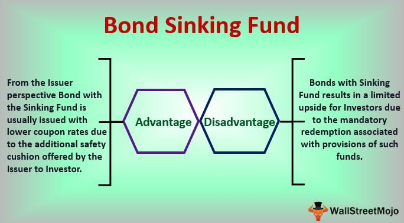

The financial world is a complex web of instruments and strategies, constantly evolving to adapt to changing economic landscapes. Diverse investment strategies are crucial for successfully navigating this intricate environment, allowing investors to mitigate risks and capitalize on opportunities. A well-rounded investment strategy often includes various financial instruments, each serving a unique purpose and function in a portfolio. Among these are sinking funds, bonds, and algorithmic trading, each representing a fundamental component of modern finance.

Sinking funds are specialized financial tools used to manage debt, particularly for issuers of bonds. These funds are established by setting aside money over time to repay a bond or debt security, thereby reducing the issuer's credit risk and providing a measure of security to investors. The sinking fund mechanism ensures that bondholders are reassured about the issuer's ability to make future repayments, thus making the bonds more attractive in certain market conditions.



Bonds, on the other hand, are a traditional investment vehicle, representing loans made by investors to borrowers—typically corporations, municipalities, or governments. They offer predictable income streams through interest payments and are fundamental to a diversified investment strategy due to their relative stability compared to equities. This stability, coupled with the possibility of different maturities and structures, including those with associated sinking funds, makes bonds a pivotal component of capital markets.

Algorithmic trading, a relatively recent development in the financial sector, represents the intersection of technology and finance. It involves using sophisticated mathematical models and algorithms to execute trades at speed and frequency that human traders cannot match. The use of algorithmic trading has transformed markets by increasing liquidity and market efficiency, while reducing the impact of trader emotion and bias. These algorithms can analyze vast datasets to identify and exploit trading opportunities in milliseconds.

The purpose of this article is to explore how these financial instruments and strategies—the predictability and stability of sinking fund bonds, coupled with the precision and efficiency of algorithmic trading—can be integrated within an investment strategy. This integration can enhance portfolio diversification and risk management, ultimately leading to more robust investment outcomes. While sinking fund bonds and algorithmic trading are distinct concepts, their convergence can offer significant insights for both professional investors and personal finance enthusiasts.

Understanding these components is critical in today's financial markets, where technological advances and innovative financial strategies continuously reshape the investing landscape. This knowledge equips investors to better align their portfolios with their financial goals, stay informed about the latest market developments, and adapt to potential changes in market conditions. As we explore the intersection of these financial tools and strategies, we aim to provide valuable insights that can aid in constructing a well-rounded and informed investment strategy.

## Table of Contents

## Understanding Sinking Fund Bonds

A sinking fund bond is a type of bond that includes a sinking fund provision, obligating the issuer to periodically set aside funds to repay the bond holder. This mechanism serves as a protective measure, both for bondholders and issuers, mitigating the risk of default and potentially reducing interest rates due to decreased credit risk. 

Sinking funds ensure that the issuer systematically accumulates funds to retire portions of the outstanding debt before maturity. This gradual redemption process safeguards investors by providing a clear path towards recovering their principal investment, thereby adding a level of security. For issuers, establishing a sinking fund demonstrates fiscal discipline and can enhance creditworthiness, potentially allowing them to issue debt at more favorable terms.

A contemporary example of a sinking fund bond is the corporate bond market, where companies issue bonds with sinking fund provisions to reassure investors of their commitment to timely principal repayment. This is reflected in several high-profile corporate bonds where sinking funds are utilized to enhance the bond's attractiveness to conservative investors seeking lower risk.

Investing in sinking fund bonds offers distinct advantages, such as reduced default risk and the potential for improved recovery rates in the event of issuer insolvency. Additionally, such bonds are often associated with lower interest rates compared to non-sinking fund bonds, attributable to the reduced risk. However, a crucial disadvantage is the potential loss of investment returns if interest rates decline after the bond’s issuance, as the issuer may call back the bond, compelling investors to reinvest at lower prevailing rates. Furthermore, the fixed contribution schedule for the sinking fund may restrict issuers' flexibility in capital management.

In terms of long-term financial strategy, sinking fund bonds can serve as a cornerstone for portfolio diversification. Their structured payout schedule and inherent safety features make them particularly appealing to risk-averse investors and those focused on capital preservation. By including these bonds in a diversified investment portfolio, investors can balance equity market [volatility](/wiki/volatility-trading-strategies) and achieve a steadier income stream, aligning asset allocation with both risk tolerance and investment objectives.

## The Mechanics of Algorithmic Trading

Algorithmic trading refers to the use of computer algorithms to automate and optimize the process of buying and selling financial instruments. This sophisticated trading method has fundamentally transformed the financial sector, introducing a new era defined by rapid execution, enhanced precision, and the elimination of emotional biases typical of human traders.

**Evolution in the Financial Sector:**

The genesis of [algorithmic trading](/wiki/algorithmic-trading) dates back to the early 1970s when the first computerized order systems were introduced. The meteoric rise of algorithmic trading, however, began in the 1980s and 1990s, catalyzed by advancements in computer processing and telecommunications technologies. These developments enabled financial institutions to execute complex strategies at speeds and volumes previously unimaginable. Today, a significant portion of the trading [volume](/wiki/volume-trading-strategy) on major stock exchanges like the New York Stock Exchange and NASDAQ is attributed to algorithms.

**Key Components and Mechanisms:**

Algorithmic trading systems comprise several key components:

1. **Algorithms:** These are sets of rules or instructions programmed to perform tasks such as identifying trading opportunities, executing trades, and managing risk.

2. **Data Feed:** Real-time and historical market data provide the algorithm with critical inputs, enabling it to make informed decisions.

3. **Trading Platform:** Software infrastructure connects the algorithm to financial markets, facilitating the transmission of buy and sell orders.

4. **Execution Engine:** This component ensures orders are executed efficiently, adhering to speed, price, and quantity specifications.

5. **Risk Management Module:** Algorithms include mechanisms to monitor and mitigate risks, adjusting strategies as necessary to limit potential losses.

**Benefits of Algorithmic Trading:**

The advantages of employing algorithms in trading are manifold:

- **Speed:** Algorithms can process vast amounts of data and execute orders within milliseconds, capitalizing on fleeting market opportunities.

- **Accuracy:** Automated systems reduce human errors associated with order placement, such as incorrect calculation of price or quantity.

- **Emotionless Decision-Making:** Algorithms adhere strictly to predefined rules, eliminating emotional biases such as fear or greed that might affect human traders.

**Common Strategies in Bond Markets:**

Algorithmic trading in bond markets often employs strategies such as:

- **Statistical Arbitrage:** Exploiting price inefficiencies between related bond securities or other financial instruments by taking opposing positions on correlated assets.

- **Trend Following:** Algorithms identify and capitalize on emerging trends in bond prices, entering trades in the direction of the trend.

- **Mean Reversion:** Based on the statistical assumption that bond prices will revert to their historical average, algorithms identify mispriced bonds to buy or sell.

**Risks and Regulatory Concerns:**

Despite its advantages, algorithmic trading poses several risks:

- **Market Volatility:** Algorithms can exacerbate market volatility, particularly during periods of low liquidity, by executing large volumes of trades in short time frames.

- **Algorithmic Failures:** Faulty algorithms can result in substantial financial losses, as observed in incidents like the 2010 Flash Crash.

- **Regulatory Challenges:** The rapid and opaque nature of algorithmic trading presents challenges for regulators striving to maintain fair and orderly markets. Regulatory bodies have implemented measures such as circuit breakers and order-to-trade ratios to mitigate these risks.

Algorithmic trading continues to evolve, driven by innovations in [machine learning](/wiki/machine-learning) and [artificial intelligence](/wiki/ai-artificial-intelligence). As these technologies advance, the landscape of algorithmic trading is expected to become even more sophisticated, offering new opportunities and challenges for traders and regulators alike.

## Integrating Sinking Fund Bonds in Algorithmic Trading Strategies

Integrating sinking fund bonds into algorithmic trading strategies requires a systematic approach that incorporates historical data analysis, performance prediction, and strategic algorithm development. This integration combines the stable, long-term features of sinking fund bonds with the efficiency and precision of algorithmic trading.

### Analyzing Historical Data and Predicting Bond Performance

The first step in merging sinking fund bonds with algorithmic trading is to thoroughly analyze historical data. Historical data provides insights into bond price movements, [interest rate](/wiki/interest-rate-trading-strategies) fluctuations, and payment schedules associated with sinking funds. Algorithms can be designed to process this data, identifying patterns and trends that may predict future performance.

A potential approach involves using time series analysis to forecast bond prices. Consider the ARIMA (AutoRegressive Integrated Moving Average) model, which can be employed to assess the time-dependent structure of bond prices. This model helps identify trends and seasonality, crucial for anticipating future price movements.

```
from statsmodels.tsa.arima.model import ARIMA
import pandas as pd

# Load bond price historical data
data = pd.read_csv('sinking_fund_bond_prices.csv')
bond_prices = data['Price']

# Define and fit the ARIMA model
model = ARIMA(bond_prices, order=(5, 1, 0))
model_fit = model.fit()

# Forecasting
forecast = model_fit.forecast(steps=12)
print(forecast)
```

### Potential Strategies and Algorithms

Strategies for algorithmic trading with sinking fund bonds may involve leveraging mean-reversion techniques, where the algorithm identifies bonds priced below their historical mean as potential buy opportunities. Conversely, bonds trading above the mean could be candidates for selling.

Another approach is to exploit the information inefficiencies in the bond market. Algorithms can monitor news releases, economic indicators, and interest rate changes to execute trades that capitalize on short-term mispricing.

### Case Studies and Examples

There have been instances where firms have successfully integrated sinking fund bonds in algorithmic trading systems. For example, companies may use machine learning models to enhance prediction accuracy. By feeding algorithms a mix of bond-specific data and macroeconomic indicators, the system can dynamically adjust its trading strategy to optimize returns.

### Challenges and Considerations

Implementing this integrated strategy presents various challenges. One such challenge is data quality and availability; historical data must be accurate and comprehensive. Additionally, the complexity of algorithms can lead to increased computational costs, necessitating advanced infrastructure.

Moreover, regulatory constraints around bond trading require careful adherence to compliance standards. Algorithms must be tested rigorously to ensure they do not inadvertently violate trading regulations, which could result in legal consequences.

Lastly, market volatility can significantly impact the performance of these strategies. Algorithms must be robust and adaptive to handle sudden changes in market conditions, which can affect bond prices and the associated returns.

In summary, integrating sinking fund bonds into algorithmic trading strategies offers significant potential but requires a sophisticated setup that includes the analysis of historical data, strategic algorithm development, and a keen awareness of the associated challenges and requirements.

## Benefits and Challenges of Combined Strategies

Merging sinking fund bonds and algorithmic trading strategies offers several synergistic benefits that can enhance investment performance. One primary advantage is the potential for optimized risk management. Sinking fund bonds, by nature, provide a mechanism for reducing default risk through periodic repayments, which can be appealing during times of economic uncertainty. This feature can be particularly useful for algorithmic trading systems, enabling them to balance portfolios with assets that inherently offer lower risk. 

In terms of market volatility, the integration of sinking fund bonds within algorithmic trading can offer stability. The regular repayments associated with these bonds can provide a steady cash flow, which can be algorithmically reinvested in a diversified portfolio. This adaptability helps counteract the volatility seen in markets, offering a buffer by reallocating resources towards more stable investments during turbulent periods. 

However, the combination of these strategies is not without challenges. Investors need to navigate the complexities of data integration and model optimization. Algorithmic systems must be adept at analyzing historical and real-time data to accurately predict bond performance, especially given that sinking fund provisions can alter the bond's duration and yield. Improper calibration of algorithms may lead to suboptimal investment decisions, especially under volatile market conditions, where sudden shifts can affect bond pricing and algorithmic predictions.

Cost-efficiency is another consideration. While algorithmic trading reduces the necessity for manual intervention, the development and maintenance of sophisticated models incur significant costs. There is also an ongoing need for investment in technology and expertise. The return on investment in such systems tends to be favorable when systems are well-optimized, but the initial outlay and potential for unforeseen technical issues must be carefully evaluated.

Looking ahead, artificial intelligence and machine learning are poised to further revolutionize this integration by providing enhanced predictive capabilities. Increasingly sophisticated algorithms could offer more precise assessments of bond performance and better handling of complex market scenarios. Investors might also expect developments in risk management tools and regulatory technology to address challenges related to compliance and security in algorithmic trading. 

Overall, for investors willing to embrace these advanced financial strategies, continued education and adaptability will be key. By effectively combining sinking fund bonds with algorithmic trading, there is the potential for striking a balance between risk management, cost efficiency, and return on investment in a rapidly evolving financial landscape.

## Conclusion

The strategies explored in this article—the integration of sinking fund bonds and algorithmic trading—highlight the innovative pathways available within today's financial landscape. Sinking fund bonds serve as a protective mechanism for investors, aiding in risk mitigation and ensuring more predictable returns. Their inclusion in a portfolio can enhance long-term financial stability and diversification. On the other hand, algorithmic trading offers unprecedented precision and speed, minimizing human error and optimizing trading outcomes through sophisticated data analysis and automated processes. The amalgamation of these elements has the potential to improve financial strategies significantly.

As the financial markets continue to evolve, these tools and methods will become increasingly crucial. Investors and financial strategists are encouraged to consider sinking fund bonds and algorithmic trading as part of their investment plans. By leveraging these techniques, they can capitalize on market opportunities while simultaneously managing risks effectively. Staying informed and adaptable remains essential, as technological advances and market dynamics contribute to a continuously shifting financial environment.

The presented strategies not only require understanding but also active engagement and ongoing education. By encouraging financial professionals and enthusiasts to further examine these concepts, there is significant potential for improved investment outcomes and future development within the finance sector. The intersection of sinking fund bonds and algorithmic trading represents not just a contemporary shift in strategy but also a forward-looking approach to comprehensive financial planning. Embracing such strategies may yield enhanced results and position investors to better navigate the complexities of modern finance.

## References & Further Reading

[1]: ["Advances in Financial Machine Learning"](https://www.amazon.com/Advances-Financial-Machine-Learning-Marcos/dp/1119482089) by Marcos Lopez de Prado

[2]: Lhabitant, F.S. (2004). ["Hedge Funds: Quantitative Insights"](https://www.wiley.com/en-us/Hedge+Funds%3A+Quantitative+Insights-p-9780470687772). Wiley Finance.

[3]: Fabozzi, F.J. (2012). ["The Handbook of Fixed Income Securities"](https://www.amazon.com/Handbook-Fixed-Income-Securities-Ninth/dp/1260473899). McGraw-Hill Education.

[4]: Narang, R.K. (2013). ["Inside the Black Box: A Simple Guide to Quantitative and High-Frequency Trading"](https://onlinelibrary.wiley.com/doi/book/10.1002/9781118662717). Wiley.

[5]: ["Quantitative Trading: How to Build Your Own Algorithmic Trading Business"](https://github.com/LucindaYa/quant-resources/blob/master/Quantitative%20Trading%20How%20to%20Build%20Your%20Own%20Algorithmic%20Trading%20Business.pdf) by Ernest P. Chan