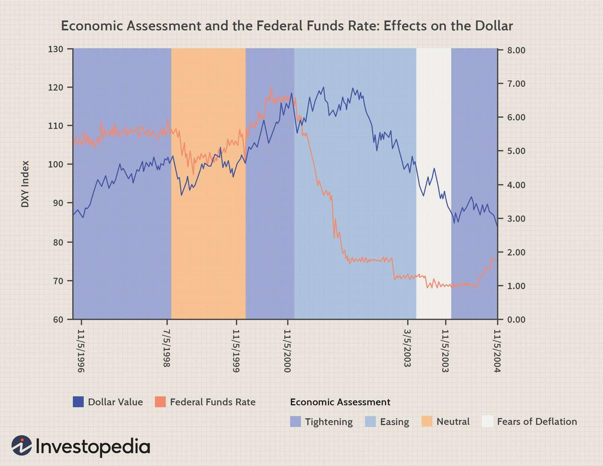

Global finance markets are intricate networks where diverse factors influence currency movements. Understanding various indicators is essential for Forex traders to make informed decisions. One critical indicator that provides nuanced insights into currency movements is bond spreads. Bond spreads, the difference in yields between two government bonds, often reflect the relative economic health of countries and market confidence. Recognizing the significance of these spreads can provide traders with a leading edge in predicting currency trends.

This article examines the connections between foreign exchange, Forex indicators, bond spreads, and algorithmic trading. With the rise of technology in financial markets, integrating these elements into a comprehensive trading strategy can significantly enhance trading performance. Foreign exchange, or Forex, is one of the largest financial markets globally, with daily trading volumes surpassing $6 trillion. This market's volatility and size make it a fertile ground for applying sophisticated analysis and trading techniques.



Forex indicators are tools used by traders to dissect currency price movements. They vary from simple moving averages to intricate algorithms that handle vast amounts of data, predicting future price trends. Along with other economic data, these indicators help traders gain a complete understanding of market conditions.

Beyond Forex indicators, bond spreads are essential in assessing economic conditions and risks. By analyzing the difference in yields between government bonds of different countries, traders can infer economic stability and predict potential currency strength or weakness. A widening spread often signals economic instability in one country relative to another, affecting currency valuations.

Algorithmic trading enhances the integration of these financial indicators into a coherent strategy. It employs automated systems based on complex mathematical models, capable of processing multiple data streams simultaneously. Algorithms can swiftly respond to shifts in bond spreads, offering a substantial advantage in the dynamic Forex market. By leveraging the strengths of bond spreads and algorithmic trading, traders can devise robust strategies suited to the complexities of currency speculation.

## Table of Contents

## Understanding Forex Indicators

Forex indicators are vital tools employed by traders to analyze currency price movements and make informed predictions about future trends. These indicators serve as the basis for devising and optimizing trading strategies in the foreign exchange market. They range from simple tools, such as moving averages, to complex algorithms designed to process and interpret large datasets effectively.

One of the simplest and widely used Forex indicators is the moving average. It helps to smooth out price data by creating a constantly updated average price. Traders utilize moving averages to identify the direction of trends. There are different types of moving averages, such as simple moving averages (SMA) and exponential moving averages (EMA), each offering differing levels of sensitivity to recent price changes.

Another important category of Forex indicators includes oscillators, which are used to signal potential reversal points in market trends. Oscillators, such as the Relative Strength Index (RSI) and the Moving Average Convergence Divergence (MACD), help traders to identify overbought or oversold conditions in the market. The RSI measures the speed and change of price movements, typically plotted on a scale of 0 to 100. A value above 70 may indicate that a currency is overbought, while a value below 30 may suggest it is oversold.

Moreover, complex algorithms and models underpin more advanced Forex indicators, which can analyze vast amounts of data to predict market movements. These algorithmic indicators incorporate statistical methods and [machine learning](/wiki/machine-learning) models to forecast prices based on historical patterns and current market conditions. Python, being a versatile computing language, is often used to develop such algorithms due to its comprehensive libraries like NumPy, pandas, and scikit-learn.

Here is a simple Python example using the pandas library to calculate the simple moving average of a currency pair:

```python
import pandas as pd

# Sample data for currency prices
data = {'price': [1.1200, 1.1215, 1.1195, 1.1220, 1.1205]}
df = pd.DataFrame(data)

# Calculate the Simple Moving Average (SMA) over a window of 3 periods
df['SMA'] = df['price'].rolling(window=3).mean()

print(df)
```

Choosing the right Forex indicators is crucial for building a robust trading strategy. Traders need to balance simplicity and complexity, understanding the strengths and limitations of each indicator. Many traders integrate multiple indicators to form a more comprehensive view of market conditions, using them alongside other economic data such as interest rates, inflation figures, and geopolitical events that can influence currency prices.

In summary, Forex indicators are essential in analyzing and predicting currency price movements. By selecting appropriate indicators, traders can enhance their understanding of market trends and improve the accuracy of their trading strategies. Whether relying on traditional tools like moving averages or advanced algorithms, the integration of Forex indicators with broader economic data is a key component of successful currency trading.

## The Role of Bond Spreads in Forex Trading

Bond spreads represent the yield differential between two government bonds, typically denominated in the same currency but issued by different countries. These spreads serve as a key barometer for assessing the relative economic health of these nations. When traders analyze bond spreads, they gain insights into perceived risk levels and investor confidence, which can influence foreign exchange (Forex) markets significantly.

The importance of bond spreads in Forex trading lies primarily in their ability to act as a leading indicator of currency movements. A bond yield reflects the return an investor will receive by holding a bond until maturity. The spread between yields of two countries can provide critical insights into market perceptions of risk and economic conditions between those nations. For instance, if the yield on country A's bond is significantly higher than that of country B, it may suggest that investors require more compensation for holding country A's bonds due to higher perceived risk or economic instability.

A widening bond spread can indicate economic instability in one country relative to another, potentially leading to fluctuations in currency strength. For example, consider two government bonds: one issued by the United States and the other by Germany. If the yield spread between U.S. and German bonds increases, this could imply higher U.S. economic risks relative to Germany. Investors may interpret this as a signal to invest in the relatively safer German assets, causing the U.S. dollar to depreciate against the euro.

Understanding bond spreads involves examining various economic factors, such as inflation, interest rates, and geopolitical events, that can affect bond yields. In practice, wider spreads often indicate rising economic concerns, prompting currency traders to adjust their positions accordingly. Conversely, narrowing spreads might suggest improved economic outlook in one country, potentially strengthening its currency against others.

Math-oriented traders often utilize quantitative models to incorporate bond spreads into their Forex trading strategies. An example formula for evaluating bond spreads could be:

$$
\text{Bond Spread} = Y_{\text{CountryA}} - Y_{\text{CountryB}}
$$

Where $Y_{\text{CountryA}}$ and $Y_{\text{CountryB}}$ represent the yields of the respective country's government bonds. This simple calculation provides a baseline from which traders can assess relative economic expectations and potential currency impacts.

Ultimately, integrating bond spreads into Forex analysis provides traders with a comprehensive understanding of currency dynamics and the underlying economic forces at play. This integration is paramount for developing informed trading strategies that anticipate market movements based on perceived risks and economic performance across nations.

## Algorithmic Trading in Forex

Algorithmic trading in Forex refers to using automated systems that follow pre-programmed instructions to execute trades. This approach relies on complex mathematical models that can evaluate multiple data points simultaneously, ensuring rapid and efficient execution of orders. The primary advantage of [algorithmic trading](/wiki/algorithmic-trading) is its ability to process and react to market data faster than human traders, which is particularly beneficial in the highly volatile and fast-paced Forex market.

Integrating Forex indicators and bond spreads into algorithmic trading strategies can significantly enhance their effectiveness. Forex indicators, such as moving averages, stochastic oscillators, or Bollinger Bands, provide insights into market trends and potential reversal points. Bond spreads, which measure the differences in yields between two government bonds, offer clues about economic conditions and investor confidence. By incorporating these elements, algorithms can develop more comprehensive trading strategies that account for both technical and fundamental factors.

For example, an algorithm might be programmed to monitor the yield spread between U.S. and German government bonds. A sudden increase in this spread could indicate economic instability in one of the regions, prompting the algorithm to execute trades accordingly. Such trades could involve selling the currency of the country perceived as less stable and buying the other. This quick reaction to changes in bond spreads can provide a competitive edge by anticipating market shifts before they become widely recognized by human traders.

Algorithmic trading also allows for the continual [backtesting](/wiki/backtesting) and refinement of models. Historical data can be analyzed to determine the effectiveness of specific strategies and to make adjustments as needed. Python, with libraries such as Pandas and NumPy, is often used to develop and test these algorithms. Below is a simple example in Python for monitoring a bond spread and placing trade orders based on certain conditions:

```python
import pandas as pd
import numpy as np

# Sample data for bond yields
us_bond_yield = pd.Series([1.5, 1.55, 1.58, 1.60])
german_bond_yield = pd.Series([0.5, 0.45, 0.48, 0.50])

# Calculate bond spreads
bond_spread = us_bond_yield - german_bond_yield

# Define a simple strategy
def trade_based_on_spread(spread):
    for i in range(1, len(spread)):
        if spread[i] > spread[i - 1]:
            print("Buy USD/EUR")
        elif spread[i] < spread[i - 1]:
            print("Sell USD/EUR")

# Execute trading strategy
trade_based_on_spread(bond_spread)
```

Incorporating bond spreads and Forex indicators into algorithmic trading is not without challenges. It requires a deep understanding of global economic conditions and constant monitoring, as well as updates to the models to keep pace with changing market dynamics. However, for those who master these concepts, the payoff can be substantial, providing a distinct advantage in navigating the complex Forex markets.

## Case Studies and Examples

Examining historical data provides valuable insights into how bond spreads influence currency trends, specifically in the context of trading pairs such as GBP/USD. Yield spreads between US and UK government bonds have consistently played a role in shaping the movement of this currency pair. A noteworthy example is when investors perceive a divergence in economic health or [interest rate](/wiki/interest-rate-trading-strategies) policies between the two countries, leading to significant shifts in spreads.

When the yield spread between US and UK bonds increases, it often indicates that US bonds are offering higher returns than their UK counterparts. This scenario can lead to capital flowing into the US bond market, strengthening the US Dollar against the British Pound. Conversely, a tightening or narrowing of the yield spread might indicate that UK's economic outlook is improving relative to the US, potentially resulting in a stronger Pound.

To comprehend these dynamics, consider historical periods where the yield spread has been a precursor to currency movements. For instance, during the financial crisis of 2008, significant shifts in yield spreads preceded noticeable changes in the GBP/USD exchange rate. In this instance, bond spreads widened as investors flocked to the perceived safety of US Treasury bonds, leading to an appreciation of the US Dollar.

Analyzing mathematical models can provide further clarity on this relationship. Consider a simplified linear regression model where the currency exchange rate ΔE is the dependent variable, and the bond yield spread ΔS is the independent variable:

$$
ΔE = α + βΔS + ε
$$

In this model, $α$ is the intercept, $β$ represents the sensitivity of the exchange rate to changes in bond spreads, and $ε$ is the error term.

Python can be utilized for analyzing historical data to model these relationships:

```python
import numpy as np
import pandas as pd
import statsmodels.api as sm

# Example data
data = {'Yield_Spread': [0.5, 0.6, 0.4, 0.7, 0.8], 'Currency_Rate_Change': [0.02, 0.03, -0.01, 0.04, 0.05]}
df = pd.DataFrame(data)

# Define the dependent and independent variables
X = df['Yield_Spread']
y = df['Currency_Rate_Change']

# Add a constant to the model (the intercept term)
X = sm.add_constant(X)

# Fit the regression model
model = sm.OLS(y, X).fit()
results_summary = model.summary()

print(results_summary)
```

By analyzing case studies through such econometric methods, traders can refine their strategies to better time entry and [exit](/wiki/exit-strategy) points in the Forex market. Understanding the temporal impacts of bond spreads enhances the ability to predict currency appreciations or depreciations effectively, ultimately contributing to more informed trading decisions. Such historical insight is invaluable for traders aiming to align their strategies with long-term trends rather than react to short-term fluctuations.

## Best Practices for Using Bond Spreads in Forex Trading

When employing bond spreads as a Forex trading indicator, prioritizing long-term trends over short-term fluctuations is crucial. This approach allows traders to capture sustained movements and avoid the noise of temporary market [volatility](/wiki/volatility-trading-strategies). Bond spreads, defined as the yield difference between two government bonds, can be indicative of economic conditions over the long term. For instance, if the spread between the German Bunds and the U.S. Treasuries widens consistently, it might suggest differing economic prospects between the Eurozone and the United States.

While bond spreads provide valuable insights, they should not be used in isolation. Integrating them with other economic indicators—such as interest rates, inflation data, and GDP growth—can offer a more comprehensive view of market conditions. For example, combining bond spread analysis with Purchasing Managers' Index (PMI) data can signal both investor sentiment and business activity levels, enhancing predictive capabilities.

It is also important to recognize that bond spreads, while influential, do not determine absolute market movement. They help set a long-term bias, but traders should consider other factors in their decision-making process. A narrow focus might lead to overlooking other critical market influencers like geopolitical events or central bank policies.

Monitoring anomalies in bond spread and currency relationships is vital for detecting potential market reversals. Abrupt changes in spreads that are not mirrored by corresponding currency movements may indicate an impending shift or correction. For instance, a divergence where bond spreads suggest an economic downturn, but the currency remains strong, could be an early warning of an upcoming reversal. Regular analysis and vigilance in observing such discrepancies can enhance a trader's ability to anticipate and act on market changes effectively.

## Conclusion

Integrating bond spreads and algorithmic trading into Forex strategies can offer a substantial enhancement in trading outcomes by leveraging the intricate relationships between these elements. Bond spreads, reflecting the interest rate differentials between two countries, serve as a leading indicator of potential currency movements. By monitoring these spreads, traders can gain insights into the relative economic health and investor confidence in these regions.

Algorithmic trading, on the other hand, provides the technological capability to process vast amounts of financial data rapidly. When Forex indicators like bond spreads are incorporated into algorithmic models, traders can execute trades with precision and speed, capturing market movements that manual traders might miss. Python and other programming languages offer robust libraries for developing such models. For example, using `pandas` for data manipulation and `numpy` for numerical computations can help create efficient trading algorithms that [factor](/wiki/factor-investing) in real-time spread changes.

The power of these strategies lies in their ability to identify opportunities proactively. By comprehensively understanding the dynamic relationships between economic indicators, currency movements, and algorithmic signals, traders can maintain a competitive advantage in currency speculation. However, these advanced strategies come with inherent complexities. They require a deep understanding of macroeconomic principles and constant monitoring of global economic conditions to remain effective.

Traders who master the integration of bond spreads and algorithmic trading are poised to navigate the intricacies of Forex markets more effectively. This mastery involves not only technical proficiency in algorithm development but also the ability to interpret economic nuances and trends, allowing them to respond swiftly to market changes. As such, continuous learning and adaptation are essential components of a successful Forex trading strategy that capitalizes on these powerful tools.

## Additional Resources

For traders eager to delve deeper, numerous resources and tools are available for further study to enhance Forex trading strategies. Platforms such as FXOpen provide extensive tools and functionalities that enable traders to track bond spreads and analyze market movements effectively. These platforms often include features for charting, backtesting strategies, and real-time data feeds, which are crucial for informed decision-making in the Forex market.

Moreover, leveraging educational resources is vital for continuous improvement. Various tutorials, webinars, and courses can help traders build and refine their understanding of Forex indicators and the role of bond spreads in currency movements. Websites like Babypips offer comprehensive courses tailored to beginners and advanced traders alike, covering essential aspects of Forex trading, including technical analysis, risk management, and trading psychology.

In addition, numerous online communities and forums such as Forex Factory and TradingView provide platforms for discussion, strategy sharing, and insights from experienced traders. Engaging with these communities can offer valuable perspectives and tips, helping traders stay abreast of latest market trends and strategies.

Staying informed and continuously learning is key to navigating the fast-evolving landscape of Forex trading. By combining the right tools and educational resources, traders can develop robust strategies and adapt to changing market conditions more effectively.

## References & Further Reading

[1]: Fabozzi, F. J., & Francis, J. C. (1979). ["Mutual Fund Systematic Risk for Bull and Bear Market Subperiods."](https://www.scirp.org/reference/ReferencesPapers?ReferenceID=1402208) The Journal of Finance, 34(5), 1243-1250.

[2]: Dacorogna, M. M., Müller, U. A., Nagler, R. J., Olsen, R. B., & Pictet, O. V. (2001). ["An Introduction to High-Frequency Finance."](https://www.semanticscholar.org/paper/A-geographical-model-for-the-daily-and-weekly-in-Dacorogna-M%C3%BCller/0967bf8292d53bd81eaebb39a84dc11c589c6bd8) Academic Press.

[3]: Menkhoff, L., Sarno, L., Schmeling, M., & Schrimpf, A. (2012). ["Currency Momentum Strategies."](https://www.sciencedirect.com/science/article/pii/S0304405X12001353) The Review of Financial Studies, 25(4), 1010-1042.

[4]: Engle, R., & Rangel, J. G. (2008). ["The Spline-GARCH Model for Low-Frequency Volatility and Its Global Macroeconomic Causes."](https://pages.stern.nyu.edu/~rengle/spline-garch.pdf) The Review of Financial Studies, 21(3), 1187-1222.

[5]: Litterman, R., & Scheinkman, J. (1991). ["Common Factors Affecting Bond Returns."](https://www.pm-research.com/content/iijfixinc/1/1/54) The Journal of Fixed Income, 1(1), 54-61.

[6]: ["Fixed Income Analysis, CFA Institute Investment Series"](https://www.amazon.com/Fixed-Income-Analysis-Institute-Investment/dp/1119627281) by Barbara S. Petitt and Jerald E. Pinto

[7]: ["Algorithmic and High-Frequency Trading"](https://assets.cambridge.org/97811070/91146/frontmatter/9781107091146_frontmatter.pdf) by Álvaro Cartea, Sebastian Jaimungal, and José Penalva