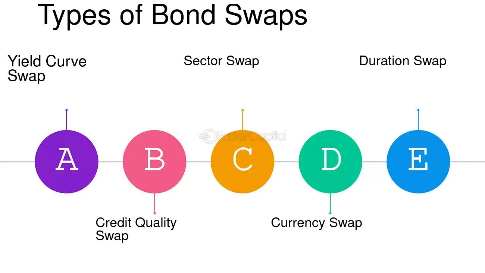

## Table of Contents

## What is a bond swap?

A bond swap is when an investor trades one bond for another. This is done to improve the investor's financial situation. The main goal is often to get a better interest rate or to reduce risk.

For example, an investor might swap a bond with a low interest rate for one with a higher rate. This can help them earn more money. Another reason for a bond swap could be to change the bond's maturity date. This can help the investor match their investment with their financial goals.

## Why would an investor consider a bond swap?

An investor might consider a bond swap to improve their financial situation. One common reason is to get a better interest rate. If an investor has a bond that is paying a low interest rate, they might swap it for a bond with a higher rate. This can help them earn more money from their investment. Another reason could be to reduce risk. If an investor feels that their current bond is too risky, they might swap it for a safer bond. This can help protect their money.

Another reason for a bond swap is to change the bond's maturity date. Sometimes, an investor's financial goals change, and they need their money at a different time. By swapping a bond, they can get one that matures when they need the money. This can help them plan their finances better. Overall, a bond swap is a way for investors to adjust their investments to better fit their needs and goals.

## What are the basic mechanics of executing a bond swap?

To execute a bond swap, an investor first needs to find a bond they want to trade their current bond for. This involves looking at different bonds and comparing them. The investor will look at things like the interest rate, the maturity date, and the risk level of the new bond. Once they find a bond that they think is better than their current one, they can start the swap process.

The next step is to contact their broker or use an online trading platform to make the swap. The investor will tell their broker which bond they want to trade and which bond they want to get in return. The broker will then handle the details of the trade, making sure everything is done correctly. Once the swap is complete, the investor will have the new bond in their portfolio, and they can start earning interest on it.

## What are the different types of bond swaps?

There are several types of bond swaps, each with its own purpose. One common type is the rate anticipation swap. This happens when an investor thinks interest rates will change soon. They swap their current bond for one that will do better if rates go up or down. Another type is the pure yield pickup swap. This is when an investor swaps a bond with a lower interest rate for one with a higher rate. They do this to earn more money from their investment.

Another type of bond swap is the tax swap. This is done to reduce the amount of taxes an investor has to pay. They swap a bond that has gone down in value for a similar bond. This lets them claim a loss on their taxes. The last type is the substitution swap. This happens when an investor finds a bond that is very similar to their current one but has a slightly better price or yield. They swap their bond to get a small improvement in their investment.

## How does a substitution swap work?

A substitution swap is when an investor trades one bond for another that is very similar but a bit better. They do this to get a small improvement in their investment. For example, if an investor has a bond that pays 3% interest, they might find another bond that pays 3.1% interest. Both bonds might have the same risk and maturity date, but the new one gives a little more money.

To do a substitution swap, the investor looks for a bond that is almost the same as their current one but has a better price or yield. Once they find it, they contact their broker or use an online trading platform to make the swap. The broker handles the trade, and soon the investor has the new bond in their portfolio, earning a bit more money than before.

## What is an intermarket spread swap and how is it used?

An intermarket spread swap is when an investor trades bonds from different markets. For example, they might swap a bond from the U.S. market for one from the European market. They do this because they think one market will do better than the other. This kind of swap can help investors make money by taking advantage of differences between markets.

To do an intermarket spread swap, an investor needs to look at different markets and find a bond that they think will do better than their current one. They might look at things like interest rates, economic conditions, and other factors that affect bond prices. Once they find a good bond, they contact their broker or use an online trading platform to make the swap. The broker takes care of the details, and soon the investor has a new bond that they hope will perform better in the new market.

## How can a rate anticipation swap benefit an investor?

A rate anticipation swap can help an investor by letting them make money when interest rates change. If an investor thinks interest rates will go up, they can swap their bond for one that will do better when rates rise. For example, they might swap a bond with a fixed rate for one with a variable rate. When rates go up, the variable rate bond will pay more interest, and the investor will earn more money.

If an investor thinks interest rates will go down, they can also use a rate anticipation swap. They might swap a bond with a variable rate for one with a fixed rate. When rates go down, the fixed rate bond will still pay the same amount of interest, while the variable rate bond will pay less. This way, the investor can keep earning the same amount of money even when rates fall. By using a rate anticipation swap, investors can protect their money and possibly make more money when interest rates change.

## What are the tax implications of engaging in a bond swap?

When you do a bond swap, it can affect your taxes. If you sell a bond for less than what you paid for it, you can claim a loss on your taxes. This is called a capital loss. You can use this loss to reduce the amount of taxes you owe on other income. But if you sell a bond for more than what you paid for it, you have to pay taxes on the profit. This is called a capital gain. The tax rate on capital gains depends on how long you held the bond. If you held it for less than a year, it's a short-term capital gain, and you pay your regular income tax rate. If you held it for more than a year, it's a long-term capital gain, and you pay a lower tax rate.

Another thing to think about is the tax swap. This is when you swap a bond that has gone down in value for a similar bond. By doing this, you can claim a loss on your taxes without changing your investment much. But there are rules you need to follow. The IRS has a rule called the wash-sale rule. This rule says you can't claim a loss if you buy the same or a very similar bond within 30 days before or after the sale. So, if you want to do a tax swap, you need to make sure the new bond is different enough from the old one to avoid the wash-sale rule.

## How do bond swaps affect portfolio duration and yield?

When you do a bond swap, it can change how long your money is tied up in your portfolio. This is called the portfolio duration. If you swap a bond that matures soon for one that matures later, your portfolio's duration gets longer. This means your money is locked up for a longer time. On the other hand, if you swap a bond that matures later for one that matures sooner, your portfolio's duration gets shorter. This can be good if you need your money sooner.

Bond swaps can also change how much money you earn from your portfolio. This is called the portfolio yield. If you swap a bond with a low interest rate for one with a higher rate, your portfolio's yield goes up. This means you earn more money from your investments. But if you swap a bond with a high interest rate for one with a lower rate, your portfolio's yield goes down. This can happen if you want to take less risk or if you think interest rates will change soon.

## What are the risks associated with bond swaps?

Bond swaps can be risky because they depend on guessing what will happen with interest rates and the economy. If you swap a bond thinking rates will go up, but they go down instead, you might end up with a bond that pays less interest than your old one. This means you could lose money. Also, if you swap to a bond from a different market or country, you have to think about things like currency changes and different rules in that country. These things can make your investment more complicated and risky.

Another risk is that you might not know all the costs of doing a bond swap. There can be fees for trading bonds, and these fees can add up. If you don't think about these costs, you might not make as much money as you hoped. Also, if you're doing a tax swap, you have to be careful about the wash-sale rule. If you break this rule, you might not be able to claim the tax loss you were hoping for. So, it's important to understand all the risks and costs before you decide to do a bond swap.

## How can bond swaps be used as part of a broader investment strategy?

Bond swaps can be a smart part of a bigger investment plan. They help investors change their investments to match what they want to do with their money. For example, if an investor thinks interest rates will change soon, they can do a rate anticipation swap. This means they trade their current bond for one that will do better when rates go up or down. This can help them make more money or protect their money from losing value. Another way to use bond swaps is to get a better interest rate. By swapping a bond with a low rate for one with a higher rate, an investor can earn more money from their investment.

Bond swaps can also help investors manage risk and plan when they need their money. If an investor thinks their current bond is too risky, they can swap it for a safer bond. This can help protect their money. Also, if an investor's plans change and they need their money at a different time, they can swap a bond to get one that matures when they need it. This helps them match their investments with their financial goals. Overall, bond swaps are a flexible tool that can help investors adjust their portfolios to fit their needs and goals.

## What advanced techniques can be applied to optimize bond swap outcomes?

To make bond swaps work better, investors can use some smart tricks. One trick is to use computer programs to help them decide when to swap bonds. These programs look at a lot of information, like interest rates and how the economy is doing, to guess what will happen next. They can help investors find the best time to swap bonds and pick the right ones. Another trick is to use options. Options are like bets on what will happen to bond prices. By using options, investors can make more money if they guess right about what will happen to interest rates.

Another way to make bond swaps better is to spread out the risk. Instead of putting all their money into one bond swap, investors can do many small swaps at different times. This way, if one swap doesn't work out, it won't hurt their whole investment. Also, investors can look at different markets around the world. By swapping bonds from one country for bonds from another, they can take advantage of different interest rates and economic conditions. This can help them make more money and protect their investments from big changes in one market.

## What is the understanding of financial instruments, specifically bonds?

Bonds are financial instruments that serve as loans from investors to issuers, typically governments or corporations, who use the proceeds to fund various activities. These debt securities mandate that issuers provide periodic interest payments, known as coupon payments, to bondholders until the bond's maturity. At maturity, the principal amount, or the bond's face value, is returned to the investor.

The bond market, a substantial component of the global financial markets, is integral for both fundraising and investment activities. It facilitates the capital needs of issuers and provides investors with a mechanism for income generation and risk diversification. Bonds are often perceived as lower risk compared to equities, as they generally offer more predictable returns and serve as a protective hedge in a diversified investment portfolio.

Bond types vary based on the issuer, maturity, interest rates, and credit quality. Government bonds, such as U.S. Treasury bonds, are considered one of the safest investments due to the low default risk associated with sovereign issuers. Conversely, corporate bonds [carry](/wiki/carry-trading) higher risk but offer potentially higher yields. Bonds can be classified further by maturity: short-term, medium-term, or long-term, each aligning with different investment strategies and risk tolerances.

Interest rates play a pivotal role in bond pricing and yield determination. Typically, there exists an inverse relationship between bond prices and interest rates; as interest rates rise, bond prices fall, and vice versa. This dynamic is crucial for investors as it affects the market value of bonds and the yield to maturity (YTM) of a bond, which represents the total return an investor can expect if a bond is held until it matures.

$$
\text{Yield to Maturity (YTM)} = \frac{\text{Coupon Payment} + \frac{\text{Face Value} - \text{Current Price}}{\text{Years to Maturity}}}{\text{Current Price}}
$$

Due to their relatively stable income and lower [volatility](/wiki/volatility-trading-strategies), bonds are an essential tool for portfolio diversification. They offset the risk associated with equities, providing a balanced investment strategy. Institutional investors and individual investors alike can leverage the bond market to align their investment strategies with their financial goals, managing both returns and risk effectively.

## References & Further Reading

[1]: Fabozzi, F. J. (2000). ["Bond Markets, Analysis, and Strategies."](https://books.google.com/books/about/Bond_Markets_Analysis_and_Strategies_ten.html?id=bQpNEAAAQBAJ) Prentice Hall.

[2]: Lopez de Prado, M. (2018). ["Advances in Financial Machine Learning."](https://www.amazon.com/Advances-Financial-Machine-Learning-Marcos/dp/1119482089) Wiley.

[3]: Chan, E. P. (2009). ["Quantitative Trading: How to Build Your Own Algorithmic Trading Business."](https://github.com/ftvision/quant_trading_echan_book) Wiley.

[4]: Jansen, S. (2020). ["Machine Learning for Algorithmic Trading."](https://github.com/stefan-jansen/machine-learning-for-trading) Packt Publishing.

[5]: Aronson, D. (2007). ["Evidence-Based Technical Analysis: Applying the Scientific Method and Statistical Inference to Trading Signals."](https://www.amazon.com/Evidence-Based-Technical-Analysis-Scientific-Statistical/dp/0470008741) Wiley.

[6]: Cuthbertson, K., & Nitzsche, D. (2004). ["Quantitative Financial Economics: Stocks, Bonds, and Foreign Exchange."](https://www.amazon.com/Quantitative-Financial-Economics-Foreign-Exchange/dp/0470091711) Wiley.