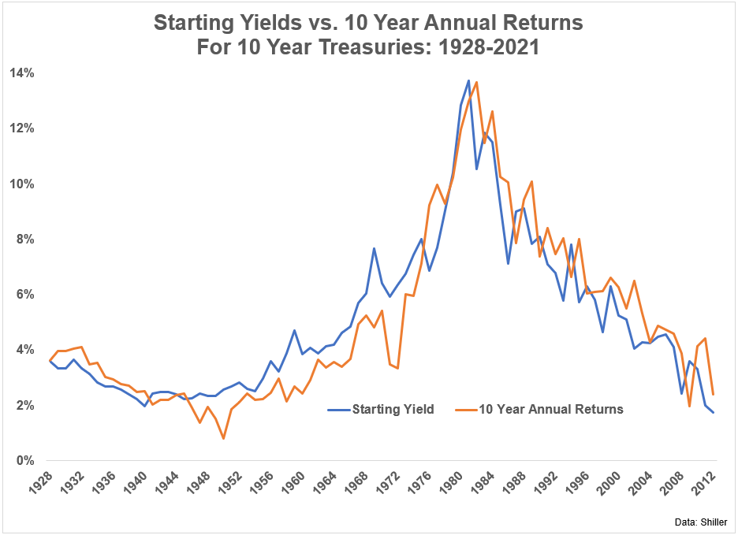

Bond timing in algorithmic trading is a sophisticated practice that aims to optimize the timing of bond transactions to achieve superior returns. Unlike the traditional buy-and-hold strategy, where investors purchase bonds and hold them until maturity to earn interest income and preserve capital, active bond timing involves short-term buying and selling decisions based on market conditions. This approach seeks to capitalize on price fluctuations caused by economic news, interest rate changes, or shifts in market sentiment.

The traditional buy-and-hold strategy is primarily focused on long-term gain through interest accumulation and holding a diversified portfolio of bonds to manage risk and ensure stable returns. However, it overlooks opportunities for profiting from interim price variations. In contrast, active bond timing leverages algorithmic trading tools to evaluate vast quantities of data and execute transactions at optimal times. This dynamic approach requires a thorough understanding of market trends and quick responsiveness to changing conditions.

Timing is crucial in bond trading because bond prices are sensitive to various factors, including interest rates, inflation expectations, and economic indicators. Accurately predicting these factors and executing timely trades can lead to significant profits. For instance, bond prices typically decrease when interest rates rise, and vice versa. Therefore, an active bond timing strategy can exploit these movements by buying bonds when prices are expected to rise and selling them when prices are expected to fall.

In summary, the essence of bond timing in algorithmic trading lies in its capacity to enhance returns by capturing price changes that traditional strategies might fail to exploit. By actively managing bond portfolios through algorithmic techniques, traders can realize gains that stem from short-term market inefficiencies and fluctuations, offering a compelling advantage over passive investment strategies.

## Table of Contents

## Understanding Bond Timing Strategies

Active fixed income management can be categorized into two primary strategies: traditional and quantitative. Traditional active management focuses on discretionary decision-making, where portfolio managers rely on their expertise and judgment to exploit inefficiencies in the bond market. This approach involves thorough research and analysis of macroeconomic indicators, issuer fundamentals, and market trends to time purchases and sales of fixed income securities.

Quantitative active management, on the other hand, utilizes algorithmic models and statistical methods to make trading decisions. These models can process vast amounts of data to identify patterns and forecast bond price movements. While both strategies aim to outperform the market, they differ in their approach to timing and execution.

The role of timing in buying and selling fixed income securities is crucial. Interest rates, economic indicators, and geopolitical events can significantly influence bond prices. Effective timing allows investors to capitalize on these fluctuations to gain an advantage over a simple buy-and-hold strategy. Timing the market accurately can enhance returns and manage risks, particularly in a market that can be affected by unexpected shocks.

Comparing [bond timing](/wiki/bond-timing) with stock market timing reveals distinct market dynamics. Bond markets are generally more sensitive to [interest rate](/wiki/interest-rate-trading-strategies) changes than stock markets. As bonds generate fixed interest payments, their prices inversely correlate with interest rate movements. In contrast, stock prices are driven by company performance, investor sentiment, and broader economic conditions. Thus, bond timing often requires greater emphasis on monitoring central bank policies and economic forecasts.

Furthermore, bond markets tend to have lower [volatility](/wiki/volatility-trading-strategies) compared to stock markets, offering a different risk-return profile for investors. Consequently, bond timing strategies might focus more on interest rate predictions, while stock market timing strategies may concentrate on [earning](/wiki/earning-announcement)s reports and [momentum](/wiki/momentum) indicators. Despite these differences, both bonds and stocks benefit from precise timing strategies to optimize returns in an ever-changing financial landscape.

## Factors Influencing Bond Prices

Understanding the [factor](/wiki/factor-investing)s that influence bond prices is crucial for traders and investors who engage in the timing of these securities. Bond prices are sensitive to various market dynamics and economic indicators, which can affect both their value and yield. Let's explore these factors in detail.

### Impact of Interest Rate Changes on Bond Price

Interest rates are a primary driver of bond prices and exhibit an inverse relationship with them. When interest rates rise, bond prices tend to fall, and vice versa. This relationship is articulated through the present value formula, where the bond's future cash flows are discounted at the prevailing market interest rate. If $C$ represents the coupon payment, $n$ the number of periods, and $r$ the discount rate, the price $P$ of the bond can be expressed as:

$$
P = \sum_{t=1}^{n} \frac{C}{(1 + r)^t}
$$

A higher $r$ (interest rate) diminishes the present value of these future cash flows, lowering the bond's price. Conversely, when rates decline, the present value of the bond's future cash flows becomes more valuable, thus increasing its price.

### Credit Risk and Its Influence on Bond Pricing

Credit risk refers to the potential that a bond issuer will fail to meet its financial obligations, such as making timely interest and principal payments. A bond's credit rating is a reflection of this risk; higher credit risk generally demands a higher yield to attract investors, which inversely lowers the bond's price.

When evaluating bonds, credit risk is assessed through credit ratings assigned by agencies like Moody's or Standard & Poor's. A downgrade in a bond’s credit rating often leads to a drop in its price, as the perceived risk influences the yield that investors demand. For example, a bond that transitions from investment-grade to junk status might see a significant price decline due to heightened risk perceptions.

### Economic Factors: GDP Growth, Political Stability, Fiscal Discipline, and Inflation

1. **GDP Growth:** Strong GDP growth can result in higher interest rates as central banks might aim to combat inflation. As previously discussed, higher rates typically lead to lower bond prices. Conversely, weak GDP growth could prompt rate cuts, boosting bond prices.

2. **Political Stability:** Political uncertainty can lead to increased risk premiums as investors seek a cushion against potential instability. This uncertainty often results in higher yields, adversely impacting bond prices. Political risk can be especially pronounced in emerging markets, where policy changes can be sudden and impactful.

3. **Fiscal Discipline:** A country's fiscal discipline, or its ability to manage its budget and debt levels, affects its sovereign bond yields. Poor fiscal management can lead to a loss of investor confidence, higher yields, and thus lower bond prices. For instance, excessive borrowing by a government may lead to concerns about its ability to repay its debts, causing bond prices to fall.

4. **Inflation:** Inflation erodes the purchasing power of a bond's future cash flows. When inflation is anticipated, investors demand higher yields to compensate for reduced buying power, which causes bond prices to drop. Central banks often adjust interest rates in response to inflation trends, thereby affecting bond prices further.

In summary, bond prices are influenced by a complex interplay of interest rates, credit risk, and economic conditions. Successful bond timing involves predicting these factors and anticipating how they influence market sentiment and the yield expectations of investors. Understanding these dynamics is essential for making informed trading decisions in the bond market.

## Popular Bond Timing Strategies

The Roll Down strategy is a popular bond timing approach intricately tied to the yield curve's shape. This strategy exploits the natural price appreciation of bonds as they approach maturity, particularly along a normal, upward-sloping yield curve. As bonds 'roll down' the yield curve, their yield decreases while their price increases, allowing investors to capture capital gains. The effectiveness of this strategy largely depends on the steepness of the yield curve; a steeper curve provides more opportunity for price gains from the roll-down effect.

Momentum strategies in bond timing rely on the continuation of existing price trends. Investors seek bonds whose prices have been rising, anticipating that momentum will drive prices even higher. These strategies are quantitative, relying on historical price data to forecast future movements. Carry strategies, on the other hand, focus on maximizing income return relative to risk, often seeking higher-yielding bonds to enhance returns over safer, lower-yield options.

Sector switching involves reallocating investments among different bond sectors—such as government, municipal, or corporate bonds—depending on expected returns. This strategy capitalizes on shifts in sector performance due to economic changes, creditworthiness, or interest rate movements.

Each of these strategies carries inherent risks largely dependent on interest rate cycles. For instance, the Roll Down strategy might falter if the yield curve flattens or inverts, limiting potential gains as bonds mature. Momentum strategies face the risk of trend reversals, which can result in significant losses if price movements suddenly shift. Carry strategies depend heavily on rate differentials; they might underperform during periods of narrowing spreads or when credit risks materialize unexpectedly.

Sector switching requires precise timing and thorough analysis of sector-related risks. Misjudging these factors can lead to suboptimal performance, especially if economic conditions shift unexpectedly or if sectors react differently to the broader economic or policy environment.

In summary, while these strategies offer paths to potentially enhance returns, their dependence on interest rate cycles and market conditions underscores the need for diligent analysis and adaptable management to mitigate associated risks.

## Economic Cycle-Based Bond Timing

Economic cycle inflection points are critical in guiding bond timing decisions due to their profound impact on interest rates and the overall market environment. These inflection points mark transitions between different phases of the economic cycle—expansion, peak, contraction, and trough—and play a significant role in determining the optimal timing for buying and selling bonds.

During these cycles, the momentum effect becomes a key factor where traders capitalize on trends in bond prices driven by economic indicators. The momentum effect is based on the principle that bonds performing well in the recent past may continue to perform well in the foreseeable future. This principle is particularly relevant near economic inflection points, where momentum can either indicate an impending shift in monetary policy or reinforce a prevailing trend.

Predicting shifts in monetary policy is another essential aspect of bond timing. As central banks adjust interest rates to manage economic growth and control inflation, bond prices react inversely to these changes in interest rates. Traders closely monitor signals such as changes in employment rates, GDP growth, and inflation reports to forecast central bank actions. For instance, when signals point towards economic contraction, bond traders might anticipate rate cuts and increase demand for bonds, leading to a price increase, and vice versa during economic expansion.

Successful spread-trading strategies often emerge during these economic cycle shifts. Spread trading involves taking positions on the difference (spread) between two related bond yields. A classic case study involves the steepening or flattening of the yield curve. During a contraction phase, a trader might engage in a steepening trade—buying long-term bonds and selling short-term bonds—anticipating that central banks will lower short-term rates more aggressively to spur economic growth. Conversely, during an expansion phase, the trader might implement a flattening trade.

For example, during the financial crisis of 2008, traders who successfully predicted the Federal Reserve's monetary easing policies were able to capitalize on the narrowing spread between 10-year and 2-year Treasury yields. By buying longer-duration bonds and selling shorter-duration ones, traders profited from the subsequent flattening of the yield curve as the Fed reduced interest rates to support economic recovery.

In summary, recognizing economic cycle inflection points and anticipating monetary policy changes are key to making informed bond timing decisions. Momentum effects provide clues to emerging trends, and spread-trading strategies offer profitable opportunities during these shifts. By understanding these dynamics, traders can enhance their bond trading strategies and achieve superior returns, even in volatile market conditions.

## Performance of Active Bond Management

Active bond management has gained prominence as a viable strategy in [algorithmic trading](/wiki/algorithmic-trading), often drawing comparisons with active equity strategies. The performance of active bond funds versus their passive counterparts provides a compelling case for why investors might consider active management in the fixed-income space.

Active bond funds typically involve strategies that seek to capitalize on the fluctuations in interest rates, credit spreads, and economic conditions. These funds are managed by portfolio managers who aim to outperform a benchmark index by adjusting the portfolio’s composition based on market forecasts. In contrast, passive bond funds aim to replicate the performance of a market index, maintaining a constant asset allocation strategy.

### Comparison of Active Bond Funds versus Active Equity Strategies

Active bond funds have shown resilience and adaptability, allowing managers to exploit interest rate movements and credit discrepancies. While both active equity and bond strategies aim to beat the market, the mechanism differs. Equity strategies often rely on stock selection and timing market cycles, whereas bond strategies might include interest rate anticipation, duration management, and credit risk assessment.

### Statistical Data on Performance

Empirical data suggests that active bond funds have at times outperformed their passive counterparts. For example, during periods of significant interest rate movements, active managers have the flexibility to adjust duration and sector allocation, thereby mitigating risks and capitalizing on opportunities. According to Morningstar, specific active bond funds have beaten their benchmarks by adjusting their exposure to different types of bonds based on interest rate forecasts.

Furthermore, a study by S&P Dow Jones Indices indicated that over a 10-year period, actively managed bond funds, particularly in the high-yield and corporate bond segments, exhibited a higher likelihood of surpassing their benchmarks compared to active equity funds. However, it is crucial to note that performance varies across different bond categories and time frames.

### Analysis of Superior Returns in Fixed-Income Management

The perceived superiority of fixed-income management stems from several factors:

1. **Interest Rate Sensitivity**: Bonds inherently respond more predictably to interest rate changes compared to equities. Active managers can take advantage of anticipated shifts by adjusting the portfolio's duration or by employing yield curve strategies.
   
2. **Credit Risk Management**: Active bond managers have the capability to assess and manage credit risk dynamically, which can lead to superior risk-adjusted returns compared to passive strategies that might be more exposed to default risks in a broad index.

3. **Economic Indicators**: Active managers often use economic indicators such as inflation data, GDP growth, and fiscal policies to anticipate market trends and adjust positions proactively, which is not feasible in passive management.

4. **Tactical Allocation**: The ability to switch between different bond sectors and credit qualities allows active managers to capitalize on changing economic conditions and market sentiments.

In conclusion, while the performance of active bond management varies, its potential for superior risk-adjusted returns, particularly during volatile interest rate environments, makes it an attractive option for investors. Active management allows for a dynamic response to market changes, offering the potential to not only meet but exceed the performance of passive strategies in the fixed-income domain.

## Conclusion

Bond timing strategies play a critical role in the sophisticated landscape of algorithmic trading. These strategies focus on optimizing the timing of buying and selling bonds to capture price changes effectively and enhance returns. By leveraging a range of methodologies such as roll down, momentum, [carry](/wiki/carry-trading), and sector switching, traders aim to anticipate and act on market dynamics and economic indicators, achieving potentially higher profits than through traditional buy-and-hold approaches.

Active bond management is often touted for its potential to outperform passive strategies. This is mainly because active managers can adapt swiftly to changing market conditions, leveraging their expertise to navigate interest rate fluctuations and credit risk developments more adeptly. By actively shifting allocations in response to the broader economic cycle, such managers strive to enhance the portfolio's performance compared to a static bond index. Empirical evidence frequently suggests that active bond funds can outperform passive counterparts, particularly in environments characterized by interest rate volatility and specific sector opportunities.

Looking ahead, the integration of technology and data analytics with bond timing strategies heralds a promising evolution in algorithmic trading. With the advent of [machine learning](/wiki/machine-learning) algorithms and real-time data analytics, the precision and predictive power of bond timing are bound to improve. This transformation could lead to even more nuanced and effective trading strategies, offering the potential for higher returns and improved risk mitigation.

However, the success of these strategies will largely depend on their ability to adapt to market changes and regulatory environments. As algorithmic trading becomes increasingly prevalent, the challenge will be to balance technological efficiency with strategic insights, ensuring that active bond management remains a competitive edge in the evolving financial landscape.

## References & Further Reading

[1]: Treynor, J. L. (1961). ["Toward a Theory of Market Value of Risky Assets"](https://jstor.org/stable/2329402) The Review of Economics and Statistics

[2]: Fama, E. F., & French, K. R. (1993). ["Common risk factors in the returns on stocks and bonds."](https://www.jstor.org/stable/2328887) Journal of Financial Economics

[3]: Litterman, R., & Scheinkman, J. (1991). ["Common Factors Affecting Bond Returns."](https://www.jstor.org/stable/4479408) The Journal of Fixed Income
