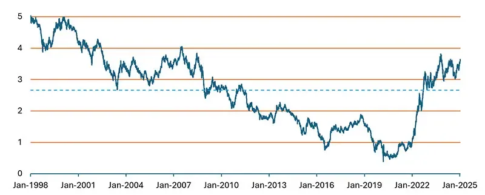

## Table of Contents

## What is bond timing?

Bond timing is a strategy where investors try to buy and sell bonds at the best times to make more money. They look at things like interest rates, the economy, and what's happening in the bond market. The goal is to buy bonds when prices are low and sell them when prices go up. This can be tricky because it's hard to predict exactly when these changes will happen.

Interest rates are really important for bond timing. When interest rates go up, bond prices usually go down. So, if someone thinks rates will rise, they might sell their bonds before the price drops. On the other hand, if they think rates will fall, they might buy bonds to sell them later at a higher price. It's a bit like trying to guess the weather – you can look at the signs, but you're never totally sure.

## Why is bond timing important for investors?

Bond timing is important for investors because it can help them make more money. By trying to buy bonds when prices are low and sell them when prices are high, investors can increase their returns. This strategy depends a lot on guessing when interest rates will change, which can be hard to do. But if an investor gets it right, they can earn more than if they just held onto their bonds without trying to time the market.

It's also important because it can help investors avoid losing money. If an investor thinks interest rates are going to go up, they might sell their bonds before the prices drop. This way, they can protect their investment from losing value. Bond timing isn't perfect and it's risky, but for those who are good at predicting market changes, it can be a useful tool to manage their investments better.

## How does bond timing differ from stock timing?

Bond timing and stock timing are both strategies where investors try to buy and sell at the best times to make more money. But they are different because they deal with different kinds of investments. Bond timing focuses on bonds, which are like loans to governments or companies. The value of bonds goes up and down mainly because of changes in interest rates. So, people who use bond timing try to guess when interest rates will change to buy or sell bonds at the right time.

Stock timing, on the other hand, is about buying and selling stocks, which are pieces of ownership in companies. The price of stocks can change because of many things, like how well the company is doing, news about the company, or what's happening in the economy. People who use stock timing look at these factors to decide when to buy or sell stocks. They might also look at things like stock market trends and patterns.

Both bond timing and stock timing are hard to do because it's tough to predict the future. But they are important because they can help investors make more money or avoid losing money. Bond timing is more about interest rates, while stock timing looks at a wider range of things that can affect stock prices.

## What are the key factors that influence bond timing?

The main thing that affects bond timing is interest rates. When interest rates go up, the price of bonds usually goes down. This is because new bonds will be issued with higher interest rates, making older bonds with lower rates less attractive. So, if someone thinks interest rates will rise, they might sell their bonds before the price drops. On the other hand, if they think interest rates will fall, they might buy bonds because the prices will likely go up. It's all about trying to guess what the interest rates will do next.

Another factor that influences bond timing is the overall economy. If the economy is doing well, interest rates might go up because the government might want to slow things down a bit. But if the economy is struggling, interest rates might be lowered to help it grow. So, people who use bond timing also look at economic reports and forecasts to help them decide when to buy or sell. It's a bit like trying to predict the weather – you look at all the signs and make your best guess.

Inflation is also important for bond timing. When inflation goes up, it can make the value of the money you get from bonds worth less. So, if someone thinks inflation will rise, they might be less interested in buying bonds. But if they think inflation will stay low or go down, bonds might look like a good investment. All these things – interest rates, the economy, and inflation – are what people think about when they're trying to time the bond market.

## Can you explain the concept of interest rate risk in bond timing?

Interest rate risk is a big deal when it comes to bond timing. It's all about how changes in interest rates can affect the price of bonds. When interest rates go up, the price of bonds usually goes down. This happens because new bonds will be issued with higher interest rates, making the older bonds with lower rates less attractive to investors. So, if someone thinks interest rates are going to rise, they might want to sell their bonds before the price drops. It's like trying to guess when it's going to rain so you can close your umbrella in time.

On the flip side, when interest rates go down, bond prices usually go up. This is because the older bonds with higher interest rates become more valuable. So, if someone thinks interest rates are going to fall, they might want to buy bonds now to sell them later at a higher price. The tricky part is that no one can predict interest rates perfectly. It's a bit like trying to guess the weather – you can look at the signs, but you're never totally sure. So, interest rate risk is a key thing that people think about when they're trying to time the bond market.

## What are the common strategies used in bond timing?

One common strategy in bond timing is called the "interest rate anticipation" strategy. This means investors try to guess when interest rates will change. If they think rates will go up, they might sell their bonds before the price drops. If they think rates will go down, they might buy bonds to sell them later at a higher price. It's like trying to predict the weather – you look at the signs and make your best guess.

Another strategy is called "riding the yield curve." This involves buying bonds with different times until they mature. The idea is to buy longer-term bonds when their yields are high and then sell them before they mature, hopefully at a higher price. It's a bit like surfing – you try to catch the wave at the right time and ride it to the shore.

Lastly, some investors use a "sector rotation" strategy. This means they move their money between different types of bonds, like government bonds or corporate bonds, based on what they think will do well. If they think the economy will grow, they might invest more in corporate bonds. If they think it will slow down, they might put more money into government bonds. It's like changing lanes on the highway to find the fastest route.

## How do economic cycles affect bond timing decisions?

Economic cycles play a big role in bond timing decisions. During a boom, when the economy is doing well, interest rates might go up because the government might want to slow things down a bit. This means bond prices could go down. So, if someone thinks the economy is about to enter a boom, they might sell their bonds before the prices drop. It's like trying to guess when the sun will come out so you can put away your umbrella in time.

On the other hand, during a recession, when the economy is struggling, interest rates might be lowered to help it grow. This can make bond prices go up. So, if someone thinks a recession is coming, they might buy bonds now to sell them later at a higher price. It's all about trying to predict what the economy will do next and making the right move at the right time. It's a bit like trying to guess the weather – you look at all the signs and make your best guess.

## What tools and indicators should be used for effective bond timing?

For effective bond timing, investors should use tools like economic calendars and financial news websites. These help them keep up with important events and reports that can affect interest rates and the economy. For example, if a big report shows that inflation is going up, it might mean interest rates will go up too. This can help investors decide if it's a good time to buy or sell bonds. Another useful tool is a bond yield calculator, which helps investors figure out how much they might earn from a bond and how changes in interest rates could affect that.

Indicators like the yield curve are also important for bond timing. The yield curve shows the difference between short-term and long-term interest rates. If the yield curve is steep, it might mean the economy is growing and interest rates could go up. If it's flat or inverted, it might mean a recession is coming and interest rates could go down. Watching the yield curve can help investors guess what might happen next with bond prices. Other indicators, like the Consumer Price Index (CPI) for inflation and employment reports, can also give clues about where the economy is headed and help with bond timing decisions.

## How can bond duration be used as a tool in bond timing?

Bond duration is a useful tool for bond timing because it tells you how sensitive a bond's price is to changes in interest rates. Duration measures how long it takes for the bond's cash flows (like interest payments and the money you get back when the bond matures) to pay back the bond's price. If a bond has a longer duration, its price will change more when interest rates go up or down. So, if you think interest rates are going to rise, you might want to buy bonds with shorter durations because their prices won't drop as much. If you think rates will fall, you might choose bonds with longer durations to get a bigger price increase.

Using bond duration in bond timing helps investors make smarter choices about when to buy or sell bonds. For example, if you expect interest rates to go up soon, you might sell your long-duration bonds and buy short-duration ones to protect your investment. On the other hand, if you think rates will go down, you might buy long-duration bonds to take advantage of the bigger price jump. By understanding and using bond duration, investors can better manage the risks and rewards of bond timing.

## What are the potential pitfalls and risks associated with bond timing?

Bond timing can be tricky and risky. One big problem is that it's really hard to guess when interest rates will change. If you get it wrong, you might sell your bonds too early or buy them too late, which can make you lose money instead of making more. It's like trying to predict the weather – you can look at the signs, but you're never totally sure. Another risk is that bond timing can lead to a lot of buying and selling, which means you might have to pay more in fees and taxes. This can eat into any extra money you might make from timing the market right.

Also, focusing too much on bond timing might make you miss out on other good investment chances. If you're always trying to guess the next move in interest rates, you might not pay enough attention to other parts of your investment plan. This can be a problem because a good investment plan usually needs a mix of different kinds of investments. Plus, bond timing can make you feel stressed and worried because you're always trying to make the right move at the right time. It's important to think about these risks and maybe talk to a financial advisor to see if bond timing is a good fit for you.

## How do professional bond traders approach bond timing?

Professional bond traders use a lot of tools and information to make smart choices about bond timing. They look at things like economic reports, interest rate forecasts, and the yield curve to guess when interest rates might change. They also use computer models and data analysis to help them make decisions. Bond traders often have a lot of experience and know how to read the signs in the market. They might use strategies like interest rate anticipation, where they try to buy or sell bonds before interest rates change, or they might use sector rotation, moving their money between different types of bonds based on what they think will do well.

But even with all their tools and experience, bond timing is still risky for professional traders. They know that it's hard to predict interest rates perfectly, so they have to be ready to change their plans if things don't go as expected. They also have to think about the costs of buying and selling bonds a lot, like fees and taxes, which can eat into their profits. Professional bond traders often work as part of a team, sharing ideas and insights to make better decisions. They try to balance the potential rewards of bond timing with the risks, always looking for ways to improve their strategies.

## What advanced techniques can be used to optimize bond timing strategies?

To optimize bond timing strategies, professional traders often use advanced techniques like quantitative analysis. This means they use math and computer models to look at a lot of data and find patterns that can help them guess when interest rates might change. They might use something called "technical analysis," which looks at past bond prices and trading volumes to predict future price movements. Another technique is "fundamental analysis," where they study economic reports, inflation rates, and other big-picture stuff to understand what might happen to interest rates. By combining these methods, traders can make more informed decisions about when to buy or sell bonds.

Another advanced technique is using "duration management." This means adjusting the average duration of their bond portfolio to take advantage of expected changes in interest rates. If they think rates will go up, they might shorten the duration of their bonds to reduce the impact on their portfolio's value. If they think rates will go down, they might lengthen the duration to get a bigger price increase. Traders also use "options and derivatives" to hedge their bets. This means they can buy or sell financial instruments that will help protect their investments if their bond timing guesses are wrong. By using these advanced techniques, professional traders can fine-tune their bond timing strategies to try to make more money while managing the risks.

## What are the factors influencing bond prices?

Understanding the [factor](/wiki/factor-investing)s that influence bond prices is crucial for traders and investors who engage in the timing of these securities. Bond prices are sensitive to various market dynamics and economic indicators, which can affect both their value and yield. Let's explore these factors in detail.

### Impact of Interest Rate Changes on Bond Price

Interest rates are a primary driver of bond prices and exhibit an inverse relationship with them. When interest rates rise, bond prices tend to fall, and vice versa. This relationship is articulated through the present value formula, where the bond's future cash flows are discounted at the prevailing market interest rate. If $C$ represents the coupon payment, $n$ the number of periods, and $r$ the discount rate, the price $P$ of the bond can be expressed as:

$$
P = \sum_{t=1}^{n} \frac{C}{(1 + r)^t}
$$

A higher $r$ (interest rate) diminishes the present value of these future cash flows, lowering the bond's price. Conversely, when rates decline, the present value of the bond's future cash flows becomes more valuable, thus increasing its price.

### Credit Risk and Its Influence on Bond Pricing

Credit risk refers to the potential that a bond issuer will fail to meet its financial obligations, such as making timely interest and principal payments. A bond's credit rating is a reflection of this risk; higher credit risk generally demands a higher yield to attract investors, which inversely lowers the bond's price.

When evaluating bonds, credit risk is assessed through credit ratings assigned by agencies like Moody's or Standard & Poor's. A downgrade in a bond’s credit rating often leads to a drop in its price, as the perceived risk influences the yield that investors demand. For example, a bond that transitions from investment-grade to junk status might see a significant price decline due to heightened risk perceptions.

### Economic Factors: GDP Growth, Political Stability, Fiscal Discipline, and Inflation

1. **GDP Growth:** Strong GDP growth can result in higher interest rates as central banks might aim to combat inflation. As previously discussed, higher rates typically lead to lower bond prices. Conversely, weak GDP growth could prompt rate cuts, boosting bond prices.

2. **Political Stability:** Political uncertainty can lead to increased risk premiums as investors seek a cushion against potential instability. This uncertainty often results in higher yields, adversely impacting bond prices. Political risk can be especially pronounced in emerging markets, where policy changes can be sudden and impactful.

3. **Fiscal Discipline:** A country's fiscal discipline, or its ability to manage its budget and debt levels, affects its sovereign bond yields. Poor fiscal management can lead to a loss of investor confidence, higher yields, and thus lower bond prices. For instance, excessive borrowing by a government may lead to concerns about its ability to repay its debts, causing bond prices to fall.

4. **Inflation:** Inflation erodes the purchasing power of a bond's future cash flows. When inflation is anticipated, investors demand higher yields to compensate for reduced buying power, which causes bond prices to drop. Central banks often adjust interest rates in response to inflation trends, thereby affecting bond prices further.

In summary, bond prices are influenced by a complex interplay of interest rates, credit risk, and economic conditions. Successful bond timing involves predicting these factors and anticipating how they influence market sentiment and the yield expectations of investors. Understanding these dynamics is essential for making informed trading decisions in the bond market.

## References & Further Reading

[1]: Treynor, J. L. (1961). ["Toward a Theory of Market Value of Risky Assets"](https://jstor.org/stable/2329402) The Review of Economics and Statistics

[2]: Fama, E. F., & French, K. R. (1993). ["Common risk factors in the returns on stocks and bonds."](https://www.jstor.org/stable/2328887) Journal of Financial Economics

[3]: Litterman, R., & Scheinkman, J. (1991). ["Common Factors Affecting Bond Returns."](https://www.jstor.org/stable/4479408) The Journal of Fixed Income
