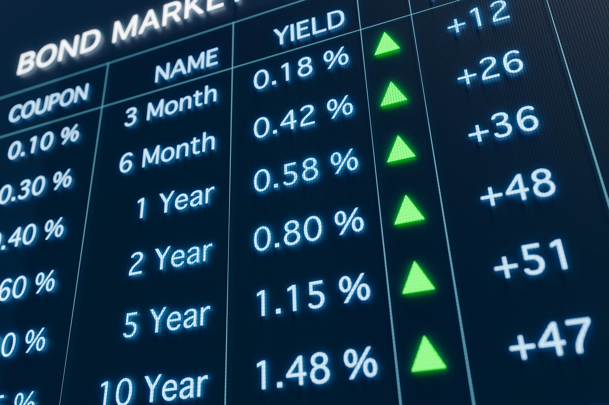

The landscape of bond trading has undergone a remarkable transformation due to the integration of technology and algorithmic platforms, introducing fresh opportunities and challenges to financial markets. In recent years, these technological advancements have significantly altered how bond trading is conducted, impacting both institutional and retail investors. The adoption of algorithmic trading has been central to this transformation, providing increased speed and efficiency while enhancing market accessibility.

The significance of algorithmic trading cannot be overstated. These sophisticated systems employ complex algorithms to automate trading activities, which enhances the precision and execution of trades. By leveraging algorithmic platforms, investors and traders can capitalize on opportunities in real-time, thereby optimizing their trading strategies and improving market participation.

As we explore this evolving landscape, it is critical to understand the various dimensions through which technology and algorithmic strategies are reshaping bond markets. These include market dynamics, technological innovation, and the regulatory environment that governs trading practices. The advent of algorithmic trading has also raised pertinent questions about the effects on market stability, competition, and investor behavior.

This exploration provides insights into how algorithmic platforms facilitate enhanced trading mechanisms and influence market conditions. By examining these factors, we can better appreciate the profound changes that technology has introduced and anticipate future trends that could further shape the industry. As algorithmic trading continues to evolve, it remains essential to balance the benefits with the inherent risks to maintain robust and fair markets.

## Table of Contents

## The Evolution of Bond Markets

Bond markets have undergone significant evolution, transitioning from opaque, broker-driven environments to transparent, technology-driven ecosystems. This transformation has been driven by regulatory changes, technological advancements, and shifting investor behavior.

Historically, bond trading was characterized by a lack of transparency, where trades were conducted over-the-counter (OTC) and heavily reliant on broker-dealers. This often resulted in limited price visibility and sluggish trade executions. However, the landscape began to change with the implementation of sweeping regulatory reforms post-2008 financial crisis, such as the Dodd-Frank Act in the United States and the Markets in Financial Instruments Directive II (MiFID II) in the European Union. These regulations aimed to enhance transparency, improve market integrity, and protect investors by imposing stricter reporting and conduct requirements on market participants.

Technological advancements have further catalyzed the evolution of bond markets. The advent of electronic trading platforms has facilitated more efficient and transparent trading. These platforms enable investors to access a broader array of bond issues and counterparties, thus enhancing [liquidity](/wiki/liquidity-risk-premium) and enabling more precise price discovery. Through [algorithmic trading](/wiki/algorithmic-trading), trades can be executed with speed and accuracy, further contributing to market efficiency.

The development and proliferation of exchange-traded funds (ETFs) have also played a crucial role in transforming bond markets. ETFs offer a diversified portfolio of bonds that can be traded on exchanges, providing investors with liquidity and exposure to various bond indices with relatively low transaction costs. The increased popularity of bond ETFs has attracted a wider range of investors, from institutional to retail, thereby broadening the investor base and driving market growth.

Investor behavior has evolved alongside these changes. With increased market transparency and access, investors are more empowered to employ sophisticated strategies for risk management and yield optimization. The enhanced ability to access real-time data and analytics tools has contributed to more informed decision-making.

These changes underscore a shift towards more dynamic and efficient bond trading environments. Understanding these transformations is crucial for comprehending the current dynamics of bond trading and for formulating effective investor strategies in today's markets. The modern bond market is a testament to the enduring impact of technology and regulation in creating more transparent, liquid, and accessible financial ecosystems.

## Algorithmic Trading in Bond Markets

Algorithmic trading in bond markets utilizes sophisticated software to execute trades with greater efficiency and precision, significantly transforming the landscape of bond trading. These advanced systems enable the execution of trades at optimal prices by analyzing vast datasets and executing orders within microseconds, effectively minimizing human intervention and errors.

Investment banks and fintech companies have been at the forefront of developing platforms that employ algorithmic trading strategies to serve both institutional and retail markets. These platforms are designed to handle large volumes of data, providing users with the ability to swiftly react to market changes and capitalize on trading opportunities. The platforms leverage complex algorithms that integrate data analysis, predictive modeling, and market trend assessment to facilitate strategic decision-making.

Key players in the domain of algorithmic bond trading include major banks, broker-dealers, and technology service providers. Institutions like JPMorgan Chase, Goldman Sachs, and Barclays have invested heavily in algorithmic trading technologies. These organizations offer platforms that cater to their own trading desks as well as clients. Additionally, fintech companies like Tradeweb and MarketAxess provide sophisticated electronic trading platforms that accommodate algorithmic trading, further expanding access to these technologies across the market.

Central to modern bond trading strategies is the adoption of high-frequency trading ([HFT](/wiki/high-frequency-trading-strategies)), automated market scanning, and risk management optimizations. High-frequency trading systems are capable of executing thousands of trades in fractions of a second, capitalizing on minute price discrepancies that may occur across different marketplaces. Automated market scanning tools continuously monitor the market landscape to identify potential trading opportunities based on predefined criteria, while real-time risk management tools actively manage exposure and reallocate assets to maintain portfolio objectives.

These technological advancements have democratized market access, allowing a broader array of market participants to engage actively with bond markets. By lowering the barriers to entry, algorithmic trading has enabled smaller firms and individual traders to compete alongside larger institutions, promoting increased diversity and competition within the market. This environment encourages innovation and fosters a more dynamic trading ecosystem, benefiting the market as a whole with enhanced liquidity and transparency.

## Benefits of Algorithmic Trading

Algorithmic trading in bond markets offers several significant benefits, enhancing the efficiency, cost-effectiveness, liquidity, and overall quality of the market. One primary advantage is the increased efficiency achieved through the automation of trading processes. By utilizing complex software, algorithmic trading facilitates the execution of trades with precision and speed, reducing the dependency on manual trading and minimizing human errors.

Cost reduction is another crucial benefit of algorithmic trading. Automated systems reduce the need for large trading teams and decrease transaction costs through optimized trade execution. This efficiency in cost management allows traders to allocate resources more effectively and strengthen their bottom line.

Enhanced liquidity is a vital outcome of algorithmic trading, where the presence of high-frequency trading and algorithmic strategies increases the availability of buy and sell orders. This heightened liquidity leads to tighter spreads and more competitive pricing. As a result, market participants benefit from improved price discovery mechanisms and more transparent market conditions, facilitating informed investment decisions.

The customization of trading strategies enabled by algorithmic platforms provides traders with the flexibility to tailor their approaches to specific market conditions and objectives. By programming algorithmic systems to react to certain market signals, traders can execute pre-defined strategies at optimized times, maximizing potential returns.

Moreover, the ability to backtest trading strategies using historical data is a significant advantage of algorithmic trading. This capability allows traders to evaluate the effectiveness of their strategies before deploying them in real market conditions. Through rigorous [backtesting](/wiki/backtesting), traders can identify potential flaws and refine their algorithms, increasing the likelihood of success in live trading environments.

Collectively, these benefits contribute to a more flexible and robust trading environment, where market participants can operate with greater confidence and efficiency. By leveraging algorithmic trading tools, participants can enhance their trading capabilities and adapt to the dynamic nature of bond markets.

## Challenges and Risks

Algorithmic trading, while offering numerous advantages, presents several challenges and risks that must be managed to ensure stable and transparent bond markets. One primary concern is liquidity risk. Algorithmic trading can exacerbate liquidity issues, especially during times of market stress, by withdrawing liquidity rapidly or amplifying market movements due to algorithmic feedback loops. This can result in significant price [volatility](/wiki/volatility-trading-strategies) and disrupt overall market stability. Operational risks are also notable, as they encompass potential technological failures and errors in algorithmic design, which can lead to unintended trading activities or financial losses.

Regulatory compliance represents another challenge within algorithmic trading. The regulatory landscape is continually evolving as authorities seek to safeguard market integrity and protect investors. Ensuring compliance requires ongoing adaptation to new regulatory requirements, such as those imposed by frameworks like the Markets in Financial Instruments Directive II (MiFID II) in the European Union. These regulations necessitate detailed algorithm testing, transparent reporting, and robust risk management practices, placing a substantial burden on algorithmic traders to remain vigilant.

Furthermore, the reliance on technology introduces cybersecurity concerns, as trading platforms and algorithms become potential targets for cyberattacks. Additionally, high-frequency trading during periods of market volatility can increase systemic risks, possibly resulting in cascading failures across interconnected systems.

Market manipulation is another risk associated with algorithmic trading. Algorithms can be programmed to engage in manipulative practices, such as spoofing or layering, which undermine market fairness and transparency. Detecting and mitigating these activities is crucial for maintaining market integrity.

Addressing these challenges involves a multifaceted approach. Firms must invest in robust risk management systems, conduct thorough algorithmic testing, and ensure compliance with regulatory standards. Additionally, ongoing monitoring and the implementation of fail-safes can help mitigate potential risks associated with algorithmic trading. By addressing these concerns, market participants can contribute to the establishment of a more stable and transparent trading environment.

## Regulatory Landscape

The surge in algorithmic trading has brought about a pressing need for a comprehensive regulatory framework to safeguard market integrity and protect investors. Algorithmic trading systems, which employ complex algorithms to execute trades at high speeds, can significantly influence market dynamics. Consequently, regulations like the Markets in Financial Instruments Directive II (MiFID II) have been implemented to enhance transparency and ensure that algorithmic trading practices do not lead to market abuse.

MiFID II, effective in the European Union since 2018, mandates that trading activities, particularly those involving algorithms, adhere to strict transparency and reporting standards. Market participants are required to disclose algorithmic trading strategies to regulatory bodies, ensuring that these strategies are regularly tested to avoid any manipulative market behavior. This transparency is crucial to maintain investor trust and market stability.

Regulatory bodies across different jurisdictions require algorithmic traders to maintain detailed records of their trading activities and adopt robust risk management systems. These disclosures are intended to monitor and control risks associated with algorithmic trading, such as sudden price fluctuations or unintended market disruptions caused by faulty algorithms. For instance, the U.S. Securities and Exchange Commission (SEC) has also set guidelines for algorithmic trading, focusing on maintaining market orderliness and preventing systemic risks.

Continuous monitoring and compliance with evolving regulatory requirements are essential for algorithmic traders. Financial markets are dynamic, with regulations frequently updated to address new risks and challenges posed by technological advancements. Traders are required to invest in compliance systems that can adapt to these changes, ensuring that they meet all regulatory expectations without hampering innovation.

Enhanced regulation aims to mitigate systemic risks inherent in algorithmic trading while simultaneously fostering technological innovation within financial markets. This dual objective is vital, as unchecked algorithmic trading could lead to significant market disruptions, yet overly stringent regulations could stifle innovation. Achieving this balance is crucial for developing a resilient financial ecosystem that benefits from technological advancements while safeguarding against potential abuses.

## Future Trends in Bond Trading Platforms

The future of bond trading platforms is set to be significantly influenced by technological advancements and evolving market dynamics. A key trend is the increasing integration of [artificial intelligence](/wiki/ai-artificial-intelligence) (AI) and [machine learning](/wiki/machine-learning) technologies. These technologies are expected to enhance the analytical capabilities of trading platforms, enabling more precise predictions and efficient execution of trades. Machine learning algorithms can analyze vast amounts of financial data to identify patterns and trends that might not be apparent to human traders, thereby optimizing trading strategies and improving decision-making processes.

Blockchain technology is another transformative trend expected to reshape bond trading platforms. By providing a secure, decentralized ledger, blockchain can enhance transparency and security in trading activities. It facilitates faster settlement times and reduces the risk of fraud, which can ultimately lead to increased trust and efficiency in bond markets. Platforms leveraging blockchain may offer features such as smart contracts, which can automate and enforce the terms of bond deals without the need for intermediaries.

The field of Regulatory Technology (RegTech) is poised to play a critical role in streamlining compliance processes within bond trading platforms. RegTech solutions can automate monitoring and reporting requirements, ensuring that trading activities adhere to evolving regulatory standards. This not only reduces compliance costs but also minimizes the risk of non-compliance-related penalties, thereby fostering a more secure trading environment.

Environmental, Social, and Governance ([ESG](/wiki/esg-investing)) criteria are becoming increasingly important in investment decisions, and their integration into bond trading platforms represents a significant trend. Investors are progressively seeking opportunities that align with their values, and platforms that incorporate ESG analytics can provide detailed insights into the sustainability and ethical implications of bond investments. This trend is likely to influence the development of new investment products and strategies centered around ESG considerations.

Moreover, advancements in mobile technology and cross-platform interoperability continue to enhance the flexibility and efficiency of bond trading. Mobile trading applications empower traders to monitor and execute trades from anywhere, offering convenience and real-time market access. Cross-platform interoperability ensures seamless integration and data sharing between different trading systems, which can lead to more cohesive and efficient trading operations.

Collectively, these trends indicate a vibrant and evolving environment for bond trading platforms. The integration of cutting-edge technologies promises to drive growth and stability in bond markets by enhancing the capabilities of trading platforms and aligning them more closely with the needs of modern investors. As these technologies mature, bond markets are expected to experience increased innovation and competition, ultimately benefiting all market participants.

## Conclusion

Algorithmic trading has significantly transformed bond markets by introducing new opportunities and challenges. The deployment of advanced technologies has substantially improved the speed, efficiency, and accessibility of bond trading platforms. These advancements enable quicker trade executions and provide investors with more accurate pricing and greater liquidity. As these platforms continue to evolve, participants in the bond market must strategically adapt to maximize benefits while navigating associated risks. 

To maintain fair and efficient markets as algorithmic trading becomes more prevalent, ongoing innovation and strong regulatory oversight are crucial. Regulators will need to address the complexities that arise with increased technological integration, ensuring that the potential for market abuse and systemic risks is minimized. In doing so, they can help preserve market integrity and investor confidence.

Looking ahead, the future of bond trading is poised for further technological integration. Innovations in artificial intelligence, machine learning, and blockchain are expected to play pivotal roles in enhancing platform capabilities. These technologies will likely facilitate more sophisticated trading strategies and improve regulatory compliance processes. As these trends unfold, bond trading platforms are set to become more advanced, offering a promising future for a dynamic and resilient bond market landscape.

## References & Further Reading

[1]: Aldridge, I. (2013). ["High-Frequency Trading: A Practical Guide to Algorithmic Strategies and Trading Systems."](https://books.google.com/books/about/High_Frequency_Trading.html?id=6l0DDQAAQBAJ) Wiley.

[2]: Lo, A. W., & MacKinlay, A. C. (1999). ["A Non-Random Walk Down Wall Street."](https://www.jstor.org/stable/j.ctt7tccx) Princeton University Press.

[3]: Harris, L. (2003). ["Trading and Exchanges: Market Microstructure for Practitioners."](https://books.google.com/books/about/Trading_and_Exchanges.html?id=Rd9hDRR1Yx4C) Oxford University Press.

[4]: Derman, E. (2004). ["My Life as a Quant: Reflections on Physics and Finance."](https://emanuelderman.com/books/my-life-as-a-quant/) Wiley.

[5]: Jamieson, S., & Kirk, S. (2016). ["Algorithmic Trading and DMA: An Introduction to Direct Access Trading Strategies."](https://www.goodreads.com/book/show/7346602-algorithmic-trading-and-dma) 4Myeloma Press.

[6]: Narang, R. K. (2013). ["Inside the Black Box: A Simple Guide to Quantitative and High-Frequency Trading."](https://www.amazon.com/Inside-Black-Box-Quantitative-Frequency/dp/1118362411) Wiley.

[7]: Chaboud, A., Chiquoine, B., Hjalmarsson, E., & Vega, C. (2009). ["Rise of the Machines: Algorithmic Trading in the Foreign Exchange Market."](https://www.federalreserve.gov/pubs/ifdp/2009/980/ifdp980.pdf) Journal of Finance.

[8]: Lepone, A. (2010). ["The Impact of Algorithmic Trading in a Simulated Asset Management Environment."](https://www.mdpi.com/1911-8074/12/2/68) The European Journal of Finance.