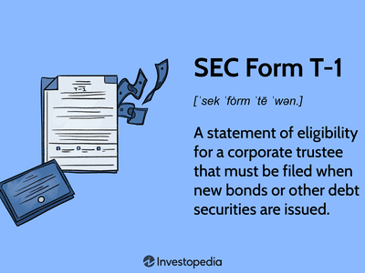

Bond trustees play a pivotal role in the financial market, serving as intermediaries who ensure that the interests of both investors and issuers are safeguarded. These specialized entities, typically banks or trust companies, are entrusted with overseeing the administration of bond agreements, known as indentures. The responsibilities of bond trustees are multifaceted and crucial for the smooth operation of the bond market.

For investors, bond trustees provide a layer of security by guaranteeing that issuers adhere to the terms outlined in the bond indenture. This includes ensuring that interest payments are made on schedule and that the principal is returned upon maturity. In case of an issuer default, trustees have the authority to take necessary actions to protect the bondholders' interests, acting as a vital advocate in negotiating resolutions or initiating legal procedures.



Issuers, on the other hand, rely on bond trustees to manage the logistics of bond administration. Trustees handle the registration, transfer, and payment of bonds, maintaining transparency and trust in the process. Furthermore, they ensure that issuers comply with the myriad of regulations and covenants stipulated in the bond agreements, thereby maintaining the integrity of the issuance.

Bond trustees serve as mediators between issuers and bondholders, facilitating effective communication and resolving disputes when they arise. This intermediary role is essential for the efficient functioning of the bond market, mitigating risks associated with miscommunication or non-compliance with bond terms.

As financial markets evolve with the advent of technology, the role of bond trustees intersects with emerging concepts like algorithmic trading. This intersection promises to enhance the management of bond portfolios, optimizing risk management and execution efficiency. Thus, understanding the comprehensive roles and responsibilities of bond trustees not only elucidates their significance in maintaining market stability but also highlights their evolving function in a technologically advancing financial landscape.

## Table of Contents

## What is a Bond Trustee?

A bond trustee is a financial institution endowed with trust powers, often a bank or trust company, entrusted with the responsibility of representing bondholders' interests. The trustee acts as a fiduciary, ensuring that the terms outlined in a bond indenture are strictly adhered to throughout the life of the bond issue. The core fiduciary duty of a bond trustee involves overseeing the issuance process, monitoring the issuer’s compliance with contractual obligations, and ensuring that bondholders receive interest payments and principal repayments as scheduled.

The bond indenture, essentially a contract between the bond issuer and bondholders, specifies the obligations of the issuer and the rights of the bondholders. It delineates critical information such as the coupon rate, maturity date, and covenants that the issuer must comply with. The bond trustee plays an instrumental role in enforcing these terms, thereby sustaining the contractual framework that underpins the bond issuance. This enforcement can be particularly crucial when an issuer experiences financial distress or defaults, protecting the bondholders by initiating necessary legal actions or negotiations to address the default.

Moreover, the bond trustee is charged with the administration of scheduled bond payments, ensuring that bondholders receive interest payments periodically and the return of the bond’s principal upon maturity. This responsibility involves managing funds transfers, maintaining accurate records, and communicating payment schedules to bondholders. In the event of an issuer default, the bond trustee's role becomes paramount as they act on behalf of the bondholders to safeguard their interests, which may involve restructuring the terms of the bond, managing the liquidation of assets, or taking legal action against the issuer.

Overall, the existence of a bond trustee provides an essential layer of oversight and protection for bondholders, enabling them to invest with greater confidence. The bond trustee's impartial and informed oversight is critical for the smooth functioning and credibility of the bond market.

## Roles and Responsibilities of a Bond Trustee

A bond trustee is entrusted with a substantial set of responsibilities crucial to the smooth operation and integrity of the bond market. The primary duties of a bond trustee include the registration, transfer, and payment of bonds. By overseeing these processes, trustees play a vital role in the functioning of bond transactions. They ensure that bonds are correctly registered in the names of holders, facilitate the transfer of bond ownership, and handle the disbursement of interest and principal payments to investors as scheduled.

Another core responsibility of a bond trustee is the management of separate accounts for handling bond-related transactions. Trustees must open and maintain distinct accounts designated for different bond issues, ensuring that funds associated with these bonds are segregated from other assets. This strategy not only aids in precise accounting but also ensures transparency and security of bondholders' funds. Moreover, trustees are responsible for providing monthly statements to bondholders, detailing the transactions that have occurred within the specific period. This regular reporting builds trust and informs bondholders about the status and performance of their investments.

Monitoring compliance with bond documents is a crucial duty of bond trustees. This involves ensuring that the issuer adheres to the terms and conditions outlined in the bond indenture—a formal contract between the bond issuer and the bondholders. Trustees must vigilantly oversee the issuer's obligation to meet specific financial covenants and other terms, serving as a safeguard against violations. In instances where an issuer deviates from the specified terms, the trustee acts on behalf of the bondholders to address and rectify the breach. This might involve negotiating remedial actions or, in more severe cases, initiating legal proceedings to protect the interests of the bondholders.

In performing these roles, bond trustees serve as impartial intermediaries between bond issuers and investors, ensuring that the integrity and commitments outlined within the bond agreements are maintained. As such, their role is indispensable in upholding the confidence of market participants and ensuring the effective operation of the bond market.

## The Process of Appointing a Bond Trustee and Their Qualifications

Appointing a bond trustee is a critical process in the issuance of bonds, as it ensures the proper management and protection of bondholder interests throughout the lifecycle of the bond. The process typically begins with the issuer selecting a trustee, who is usually a financial institution with robust trust powers, such as a bank or a trust company. This selection process emphasizes the importance of the trustee's experience and reputation, as these factors are crucial for maintaining investor confidence and ensuring effective oversight.

### Qualifications Needed for Trustees

To qualify as a bond trustee, a financial institution must possess specific attributes and credentials. Experience in the financial industry is vital, as it ensures the trustee has a deep understanding of the market dynamics and the complexities involved in managing bonds. Furthermore, the trustee is required to hold certain licenses that authorize them to conduct trust operations. These licenses are typically governed by national regulatory authorities, ensuring that the trustee is compliant with legal and financial standards.

In addition to licenses and industry experience, a reputable track record is essential. Past performance, reliability, and a history of safeguarding bondholder interests can heavily influence the selection process. An institution with a positive reputation is likely to be more trustworthy in the eyes of both issuers and investors.

### Options for Selecting a Trustee

Issuers have several options when selecting a bond trustee. One option is to engage an independent trustee. Independent trustees are third-party financial institutions that offer specialized services without any conflict of interest with the issuer. They provide unbiased oversight and are generally perceived as more impartial, thus appealing to the bondholders' need for fairness.

Alternatively, issuers may consider in-house trustees, particularly if they have an affiliated bank or trust company within their corporate structure. This option might offer cost efficiencies and better alignment with the issuer's strategic goals. However, the perceived lack of independence could raise concerns among bondholders about potential conflicts of interest.

Ultimately, the choice of trustee depends on various factors, including the size and complexity of the bond issue, the issuer's preferences, and the expectations of the bondholders. The selected trustee must meet all regulatory requirements and maintain the capability to fulfill their fiduciary duties effectively throughout the bond's term.

In conclusion, the process of appointing a bond trustee is a meticulous one that requires a careful evaluation of potential candidates' qualifications and an understanding of the various options available. The right trustee not only facilitates smooth bond administration but also upholds the integrity of the financial markets by ensuring issuer compliance and protecting the interests of bondholders.

## Monitoring Compliance and Managing Bondholder Interests

Bond trustees play a pivotal role in ensuring that issuers comply with the terms set out in bond agreements. These agreements often include covenants that issuers must adhere to, such as maintaining certain financial ratios, restrictions on additional debt, and ensuring timely repayment obligations. The trustee's primary responsibility involves vigilant monitoring of these contracts to ensure the issuer's commitments are met, which is crucial for safeguarding bondholder interests.

Effective communication and comprehensive reporting are foundational aspects of a trustee's responsibilities. By maintaining transparent communication with bondholders, trustees help keep them informed about the issuer's compliance status. Regular reports are provided to bondholders detailing the issuer's financial health, compliance status, and any risks that might affect their investment. This proactive communication builds trust and allows bondholders to make informed decisions regarding their portfolios.

When issuers breach covenants, trustees must act decisively to protect bondholder interests. This may involve engaging with the issuer to rectify the breach, negotiating revised terms, or, if necessary, initiating legal action to enforce the bond terms. Trustees can call for bondholder meetings to solicit input on the desired [course](/wiki/best-algorithmic-trading-courses) of action, ensuring that all decisions reflect the collective interests of the bondholders.

In maintaining bondholder interests, trustees must adhere to rigorous procedures. They regularly review financial statements and other disclosures from the issuer to verify compliance with covenants. If discrepancies are detected, trustees must promptly address these issues, ensuring any breaches are managed according to the terms of the bond agreement. They may also employ technological tools to enhance compliance monitoring, allowing for real-time tracking of covenant adherence.

Overall, the trustee's diligence in monitoring compliance and managing bondholder interests is essential for maintaining the integrity and value of the bond market. By upholding these responsibilities, trustees provide a vital service that balances issuer flexibility with the need for bondholder security.

## Understanding Algorithmic Trading in Bond Management

Algorithmic trading refers to the use of automated, pre-programmed trading instructions to execute financial transactions at speeds and frequencies that are impossible for human traders. In the context of bond portfolio management, [algorithmic trading](/wiki/algorithmic-trading) plays a critical role in enhancing the efficiency and effectiveness of investment strategies. This method leverages quantitative models to identify optimal trading opportunities, manage risks, and ensure execution precision.

Algorithmic trading optimizes bond portfolios by using advanced statistical models and algorithms to analyze vast data sets. These models forecast market trends, assess credit risks, and evaluate [liquidity](/wiki/liquidity-risk-premium) conditions. They can enable portfolio managers to make informed decisions while minimizing human error and emotional biases that typically affect trading. For example, an algorithm may be programmed to execute bond trades when specific market conditions are met, such as when the yield spread between treasury bonds and corporate bonds reaches a pre-determined threshold. This allows for systematic and disciplined trading approaches that are both scalable and replicable.

Python, a popular language for developing trading algorithms, offers numerous libraries, such as NumPy for numerical computations, pandas for data manipulation, and libraries like TA-Lib for technical analysis. A simple example of a trading algorithm in Python might involve using historical prices and yield data to create a moving average crossover strategy:

```python
import pandas as pd
import numpy as np

# Sample data: historical bond prices
data = pd.DataFrame({
    'date': pd.date_range(start='2021-01-01', periods=100),
    'price': np.random.rand(100) + 100  # Bond prices fluctuating around $100
})

# Calculate short and long moving averages
data['short_mavg'] = data['price'].rolling(window=20).mean()
data['long_mavg'] = data['price'].rolling(window=50).mean()

# Generate signals
data['signal'] = 0
data['signal'][20:] = np.where(data['short_mavg'][20:] > data['long_mavg'][20:], 1, 0)

# Define trading positions
data['positions'] = data['signal'].diff()

print(data[['date', 'price', 'short_mavg', 'long_mavg', 'signal', 'positions']])
```

This basic strategy generates buy signals whenever the short-term moving average surpasses the long-term average, and sell signals when the opposite occurs.

Bond trustees, whose primary responsibility is to act in the best interests of bondholders, benefit significantly from algorithmic trading. The intersection of algorithmic trading with the trustee's duties manifests in several ways. First, algorithmic strategies offer a transparent and methodical approach to executing bond trades, aligning with the trustee’s role of ensuring fair and accurate transaction reporting. Second, these algorithms help in adherence to compliance requirements by providing audit trails and real-time analytics on trading activities. Finally, algorithmic tools aid trustees in promptly addressing violations of bond covenants or defaults with precise and data-driven responses, enhancing their capacity to protect bondholder interests efficiently.

By integrating algorithmic trading techniques, bond trustees can achieve more precise risk assessments and capitalize on trading opportunities to maximize portfolio returns, thereby fulfilling their fiduciary duties more effectively.

## Risks and Liabilities in Bond Trustee Roles

Bond trustees operate within a complex financial landscape, facing various risks and liabilities that require careful management to protect their roles and responsibilities effectively. Among these challenges are legal and regulatory hurdles, credit risks, and operational issues. Addressing these challenges is crucial to maintaining the trustee's fiduciary duties and ensuring the stability of financial agreements.

Legal and regulatory challenges are inherent to the role of a bond trustee. Trustees must navigate a complex web of laws and regulations that vary by jurisdiction and evolve frequently. Failure to comply with these regulations can result in significant penalties and damage to the trustee's reputation. To manage these challenges, trustees often employ a dedicated legal team to ensure that all activities align with current laws. Additionally, staying updated with the latest regulatory changes and participating in industry groups can provide insights into upcoming legislative shifts.

Credit risk is another critical [factor](/wiki/factor-investing) for bond trustees, primarily when dealing with issuers who may default on their obligations. Trustees must assess the creditworthiness of issuers and monitor their financial health continuously. Effective credit risk management involves implementing robust due diligence processes, including reviewing the issuer's financial statements, understanding their business model, and evaluating their credit rating from reputable agencies.

Operational issues present ongoing liabilities for bond trustees, encompassing the day-to-day management of bond transactions and communications. Ensuring the accuracy and timeliness of interest payments, principal repayments, and other financial operations is essential. Operational risk can be mitigated by investing in advanced technology systems, which streamline processes and reduce the likelihood of human error. Automating routine tasks allows trustees to focus on more strategic aspects of their role, such as compliance and relationship management.

Implementing a comprehensive risk management strategy is crucial for bond trustees to navigate these challenges effectively. One approach involves deploying advanced data analytics to anticipate potential risks and make informed decisions. For example, using predictive analytics can help identify patterns indicating issuer distress, enabling trustees to take proactive measures to protect bondholders.

Moreover, maintaining transparent and open communication channels with stakeholders, including issuers, bondholders, and regulatory bodies, strengthens trust and facilitates efficient problem resolution. Regular reporting and updates ensure all parties are informed about the status of bond agreements, helping to preempt misunderstandings and disagreements.

In summary, bond trustees encounter various risks and liabilities that require strategic and proactive management. By addressing legal, regulatory, credit, and operational challenges through robust systems and transparent communication, trustees can fulfill their fiduciary responsibilities while safeguarding the interests of both issuers and bondholders.

## The Essential Role of a Bond Trustee in the Bond Market

Bond trustees hold a crucial position in the bond market by ensuring the integrity and stability of financial transactions. Their impartial oversight is essential in protecting the rights of bondholders and ensuring that issuers adhere to the terms specified in bond agreements. By acting as intermediaries, bond trustees mitigate conflicts of interest and enforce compliance, thereby fostering investor confidence and safeguarding market integrity.

The impartiality of bond trustees is vital to maintaining an even playing field in the bond market. By upholding the terms of bond indentures, bond trustees ensure that issuers honor their commitments, particularly concerning timely interest and principal payments. This enforcement capability serves as a deterrent against potential default controversies and promotes the adherence of issuers to legal and financial covenants. Additionally, the trustee is charged with the responsibility of acting on behalf of bondholders in situations where the issuer may violate bond terms or face financial distress, thus playing a critical role in upholding investor rights.

In the modern financial ecosystem, the role of bond trustees intersects significantly with algorithmic trading strategies employed in bond portfolio management. Algorithmic trading leverages advanced mathematical models and high-speed data processing capabilities to optimize bond investments, enhance liquidity, and manage risks more efficiently. Bond trustees and algorithmic trading together create a robust framework that enhances market efficiency and transparency.

For instance, algorithmic trading can provide bond trustees with real-time analytics and predictive insights into market trends, thereby aiding in the proactive monitoring of issuer compliance with bond covenants. This synergy helps trustees to swiftly identify and address breaches, minimize risks, and enforce necessary remedial actions, thus aligning the strategic interests of both bondholders and issuers. 

Moreover, as algorithmic trading continues to grow, it supports the automation of monitoring processes, which can enhance the operational capabilities of bond trustees. This development is essential in managing complex bond portfolios in a rapidly evolving market landscape. In conclusion, bond trustees and algorithmic trading play complementary roles in reinforcing the structural integrity and efficiency of the bond market, ensuring that it functions smoothly and equitably for all participants.

## References & Further Reading

[1]: Weinberg, R. (2012). ["The Role of the Bond Trustee Under the Trust Indenture Act of 1939."](https://www.supermoney.com/encyclopedia/trust-indenture-act-1939) University of Miami Law Review, 66(3), 779-802.

[2]: Fitch Ratings. (2020). ["Bond Trustee Services: Criteria and Responsibilities."](https://www.fitchratings.com/structured-finance/servicers)

[3]: Girasa, R. J. (2016). ["Regulation of Financial Markets in the USA."](https://scholar.google.com/citations?user=QUoOS2MAAAAJ&hl=en) Springer.

[4]: Alexander, C. (2008). ["Market Risk Analysis: Practical Financial Econometrics - Volume II,"](https://pdfs.semanticscholar.org/159a/c49d31ebb0e594e993935a463c42c97874e6.pdf) Wiley.

[5]: Fabozzi, F. J. (2013). ["Handbook of Fixed Income Securities."](https://www.amazon.com/Handbook-Fixed-Income-Securities-Ninth/dp/1260473899) McGraw-Hill Education.

[6]: Kercheval, A. N., & Zhang, Y. (2015). ["Modelling High-Frequency Limit Order Book Dynamics with Support Vector Machines."](https://www.math.fsu.edu/~aluffi/archive/paper462.pdf) Quantitative Finance, 15(8), 1315-1329.

[7]: Sengupta, C. (2008). ["Financial Modeling Using Excel and VBA."](https://www.wiley.com/en-us/Financial+Modeling+Using+Excel+and+VBA-p-9780471651093) Wiley.

[8]: Holder, M. E. (1990). ["Bondholder Rights and the Duties of the Bond Trustee."](https://fastercapital.com/content/Trustee--The-Responsibilities-of-a-Bond-Trustee-Explained.html) Vanderbilt Law Review, 43(4), 1033-1112.