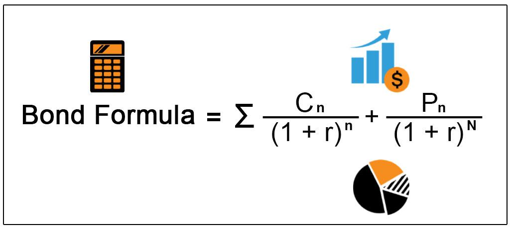

Bond valuation is a critical component for investors and financial analysts aiming to make informed decisions regarding the buying and selling of bonds. This process hinges on determining the bond's intrinsic value by calculating the present value of its anticipated future payments. These payments typically consist of periodic coupon payments and the redemption of the bond's face value at maturity.

The rationale behind bond valuation is to ensure that investors pay a fair price for a bond, in line with their financial objectives and their portfolio strategy. Investors must evaluate whether the bond's expected returns justify the initial investment, taking into account factors like the coupon rate, maturity, and prevailing market interest rates.



This article provides a thorough examination of bond valuation principles, exploring the methods used for calculating a bond's worth and how these methods are applied in practice. Additionally, it considers the role of bond valuation within algorithmic trading strategies, where automated systems exploit pricing inefficiencies to secure profitable trades. By understanding these components, investors can improve their market acumen, making strategic investment decisions that align with their financial goals.

## Table of Contents

## What Is Bond Valuation?

Bond valuation is the process of determining the fair market value of a bond by calculating the present value of its expected future cash flows. These cash flows typically consist of periodic coupon payments and the repayment of the principal amount at maturity. The valuation of a bond involves discounting these future cash flows to their present value using an appropriate discount rate, generally represented by the bond’s yield to maturity (YTM).

The present value calculation can be mathematically represented as follows:

$$

PV = \sum_{t=1}^{N} \frac{C}{(1 + r)^t} + \frac{F}{(1 + r)^N} 
$$

Where:
- $PV$ is the present value or the fair market value of the bond.
- $C$ is the coupon payment received in each period.
- $F$ is the face value or principal of the bond, which is repaid at maturity.
- $r$ is the discount rate, often the yield to maturity.
- $N$ is the total number of periods until maturity.

This valuation process is essential for investors and financial analysts for several reasons. First, it informs investment decisions by determining whether a bond is appropriately priced in the market. An undervalued bond may present a buying opportunity, while an overvalued bond might be a candidate for selling. 

Secondly, bond valuation aids portfolio management by allowing investors to align bond investments with their risk tolerance and return objectives. By understanding the present value of a bond’s future cash flows, investors can evaluate how an individual bond fits within their broader investment strategy.

## Understanding Key Concepts in Bond Valuation

Bond valuation requires understanding several key concepts that are integral to determining a bond's present value. The process centers on calculating the present value of future cash flows, which include the bond’s coupon payments and the repayment of its face value at maturity. 

**Coupon Rate:** The coupon rate is the annual interest rate paid by the bond issuer relative to its face or par value. It determines the periodic interest payments that an investor receives, typically expressed as a percentage. For instance, a bond with a face value of $1,000 and a coupon rate of 5% pays $50 in interest annually. These coupon payments are a critical component of the total cash flows an investor receives and are factored into the bond's valuation.

**Maturity Date:** This is the date on which the bond’s principal amount, also known as its face value, is repaid to the bondholder. The maturity date indicates the bond's lifespan, determining the number of coupon payments and the time until the principal is due. A longer maturity means more time for interest compounding, affecting the present value of the bond.

**Current Price:** The current market price of a bond is what investors are willing to pay for it at a given time. Bond prices fluctuate due to changes in interest rates, economic conditions, and issuer creditworthiness. Understanding a bond's current market price is essential for assessing whether it is undervalued or overvalued.

**Yield to Maturity (YTM):** YTM is a critical concept and reflects the total return an investor can expect to earn if the bond is held until maturity. It accounts for the bond’s current price, coupon payments, and principal repayment. YTM is expressed as an annual rate and allows investors to compare bonds with differing coupons and maturities on an equivalent basis. Mathematically, YTM can be approximated using a trial-and-error method or solved by setting the bond’s current price equal to the present value of its future cash flows:

$$
P = \sum_{t=1}^{n} \frac{C}{(1 + YTM)^t} + \frac{F}{(1 + YTM)^n}
$$

Where:
- $P$ is the current bond price
- $C$ is the annual coupon payment
- $F$ is the face value of the bond
- $n$ is the number of years to maturity
- $YTM$ is the yield to maturity

Using these components, investors can determine a bond's fair value, enabling informed investment decisions. Understanding these key concepts allows investors to evaluate bonds accurately and align their portfolio strategies with financial goals.

## Bond Valuation in Practice

Bond valuation is a vital component in the practical aspects of investment decision-making, portfolio management, and corporate finance strategies. Accurate valuation provides investors with insights into whether a bond is undervalued or overvalued compared to its current market price, facilitating informed investment choices.

### Investment Decision-Making

In the context of investing, bond valuation helps investors determine the fair value of potential bond investments. By calculating the present value of a bond's future cash flows and comparing it to its market price, investors can decide whether to buy, hold, or sell the bond. For example, if the calculated present value of a bond exceeds its market price, the bond is considered undervalued, potentially offering a bargain to the investor.

### Portfolio Management

Bond valuation plays a significant role in portfolio management, where fund managers must allocate assets effectively to balance risk and returns. Valuation aids in assessing the opportunity cost of holding a bond versus other investment options. It also helps in periodic rebalancing of the portfolio, ensuring alignment with the investor’s financial goals. By keeping track of the yield to maturity (YTM) and price changes, managers can optimize the portfolio’s performance across various economic conditions.

### Corporate Finance Strategies

In corporate finance, companies use bond valuation to evaluate their debt issuance strategies. Understanding how bonds are priced in the market allows companies to plan their capital structure efficiently. For instance, if market conditions suggest that the expected cost of new debt is favorable compared to existing debt structures, a company might choose to issue new bonds or refinance existing ones. Furthermore, understanding bond valuation can aid in financial planning and strategic decision-making related to mergers, acquisitions, and other corporate transactions.

Investors routinely apply various models and algorithms to compare calculated bond values against current market conditions. This quantitative analysis is essential in identifying mispriced bonds—either as a buying opportunity if prices are undervalued or as a signal to sell if overvalued. Tools and programming languages like Python can be employed to automate this process. Below is a basic example using Python to calculate the present value of a bond and compare it with its market price:

```python
def bond_valuation(face_value, coupon_rate, market_rate, years_to_maturity, frequency):
    cash_flows = [(face_value * coupon_rate / frequency) for _ in range(years_to_maturity * frequency)]
    cash_flows[-1] += face_value
    present_value = sum([cf / ((1 + market_rate / frequency) ** n) for n, cf in enumerate(cash_flows, start=1)])
    return present_value

# Example usage
market_price = 950
face_value = 1000
coupon_rate = 0.05
market_rate = 0.04
years_to_maturity = 5
frequency = 2  # Semi-annual

calculated_value = bond_valuation(face_value, coupon_rate, market_rate, years_to_maturity, frequency)

if calculated_value > market_price:
    print("The bond is undervalued.")
elif calculated_value < market_price:
    print("The bond is overvalued.")
else:
    print("The bond is fairly valued.")
```

In conclusion, applying bond valuation techniques in practice is indispensable for making informed investment decisions, optimizing portfolio compositions, and strategizing corporate finance activities. These tasks require not only understanding the theoretical aspects of bond valuation but also leveraging tools and models to apply these concepts effectively in real-world scenarios.

## The Bond Value Formula

The bond valuation formula is an essential tool for investors seeking to determine the present value of a bond based on various financial parameters. The formula calculates the present value of a bond by considering the bond's periodic coupon payments, the yield or required rate of return, the frequency of interest payments, and the time remaining until the bond's maturity. Understanding this formula is crucial because it enables investors to evaluate whether a bond is priced fairly in the market and aligns with their financial objectives.

### Bond Valuation Formula

The bond valuation formula can be expressed as follows:

$$

PV = \sum_{t=1}^{n} \frac{C}{(1 + r)^t} + \frac{F}{(1 + r)^n} 
$$

Where:
- $PV$ is the present value or price of the bond.
- $C$ represents the coupon payment per period.
- $r$ is the yield to maturity (YTM) or discount rate per period.
- $F$ is the face value of the bond.
- $n$ stands for the total number of periods until maturity.

### Components Explained

1. **Coupon Payments (C):** These are the periodic interest payments made by the bond issuer to the bondholders. The formula calculates the present value of these payments by discounting them at the bond's yield rate.

2. **Yield to Maturity (YTM or r):** This rate represents the investor's required rate of return for holding the bond until maturity. The YTM is used as the discount rate in the formula.

3. **Face Value (F):** The principal amount or par value of the bond that is repaid at maturity. This component is also discounted back to its present value as of the current date.

4. **Time to Maturity (n):** The total number of periods (such as years or months) until the bond matures. This determines how far into the future the cash flows are distributed.

5. **Frequency of Interest Payments:** Bonds may make coupon payments annually, semi-annually, quarterly, or monthly. This frequency affects the periodic interest payments and must be accounted for by adjusting $n$ and possibly $r$ accordingly.

### Python Code Example

Below is a simple Python code illustrating how to calculate the present value of a bond using the bond valuation formula:

```python
def bond_valuation(coupon_rate, face_value, periods, ytm, frequency=1):
    total_coupon_payments = periods * frequency
    coupon_payment = coupon_rate * face_value / frequency
    present_value_coupons = sum(coupon_payment / (1 + ytm / frequency) ** t for t in range(1, total_coupon_payments + 1))
    present_value_face_value = face_value / (1 + ytm / frequency) ** total_coupon_payments
    return present_value_coupons + present_value_face_value

# Example usage:
coupon_rate = 0.05  # 5% annual coupon rate
face_value = 1000   # $1000 face value
periods = 10        # 10 years to maturity
ytm = 0.04          # 4% yield to maturity
bond_price = bond_valuation(coupon_rate, face_value, periods, ytm)
print(f"Bond Price: ${bond_price:.2f}")
```

This code calculates the bond's present value by summing the present values of periodic coupon payments and the face value at maturity. Adjust the input parameters to suit different bonds or scenarios. By mastering the bond valuation formula, investors can make more informed decisions in aligning investment options with their financial strategies.

## Coupon vs. Zero-Coupon Bond Valuation

Coupon bonds and zero-coupon bonds represent two primary categories of bonds, each with a distinct method for calculating their respective valuations due to their differing cash flow structures.

### Coupon Bonds

Coupon bonds provide regular interest payments, known as coupons, to the bondholders throughout the life of the bond. These payments are typically made annually or semi-annually and continue until the bond's maturity date. The present value of a coupon bond is determined by discounting the future cash flows, which include both the coupon payments and the final principal repayment at maturity. The present value (PV) of a coupon bond can be calculated using the following formula:

$$

PV = \sum_{t=1}^{n} \frac{C}{(1 + Y)^t} + \frac{F}{(1 + Y)^n} 
$$

Where:
- $C$ is the coupon payment.
- $Y$ is the yield to maturity (YTM), representing the bond's annual return if held until maturity.
- $n$ is the number of periods until maturity.
- $F$ is the face value of the bond.
- $t$ is the specific time period for each coupon payment.

Investors can evaluate whether a bond is fairly priced by comparing the bond's market price to the calculated present value.

### Zero-Coupon Bonds

Zero-coupon bonds, unlike coupon bonds, do not make periodic interest payments. Instead, they are sold at a significant discount to their face value and provide a return to the bondholder at maturity, when the face value is repaid. The valuation of a zero-coupon bond focuses exclusively on this lump-sum repayment at maturity. The present value of a zero-coupon bond is calculated using a simpler formula:

$$

PV = \frac{F}{(1 + Y)^n} 
$$

Here, the inputs remain similar, with $F$ as the face value, $Y$ as the yield to maturity, and $n$ as the number of periods or years until maturity. Since zero-coupon bonds only offer a single cash flow, this valuation approach emphasizes the concept of time value of money, as investors must wait until maturity to receive their return.

Both coupon and zero-coupon bonds are integral to investment portfolios, offering distinct advantages based on an investor’s cash flow needs and risk appetite. Mastery of both valuations provides investors with a diversified approach to bond investing and a comprehensive understanding of bond market dynamics.

## Algorithmic Trading and Bond Valuation

Algorithmic trading leverages computational algorithms to execute trades at high speed and frequency, often utilizing predefined criteria. In the context of fixed income markets, bond valuation is a critical component of [algorithmic trading](/wiki/algorithmic-trading) strategies. These strategies focus on [arbitrage](/wiki/arbitrage) opportunities—exploiting price differences of the same or similar financial instruments to generate risk-free profit.

Bond valuation techniques, such as calculating the present value of future cash flows, enable traders to assess bonds' worth relative to market prices. Here, the objective is to identify bonds that are mispriced by the market, whether undervalued or overvalued. This valuation process helps traders to target bonds that present potential profit opportunities once they revert to their intrinsic value.

Automated systems, equipped with sophisticated algorithms, are capable of rapidly evaluating extensive datasets encompassing numerous bonds. These systems assess various factors, including yield to maturity (YTM), coupon rates, and credit ratings. The integration of [machine learning](/wiki/machine-learning) and [artificial intelligence](/wiki/ai-artificial-intelligence) into these algorithms enhances their predictive accuracy, enabling them to dynamically adapt to evolving market conditions.

For instance, an algorithm may monitor the spread between the yields of a corporate bond and a government bond with similar maturities. If the spread widens beyond historical norms without any fundamental reason, the system could trigger a buy signal, anticipating a reversion to the mean. Such strategies are designed to capitalize on temporary market inefficiencies and to adjust holdings in real time.

Python is a prevalent tool for developing algorithmic trading strategies due to its robust libraries and scalability. Using libraries like NumPy for numerical computations and pandas for data manipulation, traders can implement algorithms that process data swiftly. Below is a simplified example of how Python can be used to evaluate bonds within an algorithmic trading framework:

```python
import numpy as np
import pandas as pd

# Example bond data
bond_data = {
    'Bond': ['Bond A', 'Bond B'],
    'Current Price': [950, 1025],
    'Coupon Rate': [0.05, 0.06],
    'Years to Maturity': [10, 8],
    'Market Yield': [0.055, 0.058]
}

# Convert to DataFrame
bonds_df = pd.DataFrame(bond_data)

# Calculate Present Value of Cash Flows for each bond
def bond_valuation(row):
    coupon_payment = row['Coupon Rate'] * 1000  # Assuming face value = $1000
    ytm = row['Market Yield']
    n = row['Years to Maturity']

    cash_flows = [(coupon_payment / (1 + ytm)**t) for t in range(1, n + 1)]
    present_value = np.sum(cash_flows) + 1000 / (1 + ytm)**n
    return present_value

bonds_df['Calculated Value'] = bonds_df.apply(bond_valuation, axis=1)
bonds_df['Discrepancy'] = bonds_df['Calculated Value'] - bonds_df['Current Price']

# Display bonds that are under/overvalued
undervalued_bonds = bonds_df[bonds_df['Discrepancy'] > 0]
overvalued_bonds = bonds_df[bonds_df['Discrepancy'] < 0]

print("Undervalued Bonds:")
print(undervalued_bonds)
print("\nOvervalued Bonds:")
print(overvalued_bonds)
```

In this example, the algorithm calculates the present value of each bond's cash flows and compares it to its market price, identifying potential arbitrage opportunities. Algorithmic trading systems execute such methods on a massive scale, continually scanning the bond market for pricing anomalies to exploit while adjusting risk exposure accordingly.

## Examples of Bond Valuation

Bond valuation is an essential skill for assessing the value of bonds in various market conditions. Here are illustrative examples that demonstrate how to apply bond valuation formulas to real-world situations:

### Example 1: Valuing a Coupon Bond

Consider a 10-year bond with a face value of $1,000 that pays an annual coupon rate of 5%. Suppose the current market [interest rate](/wiki/interest-rate-trading-strategies) is 4%. To calculate the bond's present value, we determine the present value of future cash flows, consisting of annual coupon payments and the principal repayment at maturity.

The formula for calculating the present value (PV) of a bond's cash flows is:
$$

PV = \sum_{t=1}^{n} \frac{C}{(1 + r)^t} + \frac{F}{(1 + r)^n} 
$$

Where:
- $C$ is the annual coupon payment ($1,000 \times 5\% = $50)
- $r$ is the market interest rate (4% or 0.04)
- $F$ is the face value of the bond ($1,000)
- $n$ is the number of years to maturity (10)

Using these values:
$$

PV = \sum_{t=1}^{10} \frac{50}{(1 + 0.04)^t} + \frac{1,000}{(1 + 0.04)^{10}} 
$$

Calculating each term gives:
The present value of the coupon payments ≈ $405.40
The present value of the principal repayment ≈ $675.56

Thus, the bond value ≈ $405.40 + $675.56 ≈ $1,080.96

### Example 2: Valuing a Zero-Coupon Bond

Zero-coupon bonds do not make periodic interest payments. Instead, they are sold at a discount and redeemed at face value at maturity. Assume a zero-coupon bond with a face value of $1,000, maturing in 5 years, with a market interest rate of 6%.

The present value formula for a zero-coupon bond is:
$$

PV = \frac{F}{(1 + r)^n} 
$$

Where:
- $F$ is the face value ($1,000)
- $r$ is the market interest rate (6% or 0.06)
- $n$ is the number of years to maturity (5)

Substituting the values:
$$

PV = \frac{1,000}{(1 + 0.06)^5} 
\] 
$$

PV \approx \frac{1,000}{1.3382} \approx 747.26 
$$

Thus, the zero-coupon bond is valued at approximately $747.26.

### Example 3: Using Python for Bond Valuation

Python can automate bond valuation calculations. Below is a Python script for valuing a coupon bond, using the same parameters as in Example 1.

```python
def calculate_coupon_bond_value(face_value, coupon_rate, n, market_rate):
    present_value_total = 0
    coupon_payment = face_value * coupon_rate

    # Calculate present value of coupon payments
    for t in range(1, n + 1):
        present_value_total += coupon_payment / (1 + market_rate) ** t

    # Calculate present value of the principal repayment
    present_value_total += face_value / (1 + market_rate) ** n

    return present_value_total

# Example parameters
face_value = 1000  # Face value of the bond
coupon_rate = 0.05  # Annual coupon rate
n = 10  # Number of years to maturity
market_rate = 0.04  # Current market interest rate

bond_value = calculate_coupon_bond_value(face_value, coupon_rate, n, market_rate)
print(f"The calculated bond value is: ${bond_value:.2f}")
```

This code efficiently calculates the present value, ensuring accuracy even with complex bond structures or changing market conditions.

By using these examples, investors can practice calculating bond values, enhancing their valuation skills to make informed decisions.

## Conclusion

Bond valuation represents a crucial skill for investors and financial professionals striving to make informed decisions in the bond market. By accurately determining the worth of a bond, investors gain insights into potential returns, assess risks, and enhance their portfolio management strategies. Fundamentally, bond valuation involves the intricate calculation of a bond's present value by discounting its future cash flows, which include periodic coupon payments and the repayment of principal at maturity. This computation allows investors to evaluate whether a bond is undervalued or overvalued compared to current market prices.

Mastering bond valuation empowers investors to navigate changing market conditions with increased confidence. Accurate valuation skills enable the identification of lucrative investment opportunities and shield against potential financial pitfalls. By integrating bond valuation into investment strategies, individuals can optimize their portfolios, balancing risk and return effectively to achieve their financial goals. Additionally, in an environment where algorithmic trading plays a pivotal role, understanding bond valuation facilitates the utilization of automated trading systems to exploit arbitrage opportunities and enhance trading efficiency. As market dynamics evolve, the ability to perform precise bond valuation remains indispensable for achieving superior investment outcomes.

## References & Further Reading

[1]: ["Fixed Income Analysis"](https://en.wikipedia.org/wiki/Fixed_income_analysis) by CFA Institute

[2]: Fabozzi, F. J. (2012). ["Bond Markets, Analysis, and Strategies"](https://books.google.com/books/about/Bond_Markets_Analysis_and_Strategies_ten.html?id=bQpNEAAAQBAJ). 8th Edition. Pearson.

[3]: ["The Handbook of Fixed Income Securities"](https://www.amazon.com/Handbook-Fixed-Income-Securities-Ninth/dp/1260473899) by Frank J. Fabozzi

[4]: ["Advances in Financial Machine Learning"](https://www.wiley.com/en-us/Advances+in+Financial+Machine+Learning-p-9781119482086) by Marcos Lopez de Prado

[5]: ["Quantitative Fixed Income Analytics"](https://quant.stackexchange.com/questions/44741/quantitative-strategies-in-the-fixed-income-space) by Robert Brooks and Frank Fabozzi

[6]: Hull, J.C. (2014). ["Options, Futures, and Other Derivatives"](https://www.amazon.com/Options-Futures-Other-Derivatives-9th/dp/0133456315). 9th Edition. Pearson.

[7]: [Bodie, Z., Kane, A., & Marcus, A. J. (2014). "Investments"](https://www.mheducation.com/highered/product/investments-bodie-kane/M9781264412662.html) 10th Edition. McGraw-Hill Education.

[8]: ["Algorithmic Trading: Winning Strategies and Their Rationale"](https://www.wiley.com/en-us/Algorithmic+Trading%3A+Winning+Strategies+and+Their+Rationale-p-9781118460146) by Ernest P. Chan