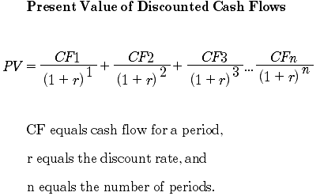

## Table of Contents

## What is bond valuation and why is it important?

Bond valuation is the process of figuring out how much a bond is worth. A bond is like a loan you give to a company or government, and in return, they promise to pay you back with interest over time. To find out the value of a bond, you need to look at things like the interest rate it pays, how long until it matures, and what the market thinks about the risk of the bond issuer not paying back.

Understanding bond valuation is important for a few reasons. First, it helps investors decide if a bond is a good investment. If the bond's price is lower than its calculated value, it might be a good buy. Second, it's useful for companies and governments that issue bonds. They need to know how much they should charge for their bonds to attract investors. Knowing the value of bonds helps everyone make better financial decisions.

## What are the basic components of a bond?

A bond has a few main parts that are important to understand. The first part is the face value, which is the amount of money the bond issuer promises to pay back when the bond matures. This is also called the par value. The second part is the coupon rate, which is the interest rate the bond pays. This tells you how much money you'll get each year until the bond matures. The third part is the maturity date, which is when the bond issuer has to pay back the face value.

Another important part of a bond is its yield, which is the return you get on your investment. The yield can change based on the bond's price in the market. If you buy a bond for less than its face value, your yield will be higher. The last part is the credit rating, which tells you how likely the bond issuer is to pay back the money. A higher credit rating means less risk, but it might also mean a lower yield. Understanding these parts helps you know what you're getting into when you invest in a bond.

## How do you calculate the present value of a bond?

To calculate the present value of a bond, you need to figure out how much the future payments from the bond are worth today. This involves adding up the present value of all the coupon payments you'll get each year until the bond matures, and the present value of the face value that you'll get back when the bond matures. You use a discount rate, which is usually the market [interest rate](/wiki/interest-rate-trading-strategies) for similar bonds, to figure out these present values. The formula for the present value of a bond is: Present Value = (Coupon Payment / (1 + Discount Rate)^1) + (Coupon Payment / (1 + Discount Rate)^2) + ... + (Coupon Payment + Face Value) / (1 + Discount Rate)^n, where n is the number of years until the bond matures.

Let's break it down with a simple example. Imagine you have a bond with a face value of $1,000, a coupon rate of 5%, and it matures in 3 years. The annual coupon payment is $50 (5% of $1,000). If the market interest rate, or discount rate, is 4%, you'd calculate the present value like this: The present value of the first year's coupon payment is $50 / (1 + 0.04)^1 = $48.08. The second year's is $50 / (1 + 0.04)^2 = $46.23. The third year's is $50 / (1 + 0.04)^3 = $44.45. And the present value of the face value at the end of the third year is $1,000 / (1 + 0.04)^3 = $889.99. Add these up, and the present value of the bond is $48.08 + $46.23 + $44.45 + $889.99 = $1,028.75. So, if you can buy this bond for less than $1,028.75, it's a good deal based on these calculations.

## What is the formula for bond valuation?

The formula for bond valuation helps you figure out how much a bond is worth today. It's a way to add up all the money you'll get from the bond in the future and see what that's worth right now. The formula is: Present Value = (Coupon Payment / (1 + Discount Rate)^1) + (Coupon Payment / (1 + Discount Rate)^2) + ... + (Coupon Payment + Face Value) / (1 + Discount Rate)^n. Here, the coupon payment is the interest you get each year, the discount rate is what the market thinks is a fair return for this kind of bond, and n is how many years until the bond matures.

Let's break it down with an example. Say you have a bond worth $1,000 at the end (face value), and it pays you $50 every year (coupon payment) for 3 years. If the market interest rate (discount rate) is 4%, you can figure out the bond's value today. You'd calculate the present value of each $50 payment and the $1,000 you get back at the end. The first year's $50 payment is worth $48.08 today, the second year's is $46.23, the third year's is $44.45, and the $1,000 at the end is worth $889.99 today. Add all those up, and the bond's value today is about $1,028.75.

## What is the difference between the coupon rate and the yield to maturity?

The coupon rate and the yield to maturity are two important numbers when you're looking at bonds, but they tell you different things. The coupon rate is the interest rate that the bond pays every year. It's a fixed percentage of the bond's face value. For example, if you have a bond with a face value of $1,000 and a coupon rate of 5%, you'll get $50 every year until the bond matures. The coupon rate stays the same for the whole time you own the bond.

The yield to maturity, on the other hand, is the total return you can expect if you hold the bond until it matures. It takes into account not just the coupon payments but also any difference between the price you paid for the bond and its face value. If you buy a bond for less than its face value, your yield to maturity will be higher than the coupon rate because you'll get more back when the bond matures. If you buy it for more than the face value, your yield to maturity will be lower. The yield to maturity changes based on the bond's price in the market and can be different from the coupon rate.

## How does the market interest rate affect bond valuation?

The market interest rate plays a big role in how much a bond is worth. When the market interest rate goes up, the value of existing bonds usually goes down. This happens because new bonds that are issued will have higher coupon rates to match the higher market interest rate. So, people would rather buy the new bonds than the old ones with lower coupon rates. To make the old bonds attractive, their prices have to drop, which makes their yield higher to match the new market rate.

On the flip side, when the market interest rate goes down, the value of existing bonds goes up. This is because the old bonds now have higher coupon rates compared to the new bonds being issued with lower rates. People will want to buy the old bonds because they pay more interest. To keep up with demand, the price of these bonds goes up, which makes their yield lower to match the new market rate. So, the market interest rate is like a seesaw for bond values: when it goes up, bond values go down, and when it goes down, bond values go up.

## What is the relationship between bond prices and interest rates?

The relationship between bond prices and interest rates is like a seesaw. When interest rates go up, bond prices go down. This happens because when new bonds are issued, they have higher coupon rates to match the higher interest rates. People would rather buy these new bonds than the old ones with lower coupon rates. So, to make the old bonds attractive, their prices have to drop. This makes the yield on the old bonds higher, which makes them more competitive with the new bonds.

On the other hand, when interest rates go down, bond prices go up. This is because the old bonds now have higher coupon rates compared to the new bonds being issued with lower rates. People will want to buy the old bonds because they pay more interest. To keep up with the demand, the price of these bonds goes up. This makes the yield on the old bonds lower, which matches the new lower interest rates. So, interest rates and bond prices move in opposite directions.

## How do you calculate the yield to maturity of a bond?

Calculating the yield to maturity (YTM) of a bond tells you what return you'll get if you hold the bond until it matures. It's a bit tricky because you need to figure out the interest rate that makes the present value of all the bond's future payments equal to its current price. You do this by solving a formula that looks at the bond's face value, the coupon payments, the number of years until it matures, and the price you paid for the bond. The formula is: Price = (Coupon / (1 + YTM)^1) + (Coupon / (1 + YTM)^2) + ... + (Coupon + Face Value) / (1 + YTM)^n, where n is the number of years until the bond matures. You solve this equation for YTM, usually using a financial calculator or a computer because it's hard to do by hand.

Let's say you have a bond with a face value of $1,000, a coupon rate of 5%, and it matures in 3 years. The annual coupon payment is $50. If you bought this bond for $950, you'd need to find the YTM that makes the present value of the bond's payments equal to $950. You'd plug in the numbers and solve for YTM, which might come out to around 6.96%. This means if you hold the bond until it matures, your total return would be about 6.96% per year. The YTM gives you a way to compare different bonds and see which one gives you the best return for your money.

## What are the different types of bond valuation models?

Bond valuation models are ways to figure out how much a bond is worth. There are a few different types, but the most common ones are the present value model, the yield to maturity model, and the duration model. The present value model is the simplest one. It adds up the value of all the bond's future payments, like the interest you get each year and the money you get back when the bond matures, and figures out what those payments are worth today. You do this by using a discount rate, which is usually the market interest rate for similar bonds. The yield to maturity model is a bit trickier. It finds the interest rate that makes the present value of the bond's payments equal to its current price. This tells you what return you'd get if you held the bond until it matures.

The duration model is another way to look at bond valuation. It measures how sensitive a bond's price is to changes in interest rates. Duration tells you how long it takes for the bond's cash flows to pay back its price. If interest rates go up, the bond's price will go down, and the duration helps you see how much the price will change. Each of these models helps investors and bond issuers understand the value of a bond from different angles. By using these models, you can make better decisions about whether to buy, sell, or issue bonds.

## How do you account for risk in bond valuation?

When you're figuring out how much a bond is worth, you need to think about risk. Risk means how likely it is that the bond issuer won't pay you back. One way to account for risk is by looking at the bond's credit rating. A higher credit rating means the bond is safer, but it might also mean a lower return. A lower credit rating means the bond is riskier, so investors want a higher return to take on that risk. The discount rate you use to calculate the bond's value can be adjusted to reflect this risk. If a bond is riskier, you'd use a higher discount rate, which makes the bond's present value lower.

Another way to think about risk in bond valuation is by considering the bond's yield. The yield is the return you get on your investment. If a bond is riskier, investors will want a higher yield to make up for that risk. So, the bond's price will be lower to offer a higher yield. This is why riskier bonds, like junk bonds, usually have higher yields than safer bonds, like government bonds. By understanding and adjusting for risk, you can get a better idea of what a bond is really worth and whether it's a good investment for you.

## What are some advanced techniques used in bond valuation?

Advanced techniques in bond valuation go beyond the basic models and help investors get a more detailed picture of a bond's worth. One such technique is the use of option-adjusted spread (OAS) models. These models account for the fact that some bonds, like callable or putable bonds, have options that can affect their value. The OAS model adjusts the bond's yield to reflect these options, giving a more accurate measure of the bond's risk and return compared to a similar bond without options. Another advanced method is the use of Monte Carlo simulations. These simulations run thousands of different scenarios to see how a bond's value might change under different conditions, like changes in interest rates or credit ratings. This helps investors understand the range of possible outcomes and the risks involved.

Another advanced technique is the use of binomial trees, which are useful for valuing bonds with embedded options. A binomial tree breaks down the bond's life into a series of time steps and looks at how the bond's value might change at each step, depending on whether interest rates go up or down. This method can provide a detailed view of how the bond's value might evolve over time. Lastly, duration and convexity measures are also advanced tools used in bond valuation. Duration tells you how sensitive a bond's price is to changes in interest rates, while convexity adds another layer of detail by showing how that sensitivity changes as interest rates move. These measures help investors manage interest rate risk and make more informed decisions about their bond investments.

## Can you provide a detailed example of bond valuation calculation?

Let's go through an example of how to calculate the value of a bond. Imagine you have a bond with a face value of $1,000, a coupon rate of 5%, and it matures in 3 years. This means you'll get $50 every year for 3 years, and at the end of the 3 years, you'll get back the $1,000. Now, let's say the market interest rate, or discount rate, is 4%. To figure out how much this bond is worth today, you need to find the present value of all the money you'll get in the future. The first step is to calculate the present value of each $50 payment you'll get each year. The first year's $50 payment is worth $50 divided by (1 + 0.04) to the power of 1, which is $48.08. The second year's $50 payment is worth $50 divided by (1 + 0.04) to the power of 2, which is $46.23. The third year's $50 payment is worth $50 divided by (1 + 0.04) to the power of 3, which is $44.45. Finally, the $1,000 you get back at the end of the 3 years is worth $1,000 divided by (1 + 0.04) to the power of 3, which is $889.99.

Now, you add up all these present values to get the total value of the bond today. So, $48.08 + $46.23 + $44.45 + $889.99 equals $1,028.75. This means if the bond is selling for less than $1,028.75, it's a good deal because you're getting more value than you're paying for. If it's selling for more than $1,028.75, it might not be the best investment because you're paying more than the bond is worth today. This way of figuring out the value of a bond helps investors make smart choices about whether to buy or sell bonds.

## What is bond valuation?

Bond valuation is the process of determining the fair market value of a bond by calculating the present value of its expected future cash flows. These cash flows typically consist of periodic coupon payments and the repayment of the principal amount at maturity. The valuation of a bond involves discounting these future cash flows to their present value using an appropriate discount rate, generally represented by the bond’s yield to maturity (YTM).

The present value calculation can be mathematically represented as follows:

$$

PV = \sum_{t=1}^{N} \frac{C}{(1 + r)^t} + \frac{F}{(1 + r)^N} 
$$

Where:
- $PV$ is the present value or the fair market value of the bond.
- $C$ is the coupon payment received in each period.
- $F$ is the face value or principal of the bond, which is repaid at maturity.
- $r$ is the discount rate, often the yield to maturity.
- $N$ is the total number of periods until maturity.

This valuation process is essential for investors and financial analysts for several reasons. First, it informs investment decisions by determining whether a bond is appropriately priced in the market. An undervalued bond may present a buying opportunity, while an overvalued bond might be a candidate for selling. 

Secondly, bond valuation aids portfolio management by allowing investors to align bond investments with their risk tolerance and return objectives. By understanding the present value of a bond’s future cash flows, investors can evaluate how an individual bond fits within their broader investment strategy.

## What are the key concepts in bond valuation?

Bond valuation requires understanding several key concepts that are integral to determining a bond's present value. The process centers on calculating the present value of future cash flows, which include the bond’s coupon payments and the repayment of its face value at maturity. 

**Coupon Rate:** The coupon rate is the annual interest rate paid by the bond issuer relative to its face or par value. It determines the periodic interest payments that an investor receives, typically expressed as a percentage. For instance, a bond with a face value of $1,000 and a coupon rate of 5% pays $50 in interest annually. These coupon payments are a critical component of the total cash flows an investor receives and are factored into the bond's valuation.

**Maturity Date:** This is the date on which the bond’s principal amount, also known as its face value, is repaid to the bondholder. The maturity date indicates the bond's lifespan, determining the number of coupon payments and the time until the principal is due. A longer maturity means more time for interest compounding, affecting the present value of the bond.

**Current Price:** The current market price of a bond is what investors are willing to pay for it at a given time. Bond prices fluctuate due to changes in interest rates, economic conditions, and issuer creditworthiness. Understanding a bond's current market price is essential for assessing whether it is undervalued or overvalued.

**Yield to Maturity (YTM):** YTM is a critical concept and reflects the total return an investor can expect to earn if the bond is held until maturity. It accounts for the bond’s current price, coupon payments, and principal repayment. YTM is expressed as an annual rate and allows investors to compare bonds with differing coupons and maturities on an equivalent basis. Mathematically, YTM can be approximated using a trial-and-error method or solved by setting the bond’s current price equal to the present value of its future cash flows:

$$
P = \sum_{t=1}^{n} \frac{C}{(1 + YTM)^t} + \frac{F}{(1 + YTM)^n}
$$

Where:
- $P$ is the current bond price
- $C$ is the annual coupon payment
- $F$ is the face value of the bond
- $n$ is the number of years to maturity
- $YTM$ is the yield to maturity

Using these components, investors can determine a bond's fair value, enabling informed investment decisions. Understanding these key concepts allows investors to evaluate bonds accurately and align their portfolio strategies with financial goals.

## What is the Bond Value Formula?

The bond valuation formula is an essential tool for investors seeking to determine the present value of a bond based on various financial parameters. The formula calculates the present value of a bond by considering the bond's periodic coupon payments, the yield or required rate of return, the frequency of interest payments, and the time remaining until the bond's maturity. Understanding this formula is crucial because it enables investors to evaluate whether a bond is priced fairly in the market and aligns with their financial objectives.

### Bond Valuation Formula

The bond valuation formula can be expressed as follows:

$$

PV = \sum_{t=1}^{n} \frac{C}{(1 + r)^t} + \frac{F}{(1 + r)^n} 
$$

Where:
- $PV$ is the present value or price of the bond.
- $C$ represents the coupon payment per period.
- $r$ is the yield to maturity (YTM) or discount rate per period.
- $F$ is the face value of the bond.
- $n$ stands for the total number of periods until maturity.

### Components Explained

1. **Coupon Payments (C):** These are the periodic interest payments made by the bond issuer to the bondholders. The formula calculates the present value of these payments by discounting them at the bond's yield rate.

2. **Yield to Maturity (YTM or r):** This rate represents the investor's required rate of return for holding the bond until maturity. The YTM is used as the discount rate in the formula.

3. **Face Value (F):** The principal amount or par value of the bond that is repaid at maturity. This component is also discounted back to its present value as of the current date.

4. **Time to Maturity (n):** The total number of periods (such as years or months) until the bond matures. This determines how far into the future the cash flows are distributed.

5. **Frequency of Interest Payments:** Bonds may make coupon payments annually, semi-annually, quarterly, or monthly. This frequency affects the periodic interest payments and must be accounted for by adjusting $n$ and possibly $r$ accordingly.

### Python Code Example

Below is a simple Python code illustrating how to calculate the present value of a bond using the bond valuation formula:

```python
def bond_valuation(coupon_rate, face_value, periods, ytm, frequency=1):
    total_coupon_payments = periods * frequency
    coupon_payment = coupon_rate * face_value / frequency
    present_value_coupons = sum(coupon_payment / (1 + ytm / frequency) ** t for t in range(1, total_coupon_payments + 1))
    present_value_face_value = face_value / (1 + ytm / frequency) ** total_coupon_payments
    return present_value_coupons + present_value_face_value

# Example usage:
coupon_rate = 0.05  # 5% annual coupon rate
face_value = 1000   # $1000 face value
periods = 10        # 10 years to maturity
ytm = 0.04          # 4% yield to maturity
bond_price = bond_valuation(coupon_rate, face_value, periods, ytm)
print(f"Bond Price: ${bond_price:.2f}")
```

This code calculates the bond's present value by summing the present values of periodic coupon payments and the face value at maturity. Adjust the input parameters to suit different bonds or scenarios. By mastering the bond valuation formula, investors can make more informed decisions in aligning investment options with their financial strategies.

## What is the difference between Coupon and Zero-Coupon Bond Valuation?

Coupon bonds and zero-coupon bonds represent two primary categories of bonds, each with a distinct method for calculating their respective valuations due to their differing cash flow structures.

### Coupon Bonds

Coupon bonds provide regular interest payments, known as coupons, to the bondholders throughout the life of the bond. These payments are typically made annually or semi-annually and continue until the bond's maturity date. The present value of a coupon bond is determined by discounting the future cash flows, which include both the coupon payments and the final principal repayment at maturity. The present value (PV) of a coupon bond can be calculated using the following formula:

$$

PV = \sum_{t=1}^{n} \frac{C}{(1 + Y)^t} + \frac{F}{(1 + Y)^n} 
$$

Where:
- $C$ is the coupon payment.
- $Y$ is the yield to maturity (YTM), representing the bond's annual return if held until maturity.
- $n$ is the number of periods until maturity.
- $F$ is the face value of the bond.
- $t$ is the specific time period for each coupon payment.

Investors can evaluate whether a bond is fairly priced by comparing the bond's market price to the calculated present value.

### Zero-Coupon Bonds

Zero-coupon bonds, unlike coupon bonds, do not make periodic interest payments. Instead, they are sold at a significant discount to their face value and provide a return to the bondholder at maturity, when the face value is repaid. The valuation of a zero-coupon bond focuses exclusively on this lump-sum repayment at maturity. The present value of a zero-coupon bond is calculated using a simpler formula:

$$

PV = \frac{F}{(1 + Y)^n} 
$$

Here, the inputs remain similar, with $F$ as the face value, $Y$ as the yield to maturity, and $n$ as the number of periods or years until maturity. Since zero-coupon bonds only offer a single cash flow, this valuation approach emphasizes the concept of time value of money, as investors must wait until maturity to receive their return.

Both coupon and zero-coupon bonds are integral to investment portfolios, offering distinct advantages based on an investor’s cash flow needs and risk appetite. Mastery of both valuations provides investors with a diversified approach to bond investing and a comprehensive understanding of bond market dynamics.

## References & Further Reading

[1]: ["Fixed Income Analysis"](https://en.wikipedia.org/wiki/Fixed_income_analysis) by CFA Institute

[2]: Fabozzi, F. J. (2012). ["Bond Markets, Analysis, and Strategies"](https://books.google.com/books/about/Bond_Markets_Analysis_and_Strategies_ten.html?id=bQpNEAAAQBAJ). 8th Edition. Pearson.

[3]: ["The Handbook of Fixed Income Securities"](https://www.amazon.com/Handbook-Fixed-Income-Securities-Ninth/dp/1260473899) by Frank J. Fabozzi

[4]: ["Advances in Financial Machine Learning"](https://www.wiley.com/en-us/Advances+in+Financial+Machine+Learning-p-9781119482086) by Marcos Lopez de Prado

[5]: ["Quantitative Fixed Income Analytics"](https://quant.stackexchange.com/questions/44741/quantitative-strategies-in-the-fixed-income-space) by Robert Brooks and Frank Fabozzi

[6]: Hull, J.C. (2014). ["Options, Futures, and Other Derivatives"](https://www.amazon.com/Options-Futures-Other-Derivatives-9th/dp/0133456315). 9th Edition. Pearson.

[7]: [Bodie, Z., Kane, A., & Marcus, A. J. (2014). "Investments"](https://www.mheducation.com/highered/product/investments-bodie-kane/M9781264412662.html) 10th Edition. McGraw-Hill Education.

[8]: ["Algorithmic Trading: Winning Strategies and Their Rationale"](https://www.wiley.com/en-us/Algorithmic+Trading%3A+Winning+Strategies+and+Their+Rationale-p-9781118460146) by Ernest P. Chan