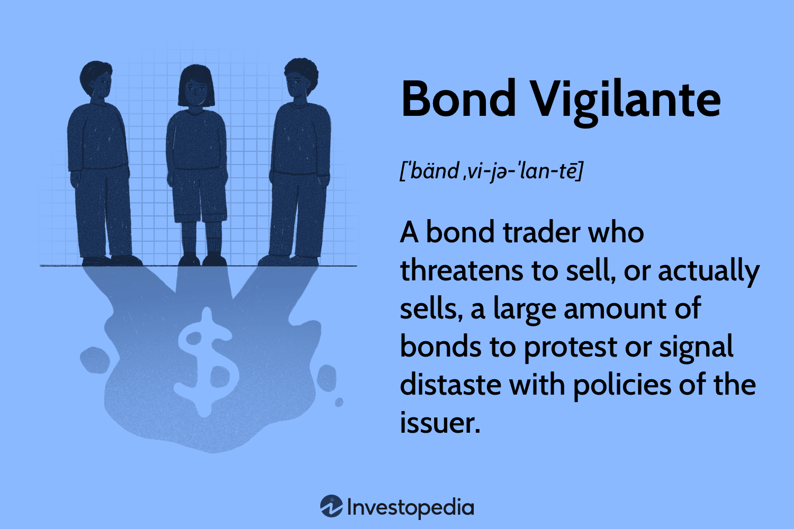

## Table of Contents

## What are Bond Vigilantes?

Bond Vigilantes are investors who sell government bonds to protest against what they see as bad financial policies by the government. They do this because they think the government is spending too much money or not managing the economy well. When many investors sell their bonds, it can make the price of the bonds go down and the interest rates go up. This is their way of sending a message to the government to change its policies.

When bond vigilantes act, it can have a big impact on the economy. Higher interest rates can make it more expensive for the government to borrow money. This can slow down the economy because businesses and people might also have to pay more to borrow money. Governments usually try to avoid making bond vigilantes angry because they know it can lead to problems with the economy.

## How do Bond Vigilantes influence the economy?

Bond Vigilantes can change the economy by selling government bonds when they don't like what the government is doing with money. When they sell a lot of bonds, the price of the bonds goes down. This makes the interest rates go up because people who want to buy the bonds now have to offer more money to get them. Higher interest rates mean the government has to pay more to borrow money, which can make them think twice about spending too much.

When interest rates go up because of Bond Vigilantes, it can affect everyone. Businesses might find it harder to borrow money for new projects, and people might have to pay more for loans like mortgages. This can slow down the economy because when borrowing costs are high, people and businesses spend less. So, Bond Vigilantes can push the government to be more careful with money, but it can also make things tougher for the rest of us.

## Can you explain the historical origins of Bond Vigilantes?

The term "Bond Vigilantes" was first used in the 1990s by Ed Yardeni, an economist. He made up the term to describe investors who would sell government bonds if they thought the government was spending too much money. Back then, the U.S. government was running big budget deficits, and people were worried about it. Yardeni said these investors were like vigilantes because they took action on their own to try and stop the government from making bad financial choices.

Since then, the idea of Bond Vigilantes has been used to explain big changes in the bond market. When investors sell a lot of bonds all at once, it can push up interest rates and make it more expensive for the government to borrow money. This has happened in different countries at different times, often when people were worried about too much government spending or too much inflation. Even though the term started in the 1990s, the idea of investors influencing government policy through the bond market is something that has been around for a long time.

## What are the typical actions taken by Bond Vigilantes?

Bond Vigilantes are investors who sell government bonds when they think the government is spending too much money or not managing the economy well. They do this to send a message to the government that they need to change their policies. When many investors start selling their bonds at the same time, it can cause the price of the bonds to go down. This happens because there are more people trying to sell than there are people trying to buy.

As bond prices fall, the interest rates on new bonds have to go up to attract buyers. Higher interest rates mean it costs the government more money to borrow. This can make the government think twice about spending too much because they know it will be more expensive to pay back their loans. The actions of Bond Vigilantes can slow down the economy because when interest rates go up, businesses and people might also have to pay more to borrow money, which can make them spend less.

## How do Bond Vigilantes affect government borrowing?

Bond Vigilantes make it harder for the government to borrow money by selling their government bonds. When many investors sell their bonds at the same time, it makes the price of the bonds go down. This happens because there are more sellers than buyers. When bond prices fall, the government has to offer higher interest rates to attract new buyers. Higher interest rates mean the government has to pay more money to borrow, which can make them think twice about spending too much.

When Bond Vigilantes cause interest rates to go up, it can also affect the rest of the economy. Businesses might find it more expensive to borrow money for new projects, and people might have to pay more for loans like mortgages. This can slow down the economy because when borrowing costs are high, people and businesses spend less. So, Bond Vigilantes can push the government to be more careful with money, but it can also make things tougher for everyone else.

## What is the relationship between Bond Vigilantes and interest rates?

Bond Vigilantes are investors who sell government bonds when they think the government is spending too much money or not managing the economy well. When a lot of investors start selling their bonds, it makes the price of the bonds go down. This happens because there are more people trying to sell than there are people trying to buy.

As the price of bonds falls, the government has to offer higher interest rates to attract new buyers. Higher interest rates mean the government has to pay more money to borrow. This can make the government think twice about spending too much because borrowing will be more expensive. So, Bond Vigilantes can push interest rates up by selling bonds, which can affect how much the government borrows and spends.

## Can Bond Vigilantes impact fiscal policy?

Bond Vigilantes can have a big effect on what the government does with money, which is called fiscal policy. When these investors think the government is spending too much, they sell their government bonds. This makes the price of the bonds go down and the interest rates go up. When interest rates are higher, it costs the government more money to borrow. This can make the government change its plans and spend less money, or find other ways to get money, like raising taxes.

The actions of Bond Vigilantes can push the government to be more careful with its money. If the government knows that spending too much will make investors sell their bonds and push up interest rates, they might decide to keep their spending under control. This means Bond Vigilantes can help shape fiscal policy by making the government think about how much it can afford to spend and borrow.

## What are some notable examples of Bond Vigilantes in action?

In the 1990s, the United States saw a big example of Bond Vigilantes in action. The government was spending a lot of money and running big budget deficits. Investors got worried and started selling their government bonds. This made the price of the bonds go down and the interest rates go up. The government had to pay more to borrow money, which made them think more carefully about their spending. This is one of the first times people talked about Bond Vigilantes and how they can influence what the government does with money.

Another example happened in Italy in the early 2010s. Italy was having problems with its economy and the government was borrowing a lot of money. Investors got worried that Italy might not be able to pay back all that money. So, they started selling Italian government bonds. This made the price of the bonds go down and the interest rates go up. The Italian government had to pay more to borrow money, which made them try to fix their budget problems. This shows how Bond Vigilantes can push governments to change their money plans when they think things are going wrong.

## How can investors identify the presence of Bond Vigilantes?

Investors can tell if Bond Vigilantes are at work by watching the bond market closely. When many investors start selling government bonds at the same time, it makes the price of the bonds go down. This happens because there are more people trying to sell than there are people trying to buy. If this happens and it seems like it's because people are worried about the government spending too much money, then Bond Vigilantes might be the reason.

Another way to spot Bond Vigilantes is by looking at interest rates. When bond prices go down because of a lot of selling, the government has to offer higher interest rates to get people to buy their bonds. If interest rates go up quickly and it's because of worries about government spending or the economy, then Bond Vigilantes could be behind it. This can make the government think twice about their money plans because borrowing will cost them more.

## What strategies can governments use to counteract Bond Vigilantes?

Governments can try to calm down Bond Vigilantes by showing that they are being careful with money. They can do this by making a plan to spend less or by finding other ways to get money, like raising taxes. When the government shows that it is serious about fixing its money problems, investors might feel better and stop selling their bonds. This can help keep bond prices from falling too much and keep interest rates from going up too high.

Another way governments can fight back against Bond Vigilantes is by talking to people and explaining their plans. If the government can make investors believe that they have a good plan to manage the economy, investors might be less likely to sell their bonds. This can stop the bond market from getting too crazy and help the government keep borrowing costs down. By being clear and showing that they are working on the problem, governments can try to keep Bond Vigilantes from causing too much trouble.

## How do Bond Vigilantes interact with central bank policies?

Bond Vigilantes can affect what central banks do with their policies. When investors sell a lot of government bonds, it makes the price of the bonds go down and the interest rates go up. Central banks watch this closely because they care about keeping interest rates stable. If interest rates go up too much because of Bond Vigilantes, the central bank might step in to try and calm things down. They can do this by buying bonds themselves, which can help keep bond prices from falling too much and stop interest rates from going up too high.

Central banks also have to think about what Bond Vigilantes are saying about the government's spending. If investors are selling bonds because they think the government is spending too much money, the central bank might talk to the government about it. They might suggest that the government should spend less or find other ways to get money. This can help stop Bond Vigilantes from causing too much trouble in the bond market. So, Bond Vigilantes can push central banks to act and help keep the economy stable.

## What are the long-term economic implications of Bond Vigilante activities?

When Bond Vigilantes sell a lot of government bonds, it can have big effects on the economy over a long time. If the government has to pay more to borrow money because of higher interest rates, they might have to spend less on things like schools, roads, and helping people. This can slow down the economy because when the government spends less, businesses and people might also spend less. Over time, this can lead to less growth and fewer jobs. It can also make the government think more carefully about how much money they spend and how they manage the economy.

In the long run, Bond Vigilantes can also make people trust the government less. If investors keep selling bonds because they think the government is spending too much, it can make other people worried too. This can make it harder for the government to borrow money in the future because people might not want to buy their bonds. If the government can't borrow money easily, it can lead to more problems with the economy. So, Bond Vigilantes can push the government to be more careful with money, but it can also make things tougher for everyone in the long run.

## What is the concept of Bond Vigilantes and how can it be understood?

Bond vigilantes are significant players in financial markets, known for their ability to leverage bond prices to influence government fiscal policies. The term "bond vigilante" was first coined by economist Ed Yardeni in the 1980s. These investors actively monitor government fiscal behaviors and respond to perceived fiscal irresponsibility by selling government bonds. This response leads to higher bond yields and increased borrowing costs, conveying market dissatisfaction with current fiscal policies.

The basic mechanism by which bond vigilantes operate involves the direct sale of government bonds. When a government implements or hints at fiscal policies perceived to lead to higher inflation or unsustainable deficits, vigilantes may begin selling off bonds. This increases the supply of bonds on the market, driving down their prices. According to the basic relationship in bond economics, lower bond prices result in higher yields. Mathematically, this is expressed as:

$$
\text{Yield} = \frac{\text{Coupon Payment}}{\text{Bond Price}}
$$

As the price of a bond decreases due to increased selling pressure, the yield (return expressed as a percentage of the bond's price) increases. Higher yields translate to higher borrowing costs for governments, effectively pressuring them to reconsider or adjust fiscal policies.

Historically, bond vigilantes have demonstrated their influence during several key moments. A notable example occurred in the 1990s when President Bill Clinton faced resistance from bond markets concerning his fiscal agenda. The perceived threat of rising budget deficits led bond traders to sell U.S. Treasury bonds, increasing yields and signaling displeasure with fiscal policy. This market reaction played a role in encouraging the administration to adopt more fiscally conservative measures, helping to reduce the federal deficit.

On a global scale, bond vigilantes have exerted influence beyond the United States. The European sovereign debt crisis of the early 2010s serves as a prime example. Countries with substantial budget deficits and heavy debt burdens, such as Greece and Italy, saw their bond yields soar due to aggressive selling by investors wary of potential defaults and unsustainable fiscal paths. This market pressure obligated these countries to implement austerity measures to regain investor confidence and stabilize their economies.

The concept of bond vigilantes underscores the dynamic nature of financial markets, illustrating how market participants can enact fiscal discipline. While the presence of bond vigilantes often carries a somewhat adversarial connotation for governments, their actions are fundamental components of the checks and balances within global fiscal policy management. The vigilance of these investors ensures that governments remain mindful of the potential market repercussions of their fiscal decisions.

## What are the episodes of Bond Vigilantism?

### Episodes of Bond Vigilantism

Bond vigilantism has been a recurrent theme in financial history, illustrating the tension between market forces and government fiscal policies. Several episodes have underscored the capacity of bond vigilantes to influence economic policy significantly.

#### The 1980s Inflation and Bond Market Dynamics

In the 1980s, bond vigilantes first gained prominence during a period of high inflation in the United States. Faced with expanding deficits and an escalating inflation rate, investors began selling off government bonds, expressing their dissatisfaction with fiscal policies deemed inflationary.[^1] The resulting hike in bond yields pressured the Federal Reserve and the government to adopt more stringent monetary and fiscal measures, ultimately leading to a subsequent decline in inflation and stabilization of financial markets.

$$
\text{Yield} = \frac{\text{Coupon Payment}}{\text{Price}}
$$

The formula above illustrates how bond prices inversely affect yields, a critical understanding when considering the role of vigilantes.

#### The 1994 Bond Massacre

Another notable incident occurred in 1994, often referred to as the "Bond Massacre." This episode saw a sudden and dramatic rise in global bond yields, triggered partially by the Federal Reserve's unexpected [interest rate](/wiki/interest-rate-trading-strategies) hikes. While not entirely due to vigilantes, the rapid escalation of yields reflected market pushback against fiscal policy anticipations. The turbulence in bond markets forced a global reassessment of fiscal strategies and played a role in emphasizing clearer communication from central banks regarding policy intentions.

#### European Sovereign Debt Crisis

The early 2010s European debt crisis provides a poignant example of bond vigilantes impacting fiscal policy on a global scale. Nations like Greece, Portugal, and Ireland experienced aggressive bond sell-offs due to perceived fiscal imprudence and doubts regarding their ability to service debt. This pressure forced austerity measures and financial assistance packages orchestrated by the European Union and International Monetary Fund, reshaping the fiscal landscape of affected countries.[^2]

#### United Kingdom Market Crisis under PM Liz Truss (2022)

In 2022, bond vigilantes were again spotlighted during the UK market crisis under Prime Minister Liz Truss. Following her administration's announcement of tax cuts and increased borrowing to stimulate the economy, bond markets reacted sharply. A severe sell-off ensued, driving gilt yields to multi-year highs, which in turn led to increased borrowing costs for the government. The turmoil forced a policy U-turn, with the government retracting its tax cut proposals and emphasizing fiscal responsibility.[^3]

#### Conclusion

These episodes demonstrate the profound influence bond vigilantes can exert over fiscal policy and the necessity for governments to maintain credibility in financial markets. The reactions observed in bond markets act as a barometer of investor confidence and expectations, significantly shaping governmental fiscal decisions.

---

[^1]: U.S. Bureau of Labor Statistics. (1980s Inflation Data). Retrieved from [BLS.gov](https://www.bls.gov)
[^2]: Lane, P. R. (2012). The European Sovereign Debt Crisis. *Journal of Economic Perspectives*, 26(3), 49-68.
[^3]: Financial Times. (2022). UK bond markets react to Truss administration policies. DOI/Issue details (specific article details align with site's style/DOI system).

## References & Further Reading

[1]: Yardeni, E. (1996). ["Bond Vigilantes: Learning to Respect Market Forces."](https://finance.yahoo.com/news/man-named-bond-vigilantes-40-151537529.html) Yardeni Research, Inc.

[2]: Lane, P. R. (2012). ["The European Sovereign Debt Crisis."](https://www.aeaweb.org/articles?id=10.1257/jep.26.3.49) Journal of Economic Perspectives, 26(3), 49-68.

[3]: ["Understanding Arbitrage](https://www.investopedia.com/terms/a/arbitrage.asp)" by Randall S. Billingsley

[4]: Lopez de Prado, M. (2018). ["Advances in Financial Machine Learning."](https://books.google.com/books/about/Advances_in_Financial_Machine_Learning.html?id=oU9KDwAAQBAJ) Wiley.

[5]: Hendershott, T., Jones, C. M., & Menkveld, A. J. (2011). ["Does Algorithmic Trading Improve Liquidity?"](https://onlinelibrary.wiley.com/doi/full/10.1111/j.1540-6261.2010.01624.x) The Review of Financial Studies, 24(8), 2915-2950.

[6]: Aronson, D. (2007). ["Evidence-Based Technical Analysis: Applying the Scientific Method and Statistical Inference to Trading Signals."](https://www.amazon.com/Evidence-Based-Technical-Analysis-Scientific-Statistical/dp/0470008741) Wiley.

[7]: Chan, E. (2009). ["Quantitative Trading: How to Build Your Own Algorithmic Trading Business."](https://github.com/ftvision/quant_trading_echan_book) Wiley.

[8]: Financial Times. (2022). ["UK bond markets react to Truss administration policies."](https://www.ft.com/content/99743b87-2292-459e-9fb1-a5aaec7205d7) Financial Times (specific article details can be accessed on the Financial Times platform).