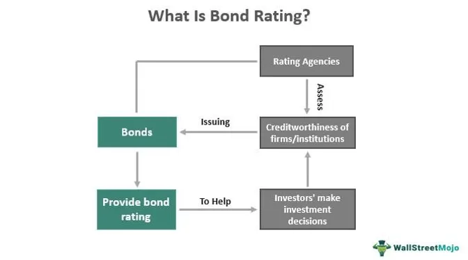

The modern financial landscape has been significantly transformed by algorithmic trading, which offers unparalleled efficiency and speed in executing trades. This technological advancement allows for the handling of large volumes of transactions, effectively optimizing market liquidity and narrowing bid-ask spreads. Nonetheless, these benefits are accompanied by an increased risk of legal challenges, particularly when bond covenants are violated. A bond covenant is a legally binding term of agreement between a bond issuer and bondholder, underscoring the issuer's financial commitments and obligations. Violations of these covenants can lead to severe financial implications, litigation, and market instability.

Algorithmic trading is inherently complex due to its reliance on sophisticated pre-programmed software, which can operate beyond human capability. It introduces potential vulnerabilities, such as coding errors, system failures, and unforeseen market conditions, that could inadvertently lead to covenant breaches. Violations may arise if the trading algorithms prompt financial actions contravening agreed terms, or in scenarios where non-financial defaults occur, such as in performance, maintenance, or construction bonds.

This article aims to explore the intricate intersection between bond violations and algorithmic trading, emphasizing the consequent legal processes involved. We will discuss the definition of bond violations, explore their occurrence alongside algorithmic trading operations, and detail their potential repercussions. The goal is to offer a comprehensive understanding of this complex subject, which is highly relevant for investors navigating high-frequency trading environments, regulators striving to uphold market integrity, and legal professionals involved in adjudicating financial disputes. The balance between technological innovation and regulatory oversight in modern markets requires vigilant examination and strategic foresight to safeguard all market participants.

## Table of Contents

## Understanding Bond Violations

A bond violation refers to the breach of legal covenants designed to protect both issuers and holders of bonds by maintaining the trust and the agreed-upon terms. These covenants are essential for ensuring the stability and predictability of financial agreements. Violations can arise from financial actions by issuers, such as failing to meet debt service requirements, or from non-financial defaults, which can include failing to comply with reporting obligations. Additionally, bond violations are not limited to financial securities; they extend to non-financial defaults in contexts like bail bonds.

Different types of bonds are subject to various potential violations, with performance, maintenance, and construction bonds among the most common. Performance bonds assure that contractors complete projects according to the terms of their contracts. A violation occurs if a contractor fails to meet the specified performance criteria, potentially leading to financial claims or legal action. Maintenance bonds guarantee the upkeep of a project for a specified period after its completion. Breaching these may result in financial liabilities if the required maintenance standards are not met.

Construction bonds, among the most prevalent in infrastructure projects, ensure project completion and compensate project owners in case of contractor failure. Breaches in such bonds can lead to significant legal implications, as they often involve substantial financial and operational disruptions. For instance, incomplete infrastructure projects due to fund mismanagement or insolvency can result in lengthy litigation processes and financial losses for all stakeholders involved.

In financial contexts, bond violations often result in severe legal consequences. Bondholders may resort to litigation to recover their investments or enforce their rights. These proceedings can be complex, involving assessments of covenant terms, interpretations of contractual obligations, and evaluations of financial performance indicators. Furthermore, regulatory bodies may also impose penalties on issuers for violating statutory requirements related to bonds, potentially affecting their market reputation and financial stability.

The legal implications of bond violations necessitate comprehensive understanding and careful risk management by all involved parties. Financial institutions and investors are often required to develop robust compliance frameworks to monitor adherence to covenants and to implement timely corrective measures in case of potential breaches. Understanding these various dimensions is critical for stakeholders in navigating the legal and financial risks associated with bond violations.

## Algorithmic Trading: An Overview

Algorithmic trading, a significant advancement within the financial markets, employs pre-programmed software to execute trades at speeds and frequencies that surpass human capability. This approach utilizes algorithms to decide the timing, price, and quantity of orders based on a variety of market indicators. By leveraging large datasets and rapid decision-making processes, [algorithmic trading](/wiki/algorithmic-trading) enhances market efficiency and [liquidity](/wiki/liquidity-risk-premium), often improving price discovery and reducing transaction costs.

Despite these advantages, algorithmic trading presents several complexities, primarily due to the inherent risks associated with technology. Errors in algorithmic systems can occur due to bugs in the code or insufficient testing, leading to unintended trading behaviors. System failures or incomplete data feeds can exacerbate these risks, resulting in significant financial losses and market disruptions. For instance, a software bug might trigger a cascade of trades that violates bond covenants by breaching set risk limits or altering the creditworthiness of issuers.

Moreover, unexpected market conditions, such as sudden [volatility](/wiki/volatility-trading-strategies) spikes, can further complicate algorithmic operations. Algorithms, operating on historical datasets and predicted models, can find it challenging to adapt instantly to such rapid changes without robust safeguards in place. These scenarios potentially lead to situations where bond covenants are unintentionally violated, invoking legal scrutiny and potential investigations.

The legal implications of such disruptions are profound. Unintended trading activities that lead to breaches of financial agreements can attract lawsuits or regulatory penalties. The reputational impact on firms involved in such transgressions can also be severe, potentially affecting long-term business relationships and market credibility.

To mitigate these risks, strong compliance frameworks within organizations are vital. These frameworks should encompass comprehensive testing protocols, augmented by real-time monitoring and risk management systems. They aim to ensure algorithms adhere to pre-defined parameters and respond appropriately to changing market conditions. Proactive measures such as regular audits, code reviews, and stress testing of trading systems can significantly reduce the probability of errors that might lead to bond covenant violations. 

Furthermore, collaboration between financial institutions and regulators in establishing guidelines for algorithmic trading is crucial. Such efforts should focus on creating standardized practices that promote transparency, enhance risk controls, and ensure algorithmic strategies remain compliant with existing financial regulations. These measures not only safeguard market integrity but also protect the interests of investors and uphold the stability of financial systems.

## Legal Processes in the Event of Bond Violations

In the context of bonds, legal processes are crucial for resolving disputes that arise from violations. These processes ensure that the agreements between bond issuers and holders are maintained, thereby upholding market stability. The legal framework encompasses various adjudication mechanisms to address breaches effectively, ranging from mediation to litigation, based on the severity and impact of the bond violation.

Adjudication processes for bond violations typically begin with an assessment of the nature of the breach. If a bond issuer fails to meet the financial or contractual obligations specified in the bond indenture, it initiates a structured legal response. Financial institutions and brokers that facilitate bond trading may be implicated, particularly if violations are caused by or relate to algorithmic trading.

One primary method for resolving disputes is mediation. Mediation serves as a non-binding and cost-effective procedure where involved parties work with a neutral mediator to negotiate a settlement. It is often preferred for minor infractions, where parties seek to maintain professional relationships and avoid court proceedings.

For more severe violations, arbitration can be employed. Arbitration involves one or more arbitrators who render a binding decision after reviewing the evidence and hearing arguments. The process is more formal than mediation but less so than litigation, offering a private and efficient way to resolve disputes without going to court.

Litigation, the most formal approach, involves taking legal action through the courts. It is typically reserved for substantial breaches where significant financial loss or systemic risks are involved. Litigation can lead to public trials, extensive legal costs, and potentially damaging publicity. Nevertheless, it provides a definitive legal resolution with the potential for appeals.

In cases of bond violations linked to algorithmic trading, specifically, regulators may impose penalties or sanctions against institutions for failing to maintain adequate compliance controls. This could include fines, restrictions on trading activities, or revocation of licenses in extreme cases. Given the complexity of algorithmic systems, thorough investigations are often required to discern whether violations were due to technical malfunctions or negligence.

Understanding these legal processes is vital for stakeholders, including regulators, financial institutions, and investors. Effective resolution of bond violations helps in maintaining market trust and stability. For actors within the financial markets, proactive measures such as developing robust compliance frameworks and risk assessment tools are essential. This can prevent potential violations and mitigate impacts should breaches occur, thus safeguarding stakeholders' interests and maintaining the integrity of financial markets.

## Case Studies in Bond Violations and Algo Trading

Real-world examples of bond violations involving algorithmic trading illustrate the significant impact of these issues on financial markets. One prominent case is the incident involving Knight Capital Group in August 2012, which highlights the critical need for robust risk management and compliance strategies within algorithmic trading systems.

In the Knight Capital Group case, a software glitch in the company's trading algorithms caused a massive disruption in the market. The algorithms, which were not properly tested, executed millions of erratic trades, leading to a $440 million loss for the company within just 45 minutes. This incident underscores the importance of thorough testing and validation of trading algorithms to prevent similar occurrences. Furthermore, it demonstrates the necessity of implementing effective risk management frameworks to quickly identify and mitigate unintended trading behaviors before they result in substantial financial damage.

The regulatory response to the Knight Capital Group incident included increased scrutiny by financial authorities, such as the Securities and Exchange Commission (SEC), over algorithmic trading practices. The SEC has since emphasized the importance of maintaining comprehensive risk controls, a mandate reflected in the Rule 15c3-5, which enforces financial institutions to have pre-trade risk management controls. The adjudication process also involved substantial financial penalties for Knight Capital and led to significant changes in industry practices, fostering a culture of continued vigilance and improvement in compliance frameworks.

These case studies highlight the lessons learned from past failures and the changes implemented to bolster market integrity. One key takeaway is the emphasis on real-time monitoring and robust system checks to swiftly identify and rectify errors as they arise. Additionally, fostering an organizational culture that prioritizes risk management and regulatory compliance is vital to preemptively address potential violations.

The outcomes of these incidents have profoundly influenced the direction of regulatory policies and technological advancements in the field of algorithmic trading. They serve as instructive examples for stakeholders, demonstrating the catastrophic impacts of ignoring risk management and the need for ongoing diligence to safeguard financial markets against such occurrences.

## Future Directions and Conclusion

The future of algorithmic trading is increasingly intertwined with technological innovations that enhance compliance and risk management. One significant development is the application of [artificial intelligence](/wiki/ai-artificial-intelligence) (AI) in trading systems. AI algorithms can analyze vast datasets more efficiently than traditional methods, potentially identifying market anomalies that signal bond violations. This capability not only aids in proactive risk management but also contributes to more accurate and timely decision-making processes, ultimately improving compliance with financial regulations.

Blockchain technology also serves as a promising solution for enhancing transparency in trading activities. Its decentralized nature ensures that all transactions are recorded in an immutable and transparent ledger, which can be pivotal in reducing the complexity of dispute resolution. By utilizing smart contracts, blockchain can automate compliance checks and manage covenant terms, thereby minimizing human error and the chances of breaches.

Given the global nature of financial markets, there is an urgent need for collaborative regulatory frameworks that transcend national borders. Such frameworks would be designed to address the dynamics of a globalized trading environment, ensuring that regulations keep pace with technological advancements. International cooperation among regulatory bodies, alongside the development of standardized regulatory practices, can foster a more resilient trading ecosystem.

Ensuring the integrity and stability of financial markets requires a continuous evolution of legal processes. This evolution is necessary to cope with the rapid pace of innovation in algorithmic trading. Regulatory frameworks must be flexible enough to adapt to new technologies while stringent enough to maintain market discipline. Incorporating regular assessments and updates to legal structures can help mitigate risks associated with evolving trading methods.

In conclusion, the future landscape of algorithmic trading will likely be shaped by the balance between innovation and regulation. Technologies like AI and blockchain offer valuable tools for improving transparency, compliance, and risk management in trading. However, their integration into financial markets necessitates ongoing adjustments to regulatory frameworks. By fostering a collaborative approach to regulation and innovation, stakeholders can protect market participants and ensure the enduring stability of global financial systems.

## References & Further Reading

1. **Books and Academic Texts:**
   - *Algorithmic Trading and DMA: An Introduction to Direct Access Trading Strategies* by Barry Johnson - A comprehensive guide on algorithmic trading strategies and their applications in financial markets.
   - *Bond Markets, Analysis, and Strategies* by Frank J. Fabozzi - This book provides detailed insights into the functioning of bond markets, including the legal frameworks governing bond covenants.
   - *Market Microstructure Invariants: Theory and Empirical Testing* by Joel Hasbrouck - Offers an in-depth analysis of market structures, relevant for understanding the implications of algorithmic trading on bond markets.

2. **Journal Articles:**
   - Chaboud, Alain P., et al. "Rise of the Machines: Algorithmic Trading in the Foreign Exchange Market." Journal of Finance, vol. 65, no. 5, 2010, pp. 2045–2084. This article examines the impact of algorithmic trading on financial market efficiency and stability.
   - Easley, David, et al. "From Mining to Markets: The Evolution of Benchmark Price Formation in Algorithmic Trading." Journal of Economic Dynamics and Control, vol. 68, 2016, pp. 38–60. Discusses the transition from traditional trading to algorithmic trading and its effects on market dynamics.
   - Hendershott, Terrence, et al. "Algorithmic Trading and Information." The Journal of Finance, vol. 66, no. 1, 2011, pp. 1–33. This study focuses on the informational role of algorithmic trading in financial markets.

3. **Regulatory Guides and Documents:**
   - **U.S. Securities and Exchange Commission (SEC):** Visit the SEC’s official website for up-to-date regulatory guidelines on algorithmic trading, including risk management practices and legal requirements for bond issuers. [SEC Website](https://www.sec.gov)
   - **Financial Industry Regulatory Authority (FINRA):** Offers resources and information on compliance requirements for trading practices, including algorithmic trading. [FINRA Website](https://www.finra.org)
   - **International Organization of Securities Commissions (IOSCO):** Provides reports on global regulatory approaches to managing algorithmic trading risks. [IOSCO Website](https://www.iosco.org)

4. **Online Articles and Reports:**
   - "Algorithmic Trading: Examining the Impact of Computer-Generated Trading on Investors and Markets" - A comprehensive report by the U.S. Commodity Futures Trading Commission that discusses the effects of algorithmic trading on market practices.
   - "Risk Management and Regulatory Compliance in Algorithmic Trading" by Deloitte - Offers insights into regulatory measures and compliance strategies in the context of algorithmic trading.
   - "The Role of Bond Covenants in Corporate Finance" by McKinsey Quarterly - Examines the significance of bond covenants and the legal implications of their violation in corporate finance.

5. **Further Reading:**
   - Explore publications from the National Bureau of Economic Research (NBER) and the European Securities and Markets Authority (ESMA) for scholarly articles and data-driven research on algorithmic trading and bond covenant violations.
   - Online platforms such as JSTOR and SSRN provide access to a wide array of academic articles pertinent to financial legalities and trading technologies.

This collection of resources will facilitate a deeper understanding of bond violations and algorithmic trading, offering diverse perspectives from academic research to regulatory frameworks.

