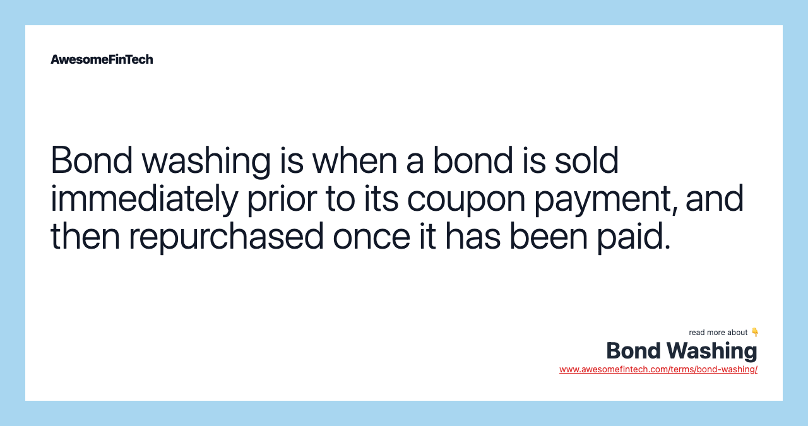

## Table of Contents

## What is bond washing in the context of fixed income markets?

Bond washing is a strategy used in the fixed income markets to reduce tax liabilities. It involves selling a bond just before it pays out its interest, and then immediately buying it back. By doing this, the investor can claim a tax deduction on the loss from selling the bond, while still receiving the interest payment when they buy it back. This practice is considered a form of tax avoidance and is often frowned upon by tax authorities.

In many countries, bond washing is illegal because it's seen as a way to unfairly reduce taxes. Tax laws are designed to prevent this kind of behavior, and there are often strict rules in place to stop it. If someone is caught doing bond washing, they could face penalties or fines. It's important for investors to understand these rules and follow them to avoid getting into trouble.

## Why do investors engage in bond washing?

Investors engage in bond washing mainly to save on taxes. By selling a bond just before it pays interest and then buying it back, they can claim a loss on their taxes. This loss can reduce the amount of taxes they have to pay. For example, if an investor sells a bond for less than they bought it and then buys it back, they can report that loss and lower their taxable income.

Even though bond washing can save money on taxes, it's often against the law. Many countries have rules that stop this kind of tax avoidance. If investors get caught doing bond washing, they might have to pay fines or other penalties. So, while it might seem like a smart way to save money, it's risky and can lead to big problems.

## How does bond washing work as a tax avoidance strategy?

Bond washing is a way some investors try to pay less in taxes. They do this by selling a bond right before it pays interest, and then buying it back right away. By selling the bond at a lower price than they bought it, they can claim a loss on their taxes. This loss helps lower their taxable income, so they pay less tax. The trick is, they still get the interest payment when they buy the bond back, so they keep making money from the bond.

But, bond washing is often against the law. Many countries have rules to stop this kind of tax trick. If someone gets caught doing bond washing, they could get in big trouble, like having to pay fines or other penalties. So, even though it might seem like a smart way to save money, it's risky and can lead to serious problems. It's important for investors to follow the tax rules to stay out of trouble.

## What are the legal and ethical implications of bond washing?

Bond washing is often illegal because it's a way to avoid paying taxes that people should pay. Many countries have rules that say you can't sell a bond just to claim a loss and then buy it back to get the interest. If someone does bond washing and gets caught, they might have to pay big fines or face other punishments. The laws are there to make sure everyone pays their fair share of taxes, and bond washing goes against this idea.

On the ethical side, bond washing raises questions about fairness and honesty. It's seen as a sneaky way to get around paying taxes, which can make people feel that it's not right. When some people use tricks like bond washing, it can make others feel that the tax system isn't fair. This can lead to a loss of trust in the system and make it harder for everyone to follow the rules. So, even if someone might not get caught, doing bond washing can still be seen as wrong by others.

## Can you explain the process of bond washing with a simple example?

Imagine you bought a bond for $1,000, and it's about to pay you $50 in interest. Instead of waiting for the interest, you sell the bond to a friend for $950 just before the interest payment. Now, you can claim a $50 loss on your taxes because you sold the bond for less than you bought it. Right after selling it, you buy the bond back from your friend for $950. When the interest payment comes, you still get the $50 because you own the bond again.

This trick is called bond washing. You used it to lower your taxes by claiming a loss, but you still got the interest money. However, many places don't allow bond washing because it's seen as cheating on taxes. If you get caught doing this, you might have to pay fines or face other punishments. It's important to follow the tax rules to avoid getting into trouble.

## What are the risks associated with bond washing?

Bond washing can get you into big trouble with the law. Many countries say it's not allowed because it's a way to cheat on taxes. If you get caught doing bond washing, you might have to pay fines or even face other punishments. The laws are there to make sure everyone pays their fair share of taxes, and bond washing goes against this idea. So, even if you think you won't get caught, it's a risky thing to do.

There are also ethical problems with bond washing. It's seen as a sneaky way to avoid paying taxes, which can make people feel that it's not right. When some people use tricks like bond washing, it can make others feel that the tax system isn't fair. This can lead to a loss of trust in the system and make it harder for everyone to follow the rules. So, even if you might not get caught, doing bond washing can still be seen as wrong by others.

## How do regulations around the world treat bond washing?

Many countries have strict rules against bond washing because it's seen as a way to cheat on taxes. In places like the United States, the UK, and Australia, there are laws that stop people from selling a bond just to claim a loss and then buying it back to get the interest. These countries have rules called "wash sale" rules that say you can't do this. If someone breaks these rules, they might have to pay big fines or face other punishments. The idea is to make sure everyone pays their fair share of taxes and doesn't use tricks to avoid them.

Even though the rules can be different in each country, the main idea is the same: bond washing is not allowed. Some countries might have different ways of catching people who do bond washing, but they all agree that it's wrong. This is because bond washing can make the tax system seem unfair, and it can make people lose trust in the system. So, it's important for investors to know the rules in their country and follow them to stay out of trouble.

## What measures have been implemented by financial authorities to curb bond washing?

Financial authorities around the world have put in place strict rules to stop bond washing. They call these rules "wash sale" rules. These rules say that if you sell a bond and buy it back within a short time, you can't claim a tax loss. This is to make sure people can't trick the tax system by selling a bond just before it pays interest and then buying it back. Countries like the United States, the UK, and Australia have these rules to make sure everyone pays their fair share of taxes.

To catch people who might be doing bond washing, financial authorities use different ways to watch what investors are doing. They look at how often people are buying and selling the same bonds and check if it looks like they're trying to avoid taxes. If they find someone doing bond washing, they can make them pay fines or face other punishments. This helps keep the tax system fair and makes sure people don't use tricks to get out of paying taxes.

## How can bond washing impact the overall fixed income market?

Bond washing can mess up the fixed income market by making it less fair. When people use bond washing to avoid taxes, it can make other investors feel that the market isn't honest. This can lead to less trust in the market. If a lot of people start doing bond washing, it could make the market seem like a place where only people who know the tricks can make money. This can scare away honest investors who want to play by the rules.

To stop bond washing, financial authorities have strict rules and watch the market closely. When they catch people doing bond washing, they make them pay fines or face other punishments. This helps keep the fixed income market fair and honest. By making sure everyone follows the rules, the market stays a good place for people to invest their money without worrying about others cheating.

## What are the differences between bond washing and other tax evasion strategies in fixed income?

Bond washing is a specific tax evasion strategy in the fixed income market where an investor sells a bond just before it pays interest, claims a tax loss, and then buys the bond back to still receive the interest payment. This trick is meant to lower the investor's taxes by claiming a loss, but it's often against the law. Many countries have rules called "wash sale" rules that stop people from doing this because it's seen as cheating on taxes.

Other tax evasion strategies in fixed income might include things like hiding income, using offshore accounts, or misreporting bond transactions. These strategies can also be illegal and can lead to big fines or other punishments if someone gets caught. Unlike bond washing, which focuses on selling and buying back the same bond, these other strategies might involve different ways to avoid paying taxes, like not telling the tax authorities about all the money you made from bonds.

Both bond washing and other tax evasion strategies can hurt the fairness of the fixed income market. When people use these tricks, it can make others feel that the market isn't honest. This can lead to less trust in the market and make it harder for everyone to follow the rules. Financial authorities work hard to stop these practices by watching the market closely and punishing those who break the rules.

## How has technology and financial innovation affected the prevalence of bond washing?

Technology and financial innovation have made it easier for people to do bond washing. With computers and the internet, it's quicker to buy and sell bonds. This means someone can sell a bond and buy it back in just a few seconds. Also, new financial tools and apps make it easier to keep track of when bonds are going to pay interest. This can help people plan when to do bond washing to try and save on taxes. But, because it's easier to do, more people might try it, which can make financial authorities watch more closely for this kind of tax trick.

On the other hand, technology has also helped financial authorities catch people who do bond washing. They use special computer programs to watch the market and see if anyone is selling and buying the same bonds in a short time. These programs can find patterns that might mean someone is trying to avoid taxes. So, while technology might make bond washing easier, it also makes it harder to get away with. This can help keep the fixed income market fair and honest for everyone.

## What are some advanced strategies that investors might use to optimize bond washing?

Some investors might try to use advanced strategies to make bond washing work better for them. One way is to use different accounts to sell and buy back the same bond. They might sell the bond from one account and then buy it back in another account, thinking this makes it harder for tax authorities to catch them. Another strategy could be timing the sales and purchases very carefully, using computer programs to do it quickly and at the right time just before the interest payment. This can help them claim the biggest tax loss possible while still getting the interest.

But, even with these advanced strategies, bond washing is still risky. Financial authorities use their own advanced technology to watch for these tricks. They have computer programs that can spot when someone is selling and buying the same bond in a short time, even if it's across different accounts. If someone gets caught doing bond washing, they could face big fines or other punishments. So, while these strategies might seem smart, they can lead to serious problems if they're found out.

## What is the understanding of Fixed Income and Bonds?

Fixed income securities, particularly bonds, are financial instruments that provide investors with a regular income stream through interest payments. Bonds are issued by various entities, including governments, municipalities, and corporations, and are used as a mechanism for raising capital. Their importance lies in their ability to mitigate portfolio volatility and deliver a dependable income, making them a staple in diversified investment portfolios.

### Key Characteristics of Bonds

Bonds possess several defining features that influence their behavior as investment instruments:

- **Maturity**: The maturity date of a bond signifies when the principal amount is due to be repaid to the bondholder. Bond maturities can range from a few months to several decades, with longer maturities often offering higher yields to compensate for the increased risk associated with the extended time frame.

- **Coupon Rate**: The coupon rate is the interest rate that the bond issuer agrees to pay the bondholder, typically expressed as a percentage of the bond's face value. This rate determines the periodic interest payments made to investors, providing a steady income. For example, a bond with a face value of $1,000 and a coupon rate of 5% would pay $50 annually.

- **Yield to Maturity (YTM)**: YTM represents the total return an investor can expect to receive if the bond is held until its maturity date, assuming that all payments are made as scheduled. It takes into account the bond's current market price, coupon payments, and time to maturity. The formula to calculate YTM involves solving for $y$ in the present value equation:
$$
  P = \sum_{t=1}^{T} \frac{C}{(1+y)^t} + \frac{F}{(1+y)^T}

$$

  Where $P$ is the price of the bond, $C$ is the annual coupon payment, $F$ is the face value, $T$ is the time to maturity, and $y$ is the yield to maturity.

### Role in Portfolio Stabilization

Bonds play an essential role in reducing the [volatility](/wiki/volatility-trading-strategies) of investment portfolios. Unlike equities, bonds often maintain or increase in value during economic downturns, providing stability. This inverse relationship with equities enhances diversification, as the consistent income from bonds can counterbalance stock market fluctuations.

### Comparison with Other Fixed Income Assets

Bonds are distinct from other fixed income assets such as preferred stocks and certificates of deposit (CDs):

- **Preferred Stocks**: These provide dividends that may be more variable than bond interest payments. Preferred stockholders have a higher claim on assets than common stockholders but are subordinate to bondholders.

- **Certificates of Deposit (CDs)**: Offered by banks, CDs involve depositing a sum for a fixed term, receiving interest. They are seen as low-risk investments but typically offer lower returns compared to long-term bonds.

Bonds, with their range of maturities and yields, offer a versatile means for investors to shape their income profile and risk exposure. Understanding these fundamental characteristics helps investors to strategically incorporate bonds into their financial plans, optimizing stability and income generation.

## References & Further Reading

Barbara S. Petitt and Jerald E. Pinto's book, "Fixed Income Analysis," provides a comprehensive guide to understanding the complexities of fixed income securities. It covers fundamental concepts such as interest rate risk, bond pricing mechanisms, and portfolio construction techniques, thus serving as an essential resource for those keen on mastering fixed income investments.

Annette Thau's "The Bond Book: Everything Investors Need to Know" offers a beginner-friendly yet detailed exploration of bond investing. It addresses the intricacies of bond types, including government, municipal, and corporate bonds, emphasizing practical insights for investors to effectively navigate fixed income markets.

Ernest P. Chan's "Algorithmic Trading: Winning Strategies" examines the transformative role of algorithmic trading in modern financial markets. Chan explores various algorithmic strategies, discussing their implementation using quantitative models and programming languages like Python. This resource is invaluable for individuals looking to harness computational techniques for enhanced trading decision-making.

Marcos Lopez de Prado's "Advances in Financial Machine Learning" investigates into the intersection of machine learning and finance. The work provides insights into how machine learning can be applied for analyzing financial data, optimizing trading strategies, and improving market predictions, highlighting the sophisticated tools driving contemporary algorithmic trading.

Salih N. Neftci's "Principles of Financial Engineering" serves as an authoritative text on the design and application of financial instruments and derivatives. It covers mathematical models and practical strategies to manage financial risks and create innovative trading solutions, making it a crucial reference for financial engineers and investors alike.

