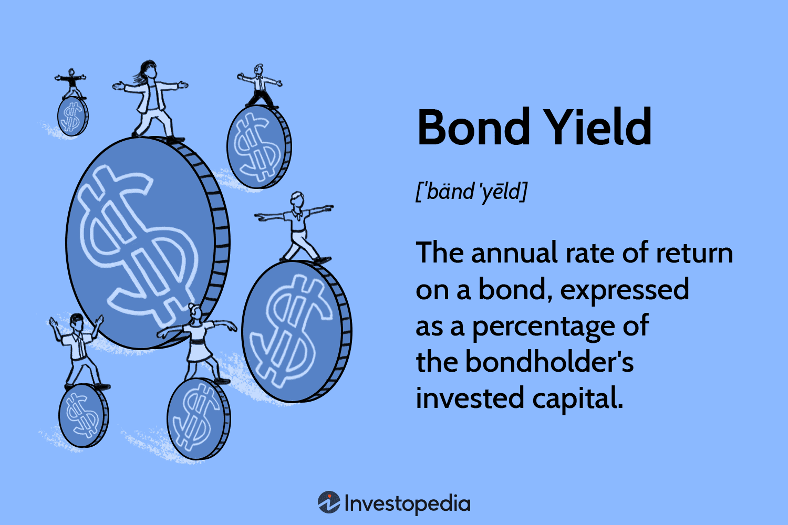

## Table of Contents

## What is a bond yield?

A bond yield is like the return you get on a loan you give to a company or government. When you buy a bond, you're essentially lending money, and the bond yield tells you how much you'll earn from that loan over time. It's usually shown as a percentage and can change based on things like how safe the bond is or how long you have to wait before getting your money back.

There are different ways to figure out a bond yield. The most common one is the yield to maturity, which looks at the total interest you'll earn if you keep the bond until it's paid off. Another way is the current yield, which just looks at the yearly interest you get compared to the bond's price right now. Understanding these can help you decide if a bond is a good investment for you.

## Why is bond yield important for investors?

Bond yield is important for investors because it tells them how much money they can expect to earn from a bond. This is like knowing the interest rate on a savings account. When you know the yield, you can compare different bonds and see which one might give you a better return on your money. It helps you decide if a bond is a good investment or if you should look for something else.

Also, bond yields can show how safe an investment is. If a bond has a high yield, it might mean the bond is riskier because the company or government has to offer more to get people to buy it. On the other hand, a low yield might mean the bond is safer. By looking at the yield, investors can balance the risk and reward of their investments and make smarter choices about where to put their money.

## How is the nominal yield of a bond calculated?

The nominal yield of a bond is the [interest rate](/wiki/interest-rate-trading-strategies) that the bond pays each year. It's also called the coupon rate. To find the nominal yield, you just look at the yearly interest payment the bond gives you and divide it by the bond's face value, which is the amount you get back when the bond matures. For example, if a bond has a face value of $1,000 and pays $50 in interest each year, the nominal yield would be 5% because $50 divided by $1,000 is 0.05, or 5%.

The nominal yield is important because it tells you the basic return you can expect from the bond, but it doesn't take into account things like the bond's price changes or how long you have to wait to get your money back. So, while it's a simple way to see what a bond pays, investors often look at other yields like the yield to maturity or current yield to get a fuller picture of what they might earn.

## What is the difference between yield to maturity and current yield?

Yield to maturity and current yield are both ways to figure out how much money you might make from a bond, but they look at things a bit differently. Yield to maturity is the total return you would get if you held onto the bond until it matures. It takes into account all the interest payments you'll receive, plus any difference between the price you paid for the bond and its face value when it matures. This makes yield to maturity a more complete picture of what you might earn over the life of the bond.

Current yield, on the other hand, is simpler and only looks at the yearly interest payment compared to the bond's current price. If a bond pays $50 a year in interest and you bought it for $1,000, the current yield would be 5%. This yield doesn't consider how long you have to wait for your money back or any changes in the bond's price over time. So, while current yield is easier to calculate, yield to maturity gives you a better idea of the bond's total return if you keep it until the end.

## How does the bond's coupon rate affect its yield?

The coupon rate of a bond is the yearly interest payment it gives you, shown as a percentage of its face value. If you have a bond with a $1,000 face value and a 5% coupon rate, you get $50 each year. This coupon rate directly affects the bond's yield because it's the main part of the interest you earn. If the bond's price stays the same as its face value, the coupon rate and the yield will be the same. But if the bond's price changes, the yield will be different from the coupon rate.

When the bond's price goes up or down, it changes the yield. If you buy the same $1,000 bond for $900 because its price dropped, you still get $50 a year, but now your yield is higher because you paid less for the bond. The yield to maturity will be even higher because it also counts the extra $100 you'll get when the bond matures. On the other hand, if you pay $1,100 for the bond, your yield drops because you're getting the same $50 on a bigger investment. So, the coupon rate sets the base for the yield, but the bond's price really decides how much you earn.

## What factors influence changes in bond yields?

Changes in bond yields can happen because of many different things. One big reason is how the economy is doing. When the economy is strong and growing, people might think that inflation will go up. To fight inflation, the central bank might raise interest rates. When interest rates go up, new bonds have to offer more to attract buyers, so the yields on existing bonds go up too. On the flip side, if the economy is not doing well, the central bank might lower interest rates to help it grow. This makes bond yields go down because new bonds don't need to offer as much to get people to buy them.

Another [factor](/wiki/factor-investing) that changes bond yields is how safe people think the bond is. If a company or government seems risky, investors will want a higher yield to take that risk. So, if something happens that makes people think a bond is riskier, like a company not doing well or a country having political problems, the yield on that bond will go up. But if the bond is seen as very safe, like a bond from a strong government, the yield will be lower because people don't need as much to invest in it.

Lastly, how much people want to buy bonds can also change yields. If everyone wants to buy bonds, the price of the bonds goes up, and the yield goes down. But if no one wants to buy bonds, the price goes down, and the yield goes up. This can happen because of things like changes in the stock market or other investment options. If stocks are doing really well, people might move their money there instead of buying bonds, which would push bond yields up.

## How can bond yields indicate economic conditions?

Bond yields can show us a lot about how the economy is doing. When the economy is growing and people think there might be more inflation, the central bank might raise interest rates to keep prices from going up too fast. This makes new bonds have to pay more interest to get people to buy them, so the yields on existing bonds go up too. On the other hand, if the economy is not doing well, the central bank might lower interest rates to help it grow. This means new bonds don't have to offer as much to get buyers, so bond yields go down. By looking at bond yields, we can get clues about what the central bank might be thinking and how the economy is doing.

Another way bond yields can show economic conditions is by how safe people think the bonds are. If a bond's yield goes up a lot, it might mean people think the company or government that issued the bond is riskier. This can happen if a company is not doing well or if a country is having political problems. On the other hand, if bond yields are low, it might mean people think the bond is very safe, like a bond from a strong government. So, changes in bond yields can tell us about how confident people are in the economy and in the companies or governments that issue the bonds.

## What is the yield curve and how does it relate to bond yields?

The yield curve is a graph that shows the yields of bonds with different times until they mature. It's like a line that goes up or down depending on whether short-term bonds or long-term bonds are paying more interest. Usually, the yield curve goes up, which means long-term bonds have higher yields than short-term ones. This makes sense because if you're lending your money for a longer time, you want to get paid more for it.

But sometimes, the yield curve can do weird things. If it starts to go flat or even turns upside down, where short-term bonds have higher yields than long-term ones, it can be a sign that people are worried about the economy. An upside-down yield curve has often happened before the economy goes into a recession. So, by looking at the yield curve, you can get a good idea of what people think about the future of the economy and how bond yields might change.

## How do you calculate the yield to call on a callable bond?

The yield to call on a callable bond is like figuring out how much money you'll make if the bond gets called back by the company before it's supposed to mature. To find this, you need to know the bond's current price, the call price (which is what the company pays if they call the bond), and how much time is left until they can call it. You also need to know the coupon payments you'll get until the call date. It's a bit like doing a puzzle because you have to guess a rate that makes the present value of all the money you'll get from the bond equal to what you paid for it.

To actually do the math, you can use a financial calculator or a computer program because it's pretty tricky to do by hand. You start with a guess for the yield to call, then you adjust it until the present value of the bond's cash flows matches its price. The yield to call is important because it helps you see if you might be better off if the bond gets called early. If the yield to call is lower than the yield to maturity, it means you might not make as much money if the bond is called back sooner than expected.

## What are the tax implications of bond yields?

When you earn money from bonds, you have to think about taxes. The interest you get from most bonds, like corporate bonds or municipal bonds that are not from your state, is usually taxed as regular income. This means you have to pay taxes on that interest money every year, just like you do with your job. The tax rate depends on how much money you make overall, so if you're in a higher tax bracket, you'll pay more taxes on your bond interest.

But there's a special kind of bond called a municipal bond. If you buy a municipal bond from your own state, the interest you earn might not be taxed by the federal government, and sometimes not by your state either. This can make these bonds a good choice if you want to keep more of your money. Just remember, even though the interest might not be taxed, if you sell the bond for more than you paid for it, you might have to pay capital gains tax on that profit.

## How do bond yields compare across different countries?

Bond yields can be different from one country to another because of things like how strong the country's economy is, how much inflation there is, and how safe people think the country's bonds are. For example, if a country has a lot of debt and people think it might not be able to pay it back, the yields on its bonds will be higher. This is because investors want more money to take the risk of lending to that country. On the other hand, if a country is seen as very safe, like the United States or Germany, the yields on its bonds will be lower because people don't need as much to invest in them.

Another thing that affects bond yields across countries is what the central bank in each country is doing. If a central bank raises interest rates to fight inflation, the yields on that country's bonds will go up. But if another country's central bank is lowering rates to help its economy grow, the yields on its bonds will go down. So, when you look at bond yields from different countries, you're really seeing a mix of how each country's economy is doing and what its central bank is trying to do about it.

## What advanced strategies can investors use to optimize bond yield returns?

Investors can use a few smart tricks to get the most out of their bond yields. One way is called "laddering." This means buying bonds that mature at different times, like having some that pay off in a year, some in two years, and so on. By doing this, you can take advantage of higher yields when interest rates go up, and you also get your money back at different times, which can help you plan better. Another trick is to look for bonds that are undervalued, which means they might be selling for less than they're really worth. If you can find these, you might get a higher yield than you expected.

Another strategy is to use bond funds or ETFs, which are like baskets of different bonds. These can help you spread out your risk because you're not putting all your money into one bond. Plus, they can be easier to buy and sell than individual bonds. Some investors also use a technique called "duration matching," where they try to match the time their bonds will mature with when they need the money. This can help them avoid losing money if interest rates change a lot. By using these strategies, investors can try to get the best returns from their bonds while also managing their risks.

## What is a Bond Yield?

A bond yield is a vital financial metric that quantifies the return an investor can expect from holding a bond until its maturity. It is crucial in assessing the potential profitability of fixed-income securities and plays a significant role in investment decision-making processes. Expressed as a percentage, bond yield represents the annual income generated by a bond, divided by its current market price or its face value. 

There are several types of bond yields, each offering a distinct perspective on bond valuation and expected returns. The most common include:

1. **Coupon Yield**: This reflects the bond's annual coupon payments as a percentage of its face value. The formula for the coupon yield is:
$$
   \text{Coupon Yield} = \left( \frac{\text{Annual Coupon Payment}}{\text{Face Value of the Bond}} \right) \times 100

$$

2. **Current Yield**: Unlike the coupon yield, the current yield considers the bond's current market price. It is calculated using:
$$
   \text{Current Yield} = \left( \frac{\text{Annual Coupon Payment}}{\text{Market Price of the Bond}} \right) \times 100

$$

3. **Yield to Maturity (YTM)**: YTM is a more comprehensive measure, accounting for all future coupon payments, as well as any gain or loss that an investor will realize if the bond is held to maturity. The YTM calculation involves solving an equation for the discount rate that equates the present value of the bond's future cash flows to its current price. The formula cannot be solved algebraically in simple terms and usually requires iterative methods or financial calculators:
$$
   \text{Price} = \sum \left( \frac{\text{Coupon Payment}}{(1 + \text{YTM})^t} \right) + \frac{\text{Face Value}}{(1 + \text{YTM})^T}

$$

   where $t$ is each time period and $T$ is the maturity period.

Understanding these different types of yields is crucial for investors, as they provide insight into the expected rate of return, investment risks, and how bonds are priced in the current market. Each yield type offers specific information that aids in evaluating the financial attractiveness and potential risks associated with bond investments.

## How can one understand bond yield calculations?

Bond yield calculations are essential for investors seeking to understand the potential returns from a bond investment. The process begins by identifying the bond's coupon rate, which is the fixed annual interest paid by the bond's issuer to the bondholder. This coupon rate is typically expressed as a percentage of the bond's face value (par value).

### Current Yield

The current yield provides a measure of the income (interest or dividends) generated by the bond relative to its current market price. The formula for calculating the current yield is:

$$
\text{Current Yield} = \frac{\text{Annual Coupon Payment}}{\text{Market Price of the Bond}}
$$

For example, if a bond has an annual coupon payment of $50 and is trading in the market at $1,000, the current yield would be:

$$
\text{Current Yield} = \frac{50}{1000} = 0.05 \, \text{or} \, 5\%
$$

### Yield to Maturity (YTM)

Yield to maturity (YTM) is a more comprehensive measure that calculates the total return anticipated on a bond if it is held until it matures. It encompasses all future coupon payments and accounts for the gain or loss incurred if the bond was purchased at a price different from its face value.

The YTM calculation generally requires solving the following equation for YTM, where $C$ is the annual coupon payment, $F$ is the face value of the bond, $P$ is the price paid for the bond, and $n$ is the number of years until maturity:

$$
P = \sum_{t=1}^{n} \frac{C}{(1 + \text{YTM})^t} + \frac{F}{(1 + \text{YTM})^n}
$$

Given the complexity, this equation is usually solved using numerical methods or financial calculators.

### Bond Equivalent Yield (BEY)

Bond Equivalent Yield (BEY) is used primarily for comparing bonds with different compounding periods. It annualizes the yield of a bond with more frequent interest payments to make it comparable to bonds with standard annual payments. The formula is:

$$
\text{BEY} = \left( \frac{\text{Semi-Annual Coupon Payment} / \text{Bond Price}}{1 - \left(\frac{1}{1 + \frac{\text{YTM Semi-Annual}}{2}}\right)} \right) \times 2
$$

### Effective Annual Yield (EAY)

Effective Annual Yield (EAY) provides a way to account for compounding interest when analyzing bond yields. If interest is compounded more frequently, EAY reflects the equivalent yield on an annual basis. The formula for calculating the EAY from the nominal yield is:

$$
\text{EAY} = \left(1 + \frac{\text{Nominal Rate}}{n}\right)^n - 1
$$

where $n$ is the number of compounding periods per year.

In summary, understanding bond yield calculations is crucial for determining the profitability and relative attractiveness of bond investments. They offer insights into the expected returns and help investors make informed decisions about portfolio management.

## What are investment returns and why are they important?

Investment returns represent the monetary outcome of investing capital, encompassing both profits and losses. Accurately calculating these returns is crucial for effective performance analysis, asset allocation, and strategic decision-making. Various methods exist for measuring investment returns, each offering unique insights into the investment's performance.

**Absolute Returns**: This method quantifies the total return an investment earns over a period, expressed in monetary terms or as a percentage. It is a straightforward calculation that does not take into account external benchmarks or market conditions. The formula for absolute return is:

$$
\text{Absolute Return} = \frac{\text{End Value} - \text{Beginning Value}}{\text{Beginning Value}} \times 100
$$

**Relative Returns**: Relative returns compare the performance of an investment to a benchmark or index, providing a context to assess how well an investment has performed relative to the broader market. This method is useful for evaluating fund managers' performance and identifying outperforming or underperforming investments.

$$
\text{Relative Return} = \frac{\text{Investment Return} - \text{Benchmark Return}}{\text{Benchmark Return}} \times 100
$$

**Risk-Adjusted Returns**: These returns take into account the risk involved in achieving a particular return, aiming to provide a more comprehensive assessment of investment performance. Commonly used risk-adjusted metrics include the Sharpe Ratio, which measures the excess return per unit of risk, and the Treynor Ratio, which evaluates return per unit of systematic risk. The Sharpe Ratio is calculated using the formula:

$$
\text{Sharpe Ratio} = \frac{R_p - R_f}{\sigma_p}
$$

where $R_p$ is the portfolio return, $R_f$ is the risk-free rate, and $\sigma_p$ is the standard deviation of the portfolio's excess return.

Understanding these methods is vital in assessing the success of any investment strategy. Accurate measurement of returns allows investors to evaluate performance against objectives, adjust asset allocations, and refine strategies to better align with financial goals. These calculations not only provide insights into historical performance but also guide future investment decisions, offering a structured approach to achieving desired investment outcomes.

## How can integrating bond yields and algorithmic trading lead to optimal investment performance?

Integrating bond yield calculations with [algorithmic trading](/wiki/algorithmic-trading) is a strategy that leverages advanced technological capabilities to enhance investment portfolio management. This synergy allows investors to systematically evaluate bond yields and execute trades that align with their investment goals, providing a structured approach to handling complex market dynamics.

**Analyzing Bond Yields with Technology**

Bond yield calculations involve metrics like the coupon yield, current yield, and yield to maturity (YTM). Each of these provides a distinct view of a bond’s return characteristics. For instance, YTM is calculated by solving the equation:

$$
P = \frac{C}{(1+r)^1} + \frac{C}{(1+r)^2} + \ldots + \frac{C+F}{(1+r)^n}
$$

where $P$ is the current market price, $C$ is the annual coupon payment, $F$ is the face value of the bond, $n$ is the number of years until maturity, and $r$ is the yield to maturity. Utilizing technology, investors can automate this complex calculation across a portfolio of bonds with varying attributes, informing more nuanced trading decisions.

**The Role of Algorithmic Trading**

Algorithmic trading employs computer programs to parse vast sets of market data, identifying patterns and executing trades based on pre-set criteria. These algorithms can process information at a speed and scale impossible for human traders, offering a competitive advantage. Algorithmic models can adapt to include bond yields as parameters, adjusting trading actions in real time as yield conditions change.

**Real-Time Decision-Making**

The integration of bond yield metrics into algorithmic trading platforms enhances real-time decision-making capabilities. By embedding real-time data on yield fluctuations within the algorithmic framework, the system can react to market movements with precision and speed, executing trades that optimize financial outcomes almost instantaneously. This minimizes delays between market fluctuations and transactional responses, potentially capitalizing on transient opportunities.

**Implementing the Integration**

To realize this integration, investors can employ programming languages like Python, utilizing libraries such as NumPy or pandas for data manipulation and analysis. The following Python pseudocode illustrates a simple framework:

```python
import numpy as np

# Sample bond data
market_price = np.array([950, 980, 990])
coupon_payment = np.array([50, 40, 45])
face_value = np.array([1000, 1000, 1000])
years_to_maturity = np.array([5, 10, 15])

# Function to calculate yield to maturity
def calculate_ytm(P, C, F, n):
    ytm_func = lambda r: sum([C / (1 + r)**i for i in range(1, n + 1)]) + F / (1 + r)**n - P
    return optimize.newton(ytm_func, 0.05)  # Newton's method

ytm = [calculate_ytm(market_price[i], coupon_payment[i], face_value[i], years_to_maturity[i]) for i in range(len(market_price))]
```

This code can be expanded and refined to implement automated trading strategies, incorporating real-time data feeds and executing trades based on predetermined yield thresholds.

**Achieving Investment Goals**

By comprehensively understanding bond yields and employing algorithmic trading, investors can create highly resilient strategies. Automated processes and systematic yield analysis facilitate informed decision-making, elevating portfolio performance. As technology continues to advance, these integrated approaches will remain pivotal in navigating increasingly sophisticated financial markets.

## References & Further Reading

[1]: Fabozzi, F. J., Pollack, I. M., & Fabozzi, F. J. (2005). ["Bond Markets, Analysis, and Strategies."](https://books.google.com/books/about/Bond_Markets_Analysis_and_Strategies_ten.html?id=bQpNEAAAQBAJ) Pearson Education.

[2]: Brandt, M. W. (2010). ["Portfolio Choice Problems."](https://www.sciencedirect.com/science/article/pii/B9780444508973500080) In Aït-Sahalia, Y., & Hansen, L. P. (eds.), Handbook of Financial Econometrics: Tools and Techniques. Elsevier.

[3]: Humphrey, J. E., & Soffer, L. C. (2011). ["Bond Math: The Theory Behind the Formulas."](https://onlinelibrary.wiley.com/doi/pdf/10.1002/9781118268001.fmatter) John Wiley & Sons.

[4]: Farlex Financial Dictionary. ["Current Yield."](https://financial-dictionary.thefreedictionary.com/current+yield) (2012).

[5]: Kissell, R. (2013). ["The Science of Algorithmic Trading and Portfolio Management."](https://www.sciencedirect.com/book/9780124016897/the-science-of-algorithmic-trading-and-portfolio-management) Academic Press.