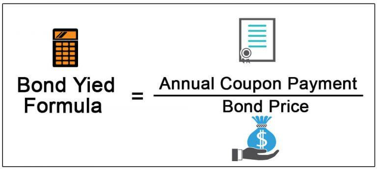

Understanding the complex landscape of investment strategies can significantly enhance portfolio returns. In today's financial environment, three core components—bond yields, investment returns, and algorithmic trading—play a pivotal role in shaping effective investment strategies. Bond yields, representing the return an investor earns from holding bonds, serve as a crucial indicator of potential income from fixed-income securities. Investment returns, defined by the profit or loss from capital investments, are essential for assessing the efficacy of any investment strategy through methods such as absolute and risk-adjusted returns.

Algorithmic trading, leveraging advanced computer programs to execute trades at high speeds, has redefined the efficiency and scope of trading strategies. These algorithms harness complex mathematical models to make rapid and informed trading decisions, thereby enhancing market efficiency and trading precision.



This article aims to clarify the mechanics of bond yield calculations and the importance of evaluating investment returns while introducing algorithmic trading's transformative role in optimizing financial gains. By exploring these integral aspects, readers will gain valuable insights into maximizing financial growth, regardless of whether they are seasoned investors or just embarking on their investment journey.

Through examining fundamental principles, performing essential calculations, and understanding real-world applications, this article seeks to equip you with the knowledge to navigate and capitalize on the intricacies of modern financial strategies.

## Table of Contents

## What is a Bond Yield?

A bond yield is a vital financial metric that quantifies the return an investor can expect from holding a bond until its maturity. It is crucial in assessing the potential profitability of fixed-income securities and plays a significant role in investment decision-making processes. Expressed as a percentage, bond yield represents the annual income generated by a bond, divided by its current market price or its face value. 

There are several types of bond yields, each offering a distinct perspective on bond valuation and expected returns. The most common include:

1. **Coupon Yield**: This reflects the bond's annual coupon payments as a percentage of its face value. The formula for the coupon yield is:
$$
   \text{Coupon Yield} = \left( \frac{\text{Annual Coupon Payment}}{\text{Face Value of the Bond}} \right) \times 100

$$

2. **Current Yield**: Unlike the coupon yield, the current yield considers the bond's current market price. It is calculated using:
$$
   \text{Current Yield} = \left( \frac{\text{Annual Coupon Payment}}{\text{Market Price of the Bond}} \right) \times 100

$$

3. **Yield to Maturity (YTM)**: YTM is a more comprehensive measure, accounting for all future coupon payments, as well as any gain or loss that an investor will realize if the bond is held to maturity. The YTM calculation involves solving an equation for the discount rate that equates the present value of the bond's future cash flows to its current price. The formula cannot be solved algebraically in simple terms and usually requires iterative methods or financial calculators:
$$
   \text{Price} = \sum \left( \frac{\text{Coupon Payment}}{(1 + \text{YTM})^t} \right) + \frac{\text{Face Value}}{(1 + \text{YTM})^T}

$$

   where $t$ is each time period and $T$ is the maturity period.

Understanding these different types of yields is crucial for investors, as they provide insight into the expected rate of return, investment risks, and how bonds are priced in the current market. Each yield type offers specific information that aids in evaluating the financial attractiveness and potential risks associated with bond investments.

## Understanding Bond Yield Calculations

Bond yield calculations are essential for investors seeking to understand the potential returns from a bond investment. The process begins by identifying the bond's coupon rate, which is the fixed annual interest paid by the bond's issuer to the bondholder. This coupon rate is typically expressed as a percentage of the bond's face value (par value).

### Current Yield

The current yield provides a measure of the income (interest or dividends) generated by the bond relative to its current market price. The formula for calculating the current yield is:

$$
\text{Current Yield} = \frac{\text{Annual Coupon Payment}}{\text{Market Price of the Bond}}
$$

For example, if a bond has an annual coupon payment of $50 and is trading in the market at $1,000, the current yield would be:

$$
\text{Current Yield} = \frac{50}{1000} = 0.05 \, \text{or} \, 5\%
$$

### Yield to Maturity (YTM)

Yield to maturity (YTM) is a more comprehensive measure that calculates the total return anticipated on a bond if it is held until it matures. It encompasses all future coupon payments and accounts for the gain or loss incurred if the bond was purchased at a price different from its face value.

The YTM calculation generally requires solving the following equation for YTM, where $C$ is the annual coupon payment, $F$ is the face value of the bond, $P$ is the price paid for the bond, and $n$ is the number of years until maturity:

$$
P = \sum_{t=1}^{n} \frac{C}{(1 + \text{YTM})^t} + \frac{F}{(1 + \text{YTM})^n}
$$

Given the complexity, this equation is usually solved using numerical methods or financial calculators.

### Bond Equivalent Yield (BEY)

Bond Equivalent Yield (BEY) is used primarily for comparing bonds with different compounding periods. It annualizes the yield of a bond with more frequent interest payments to make it comparable to bonds with standard annual payments. The formula is:

$$
\text{BEY} = \left( \frac{\text{Semi-Annual Coupon Payment} / \text{Bond Price}}{1 - \left(\frac{1}{1 + \frac{\text{YTM Semi-Annual}}{2}}\right)} \right) \times 2
$$

### Effective Annual Yield (EAY)

Effective Annual Yield (EAY) provides a way to account for compounding interest when analyzing bond yields. If interest is compounded more frequently, EAY reflects the equivalent yield on an annual basis. The formula for calculating the EAY from the nominal yield is:

$$
\text{EAY} = \left(1 + \frac{\text{Nominal Rate}}{n}\right)^n - 1
$$

where $n$ is the number of compounding periods per year.

In summary, understanding bond yield calculations is crucial for determining the profitability and relative attractiveness of bond investments. They offer insights into the expected returns and help investors make informed decisions about portfolio management.

## Investment Returns and Their Importance

Investment returns represent the monetary outcome of investing capital, encompassing both profits and losses. Accurately calculating these returns is crucial for effective performance analysis, asset allocation, and strategic decision-making. Various methods exist for measuring investment returns, each offering unique insights into the investment's performance.

**Absolute Returns**: This method quantifies the total return an investment earns over a period, expressed in monetary terms or as a percentage. It is a straightforward calculation that does not take into account external benchmarks or market conditions. The formula for absolute return is:

$$
\text{Absolute Return} = \frac{\text{End Value} - \text{Beginning Value}}{\text{Beginning Value}} \times 100
$$

**Relative Returns**: Relative returns compare the performance of an investment to a benchmark or index, providing a context to assess how well an investment has performed relative to the broader market. This method is useful for evaluating fund managers' performance and identifying outperforming or underperforming investments.

$$
\text{Relative Return} = \frac{\text{Investment Return} - \text{Benchmark Return}}{\text{Benchmark Return}} \times 100
$$

**Risk-Adjusted Returns**: These returns take into account the risk involved in achieving a particular return, aiming to provide a more comprehensive assessment of investment performance. Commonly used risk-adjusted metrics include the Sharpe Ratio, which measures the excess return per unit of risk, and the Treynor Ratio, which evaluates return per unit of systematic risk. The Sharpe Ratio is calculated using the formula:

$$
\text{Sharpe Ratio} = \frac{R_p - R_f}{\sigma_p}
$$

where $R_p$ is the portfolio return, $R_f$ is the risk-free rate, and $\sigma_p$ is the standard deviation of the portfolio's excess return.

Understanding these methods is vital in assessing the success of any investment strategy. Accurate measurement of returns allows investors to evaluate performance against objectives, adjust asset allocations, and refine strategies to better align with financial goals. These calculations not only provide insights into historical performance but also guide future investment decisions, offering a structured approach to achieving desired investment outcomes.

## The Role of Algorithmic Trading

Algorithmic trading leverages advanced computer algorithms to execute trading strategies with remarkable speed and precision. These algorithms are designed to analyze massive datasets, extracting actionable insights from complex market trends and patterns. The core mechanism involves the application of mathematical models that process real-time market data, enabling the automated execution of buy and sell orders with minimal latency.

A significant advantage of [algorithmic trading](/wiki/algorithmic-trading) is its ability to enhance the efficiency of trading operations. By automating the decision-making process, algorithms bypass human limitations, reducing the time taken to respond to market changes. This not only speeds up trading activities but also improves [liquidity](/wiki/liquidity-risk-premium) and narrows bid-ask spreads, resulting in cost savings for traders.

Furthermore, algorithmic trading provides a higher degree of market analysis capability. Algorithms can process and analyze vast quantities of historical and current market data, identifying patterns and correlations that might be missed by human traders. This analytical power allows for the identification of [arbitrage](/wiki/arbitrage) opportunities and facilitates the execution of complex strategies such as [statistical arbitrage](/wiki/statistical-arbitrage), pairs trading, and market-making.

Moreover, the automated nature of algorithmic trading significantly minimizes human error. Trading algorithms operate based on predetermined criteria and models, reducing the emotional and psychological influences that often lead to suboptimal trading decisions. This leads to more consistent and disciplined execution of trading strategies.

As technology advances, the scope of algorithmic trading continues to expand, integrating [artificial intelligence](/wiki/ai-artificial-intelligence) and [machine learning](/wiki/machine-learning) to enhance its predictive capabilities. These technologies enable more adaptive algorithms that learn from past data to predict future market movements more accurately. Here is a simple example of a mathematical approach commonly used in algorithmic trading: 

```python
import numpy as np

# Example: Moving Average Crossover Strategy
prices = np.array([100, 102, 104, 103, 105, 107, 106])  # Historical price data
short_window = 3
long_window = 5

# Calculate short-term and long-term moving averages
short_moving_avg = np.convolve(prices, np.ones(short_window)/short_window, mode='valid')
long_moving_avg = np.convolve(prices, np.ones(long_window)/long_window, mode='valid')

# Generate buy/sell signals based on moving average crossover
signals = np.where(short_moving_avg[-len(long_moving_avg):] > long_moving_avg, 'Buy', 'Sell')
print("Trade Signals:", signals)
```

The application of such algorithms in trading is redefining how portfolios are managed and optimized. By automating repetitive tasks and continuously monitoring market conditions, algorithmic trading ensures that strategies evolve and adapt to new market dynamics. In this way, it forms a crucial component of modern trading systems, offering investors the tools needed to achieve optimized returns in increasingly competitive and fast-paced financial markets.

## Integrating Bond Yields and Algorithmic Trading for Optimal Investment Performance

Integrating bond yield calculations with algorithmic trading is a strategy that leverages advanced technological capabilities to enhance investment portfolio management. This synergy allows investors to systematically evaluate bond yields and execute trades that align with their investment goals, providing a structured approach to handling complex market dynamics.

**Analyzing Bond Yields with Technology**

Bond yield calculations involve metrics like the coupon yield, current yield, and yield to maturity (YTM). Each of these provides a distinct view of a bond’s return characteristics. For instance, YTM is calculated by solving the equation:

$$
P = \frac{C}{(1+r)^1} + \frac{C}{(1+r)^2} + \ldots + \frac{C+F}{(1+r)^n}
$$

where $P$ is the current market price, $C$ is the annual coupon payment, $F$ is the face value of the bond, $n$ is the number of years until maturity, and $r$ is the yield to maturity. Utilizing technology, investors can automate this complex calculation across a portfolio of bonds with varying attributes, informing more nuanced trading decisions.

**The Role of Algorithmic Trading**

Algorithmic trading employs computer programs to parse vast sets of market data, identifying patterns and executing trades based on pre-set criteria. These algorithms can process information at a speed and scale impossible for human traders, offering a competitive advantage. Algorithmic models can adapt to include bond yields as parameters, adjusting trading actions in real time as yield conditions change.

**Real-Time Decision-Making**

The integration of bond yield metrics into algorithmic trading platforms enhances real-time decision-making capabilities. By embedding real-time data on yield fluctuations within the algorithmic framework, the system can react to market movements with precision and speed, executing trades that optimize financial outcomes almost instantaneously. This minimizes delays between market fluctuations and transactional responses, potentially capitalizing on transient opportunities.

**Implementing the Integration**

To realize this integration, investors can employ programming languages like Python, utilizing libraries such as NumPy or pandas for data manipulation and analysis. The following Python pseudocode illustrates a simple framework:

```python
import numpy as np

# Sample bond data
market_price = np.array([950, 980, 990])
coupon_payment = np.array([50, 40, 45])
face_value = np.array([1000, 1000, 1000])
years_to_maturity = np.array([5, 10, 15])

# Function to calculate yield to maturity
def calculate_ytm(P, C, F, n):
    ytm_func = lambda r: sum([C / (1 + r)**i for i in range(1, n + 1)]) + F / (1 + r)**n - P
    return optimize.newton(ytm_func, 0.05)  # Newton's method

ytm = [calculate_ytm(market_price[i], coupon_payment[i], face_value[i], years_to_maturity[i]) for i in range(len(market_price))]
```

This code can be expanded and refined to implement automated trading strategies, incorporating real-time data feeds and executing trades based on predetermined yield thresholds.

**Achieving Investment Goals**

By comprehensively understanding bond yields and employing algorithmic trading, investors can create highly resilient strategies. Automated processes and systematic yield analysis facilitate informed decision-making, elevating portfolio performance. As technology continues to advance, these integrated approaches will remain pivotal in navigating increasingly sophisticated financial markets.

## Challenges and Considerations

Despite the potential advantages in investment management offered by bond yield calculations and algorithmic trading, there are significant challenges that investors must navigate. Market [volatility](/wiki/volatility-trading-strategies) is a predominant concern, as rapid fluctuations can destabilize pricing models and lead to unexpected outcomes in bond valuations and trading strategies. For instance, sudden [interest rate](/wiki/interest-rate-trading-strategies) hikes can affect bond yields negatively, while algorithmic trading systems might trigger a cascade of trades that amplify market movements, as witnessed during flash crashes.

Regulatory constraints also pose challenges. As markets evolve, regulatory bodies enforce rules to ensure transparency and fairness, but these can sometimes limit the flexibility of algorithmic trading systems. Compliance with these regulations requires constant monitoring and updates to algorithms, which can be resource-intensive.

Technology limitations are another hurdle. Algorithmic trading relies heavily on advanced computing infrastructure and real-time data processing. Any lag in data feeds or system malfunctions can lead to suboptimal trading decisions. Investors are thus compelled to invest in robust and resilient technological solutions to support their trading activities.

Ongoing education is essential for investors. The financial landscape, influenced by economic indicators, central bank policies, and geopolitical events, is continuously changing. Staying updated with market trends, regulatory changes, and technological advancements is crucial for mitigating risks.

In conclusion, while bond yield calculations and algorithmic trading offer enhanced investment opportunities, navigating the challenges of market volatility, regulatory constraints, and technological limitations is critical. By considering these factors, investors can better manage risks and optimize their investment outcomes.

## Conclusion

The integration of bond yields and algorithmic trading marks a significant advancement in investment management, offering a comprehensive approach to optimizing portfolio performance. Understanding how to calculate and utilize bond yields equips investors with valuable insights into fixed-income investments. By grasping concepts such as yield to maturity and current yield, investors can make informed decisions about bond investments, evaluate potential returns, and assess relative value compared to other asset classes.

Algorithmic trading, on the other hand, bolsters trading efficiency by employing computer programs to execute predefined strategies at superior speeds and accuracy. This technological enhancement facilitates the analysis of vast quantities of market data and aids in executing trades that are aligned with precise investment goals. The automation and speed provided by algorithmic trading allow investors to respond more swiftly to market fluctuations, potentially capturing opportunities that manual trading might miss.

By mastering both bond yield calculations and algorithmic trading techniques, investors are better positioned to navigate the complexities of the financial markets. This dual understanding can lead to more informed and agile investment strategies, ultimately enhancing portfolio performance. As financial markets continue to evolve with technological advancements, the synergistic application of these concepts is likely to play a pivotal role in achieving higher returns and mitigating risks associated with market volatility. This proactive approach not only opens new avenues for reaching investment objectives but also underscores the importance of continuous learning and adaptation in the dynamic environment of modern finance.

## References & Further Reading

[1]: Fabozzi, F. J., Pollack, I. M., & Fabozzi, F. J. (2005). ["Bond Markets, Analysis, and Strategies."](https://books.google.com/books/about/Bond_Markets_Analysis_and_Strategies_ten.html?id=bQpNEAAAQBAJ) Pearson Education.

[2]: Brandt, M. W. (2010). ["Portfolio Choice Problems."](https://www.sciencedirect.com/science/article/pii/B9780444508973500080) In Aït-Sahalia, Y., & Hansen, L. P. (eds.), Handbook of Financial Econometrics: Tools and Techniques. Elsevier.

[3]: Humphrey, J. E., & Soffer, L. C. (2011). ["Bond Math: The Theory Behind the Formulas."](https://onlinelibrary.wiley.com/doi/pdf/10.1002/9781118268001.fmatter) John Wiley & Sons.

[4]: Farlex Financial Dictionary. ["Current Yield."](https://financial-dictionary.thefreedictionary.com/current+yield) (2012).

[5]: Kissell, R. (2013). ["The Science of Algorithmic Trading and Portfolio Management."](https://www.sciencedirect.com/book/9780124016897/the-science-of-algorithmic-trading-and-portfolio-management) Academic Press.