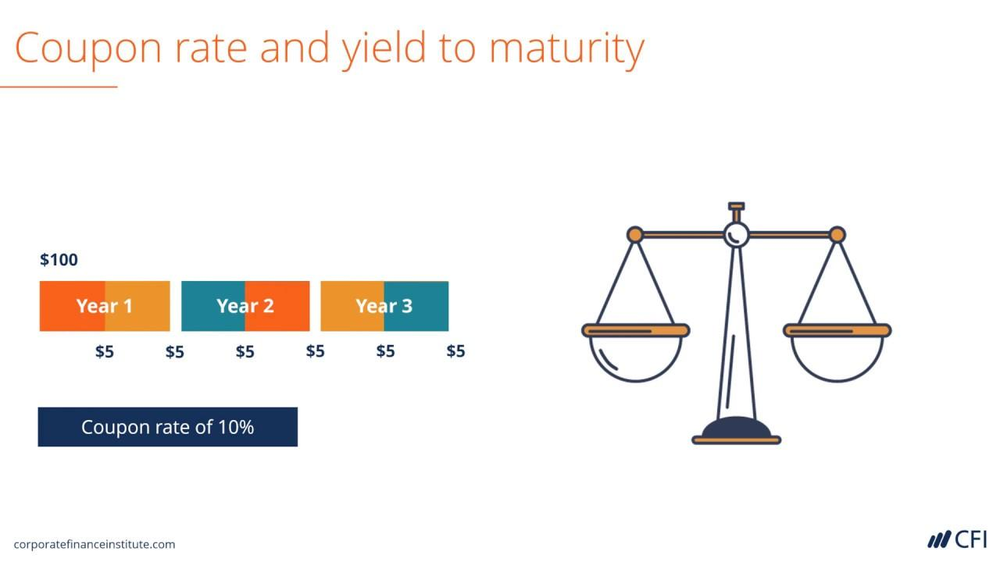

## Table of Contents

## What is a bond?

A bond is like a loan that you give to a big company or the government. When you buy a bond, you are lending them money. In return, they promise to pay you back the money you lent them, plus a little extra, after a certain amount of time. This extra money is called interest. It's a way for companies and governments to borrow money from people like you to do big projects or run their operations.

Bonds are considered safer than other types of investments like stocks. This is because the company or government has to pay you back, no matter what happens to their business. But, if they can't pay you back, you might lose your money. That's why it's important to check how likely they are to pay you back before you buy a bond. Different bonds can have different levels of risk and different amounts of interest.

## What is the coupon rate of a bond?

The coupon rate of a bond is like the interest rate you get for lending your money. It's a percentage of the bond's face value, which is the amount you get back when the bond matures. For example, if you buy a bond with a face value of $1,000 and a coupon rate of 5%, you'll get $50 every year until the bond matures.

The coupon rate is important because it tells you how much money you'll earn from the bond each year. This rate stays the same for the entire time you own the bond, so you know exactly what to expect. If the coupon rate is high, you'll earn more money, but if it's low, you'll earn less. It's one of the key things to look at when deciding if a bond is a good investment for you.

## What is bond yield?

Bond yield is like the return you get on your money when you buy a bond. It's different from the coupon rate because it takes into account the price you paid for the bond and how much time is left until the bond matures. If you buy a bond for less than its face value, your yield will be higher than the coupon rate because you're getting the same interest payments but you paid less for the bond.

There are different ways to calculate bond yield, but the most common one is called the yield to maturity (YTM). This tells you the total return you can expect if you hold the bond until it matures. It includes all the interest payments you'll get and any gain or loss from the difference between what you paid for the bond and its face value. So, bond yield is a useful number to know because it helps you compare different bonds and see which ones might give you a better return on your money.

## How is the coupon rate determined?

The coupon rate of a bond is decided by the people who issue the bond, like a company or the government. They look at a lot of things to figure out what the coupon rate should be. One big thing they look at is the interest rates that are happening right now in the economy. If interest rates are high, they might set a higher coupon rate to make their bond look good compared to other investments. They also think about how risky their bond is. If people think there's a bigger chance the company might not be able to pay back the bond, they'll want a higher coupon rate to make up for that risk.

Another thing that can affect the coupon rate is how long the bond will last before it matures. Bonds that take longer to mature might have a higher coupon rate because people want more money for waiting longer to get their money back. The credit rating of the company or government issuing the bond also plays a role. A high credit rating means they're seen as safe, so they might not need to offer a high coupon rate. But if their credit rating is low, they'll probably need to offer a higher coupon rate to attract investors. All these things together help decide what the coupon rate will be.

## What factors influence bond yield?

Bond yield is affected by many things. One big thing is the price you pay for the bond. If you buy a bond for less than its face value, the yield goes up because you're getting the same interest payments but you paid less for the bond. On the other hand, if you pay more than the face value, the yield goes down. The time left until the bond matures also matters. If there's a lot of time left, the yield might be different than if the bond is about to mature soon.

Another thing that changes bond yield is the interest rates in the economy. When interest rates go up, new bonds usually have higher coupon rates, which can make older bonds with lower coupon rates less attractive. This can cause the price of those older bonds to drop, which in turn raises their yield. The opposite happens when interest rates go down. The credit rating of the bond issuer also plays a role. If a company or government is seen as risky, investors will want a higher yield to take on that risk. So, a lower credit rating usually means a higher yield.

Lastly, the overall demand for bonds can influence yield. If lots of people want to buy bonds, the price might go up, which can lower the yield. But if fewer people want to buy bonds, the price might go down, which can raise the yield. All these factors together help decide what the bond yield will be, and it's important to think about them when you're looking at bonds as an investment.

## How do you calculate the yield of a bond?

Calculating the yield of a bond can seem tricky, but it's really about figuring out the return you'll get on your money. The most common way to do this is by finding the yield to maturity (YTM). This is the total return you can expect if you hold the bond until it matures. To find the YTM, you need to know the bond's current price, its face value, the coupon rate, and how long until it matures. Then, you use a formula or a financial calculator to work out the YTM. It takes into account all the interest payments you'll get over time and any gain or loss from the difference between what you paid for the bond and its face value.

Another way to calculate yield is the current yield, which is simpler but doesn't give you the full picture. The current yield is just the annual interest payment divided by the bond's current market price. For example, if a bond pays $50 a year in interest and you bought it for $1,000, the current yield would be 5%. This method is quick and easy, but it doesn't consider the time until the bond matures or any changes in the bond's price. So, while it's a good starting point, the yield to maturity is usually a better way to understand the true return on your bond investment.

## What is the difference between coupon rate and yield?

The coupon rate and the yield of a bond are two different things that can sometimes get mixed up. The coupon rate is like the interest rate you get on a bond. It's a percentage of the bond's face value, and it stays the same for the whole time you own the bond. For example, if you have a bond with a face value of $1,000 and a coupon rate of 5%, you'll get $50 every year until the bond matures. The coupon rate is set when the bond is first issued and doesn't change, so it's easy to know exactly how much money you'll earn each year.

The yield, on the other hand, is the total return you can expect from the bond, and it can change over time. It takes into account the price you paid for the bond, the coupon payments, and how long until the bond matures. The most common way to calculate yield is called the yield to maturity (YTM). If you buy a bond for less than its face value, the yield will be higher than the coupon rate because you're getting the same interest payments but you paid less for the bond. The yield can go up or down depending on things like changes in the bond's price or interest rates in the economy. So, while the coupon rate tells you the interest you'll get, the yield gives you a better idea of the total return on your investment.

## Why might the yield of a bond be different from its coupon rate?

The yield of a bond might be different from its coupon rate because of the price you pay for the bond. If you buy a bond for less than its face value, you're getting the same interest payments but you paid less for the bond. This makes the yield higher than the coupon rate. On the other hand, if you pay more than the face value, the yield will be lower than the coupon rate because you paid more for the same interest payments. So, the price you pay can make the yield different from the coupon rate.

Another reason the yield might be different is because of changes in interest rates in the economy. If interest rates go up, new bonds will have higher coupon rates, making older bonds with lower coupon rates less attractive. This can cause the price of those older bonds to drop, which raises their yield. If interest rates go down, the opposite happens. The yield also depends on how long you have to wait until the bond matures. All these things together can make the yield different from the coupon rate, even though the coupon rate stays the same.

## How does the market price of a bond affect its yield?

The market price of a bond has a big impact on its yield. When you buy a bond for less than its face value, the yield goes up. This is because you're getting the same interest payments, but you paid less for the bond. So, if you buy a bond for $900 that has a face value of $1,000 and a coupon rate of 5%, you'll still get $50 every year, but your yield will be higher than 5% because you paid less. On the other hand, if you buy the bond for more than its face value, the yield goes down. If you pay $1,100 for the same bond, your yield will be lower than 5% because you paid more for the same interest payments.

The market price of a bond can change because of things like interest rates in the economy. If interest rates go up, new bonds will have higher coupon rates, and older bonds with lower coupon rates might not look as good. This can make the price of those older bonds drop, which raises their yield. If interest rates go down, the price of those older bonds might go up, which lowers their yield. So, the market price of a bond and its yield are always connected, and changes in one can affect the other.

## What is the relationship between bond yield and interest rates?

The relationship between bond yield and interest rates is pretty straightforward. When interest rates in the economy go up, new bonds usually have higher coupon rates to stay competitive. This makes older bonds with lower coupon rates less attractive to investors. As a result, the market price of those older bonds goes down. When the price of a bond drops, its yield goes up because you're getting the same interest payments but you paid less for the bond. So, higher interest rates in the economy can lead to higher bond yields.

On the other hand, when interest rates go down, new bonds come with lower coupon rates. This makes older bonds with higher coupon rates more attractive, which can drive up their market price. When the price of a bond goes up, its yield goes down because you're paying more for the same interest payments. So, lower interest rates in the economy can lead to lower bond yields. This seesaw effect between interest rates and bond yields is something to keep in mind when you're thinking about buying or selling bonds.

## How do investors use bond yield versus coupon rate in investment decisions?

Investors use the coupon rate and bond yield to make smart choices about buying bonds. The coupon rate is like the interest rate on the bond. It's the percentage of the bond's face value that you get every year. This rate stays the same no matter what happens to the bond's price. So, if you want to know how much money you'll get each year from the bond, you look at the coupon rate. It's simple and easy to understand, but it doesn't tell you the whole story about how good of an investment the bond might be.

The bond yield, on the other hand, gives you a better idea of the total return you can expect from the bond. It takes into account the price you pay for the bond, the coupon payments, and how long until the bond matures. If you buy a bond for less than its face value, the yield will be higher than the coupon rate because you're getting the same interest payments but you paid less. The yield can change if the bond's price goes up or down or if interest rates in the economy change. So, investors look at the yield to see if a bond is a good deal compared to other investments. It helps them decide if the bond is worth buying or if they should look for something else.

## What advanced strategies involve exploiting differences between bond yield and coupon rate?

Some investors use a strategy called bond trading to make money from the differences between bond yield and coupon rate. They look for bonds that are selling for less than their face value. When they find these bonds, they buy them because the yield will be higher than the coupon rate. Then, they wait for the bond's price to go up. If the price goes up, they can sell the bond for more than they paid for it, making a profit. This strategy works because the yield goes up when the price goes down, and it goes down when the price goes up. So, by buying low and selling high, investors can make money from the changes in yield.

Another strategy is called bond laddering. This is where investors buy a bunch of bonds that mature at different times. They look at the yields of these bonds to pick the best ones. By spreading out when the bonds mature, they can take advantage of changes in interest rates. If rates go up, they can reinvest the money from bonds that mature into new bonds with higher coupon rates and yields. If rates go down, they still have bonds with higher yields from when they bought them. This way, they can balance the risk and get a steady income from their investments. Bond laddering helps investors make the most of the differences between yield and coupon rate over time.

## What is the relationship between bond yield and coupon rate?

A bond's coupon rate is defined as the annual interest rate that the bond issuer agrees to pay to the bondholder relative to its par value, commonly known as the face value. This coupon rate is predetermined and fixed for the duration of the bond's term. For example, a bond with a par value of $1,000 and a coupon rate of 5% would pay $50 annually in interest to the bondholder.

In contrast, bond yield is a measure that reflects the return an investor can expect from holding the bond, taking into account the bond's current market price and its coupon payments. Unlike the fixed coupon rate, the bond yield is variable and responds to changes in market conditions. The yield to maturity (YTM) is a common way to express this return, representing the total return anticipated on the bond if it is held until it matures.

Mathematically, the yield can be calculated using the formula:

$$

\text{YTM} = \frac{C + \frac{(F-P)}{n}}{\frac{(F+P)}{2}} 
$$

Where:
- $C$ is the annual coupon payment,
- $F$ is the face value of the bond,
- $P$ is the current price of the bond, and
- $n$ is the number of years remaining until maturity.

The bond yield is sensitive to the current market price, reflecting the investor's required rate of return. If the bond is sold at a discount (below par value), its yield will be higher than the coupon rate, as the investor benefits from a capital gain upon maturity. Conversely, a bond sold at a premium (above par value) would result in a yield lower than the coupon rate due to the capital loss incurred.

This dynamic interplay between yield and coupon rates underscores their significance in assessing a bond's attractiveness to investors. Bond yields serve as key indicators, adjusting for market fluctuations and providing insights into [interest rate](/wiki/interest-rate-trading-strategies) trends and economic conditions. Savvy investors routinely analyze these variables to gauge the relative attractiveness of bonds and to formulate strategies for maximizing returns while managing risks.

## What are the factors influencing bond yield and coupon rates?

The yield of a bond is significantly influenced by the prevailing interest rate environment. When interest rates rise, the bond's value typically decreases for bonds that have lower coupon rates. As a result, the yield on these existing bonds becomes less attractive compared to newly issued bonds with higher coupon rates. The inverse is true when interest rates fall; existing bonds with higher-than-market coupon rates become more valuable, often increasing their market demand and thus affecting their yield inversely.

The relationship between interest rates and bond prices can be mathematically expressed through the bond price formula, which equates the present value of future cash flows (coupon payments and principal) to the bond's market price. For a bond with a fixed coupon rate, the formula is:

$$
P = \sum_{t=1}^{n} \left( \frac{C}{(1 + r)^t} \right) + \frac{M}{(1 + r)^n}
$$

Where:
- $P$ is the price of the bond
- $C$ is the annual coupon payment
- $r$ is the discount rate or yield
- $M$ is the maturity value of the bond
- $n$ is the total number of periods or years

Further influencing the yield of a bond is its credit rating, a metric that indicates the creditworthiness of the issuer. Essential for gauging risk, credit ratings directly affect both the yield and price of a bond. Bonds with higher risk, indicated by lower credit ratings, typically offer higher yields. This compensates investors for the greater risk of default. Conversely, bonds with high credit ratings — considered safer investments — tend to offer lower yields due to their perceived lower risk.

Credit rating agencies, such as Moody's, S&P Global, and Fitch Ratings, assess the financial stability of bond issuers and assign ratings that impact investor confidence and, consequently, investor demand. For instance, a downgrade in a bond's credit rating can cause its price to drop and consequently increase its yield as investors demand a risk premium.

In summary, bond yields and coupon rates are dynamic metrics influenced by interest rates and credit ratings. Their interplay determines a bond's attractiveness in the market, influencing investor decisions.

## What are the special considerations in bond investing?

Bond investments encompass a wide array of options, each with distinct characteristics influencing tax implications and risk profiles. Three major categories include municipal, corporate, and treasury bonds.

**Municipal Bonds** are issued by local and state governments. One of their appealing features is the tax advantage: interest earned is typically exempt from federal income tax and, in many cases, state and local taxes if the investor resides in the issuing state. This tax exemption can make municipal bonds particularly attractive to investors in higher tax brackets. However, the relative safety of municipal bonds can vary based on the financial health of the issuing municipality.

**Corporate Bonds** are issued by companies seeking to raise capital. They typically offer higher yields compared to government bonds due to the increased risk of default associated with businesses. The interest from corporate bonds is fully taxable, which investors should consider when evaluating their potential after-tax returns. The credit rating of a corporate bond is a crucial aspect as it indicates the issuer's creditworthiness and stability.

**Treasury Bonds**, issued by the federal government, are considered one of the safest investments due to their backing by the U.S. government. They are subject to federal taxes, but exempt from state and local taxes. While their yields are typically lower due to their safety, they offer a stable investment option.

For a comprehensive assessment of potential returns, investors should be familiar with key concepts such as **Yield to Maturity (YTM)** and **Yield to Call (YTC)**:

- **Yield to Maturity (YTM)** is the total return anticipated on a bond if held until it matures. It accounts for the bond's current market price, par value, coupon interest rate, and the time remaining until maturity. YTM is expressed as an annual rate, and assumes that all coupon payments are reinvested at the same rate. It can be calculated using the formula:
$$
  YTM = \frac{C + \frac{(F - P)}{n}}{\frac{(F + P)}{2}}

$$

  where:
  - $C$ is the annual coupon payment,
  - $F$ is the face value of the bond,
  - $P$ is the price of the bond,
  - $n$ is the number of years to maturity.

- **Yield to Call (YTC)** applies to callable bonds, which the issuer can redeem before maturity at a specified call price. YTC measures the yield of the bond if it is called by the issuer before its maturity date, typically when interest rates decline. The calculation is relatively similar to YTM but factors in the call date and call price instead of the maturity date and face value.

It is vital for investors to understand these concepts to evaluate bonds accurately, given how varying risk levels and tax treatments can significantly influence an investment's overall appeal and financial outcome.

## References & Further Reading

[1]: [Fabozzi, F. J. (2015). "Bond Markets, Analysis, and Strategies"](https://books.google.com/books/about/Bond_Markets_Analysis_and_Strategies_ten.html?id=bQpNEAAAQBAJ) - This book provides a comprehensive overview of the bond market, including discussions on bond yields and coupon rates.

[2]: ["Algorithmic Trading: Winning Strategies and Their Rationale"](https://www.wiley.com/en-us/Algorithmic+Trading%3A+Winning+Strategies+and+Their+Rationale-p-9781118460146) by Ernest P. Chan - Offers an exploration of algorithmic trading strategies applicable to various financial markets.

[3]: ["Fixed Income Securities: Tools for Today's Markets"](https://www.amazon.com/Fixed-Income-Securities-Markets-Finance/dp/1119835550) by Bruce Tuckman and Angel Serrat - This resource provides insight into the valuation of fixed income securities, a cornerstone topic for understanding bond yields and coupon rates.

[4]: ["Inside the Yield Book: The Classic That Created the Science of Bond Analysis"](https://www.amazon.com/Inside-Yield-Book-Classic-Analysis/dp/111839013X) by Sidney Homer and Martin L. Leibowitz - A fundamental text for understanding the impact of interest rates and yield curve on bond pricing and strategies.

[5]: ["The Basics of Algorithmic Trading: Concepts and Examples"](https://www.investopedia.com/articles/active-trading/101014/basics-algorithmic-trading-concepts-and-examples.asp) - A research foundation publication by the CFA Institute, which investigates into the principles and applications of algorithmic trading in modern markets. 