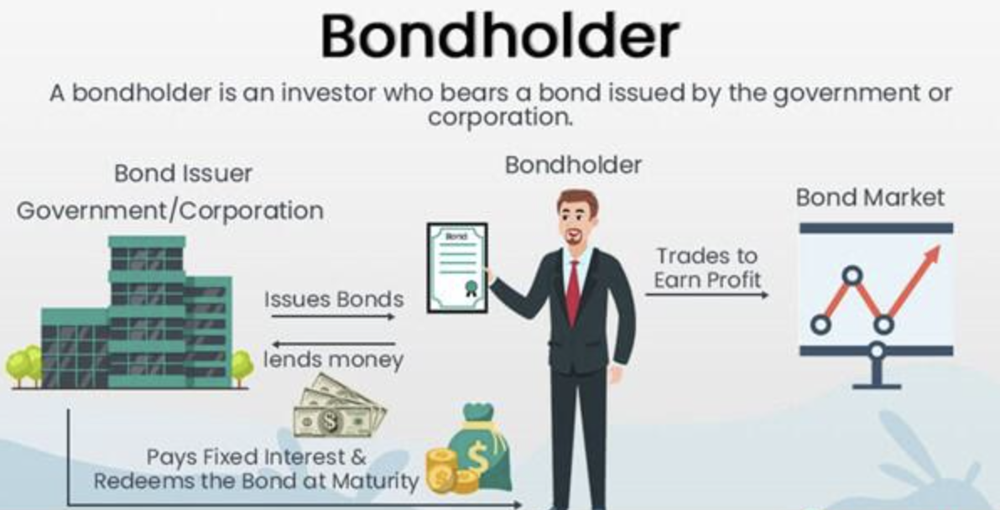

## Table of Contents

## What is a bondholder?

A bondholder is someone who owns a bond. A bond is like a loan that you give to a company or the government. In return, they promise to pay you back the money you lent them, plus some extra money called interest, over a certain period of time.

When you buy a bond, you become a bondholder. This means you have the right to receive the interest payments and get your money back when the bond reaches its end date, which is called the maturity date. Bondholders are important because they help companies and governments raise money to do things like build roads or expand their businesses.

## What are the basic types of bonds?

There are several basic types of bonds that people can invest in. The first type is government bonds. These are issued by governments to raise money for public projects like building schools or highways. They are usually considered safe because the government is less likely to go bankrupt. Examples include U.S. Treasury bonds, which are backed by the full faith and credit of the U.S. government.

Another type is corporate bonds. These are issued by companies to raise money for things like expanding their business or buying new equipment. Corporate bonds can be riskier than government bonds because a company might go bankrupt and not be able to pay back the bondholders. However, they often offer higher interest rates to make up for this risk.

Lastly, there are municipal bonds, which are issued by states, cities, or other local government bodies. They are used to fund local projects like building hospitals or improving water systems. Like government bonds, they are generally seen as safe investments, and they have the added benefit of being tax-exempt, meaning you don't have to pay federal taxes on the interest you earn from them.

## What are the potential rewards of being a bondholder?

Being a bondholder can bring you steady income. When you own a bond, you get regular interest payments, usually every six months or once a year. This money can help you pay your bills or save for something special. It's like getting a little paycheck from the company or government that issued the bond. This steady income is one of the main reasons people like to invest in bonds.

Another reward is that bonds are usually safer than stocks. If you buy a bond from a strong company or the government, it's very likely they will pay you back when the bond matures. This means you get your original money back, plus all the interest you earned along the way. While bonds might not make you rich quickly like some stocks can, they help you keep your money safe and grow it slowly over time.

## What are the main risks associated with holding bonds?

One main risk of holding bonds is that the company or government that issued the bond might not be able to pay you back. This is called default risk. If a company goes bankrupt, it might not have enough money to give you your interest payments or return your original investment. Government bonds are usually safer, but even some countries can struggle to pay their debts. So, it's important to check how strong the issuer is before you buy a bond.

Another risk is interest rate risk. When interest rates in the economy go up, the value of the bonds you already own can go down. This happens because new bonds being issued will have higher interest rates, making your old bonds less attractive to other investors. If you need to sell your bond before it matures, you might have to sell it for less than you paid for it. This risk is more important if you might need your money back before the bond's maturity date.

Inflation risk is also something to think about. Over time, the value of money can go down because of inflation. If the interest rate on your bond is lower than the inflation rate, the money you get back won't be worth as much as when you first invested it. This means your investment might not grow as much as you hoped, and you could lose buying power.

## How do interest rates affect bond prices and yields?

When interest rates go up, the prices of existing bonds usually go down. Here's why: Imagine you bought a bond that pays 2% interest a year. If new bonds start paying 3% interest, people will want those new bonds more because they give more money. To sell your old 2% bond, you might have to lower its price so someone will still want to buy it. The lower the price of a bond, the higher its yield becomes, because the same interest payment is now spread over a smaller investment. So, when interest rates rise, bond prices fall, but their yields go up.

On the other hand, when interest rates go down, the prices of existing bonds usually go up. If new bonds are only paying 1% interest, your old bond paying 2% looks pretty good. People will be willing to pay more for your bond because it gives them more money than the new ones. When the price of a bond goes up, its yield goes down, because the same interest payment is now spread over a bigger investment. So, when interest rates fall, bond prices rise, but their yields go down.

Understanding how interest rates affect bond prices and yields is important for bondholders. If you might need to sell your bond before it matures, changes in interest rates can make a big difference in how much money you get back. If you can hold onto your bond until it matures, you'll get your original investment back plus the interest, no matter what happens to interest rates in between.

## What is the difference between a bond's coupon rate and its yield to maturity?

A bond's coupon rate is the interest rate that the bond issuer promises to pay you every year until the bond matures. It's like the bond's annual paycheck. For example, if you buy a bond with a $1,000 face value and a 5% coupon rate, you'll get $50 every year. The coupon rate stays the same for the whole time you own the bond, unless it's a special kind of bond that changes.

A bond's yield to maturity, or YTM, is different. It's the total return you can expect if you hold the bond until it matures. YTM takes into account not just the coupon payments but also any difference between the price you paid for the bond and its face value at maturity. If you buy the bond for less than its face value, your YTM will be higher than the coupon rate because you'll get a little extra when the bond matures. If you buy it for more than the face value, your YTM will be lower than the coupon rate because you'll get less back than you paid.

So, the coupon rate is like the bond's fixed interest payment, while the yield to maturity is the overall return you'll get, considering both the interest payments and any gain or loss from the bond's price.

## How can bondholders mitigate interest rate risk?

Bondholders can mitigate interest rate risk by building a bond ladder. This means buying bonds that mature at different times. Instead of putting all your money into one bond that matures in 10 years, you could buy bonds that mature in 1, 2, 3, and so on up to 10 years. This way, you get some money back every year, and you can use it to buy new bonds at the current interest rates. If rates go up, you can reinvest at higher rates. If they go down, you still have some bonds earning the old, higher rates.

Another way to reduce interest rate risk is by investing in floating-rate bonds. These bonds have interest rates that change along with market rates. So, if interest rates go up, the interest payments on your floating-rate bonds will also go up. This means your bond's value won't drop as much as a regular bond's would. While floating-rate bonds can help protect against rising rates, they might not pay as much interest when rates are low.

## What are the tax implications of bond income?

When you earn money from bonds, you usually have to pay taxes on it. The interest you get from most bonds is taxed as regular income. This means it's added to your other income, like your salary, and you pay taxes based on your total income. The tax rate you pay depends on how much money you make overall. For example, if you're in a high tax bracket, you'll pay more taxes on your bond interest than someone in a lower tax bracket.

However, there are some bonds that offer tax benefits. For example, interest from municipal bonds is usually not taxed by the federal government. This means you don't have to pay federal taxes on the interest you earn from these bonds. Sometimes, if you buy municipal bonds from your own state, you might not have to pay state taxes on that interest either. These tax-free bonds can be a good choice if you're trying to lower your tax bill.

## How do municipal bonds offer tax advantages?

Municipal bonds are special because the interest you earn from them is usually not taxed by the federal government. This means you don't have to pay federal income tax on the money you get from these bonds. It's like getting a little extra money because you keep more of what you earn. If you buy municipal bonds from your own state, you might not have to pay state taxes on that interest either. This can be a big help if you want to lower your tax bill.

These tax advantages make municipal bonds very attractive to people in high tax brackets. If you earn a lot of money and are in a high tax bracket, the tax-free interest from municipal bonds can save you a lot of money compared to other bonds where you have to pay taxes on the interest. It's like getting a better deal because you keep more of your earnings. So, if you're trying to keep your taxes down, municipal bonds can be a smart choice.

## What are the considerations for bondholders in terms of capital gains tax?

When you sell a bond for more money than you paid for it, you might have to pay capital gains tax. This tax is on the profit you made from selling the bond. If you hold the bond for less than a year before selling it, the profit is taxed as short-term capital gains, which is the same as your regular income tax rate. If you hold the bond for more than a year, the profit is taxed as long-term capital gains, which usually has a lower tax rate. So, it's good to think about how long you plan to keep the bond before you sell it.

But, if you hold the bond until it matures, you won't have to worry about capital gains tax. When a bond matures, you just get back the face value of the bond, and you only pay tax on the interest you earned over time. So, if you don't plan to sell the bond before it matures, you can avoid dealing with capital gains tax altogether. It's important to know these rules so you can make smart choices about when to buy and sell bonds.

## How do inflation-linked bonds protect against inflation risk?

Inflation-linked bonds help protect your money from losing value because of inflation. These bonds have their interest payments and principal adjusted based on inflation rates. If inflation goes up, the payments you get from the bond go up too. This means your money keeps its buying power even when prices are rising. For example, if you have a bond that pays $100 a year and inflation rises by 2%, your payment might go up to $102.

These bonds are usually issued by governments, like the U.S. Treasury with its Treasury Inflation-Protected Securities (TIPS). When you buy TIPS, the bond's value adjusts with the Consumer Price Index (CPI), which measures inflation. So, if the CPI goes up, the value of your bond and the interest you earn will increase. This way, even if everything else gets more expensive, your bond payments will be worth the same amount in terms of what you can buy with them. It's a good way to make sure your investment keeps up with the cost of living.

## What advanced strategies can bondholders use to optimize their portfolio's tax efficiency?

Bondholders can optimize their portfolio's tax efficiency by focusing on municipal bonds. Since the interest from these bonds is usually free from federal taxes, and sometimes state taxes too, they are great for people in high tax brackets. If you earn a lot of money, putting some of it into municipal bonds can save you a lot on taxes. You can also look for municipal bonds from your own state to avoid state taxes as well. This way, you keep more of your earnings and don't have to give as much to the government.

Another strategy is to use tax-efficient bond funds. These funds are designed to minimize the taxes you have to pay on your investments. They might invest in a mix of different types of bonds, including municipal bonds, to keep your tax bill low. By choosing a fund that focuses on tax efficiency, you can let experts handle the details while you enjoy more of your returns. This can be a smart move if you want to grow your money without losing too much to taxes.

## References & Further Reading

[1]: ["Advances in Financial Machine Learning"](https://www.amazon.com/Advances-Financial-Machine-Learning-Marcos/dp/1119482089) by Marcos Lopez de Prado

[2]: ["Evidence-Based Technical Analysis: Applying the Scientific Method and Statistical Inference to Trading Signals"](https://www.amazon.com/Evidence-Based-Technical-Analysis-Scientific-Statistical/dp/0470008741) by David Aronson

[3]: ["Machine Learning for Algorithmic Trading"](https://github.com/stefan-jansen/machine-learning-for-trading) by Stefan Jansen

[4]: ["Quantitative Trading: How to Build Your Own Algorithmic Trading Business"](https://www.amazon.com/Quantitative-Trading-Build-Algorithmic-Business/dp/1119800064) by Ernest P. Chan

[5]: Fabozzi, F. J. (2007). ["Fixed Income Analysis."](https://books.google.com/books/about/Fixed_Income_Analysis.html?id=lujLawVLS3YC) Wiley Finance.

[6]: Fabozzi, F. J., Mann, S. V., & Choudhry, M. (2003). ["The Handbook of European Structured Financial Products."](https://www.mhebooklibrary.com/doi/book/10.1036/9781260473902) Wiley.