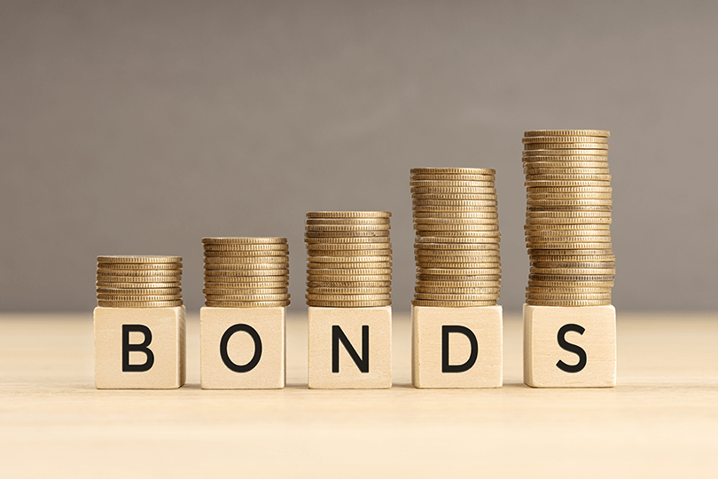

## Table of Contents

## What is a bond?

A bond is like a loan that you give to a company or the government. When you buy a bond, you're lending them money. In return, they promise to pay you back the money you lent them, plus some extra, called interest, over a certain period of time. This interest is usually paid to you regularly, like every year or every six months, until the bond reaches its end date, which is called the maturity date.

At the maturity date, the company or government pays you back the original amount of money you lent them. Bonds are seen as a safer way to invest your money compared to stocks because they usually give you a steady income from the interest payments. However, if the company or government runs into financial trouble, they might not be able to pay you back, which is a risk you take when you buy a bond.

## How do bonds work as an investment?

When you buy a bond as an investment, you're basically lending money to the issuer, which could be a company or the government. They promise to pay you back the amount you lent them, called the principal, plus interest over time. The interest is usually paid to you at regular intervals, like every six months, until the bond reaches its maturity date. This means you get a steady stream of income from the interest payments, which can be attractive if you're looking for a more predictable return on your investment compared to stocks.

The value of a bond can change based on things like interest rates and the financial health of the issuer. If interest rates go up, new bonds might offer higher interest rates, making your existing bond less valuable because it pays less interest. On the other hand, if the issuer's financial situation worsens, the bond's value could drop because there's a higher risk they won't be able to pay you back. When the bond reaches its maturity date, you get your principal back, assuming the issuer can pay. This makes bonds a way to invest your money with a bit more safety than stocks, but they still [carry](/wiki/carry-trading) some risk.

## What are the different types of bonds?

There are several types of bonds, each with its own features and purposes. Government bonds are issued by national governments. They are seen as very safe because they're backed by the government's ability to pay. Treasury bonds in the U.S. are a good example. Municipal bonds are issued by states, cities, or other local government bodies. They often help fund public projects like schools or roads. The interest you earn from these bonds might not be taxed by the federal government, which can be a big plus.

Corporate bonds are issued by companies. They usually offer higher interest rates than government bonds because there's more risk that the company might not be able to pay you back. Within corporate bonds, there are investment-grade bonds, which are seen as safer, and high-yield or "junk" bonds, which are riskier but offer higher interest rates. There are also agency bonds, which are issued by government-affiliated organizations like Fannie Mae or Freddie Mac. These are usually a bit riskier than Treasury bonds but still considered pretty safe.

Other types of bonds include zero-coupon bonds, which don't pay interest until they mature, and convertible bonds, which can be turned into a set number of the company's stock. Each type of bond has its own set of risks and benefits, so it's important to understand them before you decide to invest.

## What are the risks associated with investing in bonds?

When you invest in bonds, one big risk is that the issuer might not be able to pay you back. This is called default risk. If a company or government runs into financial trouble, they might not have the money to give you your interest payments or return your principal when the bond matures. Government bonds are usually seen as safer because countries have more ways to get money, but even they can face problems. Corporate bonds, especially high-yield or "junk" bonds, are riskier because the companies issuing them might not be as financially stable.

Another risk is [interest rate](/wiki/interest-rate-trading-strategies) risk. When interest rates go up, the value of your bond goes down. This happens because new bonds will be issued with higher interest rates, making your bond less attractive to other investors. If you need to sell your bond before it matures, you might have to sell it for less than you paid for it. Also, inflation risk can affect your bond's value. If inflation goes up, the money you get from your bond might not buy as much as it used to, reducing the real value of your investment.

Lastly, there's reinvestment risk. This happens when your bond matures or when you get interest payments, and you have to reinvest that money. If interest rates have gone down since you bought your bond, you might have to put your money into new bonds that pay less interest. This can mean less income from your investments. Each type of bond has its own mix of these risks, so it's good to think about them before you decide to invest.

## How do bond ratings affect investment decisions?

Bond ratings are like report cards for bonds. They tell you how safe it is to invest in a bond. Agencies like Moody's, Standard & Poor's, and Fitch give bonds ratings based on how likely the issuer is to pay you back. A high rating, like AAA or Aaa, means the bond is seen as very safe. A low rating, like BB or below, means the bond is riskier. When you're thinking about buying a bond, these ratings can help you decide if it's a good fit for you. If you want a safe investment, you'll look for bonds with high ratings. If you're okay with more risk and want higher interest, you might go for bonds with lower ratings.

These ratings can also affect how much you might earn from a bond. Bonds with lower ratings usually offer higher interest rates because they're riskier. This is why they're called high-yield or "junk" bonds. On the other hand, bonds with high ratings offer lower interest rates because they're safer. So, when you're making an investment decision, you have to think about the balance between risk and reward. A bond with a good rating might give you steady income, but it won't pay as much as a riskier bond. Knowing the ratings helps you pick the right bond for your investment goals and how much risk you're comfortable with.

## What is the relationship between bond prices and interest rates?

When interest rates go up, bond prices go down. This happens because new bonds that are issued will have higher interest rates. If you have an old bond with a lower interest rate, it becomes less attractive to other investors. They would rather buy the new bonds that pay more. So, if you want to sell your old bond before it matures, you might have to sell it for less than what you paid for it. This is why people say that bond prices and interest rates move in opposite directions.

On the other hand, when interest rates go down, bond prices go up. This is because your old bond with a higher interest rate becomes more attractive to other investors. They would rather buy your bond than the new ones that pay less. So, if you want to sell your bond before it matures, you can probably sell it for more than what you paid for it. This relationship is important for investors to understand because it affects how much money they can make or lose from their bond investments.

## How can one calculate the yield of a bond?

To calculate the yield of a bond, you need to know a few things: the bond's price, the face value (which is what you get back when the bond matures), the coupon rate (which tells you how much interest the bond pays each year), and how long until the bond matures. The yield is like the return you get on your investment, and it's often shown as a percentage. There are different ways to calculate yield, but one common way is the current yield. You find the current yield by taking the annual interest payment (which is the face value times the coupon rate) and dividing it by the bond's current market price. Then, you multiply that number by 100 to get a percentage.

Another way to calculate yield is the yield to maturity (YTM). This is a bit more complicated because it takes into account not just the annual interest payments but also the difference between the bond's price and its face value over the time until it matures. You can use a financial calculator or a spreadsheet to figure out the YTM, but the basic idea is that it's the rate that makes the present value of all future cash flows from the bond equal to its current price. Both the current yield and the yield to maturity give you an idea of how much money you can expect to earn from a bond, but YTM gives you a more complete picture because it considers the bond's price changes and the time until it matures.

## What is the difference between nominal yield, current yield, and yield to maturity?

Nominal yield, current yield, and yield to maturity are three ways to measure how much money you can make from a bond, but they look at different things. Nominal yield is the simplest one. It's just the interest rate that the bond says it will pay you every year. This is the coupon rate, and it doesn't change even if the bond's price goes up or down. So, if you have a bond with a face value of $1,000 and a coupon rate of 5%, the nominal yield is 5%, which means you get $50 every year.

Current yield is a bit different because it takes into account the bond's current market price. You find the current yield by dividing the annual interest payment by the bond's current price and then multiplying by 100 to get a percentage. So, if that same $1,000 bond with a 5% coupon rate is now selling for $900, the current yield would be higher than the nominal yield because you're getting the same $50 interest on a lower price. The current yield would be about 5.56% ($50/$900 * 100).

Yield to maturity (YTM) is the most complete way to look at a bond's return. It considers not just the annual interest payments but also the difference between the bond's price and its face value over the time until it matures. YTM is the rate that makes the present value of all future cash flows from the bond equal to its current price. It's more complicated to calculate and usually needs a financial calculator or a spreadsheet. If you bought that $1,000 bond for $900 and held it until it matures, the YTM would be higher than the nominal yield and the current yield because you're also getting that extra $100 when the bond matures.

## How do bonds contribute to portfolio diversification?

Bonds can help spread out the risk in your investment portfolio. When you put money into different kinds of investments, like stocks, bonds, and real estate, you're not putting all your eggs in one basket. This can protect you if one type of investment does badly. Bonds are often seen as safer than stocks because they give you regular interest payments and return your money when they mature. So, if the stock market goes down, the bonds in your portfolio might still be doing okay, which can help balance things out.

Adding bonds to your portfolio can also give you a steady income. While stocks might go up and down a lot, bonds usually pay you interest regularly. This can be really helpful if you need money coming in every month or every year. By having both stocks and bonds, you can aim for growth with your stocks and stability with your bonds. This mix can make your investments less risky overall and help you reach your financial goals more smoothly.

## What are bond ladders and how do they work?

A bond ladder is a way to spread out your investments in bonds. You buy a bunch of bonds that mature at different times. Imagine you have five bonds, and each one matures a year apart. The first bond matures in one year, the second in two years, and so on up to five years. This way, you get money back from the bonds at different times, which can help you manage your cash flow better. It's like having a ladder where you can climb up one step each year as your bonds mature.

Bond ladders can help you deal with changes in interest rates. If rates go up, you can take the money from the bond that just matured and buy a new bond with a higher rate. If rates go down, you still have the other bonds that were bought at higher rates, so you're not stuck with all low-rate bonds. This strategy can give you more flexibility and help you keep [earning](/wiki/earning-announcement) a good return on your money, even when the market changes.

## How do municipal bonds differ from corporate bonds in terms of tax implications?

Municipal bonds and corporate bonds are different when it comes to taxes. When you earn interest from a municipal bond, you usually don't have to pay federal taxes on it. Sometimes, you don't even have to pay state or local taxes if you live in the same place where the bond was issued. This can save you a lot of money, especially if you're in a high tax bracket. Municipal bonds are often used to fund public projects like schools or roads, and the tax breaks are meant to encourage people to invest in their communities.

On the other hand, the interest you earn from corporate bonds is taxed at both the federal and state levels. This means you have to pay taxes on the money you make from these bonds, which can reduce your overall return. Corporate bonds are issued by companies to raise money for things like expanding their business or paying off debts. Because they don't have the same tax advantages as municipal bonds, they often offer higher interest rates to attract investors. So, when deciding between municipal and corporate bonds, you have to think about how taxes will affect your earnings and which type of bond fits better with your investment goals.

## What are the advanced strategies for trading bonds in the secondary market?

When you want to trade bonds in the secondary market, one advanced strategy is called duration matching. This means you try to match the length of time your bonds will last with how long you want to keep your money invested. If you know you'll need your money back in five years, you'd buy bonds that mature in five years. This can help you avoid having to sell your bonds early and maybe losing money if the bond's price has gone down. It's a way to make sure your investment plan fits with your life plans.

Another strategy is called yield curve positioning. This is a bit trickier and involves looking at how interest rates are expected to change in the future. If you think interest rates will go up, you might buy short-term bonds because you can reinvest the money at higher rates when they mature. If you think rates will go down, you might buy long-term bonds to lock in the higher rates you're getting now. This strategy needs you to keep an eye on economic news and trends, but it can help you make more money from your bonds if you guess right about where interest rates are headed.

Lastly, some people use a strategy called bond swapping. This means you sell one bond and buy another one that's similar but has some better features. For example, you might swap a bond that's about to mature for a new one with a higher interest rate. Or you might swap a bond from a company that's doing badly for one from a company that's doing better. This can help you keep your money working hard for you and take advantage of changes in the market.

## References & Further Reading

[1]: Lopez de Prado, M. (2018). ["Advances in Financial Machine Learning."](https://www.amazon.com/Advances-Financial-Machine-Learning-Marcos/dp/1119482089) Wiley.

[2]: Aronson, D. R. (2006). ["Evidence-Based Technical Analysis: Applying the Scientific Method and Statistical Inference to Trading Signals."](https://www.amazon.com/Evidence-Based-Technical-Analysis-Scientific-Statistical/dp/0470008741) Wiley.

[3]: Jansen, S. (2020). ["Machine Learning for Algorithmic Trading: A Step-by-Step Guide to Predictive Modeling and Strategy Design."](https://github.com/stefan-jansen/machine-learning-for-trading) Packt Publishing.

[4]: Chan, E. P. (2008). ["Quantitative Trading: How to Build Your Own Algorithmic Trading Business."](https://github.com/ftvision/quant_trading_echan_book) Wiley.

[5]: Bergstra, J., Bardenet, R., Bengio, Y., & Kégl, B. (2011). ["Algorithms for Hyper-Parameter Optimization."](https://dl.acm.org/doi/10.5555/2986459.2986743) Advances in Neural Information Processing Systems 24.