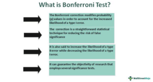

In data-driven finance, achieving statistical accuracy is crucial, especially for algorithmic trading. Algorithmic trading refers to using computer algorithms to automate stock trading decisions, aiming for efficiency and rapid responses to market changes. A significant challenge within this domain is the multiple comparisons problem. This occurs when multiple statistical tests are conducted on the same dataset, thereby increasing the likelihood of false positives, or Type I errors, where results appear significant but are actually due to chance.

The Bonferroni correction is a statistical technique designed to combat this issue by adjusting the significance level of each individual hypothesis test. Mathematically, the correction involves dividing the desired family-wise error rate ($\alpha$) by the number of tests, which lowers the threshold for significance. For example, if you conduct 10 experiments with an $\alpha$ of 0.05, applying the Bonferroni correction adjusts the significance level to 0.005 for each test. This ensures that the probability of making at least one Type I error across all tests remains within the specified confidence level.



In algorithmic trading, where decision-making is automated and rapid, incorporating statistical methods like the Bonferroni correction is vital for ensuring reliable and effective trading strategies. This correction is particularly beneficial in backtesting phases, where multiple trading indicators or strategies are evaluated simultaneously. By properly applying the Bonferroni correction, traders and data scientists can differentiate between genuine signals and mere statistical anomalies, enhancing the reliability of predictive models and reducing the risk of erroneous market actions.

The proper integration of such statistical corrections not only mitigates the risk of misleading outcomes but also contributes to more sophisticated and reliable trading models. Ultimately, understanding and implementing the Bonferroni correction in financial analytics ensures robust, meaningful, and actionable results, providing a solid foundation for traders aiming to maintain a competitive edge in an increasingly data-centric market.

## Table of Contents

## Understanding the Multiple Comparisons Problem

The multiple comparisons problem emerges when numerous hypothesis tests are conducted on the same data set, thereby increasing the likelihood of Type I errors, commonly known as false positives. In statistical hypothesis testing, a Type I error occurs when a true null hypothesis is incorrectly rejected, presenting a significant result where none exists. The probability of such an error, denoted as the significance level (alpha), typically stands at 0.05.

As the number of hypothesis tests increases, the collective risk of Type I errors likewise escalates, particularly when each test is considered independently. This issue holds importance in scientific fields including genetics, psychology, and finance, where simultaneous testing of multiple hypotheses is a standard practice. For instance, in genetic studies, numerous genetic markers may be assessed for association with a particular trait, while in psychology, multiple behavioral measures might be evaluated for a treatment effect.

In the field of [algorithmic trading](/wiki/algorithmic-trading), multiple comparisons manifest when evaluating the success of various trading signals or strategies. Here, traders might examine the profitability or predictive capability of multiple market indicators simultaneously. Without addressing the multiple comparisons problem, one risks making flawed trading decisions, inaccurately attributing market noise or random chance to significant trading outcomes. This can lead to the erroneous inclusion of ineffective signals into automated trading algorithms, potentially resulting in financial losses.

To mitigate the risk of Type I errors caused by multiple comparisons, statistical methods like the Bonferroni correction are utilized. The Bonferroni correction provides a straightforward means of adjusting significance levels. It involves dividing the desired overall significance level, or family-wise error rate (FWER), by the number of comparisons being made. If testing 10 hypotheses with a target alpha of 0.05, the Bonferroni correction would adjust the significance level for each individual test to 0.005. This adjustment aims to ensure that the collective probability of one or more Type I errors across all tests does not exceed the specified alpha level.

While effective in controlling Type I errors, the Bonferroni correction’s conservative nature can lead to a rise in Type II errors, where false negatives occur, potentially overlooking valid results. Nevertheless, it remains a crucial tool in the arsenal of researchers and practitioners, particularly in high-stakes fields like finance, where minimizing false positives is paramount.

## The Bonferroni Correction Explained

The Bonferroni correction is a statistical method designed to address the issue of multiple comparisons, which arises when several hypothesis tests are performed simultaneously. This can increase the likelihood of making Type I errors, where a true null hypothesis is incorrectly rejected. The Bonferroni correction mitigates this risk by adjusting the significance level, or p-value, for each individual test.

The adjustment is straightforward: the desired family-wise error rate (often denoted as $\alpha$) is divided by the number of comparisons ($n$). Mathematically, the adjusted significance level for each test is expressed as:

$$
\alpha_{\text{adjusted}} = \frac{\alpha}{n}
$$

For example, if 10 hypothesis tests are being conducted with an overall $\alpha$ of 0.05, the Bonferroni correction sets the significance threshold for each test to $0.005$ ($\frac{0.05}{10}$).

The primary benefit of the Bonferroni correction is its effectiveness in ensuring the probability of making one or more Type I errors across the entire set of tests does not exceed the specified $\alpha$ level. This provides a more robust framework for maintaining the integrity of statistical findings.

However, the conservative nature of the Bonferroni correction can also lead to an increased risk of Type II errors, where false negatives occur and true alternative hypotheses are not identified. This conservatism can decrease the power of the statistical tests, potentially overlooking meaningful associations or signals.

In summary, while the Bonferroni correction is a critical tool for controlling Type I errors in multiple hypothesis testing, it is essential to weigh its benefits against the potential for increased Type II errors, especially in fields where identifying true positives is crucial.

## Implementing Bonferroni Correction in Algorithmic Trading

In algorithmic trading, the Bonferroni correction serves as a crucial statistical tool for validating trading strategies and signals. The financial market environment often involves testing multiple hypotheses about market indicators. These hypotheses require thorough statistical validation before being incorporated into automated trading algorithms. The Bonferroni correction, a method for addressing the multiple comparisons problem, is particularly suited for this task due to its ability to minimize the likelihood of false positives, which can otherwise mislead trading decisions and potentially result in financial losses.

To apply the Bonferroni correction, traders first determine the family-wise error rate ($\alpha$), which represents the maximum acceptable probability of making one or more Type I errors across a series of hypothesis tests. For example, with $\alpha = 0.05$ and 10 hypotheses, the correction modifies each individual significance level to $\alpha / m = 0.005$, where $m$ is the number of tests. This adjustment ensures that the collective error rate remains controlled, safeguarding against spurious results that might otherwise pass for significant.

Despite its conservative nature, which may increase Type II errors (false negatives), the Bonferroni correction provides a reliable safeguard against misleading correlations that can arise from less stringent statistical tests. For algorithm developers, integrating the Bonferroni correction within [backtesting](/wiki/backtesting) frameworks is a strategic approach to enhance the robustness and credibility of trading strategy validations. These frameworks simulate how trading strategies might perform based on historical data, thus allowing developers to refine algorithms before deployment in live market conditions.

An example of how this might be implemented in a Python backtesting environment is as follows:

```python
import numpy as np
from scipy import stats

# Suppose we have 10 p-values from testing different trading signals
p_values = np.array([0.03, 0.02, 0.15, 0.05, 0.01, 0.4, 0.35, 0.25, 0.07, 0.06])

# Set the desired family-wise error rate
alpha = 0.05

# Apply Bonferroni correction
bonferroni_alpha = alpha / len(p_values)
significant_signals = p_values < bonferroni_alpha

print("Significant Signals:")
print(significant_signals)
```

This code calculates which trading signals are statistically significant after applying the Bonferroni correction, thus filtering out those that do not meet the adjusted significance criteria. The use of such statistical rigor not only mitigates undue risks but also ensures that trading strategies are anchored in robust analytical foundations. Consequently, understanding and implementing the Bonferroni correction can greatly enhance decision-making processes in algorithmic trading, leading to more reliable and efficient trading outcomes.

## Challenges and Limitations

The use of the Bonferroni correction, while effective in controlling Type I errors (false positives), presents certain challenges. One of the main challenges is its conservative nature, which can lead to an increased risk of Type II errors (false negatives). In the context of algorithmic trading, this manifests as the potential to overlook viable trading strategies due to overly strict significance thresholds. As a result, traders may miss out on profitable opportunities simply because the corrected p-value hurdles were set too high.

To illustrate, consider a scenario in which a trader tests multiple trading signals for potential inclusion in an algorithmic model. While the Bonferroni correction adjusts the alpha level to maintain a specified family-wise error rate, $\alpha$, by recalculating it as $\alpha/m$ (where $m$ is the number of comparisons), this can result in genuine signals being classified as non-significant, thereby reducing the sensitivity of the test.

Given these limitations, alternative statistical methods might offer a more balanced approach. The Holm-Bonferroni method, for example, adjusts the significance levels in a step-wise manner, providing a less conservative adjustment while maintaining control over the family-wise error rate. Similarly, the False Discovery Rate (FDR) technique, which controls the expected proportion of incorrectly rejected null hypotheses, can be more powerful in contexts where discovering as many true effects as possible is critical.

Despite the appeal of these alternatives, they may not always align with the stringent requirements of high-stakes environments like financial trading, where minimizing Type I errors often takes precedence. In markets where incorrect decisions can lead to substantial financial losses, maintaining conservative error control is crucial.

Traders and algorithm developers thus face the challenge of striking an optimal balance between Type I and Type II errors. Incorporating a mix of statistical techniques or adaptive methods might help to achieve this balance. 

In practice, evaluating the trade-offs between different correction methods becomes an essential aspect of developing robust trading models. Making informed decisions about these methods requires a comprehensive understanding of both the statistical properties and the practical implications in trading environments.

## Conclusion

The Bonferroni correction is a critical statistical tool for reducing the risk of false positives in hypothesis testing, providing significant value in the domain of algorithmic trading. Its primary strength lies in its ability to adjust the significance level to ensure that the probability of making one or more Type I errors across multiple tests does not exceed a predefined threshold, typically denoted by alpha (α). By dividing the alpha level by the number of comparisons, the Bonferroni correction maintains the overall error rate, a feature crucial for robust financial analysis.

Despite its strengths, the Bonferroni correction is not without limitations. Its conservative nature may increase the risk of Type II errors, potentially leading to the exclusion of valid trading signals due to overly stringent significance thresholds. Nevertheless, the method's reliability in safeguarding against spurious correlations is invaluable for traders aiming to build statistically sound models that are ready to engage with complex and volatile market dynamics.

To further enhance the utility of the Bonferroni correction, traders and data scientists in finance are encouraged to explore complementary methods that offer more flexible error control. Alternatives like the Holm-Bonferroni method or the False Discovery Rate (FDR) provide a balanced approach, although suitable considerations must be made depending on the trading environment's risk preferences.

In conclusion, integrating appropriate statistical adjustments, such as the Bonferroni correction, enhances the reliability of trading strategies and paves the way for advancing algorithmic trading practices. Through rigorous statistical corrections, trading models are better equipped to provide meaningful insights and performance, ensuring they are not just theoretically sound but also practically viable in fast-paced financial markets.

## References & Further Reading

[1]: Holm, S. (1979). ["A Simple Sequentially Rejective Multiple Test Procedure."](https://www.jstor.org/stable/4615733?read-now=1) Scandinavian Journal of Statistics.

[2]: Benjamini, Y., & Hochberg, Y. (1995). ["Controlling the False Discovery Rate: A Practical and Powerful Approach to Multiple Testing."](https://academic.oup.com/jrsssb/article-abstract/57/1/289/7035855) Journal of the Royal Statistical Society. Series B (Methodological).

[3]: ["Multiple Testing: The Bonferroni Correction."](https://en.wikipedia.org/wiki/Bonferroni_correction) Statistical Methods in Medical Research by Thomas D. Saville

[4]: ["Advances in Financial Machine Learning"](https://www.amazon.com/Advances-Financial-Machine-Learning-Marcos/dp/1119482089) by Marcos Lopez de Prado

[5]: ["Evidence-Based Technical Analysis: Applying the Scientific Method and Statistical Inference to Trading Signals"](https://www.amazon.com/Evidence-Based-Technical-Analysis-Scientific-Statistical/dp/0470008741) by David Aronson

[6]: ["Machine Learning for Algorithmic Trading"](https://github.com/stefan-jansen/machine-learning-for-trading) by Stefan Jansen

[7]: ["Quantitative Trading: How to Build Your Own Algorithmic Trading Business"](https://github.com/LucindaYa/quant-resources/blob/master/Quantitative%20Trading%20How%20to%20Build%20Your%20Own%20Algorithmic%20Trading%20Business.pdf) by Ernest P. Chan