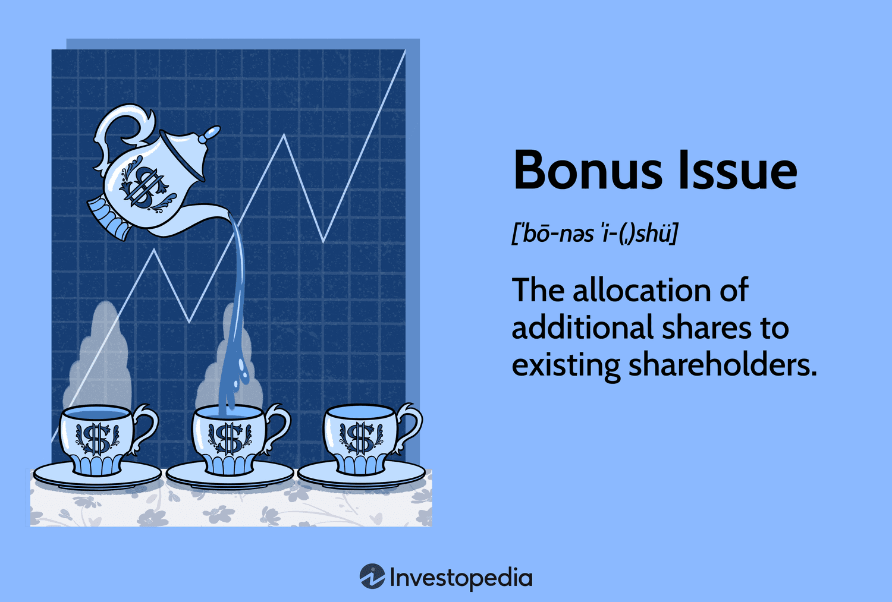

In corporate finance, issuing bonus shares is a strategic move that companies make to reward current shareholders while also potentially attracting new investors. Bonus shares, sometimes called scrip or capitalization issues, are distributed to shareholders at no additional cost. This approach serves as an alternative to cash dividends and helps boost the company's equity capital without affecting cash reserves. By increasing the number of shares without altering the payout amount, companies can maintain liquidity while enhancing shareholder value.

Similarly, stock issuance plays a crucial role in corporate finance by allowing companies to obtain the necessary capital for growth, paying off debts, and other strategic investments. When companies issue new shares, they open up opportunities for expansion and financial stabilization, providing a pathway for long-term strategic planning.

Algorithmic trading is another key component that represents a sophisticated method in modern financial markets. Automating the execution of trades, algorithmic trading utilizes complex algorithms to carry out transactions efficiently and rapidly. This technology-driven process can boost market liquidity and ensure that trades are executed at optimal prices without human intervention. The seamless integration of algorithmic trading with various corporate actions, like stock issuance, can significantly influence market dynamics, offering advantages such as increased trading volumes and price stability.

This article aims to explore the interrelations between bonus shares, stock issuance, and algorithmic trading, shedding light on their collective impact within corporate finance. Understanding how these components influence corporate strategies and market behaviors is essential for stakeholders navigating today's financial landscape.

## Table of Contents

## Understanding Bonus Shares

Bonus shares, also referred to as scrip or capitalization issues, are a mechanism through which a company increases its outstanding share count without affecting its overall market capitalization. The issuance of bonus shares generally occurs because the stock price adjusts to reflect the increased number of shares, maintaining the company’s market value. For example, if a company issues one bonus share for every existing share, the total number of shares doubles, but the price of each share typically halves, keeping the market capitalization constant.

Companies issue bonus shares for various strategic reasons:

1. **Attraction of Retail Investors**: By increasing the number of shares without a proportional increase in market capitalization, companies can lower their stock price, making it more accessible to retail investors. This wider accessibility can lead to an increased investor base and potentially higher demand for the shares.

2. **Enhanced Stock Liquidity**: With more shares in circulation, trading volumes may increase, enhancing liquidity. Greater liquidity often leads to more accurate stock pricing and reduces the volatility associated with thinly traded stocks.

3. **Alternative to Cash Dividends**: Bonus shares offer an alternative to cash dividends, allowing a company to reward its shareholders without depleting its cash reserves. This can be particularly beneficial for companies that wish to conserve cash for investments or operational needs.

4. **Signal of Financial Health**: Issuing bonus shares can be a signal of a company’s confidence in its future earnings. It suggests that the company has accumulated sufficient reserves and retained earnings to justify converting these into additional equity.

Typically, the funds required for issuing bonus shares are sourced from a company's profits or reserve capital. The process involves capitalizing part of the company’s reserves, converting them into share capital, and distributing these shares to existing shareholders. As the allocation is proportional to their current shareholdings, the decision does not disturb the existing ownership percentages and equity ratios among shareholders.

In summary, bonus shares serve as a non-monetary dividend to shareholders, enhancing market [liquidity](/wiki/liquidity-risk-premium) and potentially making the stock more attractive, all while preserving the company's cash flow for other strategic goals. By examining these factors, stakeholders can assess how bonus shares fit into broader corporate financial strategies.

## Stock Issuance in Corporate Finance

Stock issuance is a central mechanism in corporate finance through which companies raise capital by offering new shares to investors. This process plays a pivotal role in enabling a company to finance operational expansion, support project funding, and reduce existing debt. The issuance of stock is not merely a financial exercise but a strategic move to realign the company's capital structure and enhance its market presence.

Companies typically issue two primary forms of stock: common stocks and preferred stocks. Each type offers different benefits and rights to investors, and their issuance can have varying impacts on corporate finance.

### Common Stocks

Common stocks are the most prevalent form of equity a company issues. Holders of common stock enjoy voting rights, usually one vote per share, allowing them to influence major corporate decisions. These decisions can range from electing board members to approving mergers or acquisitions. In addition to voting rights, common stockholders can receive dividends—though they are not guaranteed—as these dividends are usually paid out from the company's profits after all obligations are settled.

In the event of liquidation, common stockholders are at the bottom of the priority ladder for asset distribution. They receive payments only after all creditors, including bondholders and preferred shareholders, have been compensated. The priority hierarchy in asset distribution is represented as:

$$
\text{Creditors} \rightarrow \text{Bondholders} \rightarrow \text{Preferred Stockholders} \rightarrow \text{Common Stockholders}
$$

Despite their lower priority, common stocks generally offer potential for higher returns through capital appreciation.

### Preferred Stocks

Preferred stocks represent a class of ownership with preferential treatment over common stocks in several aspects. Primarily, they provide fixed dividends, which are typically paid out before any dividends are declared for common stockholders. This fixed-income feature makes preferred stocks similar to debt instruments like bonds, offering a predictable income stream.

Preferred stockholders also have priority over common stockholders when it comes to asset distribution upon liquidation, as depicted in the distribution hierarchy above. However, unlike common stocks, preferred stocks usually do not come with voting rights, which might limit investors’ influence over company decisions.

The issuance of preferred stocks is particularly attractive to companies that wish to raise capital without diluting the voting power of existing common stockholders. Furthermore, preferred stocks can provide companies with greater flexibility in capital structure management, as they often have features like conversion options or redemption rights.

In conclusion, stock issuance is not only a tool for capital acquisition but also a strategic decision that shapes a company's financial and operational landscape. The decision to issue common or preferred stocks depends on the company's financial strategy, investor expectations, and market conditions.

## Advantages and Drawbacks of Bonus Shares

Issuing bonus shares can be a strategic move for companies seeking to enhance their market appeal and liquidity. One of the primary advantages is increased retail investor participation. By making shares more accessible, companies can attract a broader base of investors, potentially driving up demand for the stock. This can lead to enhanced market liquidity, as more traders are willing to buy and sell the shares, ensuring smoother transactions and price stability.

Another significant benefit of bonus shares is that they project financial stability. By distributing shares instead of cash, companies conserve their cash reserves and signal confidence in their ongoing operations. This can be particularly advantageous during periods of economic uncertainty when maintaining cash flow is critical for business continuity.

However, issuing bonus shares also has its drawbacks. There is an inherent opportunity cost involved, as funds earmarked for bonus shares might be utilized for other strategic initiatives or investments that could yield higher long-term returns. Additionally, while bonus shares increase the number of outstanding shares, they do not bring in additional cash for the company. This could potentially lead to a decrease in future cash dividend payouts, which may not sit well with shareholders who prefer immediate financial returns.

These dynamics underscore the importance of a well-considered strategy when companies opt to issue bonus shares, balancing the benefits of increased market engagement and liquidity with the potential downsides of opportunity cost and cash flow implications.

## Algorithmic Trading in Stock Markets

Algorithmic trading is a method of executing trades using pre-programmed algorithms to make decisions about the timing, price, and quantity of orders. This approach is characterized by the rapid execution of transactions, often in milliseconds, which is facilitated by computer programs that follow defined sets of rules. These algorithms are capable of analyzing numerous market variables and identifying trading opportunities that might be missed by human traders due to the speed and complexity of data processing.

One of the primary benefits of [algorithmic trading](/wiki/algorithmic-trading) is its ability to enhance market liquidity. By automating the trading process, it enables high-frequency trading ([HFT](/wiki/high-frequency-trading-strategies)) which increases the [volume](/wiki/volume-trading-strategy) of market transactions. This heightened activity can narrow bid-ask spreads, offering better prices for traders and improving overall market efficiency.

However, the fast-paced nature of algorithmic trading can also introduce certain risks. Errors in the algorithms or unforeseen market conditions can lead to erratic trading behaviors, contributing to market [volatility](/wiki/volatility-trading-strategies). A notable instance of this was the Flash Crash of May 6, 2010, where major U.S. stock indices dropped and then recovered within minutes, partly due to algorithmic trading activities.

Algorithmic trading can also play a role in stock issuance practices. Post-issuance phases often see fluctuations in stock price and liquidity as the market adjusts to the new supply of shares. By incorporating algo trading strategies, companies can potentially stabilize these fluctuations. Algorithms can be designed to support price discovery and maintain order flow by executing trades that counteract extreme price movements, thus ensuring a smoother transition into normal trading conditions after a stock issuance.

Furthermore, the integration of algorithmic trading into stock markets aligns with complex strategies such as [arbitrage](/wiki/arbitrage), where rapid trading decisions can exploit price differences of similar or related financial instruments. The algorithms can also facilitate optimal execution strategies, minimizing market impact and reducing transaction costs.

While there are significant advantages to algorithmic trading, stakeholders should be mindful of its potential drawbacks. Proper regulation and oversight are necessary to mitigate the risks of erroneous trades and maintain fair market conditions. As financial technologies advance, the role of algorithmic trading in market dynamics will continue to evolve, requiring ongoing adaptation and strategy refinement from market participants.

## Intersection of Bonus Shares, Stock Issuance, and Algo Trading

The intersection of bonus shares, stock issuance, and algorithmic trading is a nuanced aspect of corporate finance, significantly influencing corporate strategies and market dynamics. Companies utilize these financial tools to maneuver through the intricate landscape of shareholder interests, market perceptions, and liquidity requirements.

Issuing stock or bonus shares alters the shareholder structure by increasing the total number of outstanding shares, which can dilute the value of existing shares unless perfectly offset by corresponding gains in company value. For instance, when a company issues bonus shares, each shareholder receives additional shares for free, but the stock's market price typically adjusts downward to reflect the increased share count. Similarly, when new stock is issued to raise capital, the influx of shares must either be absorbed by the market or result in an adjusted share price that reflects the expanded equity base.

Algorithmic trading plays a crucial role in stabilizing trading patterns following such alterations in shareholder composition. With predefined algorithms capable of analyzing market data at high speed, algo trading can support the liquidity of newly issued shares, ensuring smoother price adjustments and reducing potential volatility. This stabilizing effect is particularly important during large-scale stock issuances or bonus share distributions when market dynamics are subject to abrupt changes. Algo trading systems, equipped with strategies like [market making](/wiki/market-making), arbitrage, and [trend following](/wiki/trend-following), allow for the automatic adjustment of trading practices, which can prevent significant fluctuations and maintain investor confidence.

Moreover, the strategic timing of bonus issues and stock offerings can harness the power of algorithmic trading. For example, companies could time their share issues to coincide with positive market sentiment or low volatility periods detected through algorithmic analysis, optimizing stock performance. By integrating algo trading strategies into these processes, firms can potentially enhance shareholder satisfaction by achieving more aligned share price valuations with perceived company value.

In summary, the synergy among bonus shares, stock issuance, and algorithmic trading underscores a sophisticated approach to managing corporate financial strategies. Through careful planning and leveraging advanced trading technologies, companies can effectively navigate market complexities, ensuring both the stability and attractiveness of their stock within the broader financial ecosystem.

## Conclusion

Understanding the strategic reasons for issuing bonus shares and new stock, alongside the role of algorithmic trading, is of paramount importance for stakeholders in corporate finance. Bonus shares, which serve to enhance liquidity and investor appeal, and new stock issuances, which provide essential capital for business growth, are critical tools in the financial arsenal of any corporation. They allow companies to efficiently manage their capital structure and communicate financial robustness to potential investors. However, these strategies must be pursued with careful consideration of their inherent drawbacks. For instance, while bonus shares and stock issuances can signal financial health, they do not generate cash inflows, which can limit available capital for immediate needs and reduce cash dividend payouts, potentially leading to shareholder dissatisfaction.

Algorithmic trading further integrates into corporate finance by providing mechanisms for efficient trade execution and maintaining liquidity. This technology can stabilize trading patterns post-issuance, mitigating market volatility risks associated with new stock or bonus share offerings. Algorithmic systems, with their ability to execute trades at high speeds and in large volumes, offer significant advantages in maintaining order flow and price stability in active markets.

As financial markets continue to evolve, the seamless integration of bonus shares, stock issuance, and algorithmic trading underlines the dynamic nature of corporate finance strategies. Companies that adeptly combine these elements can better align their financial practices with market expectations while ensuring strategic agility. Engaging effectively with these components—by understanding their benefits, limitations, and interplay—enables corporations to create shareholder value and sustain competitive advantage in a rapidly changing economic landscape.

## References & Further Reading

[1]: ["The Financial Policy of Corporations"](https://archive.org/download/financialpolicy00dewigoog/financialpolicy00dewigoog.pdf) by Arthur Stone Dewing

[2]: Ezzine, H., Olivero, B., & Rusu, F. (2016). ["The Impact of Bonus Share Issue on Stock Price: Evidence from the Casablanca Stock Exchange."](https://papers.ssrn.com/sol3/papers.cfm?abstract_id=2148717) Procedia - Social and Behavioral Sciences.

[3]: ["Advances in Financial Machine Learning"](https://www.amazon.com/Advances-Financial-Machine-Learning-Marcos/dp/1119482089) by Marcos Lopez de Prado

[4]: Lintner, J. (1956). ["The Distribution of Incomes of Corporations Among Dividends, Retained Earnings, and Taxes."](https://www.semanticscholar.org/paper/DISTRIBUTION-OF-INCOMES-OF-CORPORATIONS-AMONG-AND-Lintner/143efffe75d830c56a943b1098016341e2f17c3c) The American Economic Review.

[5]: ["Algorithmic Trading: Winning Strategies and Their Rationale"](https://www.wiley.com/en-us/Algorithmic+Trading%3A+Winning+Strategies+and+Their+Rationale-p-9781118460146) by Ernie Chan

[6]: Zhang, F. X. (2006). ["Index Revisions and Fund Flows."](https://onlinelibrary.wiley.com/doi/full/10.1111/j.1540-6261.2006.00836.x) The Review of Financial Studies.

[7]: Goldberg, P. & Noussair, C. (1999). ["Public Information and Speculative Trading."](https://academic.oup.com/rfs/article-abstract/22/1/299/1583537) Econometrica.