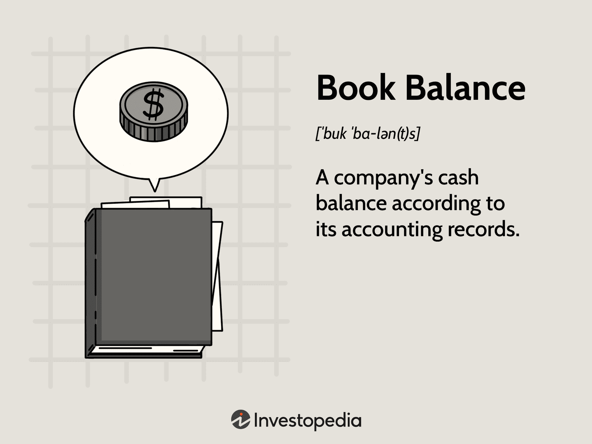

In today's financial landscape, understanding fundamental accounting and trading concepts is crucial for achieving financial success. This article examines the intersection of bank balance, book balance, accounting terms, and algorithmic trading, showcasing how these elements impact financial management and strategy. 

A bank balance denotes the funds available in a company's bank account as per the bank's records, while a book balance reflects the cash balance logged in the company's accounting books. Discrepancies between these figures can arise from uncleared checks, pending deposits, and service charges, making it essential to reconcile them regularly for accurate financial reporting.

Accounting terms such as debits, credits, and reconciliation form the bedrock of financial reporting. These concepts not only influence book balance but also assist businesses in managing their financial records and ensuring regulatory compliance. Maintaining accurate records through consistent updates and audits is critical to an organization's financial health.

On the other hand, algorithmic trading leverages pre-programmed instructions for executing trades at speeds and frequencies unattainable by human traders. By understanding key aspects like backtesting, execution strategy, and latency, traders can minimize transaction costs and human errors while also navigating risks, including market volatility and technical failures.

This exploration aims to enhance your understanding of these financial terms and practices, ultimately allowing you to effectively manage your finances and trading strategies. Embracing these concepts positions business owners, accountants, and traders to optimize performance and ensure financial stability in an ever-evolving economic environment.

## Table of Contents

## Understanding Bank Balance and Book Balance

The bank balance represents the amount of money available in a company's bank account as reported by the bank at a specific point in time. This is the balance accessible for immediate use and is typically shown on a company's bank statement. In contrast, the book balance reflects the cash balance recorded in the company’s internal accounting records. It might include transactions that have not yet been processed by the bank, such as checks issued but not yet cleared or deposits made after the bank's cutoff time. 

Reconciling the bank balance and book balance is vital for identifying financial discrepancies. Differences between these balances often arise from uncleared checks, pending deposits, bank fees, or errors in recording transactions. For instance, if a company writes a check, the amount is deducted immediately from the book balance, but it may not reflect in the bank balance until the recipient cashes it. Similarly, deposits in transit, which have been recorded in the company's [books](/wiki/algo-trading-books) but have not yet appeared in the bank statement, can also lead to differences.

The reconciliation process involves adjusting the book balance by accounting for transactions that do not yet appear on the bank statement. Conversely, adjustments are made to the bank balance for transactions such as bank fees that the company might not have recorded. This can be systematically handled in financial software or manually using tools like Microsoft Excel. A simplified reconciliation formula might look as follows:

$$
\text{Adjusted Book Balance} = \text{Book Balance} + \text{Deposits in Transit} - \text{Outstanding Checks} - \text{Bank Fees}
$$

Regular reconciliation ensures that the company’s financial records are accurate, facilitating reliable financial reporting. It helps detect errors, fraud, and any discrepancies between bank records and the company’s books, enhancing accountability and financial transparency. Practices like monthly reconciliation are standard, although more frequent reconciliations can be beneficial for businesses with high transaction volumes.

## Key Accounting Terms

Understanding accounting terms is vital for effectively managing finances and ensuring compliance with financial regulations. These terms form the fundamental language of financial reporting, shaping how financial health is communicated and analyzed. Key among these are debits, credits, and reconciliation, each playing a crucial role in maintaining the integrity and accuracy of financial records.

Debits and credits are the cornerstone of double-entry accounting, a system where every financial transaction affects at least two accounts. Debits (Dr) are entries that increase asset or expense accounts while decreasing liability, income, or equity accounts. Conversely, credits (Cr) increase liability, income, or equity accounts and decrease asset or expense accounts. The formula governing this double-entry system is:

$$
\text{Assets} = \text{Liabilities} + \text{Equity}
$$

This equation must always balance, ensuring that the books are correct at any given time. In practice, if a company purchases inventory for cash, the inventory account (an asset) is debited, and the cash account is credited, keeping the equation in balance.

Reconciliation is the process of comparing the book balance, which is the balance recorded in the company's accounting records, with the bank balance, which is the balance reported by the bank. This process helps identify and resolve discrepancies such as uncleared checks, pending deposits, and bank service charges. For instance, checks issued but not yet cleared will cause a difference between the book balance and the bank balance, highlighting the necessity for reconciliation to ensure financial statements' accuracy.

The book balance is susceptible to various accounting activities. For example, pending checks (checks issued but not yet cleared) and deposits in transit (deposits recorded by the company but not yet reflected in the bank account) directly affect the book balance. Accurate recording of these transactions is vital for maintaining financial health and avoiding discrepancies in financial statements.

Clarifying these terms helps organizations maintain precise accounting records, which is essential for financial planning and analysis. Regular updates and audits are necessary components of this process, enabling businesses to maintain transparency and rectify discrepancies. Frequent audits ensure that financial data is accurate, reliable, and compliant with applicable standards, ultimately supporting the organization's credibility and decision-making processes.

In summary, a solid understanding of key accounting terms allows businesses to maintain accurate and transparent financial records. This is vital for strategic financial planning and maintaining stakeholders' trust. These practices not only ensure compliance but also enhance the organization's ability to adapt and respond to financial challenges and opportunities.

 to Algorithmic Trading

Algorithmic trading represents a considerable advancement in the execution of trades, primarily driven by computer algorithms that follow a set of pre-programmed rules or strategies. These algorithms operate at speeds and frequencies that are beyond the capabilities of human traders. This trading method is used to take advantage of micromarket conditions, enabling faster and often more accurate trading decisions.

An essential aspect of [algorithmic trading](/wiki/algorithmic-trading) involves understanding key terms such as [backtesting](/wiki/backtesting), execution strategy, and latency. Backtesting refers to the process of testing a trading strategy using historical data to evaluate its potential efficacy. This allows traders to explore how a particular algorithm might perform under various market conditions before it is employed in real-time trading.

Execution strategy encompasses the methods adopted to [carry](/wiki/carry-trading) out orders while attempting to minimize the market impact. For instance, common execution strategies include VWAP (Volume Weighted Average Price) and TWAP (Time Weighted Average Price), which seek to optimize the execution price relative to the [volume](/wiki/volume-trading-strategy) and time respectively.

Latency, the time delay in the execution of a trading order, is another critical element. Reducing latency can confer a competitive edge, especially in high-frequency trading where even microseconds can be significant. 

The advantages of algorithmic trading are manifold. It substantially reduces transaction costs by limiting the need for manual intervention. Furthermore, automation mitigates human errors that can arise from emotional decision-making or operational mishaps. By optimizing trade execution and reducing slippage, algorithms can further enhance overall profitability.

However, algorithmic trading is not without its risks. Market [volatility](/wiki/volatility-trading-strategies) can lead to unexpected algorithmic behaviors if the underlying code is not robust against rapid price changes. Additionally, technical failures such as software glitches or communication outages can result in substantial financial losses. It is crucial that traders in algorithmic trading environments continuously monitor and adjust their systems to adapt to evolving market landscapes.

Overall, algorithmic trading is a crucial development in modern trading practices, offering both opportunities and challenges. Its intricate blend of technology and financial acumen requires a thorough understanding and continuous innovation to harness its full potential effectively.

## Integrating Financial Concepts for Success

Integrating an understanding of bank and book balances into financial strategy is essential for effective cash management. The bank balance represents the cash available in an account as conveyed by the bank's records, while the book balance is the figure recorded in a company's own accounting records. Differences between these two balances frequently arise due to timing issues, such as uncleared checks or pending deposits. By regularly reconciling these balances, businesses can ensure the accuracy of their cash position and identify any discrepancies that might affect their financial planning and forecasting. This process not only aids in identifying potential errors but also provides a clearer picture of available funds, leading to more informed decision-making.

Accounting insights play a vital role in monitoring financial exposures and [liquidity](/wiki/liquidity-risk-premium). A detailed comprehension of terms such as debits, credits, and assets versus liabilities can offer crucial insights into a company’s financial stability. Tracking these metrics allows businesses to predict cash flow effectively and manage fiscal risk. Accurate accounting records enable companies to anticipate periods of low liquidity and plan accordingly by securing additional credit or adjusting operational strategies.

In the context of trading, algorithmic strategies benefit significantly from precise and up-to-date financial data. Algorithms are designed to execute trades based on specific parameters, requiring accurate information to function optimally. Enhanced data accuracy achieved through reconciliation ensures that the trading algorithms operate under correct assumptions, leading to better trade execution and reduced chances of slippage—where the execution price differs from the expected price due to market movements.

Consistent reconciliation of financial data is crucial in supporting strategic decision-making in trading. By ensuring that all recorded transactions are accurate and up to date, traders can better rely on their data analytics, models, and strategies. This alignment not only reinforces confidence in trading decisions but also enables a quick adaptation to market changes, providing a competitive edge.

By synthesizing these various aspects of financial management—accurate bank and book balance reconciliation, comprehensive accounting insights, and reliable algorithmic trading strategies—financial professionals can significantly optimize performance. This holistic approach allows for better cash flow management, informed financial planning, and efficient operation within the dynamic landscape of modern finance. Such integration ensures robust financial health, positioning businesses and traders for sustainable success in the marketplace.

## Conclusion

The synergy between book balance accounting and algorithmic trading offers significant improvements in financial efficiency. By leveraging accurate financial data, businesses and traders gain enhanced trade execution capabilities and can engage in more effective strategic financial planning. This precision in financial data is crucial, as it directly influences decision-making processes and outcomes in trading activities.

Staying informed about the latest developments in accounting practices and algorithmic trading methodologies is essential for businesses and traders. This knowledge empowers them to remain competitive and make informed decisions that align with their financial goals. The discipline of regularly reconciling financial records and refining trading algorithms forms the foundation for success in modern financial markets. Through consistent examination and adjustment, entities can identify discrepancies early, mitigate risks, and exploit market opportunities effectively.

Continual learning and adaptation are indispensable traits in today's dynamic financial landscape. As markets evolve and technology advances, financial professionals must be proactive in acquiring new skills and knowledge. This ongoing education enables them to anticipate market shifts, regulate financial exposures, and harness sophisticated trading techniques. In this context, the diligence of financial reconciling and continuous algorithm refinement not only ensures operational fidelity but also paves the way for sustainable financial growth and success.

## References & Further Reading

[1]: ["Advances in Financial Machine Learning"](https://www.amazon.com/Advances-Financial-Machine-Learning-Marcos/dp/1119482089) by Marcos Lopez de Prado

[2]: ["Quantitative Trading: How to Build Your Own Algorithmic Trading Business"](https://www.amazon.com/Quantitative-Trading-Build-Algorithmic-Business/dp/1119800064) by Ernest P. Chan

[3]: ["Algorithmic Trading: Winning Strategies and Their Rationale"](https://books.google.com/books/about/Algorithmic_Trading.html?id=WAlFDwAAQBAJ) by Ernest P. Chan

[4]: ["Evidence-Based Technical Analysis: Applying the Scientific Method and Statistical Inference to Trading Signals"](https://www.amazon.com/Evidence-Based-Technical-Analysis-Scientific-Statistical/dp/0470008741) by David Aronson

[5]: ["Financial Statement Analysis and Security Valuation"](https://www.mheducation.com/highered/product/Financial-Statement-Analysis-and-Security-Valuation-Penman.html) by Stephen H. Penman