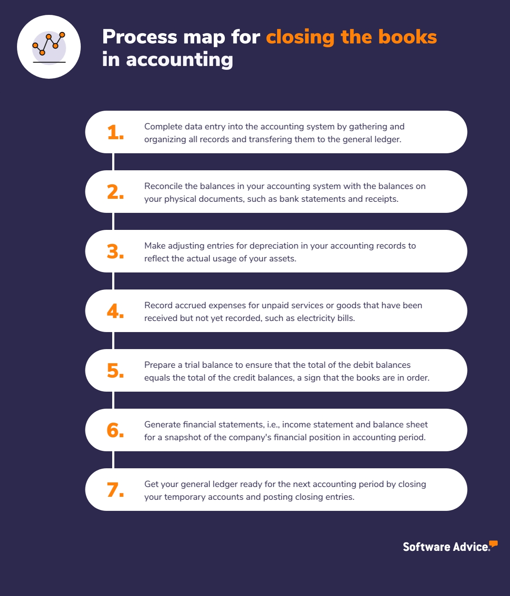

In today's fast-paced financial world, the integration of accounting cycles, book closing, and algorithmic trading has become more relevant than ever. The accounting cycle forms the backbone of financial accounting, ensuring both accuracy and compliance across financial documents. This sequence of systematic steps—starting from transaction analysis and extending to financial statement preparation—provides a structured approach for managing a company's financial activities. Each stage, from journalizing to ledger posting and trial balance preparation, plays a vital role in maintaining the reliability and integrity of financial data.

Book closing represents a crucial step in the accounting process. It involves transferring temporary account balances to permanent accounts to reflect a company’s retained earnings. This period-end procedure prevents unauthorized changes to past financial data, thus preserving the integrity of the company’s financial records. By closing the books properly, organizations prepare reliable financial statements and maintain audit readiness, which are essential for both internal assessments and external reporting.



Algorithmic trading, on the other hand, is a sophisticated approach to trading that relies on precise and timely financial data for decision-making. High-frequency trading systems use complex algorithms to model market behaviors and execute trades automatically, often within fractions of a second. The accuracy of these trading systems hinges on the quality of the financial data fed into them, which is derived from rigorous accounting practices. An understanding of the accounting cycle and thorough book closing are therefore imperative to ensure that the data driving these trading algorithms is both accurate and up-to-date.

In this article, we explore how these elements—accounting cycles, book closing, and algorithmic trading—work in synergy to optimize financial processes and trading strategies. By integrating these components, organizations can enhance their financial decision-making and leverage algorithmic trading to its full potential. As technology continues to advance, this integration offers significant opportunities to improve efficiency, accuracy, and strategic financial management.

## Table of Contents

## Understanding the Accounting Cycle

The accounting cycle is a fundamental mechanism in financial accounting that ensures all financial transactions are systematically recorded and reported. It involves a series of steps that help in maintaining the integrity and accuracy of financial data over a specified accounting period.

**1. Transaction Analysis**: This initial phase of the accounting cycle involves examining business transactions to determine their financial impact on the entity. Each transaction is scrutinized to identify the accounts affected, ensuring that the accounting equation (Assets = Liabilities + Equity) remains balanced.

**2. Journalizing**: Once transactions are analyzed, they are recorded in the company's journal in chronological order. This process, known as journalizing, involves creating journal entries that include the date of the transaction, the accounts affected, debits, and credits. Journals serve as the first formal record of business transactions.

**3. Posting to Ledgers**: After transactions are journalized, the next step is to transfer the journal entries to individual accounts in the general ledger. This process is known as posting. The general ledger summarizes all the debit and credit entries from the journal, providing a comprehensive view of the company’s financial transactions during the period.

**4. Preparing Trial Balances**: A trial balance is prepared to ensure that debits equal credits after posting has been completed. This step is crucial for verifying the accuracy of the recorded transactions in the ledger and is typically done at the end of an accounting period.

**5. Adjusting Entries**: Adjustments are necessary to account for accrued revenues and expenses, prepayments, depreciation, and other complex accounting scenarios. Adjusting entries ensure that the financial statements accurately reflect the company’s financial position at the end of the accounting period.

**6. Preparing Financial Statements**: Once the adjusting entries are made, the financial statements are prepared. These include the income statement, balance sheet, statement of retained earnings, and cash flow statement, which collectively provide an overview of the company’s financial performance and position.

**7. Automation in the Accounting Cycle**: The advent of technology has greatly enhanced the efficiency of the accounting cycle. Automation reduces human error and increases the speed at which financial data is processed. Software solutions can automate repetitive tasks such as transaction recording, ledger posting, and even the generation of trial balances and financial statements. This not only saves time but also ensures that financial data is consistently accurate and up-to-date.

In conclusion, the accounting cycle is an integral component of financial management, meticulously guiding the flow of financial information from transaction inception to the preparation of financial statements. Embracing automation within this cycle further augments its effectiveness, leading to more reliable financial reporting.

## Importance of Book Closing in Financial Accounting

Book closing is a pivotal phase in the world of financial accounting, signifying the end of an accounting cycle for a designated period, usually a fiscal year. This process is instrumental in transitioning from a period's financial activities to the subsequent one by finalizing the accounts.

One of the primary activities during book closing involves the transfer of temporary account balances to permanent accounts, such as retained earnings. Temporary accounts, which include revenues, expenses, and dividends, are reset to zero to prepare them for the next accounting period. This transfer typically adheres to the closing entry process, which ensures that the correct balances are reflected in the company's financial records. For instance, the revenue of a given period is added to retained earnings, a permanent account, reflecting accumulated profits.

Additionally, book closing establishes a cutoff point that prevents further entries for that period. This action effectively locks the financial data, safeguarding the integrity and reliability of the company's financial information. By restricting modifications to closed periods, organizations can assure stakeholders that the financial statements are free from unauthorized alterations, a [factor](/wiki/factor-investing) crucial for corporate transparency and trust.

Accurate book closing practices are indispensable for the preparation of reliable financial statements. These statements, such as the income statement, balance sheet, and cash flow statement, provide stakeholders with insights into the company's financial health and are essential for making informed decisions. Furthermore, closing the [books](/wiki/algo-trading-books) accurately is essential for audit readiness, as auditors rely on finalized accounts to conduct their assessments. Ensuring that financial records are complete and accurate reduces the risk of financial discrepancies that could impede audit processes.

Modern accounting systems significantly enhance the book closing process by automating many of its facets, which reduces the manual workload traditionally associated with this task. Automation facilitates the quick processing of large volumes of financial data and minimizes the risk of errors inherent in manual processing. For example, accounting software can automatically post closing entries, generate financial statements, and even provide real-time insights into the financial status of a company. 

As technology continues to advance, the automation of book closing processes will further streamline financial operations and bolster accuracy, ultimately leading to more efficient and precise accounting practices.

## The Role of Accurate Financial Data in Algorithmic Trading

Algorithmic trading is a highly sophisticated method of executing financial transactions, relying on the speed and precision of computers to evaluate market data and trigger trades without human intervention. At the heart of effective [algorithmic trading](/wiki/algorithmic-trading) lies the necessity for precise and timely financial data. The accuracy of this data is paramount, as algorithms often base their trading signals on minute changes in financial indicators.

Understanding accounting cycles and book closing processes is instrumental in ensuring that the financial data fed into trading algorithms is accurate and up-to-date. Accountants analyze transactions, post them to ledgers, adjust entries, and prepare financial statements to reflect a company's true financial performance. By integrating these cycles with trading operations, firms can use consistently updated and accurate data, thereby reducing the risks associated with outdated or incorrect information. For instance, automated systems that ensure the books are closed properly help avoid any discrepancies that might result from unauthorized changes.

Algorithmic trading systems utilize this precise data to build models that predict how the market will move. These models can be sophisticated statistical or [machine learning](/wiki/machine-learning) models that identify patterns and insights from historical data. For example, a simple moving average crossover strategy might be implemented as follows in Python:

```python
def moving_average(series, window_size):
    return series.rolling(window=window_size).mean()

def generate_signals(prices, short_window, long_window):
    signals = pd.DataFrame(index=prices.index)
    signals['price'] = prices
    signals['short_moving_avg'] = moving_average(prices, short_window)
    signals['long_moving_avg'] = moving_average(prices, long_window)
    signals['signal'] = 0.0
    signals['signal'][short_window:] = np.where(
        signals['short_moving_avg'][short_window:] > signals['long_moving_avg'][short_window:], 1.0, 0.0)
    signals['positions'] = signals['signal'].diff()
    return signals

# Usage with hypothetical price data
import pandas as pd
import numpy as np

data = pd.Series([/* hypothetical price data */])
signals = generate_signals(data, short_window=40, long_window=100)
```

In high-frequency trading ([HFT](/wiki/high-frequency-trading-strategies)), where thousands of trades can be executed in milliseconds, even slight inaccuracies in financial data can lead to substantial financial repercussions. Thus, the integration of real-time and accurate data from accounting into trading algorithms is critical. Any discrepancies can result in erroneous trades, leading potentially to significant financial losses.

Collaboration between accounting and trading teams is crucial to mitigate these risks. By working together, these teams can ensure that the trading models are based on sound financial data and reflect the organization's actual economic position. This collaboration leads to more robust risk management, better strategic planning, and enhanced execution of trades.

In summary, accurate financial data serves as the backbone of algorithmic trading strategies. As trading systems become more advanced, the need for precise and timely data will only grow, emphasizing the importance of strong interdepartmental cooperation.

## Integrating Financial Accounting with Algorithmic Trading

Integrating accounting and trading systems offers significant advantages for financial decision-making by ensuring that trading algorithms operate with accurate, real-time financial data. This integration allows organizations to enhance the precision of their trading strategies and optimize financial outcomes.

The flow of real-time data from accounting processes into trading algorithms is crucial for maintaining accuracy. Algorithmic trading, which often involves executing trades at high speeds and frequencies, relies on up-to-date financial information to analyze market conditions effectively. When accounting systems provide real-time data updates, trading algorithms can respond promptly to market changes, leading to more informed decision-making.

Properly closed books are essential to ensure that trading data mirrors the true financial state of an organization. Closing the books involves finalizing all financial activities for a specific period, thereby preventing additional entries that could alter financial statements. By locking these records, organizations safeguard the integrity of the data used in trading algorithms, reducing the risk of executing trades based on incorrect or outdated information.

Cross-disciplinary expertise spanning both accounting and trading is invaluable for developing sound trading strategies and effective execution plans. Financial accountants with a strong understanding of trading principles can better anticipate the data needs of trading systems, while traders with accounting knowledge can appreciate the importance of accurate and timely data. This synergy between disciplines fosters comprehensive strategic planning, enabling organizations to leverage financial and market insights effectively.

As technology progresses, the integration of accounting and algorithmic trading systems becomes more seamless, enhancing operational efficiency and yielding cost savings. Developments in software solutions and data analytics tools facilitate this integration, allowing for streamlined data flows between accounting entries and trading platforms. Automation further plays a pivotal role by minimizing human error and accelerating processes.

In conclusion, integrating financial accounting with algorithmic trading empowers organizations to make better financial decisions through precise, real-time data. This collaboration between accounting and trading disciplines, supported by technological advancements, positions organizations to capitalize on trading opportunities and manage risks effectively.

## Conclusion

The integration of accounting cycles, book closing, and algorithmic trading signifies a transformative evolution in modern financial management. At its core, this convergence underscores the necessity of accurate financial data, which is indispensable for maximizing the potential of algorithmic trading. The precision of financial data, derived from meticulously executed accounting cycles and stringent book closing processes, ensures that trading algorithms operate on reliable and timely information. This accuracy minimizes risks and enhances the strategic execution of trades, leading to more informed and potentially profitable financial decisions.

Automation and technological advancements play pivotal roles in these processes, streamlining operations and reducing human error. Automation in the accounting cycle not only bolsters efficiency but also ensures that financial data is consistently updated and accurate. Similarly, modern book closing systems automate numerous tasks, allowing for swifter and more reliable reconciliation and data locking, which is critical for maintaining the integrity of financial reports.

For financial professionals, understanding the symbiotic relationship between accounting processes and algorithmic trading is crucial. This knowledge enables them to harness the full capabilities of technological tools and make strategic decisions that align with organizational goals. As technology continues to advance, the integration of accounting practices and trading strategies is expected to deepen, presenting new possibilities for enhanced efficiency, cost savings, and innovative trading techniques.

Looking ahead, the future of financial management will likely embrace even greater integration between these domains. This evolution will undoubtedly pose challenges, such as the need for continuous learning and adaptation to emerging technologies. However, it also offers the promise of novel opportunities to optimize financial strategies and maintain a competitive edge in an increasingly data-driven industry. These developments call for a proactive approach from financial professionals, ensuring they remain at the forefront of innovation and fully capitalize on the advantages of this integration.

## References & Further Reading

[1]: Bergstra, J., Bardenet, R., Bengio, Y., & Kégl, B. (2011). ["Algorithms for Hyper-Parameter Optimization."](https://dl.acm.org/doi/10.5555/2986459.2986743) Advances in Neural Information Processing Systems 24.

[2]: ["Advances in Financial Machine Learning"](https://www.amazon.com/Advances-Financial-Machine-Learning-Marcos/dp/1119482089) by Marcos Lopez de Prado

[3]: ["Evidence-Based Technical Analysis: Applying the Scientific Method and Statistical Inference to Trading Signals"](https://www.amazon.com/Evidence-Based-Technical-Analysis-Scientific-Statistical/dp/0470008741) by David Aronson

[4]: ["Machine Learning for Algorithmic Trading"](https://github.com/stefan-jansen/machine-learning-for-trading) by Stefan Jansen

[5]: ["Quantitative Trading: How to Build Your Own Algorithmic Trading Business"](https://www.amazon.com/Quantitative-Trading-Build-Algorithmic-Business/dp/1119800064) by Ernest P. Chan