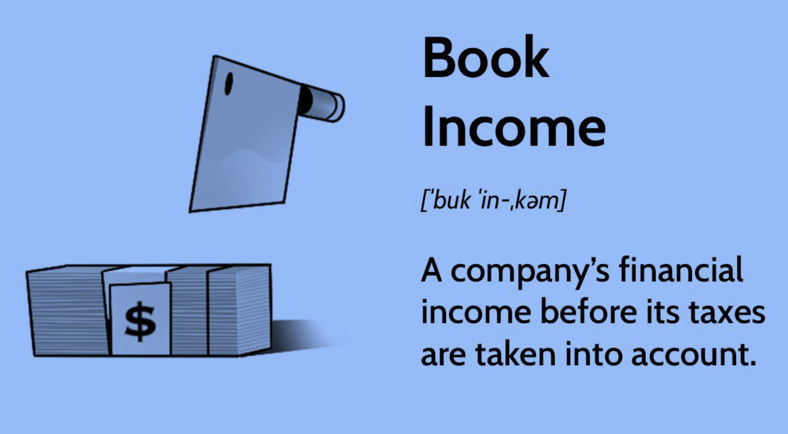

## Table of Contents

## What is book income?

Book income is the amount of money a company shows on its financial statements as its profit. This is calculated after subtracting all the costs and expenses from the total revenue earned during a specific period, usually a year. The financial statements, like the income statement, are used to report this information to shareholders and other interested parties. Book income is important because it gives an idea of how well the company is doing financially.

However, book income can be different from taxable income, which is the amount of money the company reports to the tax authorities for tax purposes. This difference happens because tax laws and accounting rules can have different ways of calculating income and expenses. For example, some expenses might be allowed to be deducted for tax purposes but not for book income, or vice versa. Understanding these differences is important for both the company's management and its investors.

## How is book income different from taxable income?

Book income and taxable income are two different ways to measure a company's profit. Book income is what a company reports on its financial statements. It shows how much money the company made after paying all its costs and expenses. This number is important for shareholders and investors because it tells them how well the company is doing. Book income follows accounting rules, which are set by organizations like the Financial Accounting Standards Board (FASB) in the United States.

Taxable income, on the other hand, is what a company reports to the tax authorities, like the Internal Revenue Service (IRS) in the United States. This is the amount of money the company uses to figure out how much tax it needs to pay. Taxable income follows tax laws, which can be different from accounting rules. For example, some expenses might be allowed to be deducted for tax purposes but not for book income, or vice versa. These differences can make book income and taxable income very different numbers, and it's important for companies to keep track of both.

## What are the common sources of book income for a business?

The main sources of book income for a business come from the money it makes from selling its products or services. This is called revenue. When a business sells something, whether it's a physical item like a toy or a service like a haircut, the money it gets from that sale adds to its revenue. Other sources of book income can include interest from money the business has in the bank, income from investments, or money received from renting out property. All these different ways of making money get added together to figure out the total revenue.

After a business knows how much money it made, it needs to subtract all its costs and expenses to find out its book income. Costs and expenses include things like the cost of making or buying the products it sells, paying employees, rent for its buildings, utilities, and other day-to-day expenses. Sometimes, a business might also have to account for things like depreciation, which is the decrease in value of its assets over time. Once all these costs and expenses are subtracted from the total revenue, what's left is the book income, which shows how much profit the business made during a specific period.

## How do businesses record book income in their financial statements?

Businesses record their book income on their financial statements, which are like reports that show how much money they made and spent. The main financial statement where book income is shown is called the income statement. This statement lists all the money the business made from selling things or providing services, which is called revenue. Then, it subtracts all the costs and expenses the business had, like the cost of making the products, paying employees, and other bills. What's left after subtracting all those costs is the book income, which shows the profit the business made during a certain time, like a year or a quarter.

Sometimes, businesses also need to include other things on their income statement that can affect book income. For example, they might have to account for depreciation, which is the decrease in value of their equipment or buildings over time. They might also have income from other sources, like interest from money in the bank or money from investments. All these different pieces of information are put together on the income statement to give a clear picture of the business's book income. This helps people who are interested in the business, like investors and shareholders, understand how well the company is doing financially.

## What are the key components of a book income statement?

A book income statement is a report that shows how much money a business made and spent over a certain time. The first part of the statement lists all the money the business earned from selling things or providing services, which is called revenue. This can include money from selling products, providing services, or even income from other sources like interest from money in the bank or profits from investments. All these different ways of making money are added together to find the total revenue.

The second part of the income statement lists all the costs and expenses the business had during that time. This includes the cost of making or buying the products the business sells, paying employees, rent for buildings, utilities, and other day-to-day expenses. Sometimes, the business also needs to account for things like depreciation, which is the decrease in value of its equipment or buildings over time. After subtracting all these costs and expenses from the total revenue, what's left is the book income, which shows the profit the business made during that period.

## How does book income affect a company's financial health?

Book income is important because it shows how much money a company made after paying all its bills. This number is shown on the company's income statement and tells people like shareholders and investors how well the company is doing. If a company has a high book income, it means it made a lot of profit, which is good for its financial health. A high book income can make people feel more confident about the company and might make them want to invest more money in it.

On the other hand, if a company has a low or negative book income, it means it didn't make much profit or even lost money. This can be a warning sign that the company might have problems. It might make people worried about the company's future and less likely to invest in it. So, book income is a key part of understanding a company's financial health and can influence what people think and do about the company.

## What are the accounting principles that govern the calculation of book income?

The calculation of book income is guided by accounting principles set by organizations like the Financial Accounting Standards Board (FASB) in the United States. These principles make sure that companies report their income in a clear and consistent way. One important principle is the revenue recognition principle, which says that a company should record revenue when it earns it, not just when it gets paid. Another key principle is the matching principle, which means that a company should match its expenses with the revenue they helped to earn. This helps to show a true picture of the company's profit.

These principles are important because they help to make sure that the book income reported by a company is accurate and fair. For example, if a company sells something in December but doesn't get paid until January, the revenue recognition principle says it should still count that sale in December's income. And if a company buys materials in one month to make a product it sells in another month, the matching principle says it should count those material costs in the same month it counts the revenue from the sale. By following these rules, companies can give a clear and honest report of their financial health.

## Can book income be manipulated, and if so, how?

Yes, book income can be manipulated. Companies might want to make their book income look better than it really is, to impress investors or get more money. They can do this by playing with the numbers. For example, a company might record sales before they actually happen, or they might not count some expenses until later. This makes the book income look higher for now. Another way is to change how they value their inventory or how they count depreciation, which can also make the numbers look better.

These tricks are called "earnings management" or sometimes "creative accounting." While some of these practices might be legal, they can still be misleading. If companies do this too much, it can be seen as fraud. A famous example is the Enron scandal, where the company used these tricks to make their book income look good, but it was all fake. This kind of manipulation can hurt the company in the long run because when the truth comes out, investors lose trust and the company can get in big trouble.

## How do changes in accounting standards impact book income?

Changes in accounting standards can have a big effect on a company's book income. These standards are the rules that companies follow when they report their money. If the rules change, it can mean that companies have to count their money in a different way. For example, if a new rule says that companies have to count their sales at a different time, it can make the book income look different. This can make it hard for people to compare the company's money from one year to the next, because the rules changed.

Sometimes, new accounting standards can make a company's book income go up or down, even if nothing else changed. For example, if a new rule says that companies have to count more expenses right away, it can make the book income look lower. On the other hand, if a new rule lets companies count their sales earlier, it can make the book income look higher. These changes can make it tricky for investors and shareholders to understand how well the company is really doing, because the numbers can look different just because of the new rules.

## What role does book income play in investment decisions?

Book income is important for people who want to invest in a company. It tells them how much money the company made after paying all its bills. If a company has a high book income, it means they made a lot of profit. This can make investors feel good about the company and more likely to put their money into it. They might think the company is doing well and will keep making money in the future.

On the other hand, if a company has a low or negative book income, it means they didn't make much profit or even lost money. This can make investors worried. They might think the company is not doing well and could have problems in the future. So, book income helps investors decide if a company is a good place to put their money. It's one of the key things they look at when they're thinking about investing.

## How is book income used in performance evaluation and management?

Book income is a big part of how businesses check how well they're doing. When managers look at the book income, they can see if the company made money or lost money during a certain time. If the book income is high, it means the company did a good job at making more money than it spent. This can make the managers feel good about their work and help them decide what to do next to keep making money. They might decide to spend more on things that helped them make money, like advertising or new products.

On the other hand, if the book income is low or negative, it means the company didn't make enough money to cover its costs. This can be a warning sign for managers. They might need to look at what went wrong and find ways to fix it. They could cut back on some expenses or try to sell more products. Book income helps managers see where they stand and make smart choices about how to run the business better.

## What are the advanced strategies for optimizing book income in multinational corporations?

Multinational corporations can use advanced strategies to optimize their book income by carefully managing their global operations. One way they do this is by using transfer pricing, which is how they set prices for goods or services moved between different parts of the company in different countries. By setting these prices in a smart way, they can move profits to countries with lower taxes, which can make their overall book income look better. Another strategy is to use currency hedging, where they protect themselves from changes in currency values. This can help them keep their costs down and their profits up, no matter what happens with the money in different countries.

Another important strategy is to take advantage of tax incentives and different accounting rules in different countries. Multinational corporations can choose where to invest or set up their operations based on where they can get the best tax breaks or use accounting methods that let them show higher profits. For example, they might invest in research and development in a country that gives tax credits for this kind of work. By understanding and using these differences, they can make their book income look as good as possible. 

Overall, optimizing book income for multinational corporations involves a lot of planning and smart financial moves. They need to keep a close eye on how they price things within their own company, how they handle different currencies, and how they use tax laws and accounting rules to their advantage. By doing all these things well, they can make their book income higher, which makes their company look more successful to investors and shareholders.

## References & Further Reading

Bergstra, J., et al. 'Algorithms for Hyper-Parameter Optimization.' Advances in Neural Information Processing Systems 24. This paper offers insights into optimizing trading algorithms through hyper-parameter adjustment, which is crucial for enhancing [algorithmic trading](/wiki/algorithmic-trading) frameworks.

Lopez de Prado, M. 'Advances in Financial Machine Learning.' This book is a comprehensive guide to implementing [machine learning](/wiki/machine-learning) techniques within financial settings. It details advanced methods that can be pivotal in developing effective algorithmic trading strategies.

Aronson, D. 'Evidence-Based Technical Analysis: Applying the Scientific Method and Statistical Inference to Trading Signals.' Aronson provides a rigorous approach to technical analysis by integrating scientific methods and statistical inference, which can be instrumental in refining trading signals within algorithmic systems.

Jansen, S. 'Machine Learning for Algorithmic Trading.' Jansen's work focuses on employing machine learning for constructing algorithmic trading models. The text covers practical applications, which are essential for traders seeking to leverage machine learning in financial markets.

Chan, E. P. 'Quantitative Trading: How to Build Your Own Algorithmic Trading Business.' This book serves as a practical manual for developing a personal algorithmic trading venture. It covers the essential quantitative techniques and provides practical advice on setting up and managing trading algorithms.

