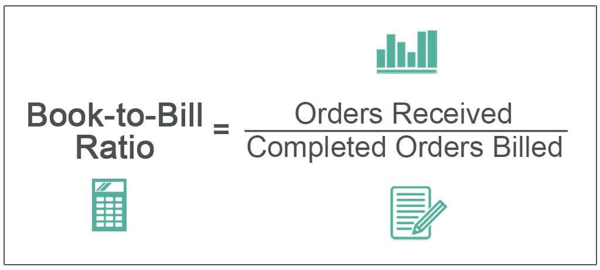

Understanding financial metrics is crucial for any business aiming to achieve sustainable growth. One metric that stands out in providing insights into a company's performance and potential is the book-to-bill ratio. This metric is vital in assessing a company's order performance and future prospects, offering a snapshot of the demand and supply balance over a given period.

The book-to-bill ratio is defined as the ratio of orders received to the orders shipped within the same period. It is a critical indicator for evaluating a company's efficiency in converting bookings into actual revenue, and it is particularly significant in industries characterized by rapid technological advancements and fluctuating market demands, such as manufacturing and technology sectors. A ratio above 1 suggests that more orders were booked than fulfilled, indicating future growth opportunities. Conversely, a ratio below 1 may signal decreasing demand or market challenges.



In today's rapidly evolving economic landscape, these insights are invaluable, particularly in the context of algorithmic trading. Algorithmic trading utilizes automated and pre-programmed trading instructions to execute orders. Incorporating the book-to-bill ratio into these algorithms can enhance a trader's ability to forecast market movements and make informed strategic decisions. By understanding and integrating this metric, businesses can refine decision-making processes in both operations and trading strategies.

Through this article, explore the book-to-bill ratio's integrative role in financial analysis, enhancing both business acumen and trading outcomes. This metric's relevance in modern business analysis and its impact on decision-making underscores the need for businesses to integrate it into their strategic planning and operational assessments.

## Table of Contents

## Understanding the Book-to-Bill Ratio

The book-to-bill ratio is a key financial metric that indicates the relationship between the orders a company [books](/wiki/algo-trading-books) and the orders it ships over a specified period, usually a month or quarter. This ratio is calculated by dividing the value of orders received by the value of orders fulfilled during the same timeframe. Mathematically, it can be expressed as:

$$
\text{Book-to-Bill Ratio} = \frac{\text{Orders Received}}{\text{Orders Shipped}}
$$

In the business world, the book-to-bill ratio is significant as it serves as a leading indicator of a company's future revenue and production capacity utilization. A ratio of 1 indicates a balance between incoming and outgoing orders, suggesting stable demand. A ratio greater than 1 suggests that demand is exceeding supply, which is often a positive sign indicating potential growth and increased future revenues. Conversely, a ratio below 1 might signal declining demand or overcapacity, potentially indicating a need for strategic adjustments.

The significance of the book-to-bill ratio varies across industries. In manufacturing, particularly in sectors like semiconductors and electronics, the ratio is crucial due to the high capital intensity and long production cycles involved. For instance, a high book-to-bill ratio in this sector can suggest upcoming expansions and increased investments in production capabilities to meet future demand. In the technology sector, the ratio also plays a vital role, as it helps companies manage inventories and production schedules in fast-evolving markets where product lifecycle is a critical [factor](/wiki/factor-investing).

Understanding the book-to-bill ratio also involves recognizing its strategic implications. A ratio above 1 can signal a company to scale up production or increase pricing due to strong demand. However, it can also indicate potential supply chain constraints if not managed adeptly. Conversely, a ratio below 1 may prompt a company to analyze market conditions, optimize operational efficiency, or adjust its sales strategies to align with current demand. 

In summary, the book-to-bill ratio is a valuable tool that provides insights into both operational performance and market conditions. It enables companies to make informed decisions about production, inventory management, and resource allocation, ultimately contributing to strategic planning and competitive advantage.

## The Role of Financial Metrics in Business Analysis

Financial metrics are essential tools for evaluating a company's health and potential, providing insights into its operational efficiency, profitability, and overall financial stability. These metrics allow stakeholders, including investors, managers, and analysts, to make informed decisions regarding business strategies, investments, and resource allocations.

The book-to-bill ratio, a key performance indicator, is an important component of financial analytics. It measures the ratio of orders received (bookings) to products shipped and billed (billings) over a specific period. This ratio is especially significant in industries like manufacturing and technology, where order backlogs and delivery timelines are critical.

$$
\text{Book-to-Bill Ratio} = \frac{\text{Bookings}}{\text{Billings}}
$$

A book-to-bill ratio greater than 1 implies that new orders are being received at a faster rate than existing orders are being fulfilled, suggesting business expansion and future revenue growth. Conversely, a ratio below 1 indicates a potential slowdown, as orders are not keeping pace with deliveries, possibly forecasting decreased future revenue.

Examples of businesses effectively utilizing financial metrics include those that have adjusted production schedules, optimized inventory levels, and refined sales strategies based on these insights. For instance, a tech company noticing a consistent book-to-bill ratio above 1 might increase production capacity to meet anticipated demand, whereas a manufacturing firm with a declining ratio might streamline operations to maintain profitability.

However, tracking and interpreting financial metrics accurately presents challenges. Data inconsistencies, timing issues, and external economic factors can distort these metrics, leading to potentially misleading conclusions. Businesses must ensure reliable data collection and adjust analyses for seasonal variations, market cycles, and industry trends to derive meaningful insights from their financial metrics. By combining the book-to-bill ratio with other financial indicators such as cash flow, profit margins, and revenue growth, companies can achieve a more holistic understanding of their operational dynamics and financial health.

## Leveraging Book-to-Bill Ratio in Algorithmic Trading

Algorithmic trading, often referred to as algo trading, has transformed financial markets by leveraging computing power and advanced algorithms to execute trades at speeds and efficiencies unattainable by human traders. This approach uses pre-defined criteria and mathematical models to assess market conditions and make trading decisions. The integration of financial metrics, such as the book-to-bill (BTB) ratio, into these algorithms can enhance their predictive accuracy and strategic effectiveness.

The book-to-bill ratio, a critical measure of a company's order performance relative to its billed sales, can be incorporated into trading algorithms to provide a real-time assessment of a company's order activity. A BTB ratio greater than 1 suggests that new orders exceed current sales, indicating potential growth, while a ratio less than 1 could signal a downturn. Integrating this ratio into trading algorithms involves utilizing it alongside other financial and technical indicators to refine decision-making processes.

For instance, a trading algorithm might assess historical BTB data alongside other financial metrics to predict price movements. Here is a simplified Python example:

```python
def predict_trend(btb_ratio, moving_average, revenue_growth):
    if btb_ratio > 1 and revenue_growth > 0 and moving_average > 0:
        return "Buy"
    elif btb_ratio < 1 and revenue_growth < 0 and moving_average < 0:
        return "Sell"
    else:
        return "Hold"

# Example data
btb_ratio = 1.2
moving_average = -0.5
revenue_growth = 0.1

decision = predict_trend(btb_ratio, moving_average, revenue_growth)
print(decision)  # Output: Hold
```

In this example, the algorithm evaluates the BTB ratio in conjunction with revenue growth and moving average trends to generate trading signals. A "Buy" signal might be triggered if all indicators suggest a positive trend, while the inverse data would prompt a "Sell" recommendation.

The benefits of using the BTB ratio in trading strategies include the ability to anticipate shifts in a company's market sentiment and operational performance. When combined with other financial indicators, it can help traders craft a more nuanced perspective on market conditions, which is particularly useful in volatile markets.

Case studies and theoretical models have demonstrated the effectiveness of incorporating the book-to-bill ratio into trading algorithms. For example, a study involving tech industry stocks showed that algorithms utilizing BTB ratios, alongside earnings reports and revenue forecasts, could improve investment returns by identifying undervalued stocks poised for future growth.

In conclusion, leveraging the book-to-bill ratio within [algorithmic trading](/wiki/algorithmic-trading) can significantly enhance trading outcomes by providing additional layers of insight into a company's operational health. When systematically integrated with other financial metrics, this ratio can serve as a powerful tool in crafting sophisticated trading strategies that align with market dynamics.

## Integrating Book-to-Bill Ratio with Other Financial Metrics

The book-to-bill ratio can significantly enhance financial analysis when used in conjunction with other key financial metrics. By integrating it with metrics such as cash flow, revenue growth, and profit margins, businesses can achieve a more comprehensive understanding of their financial health and operational performance.

Cash flow is a fundamental metric that measures the net amount of cash being transferred into and out of a business. When examined alongside the book-to-bill ratio, cash flow can provide insights into a company’s [liquidity](/wiki/liquidity-risk-premium) position against its order fulfillment capacity. For instance, a high book-to-bill ratio, indicating strong future sales, coupled with a positive cash flow, signifies that a company is well-positioned to capitalize on upcoming orders without liquidity issues. On the contrary, a high book-to-bill ratio with negative cash flow could point to operational inefficiencies or overexpansion risks.

Revenue growth tracks the increase in a company’s sales over specific periods. Integrating this metric with the book-to-bill ratio can reveal growth sustainability. For example, if a company shows consistent revenue growth but the book-to-bill ratio begins to drop, it may indicate impending challenges in securing future orders, signaling potential downturns in revenue trends.

Profit margins, delineated by dividing net income by revenue, assess a company’s efficiency in converting sales into actual profit. A healthy profit margin alongside a favorable book-to-bill ratio indicates not only robust sales but also effective cost management. Conversely, if profit margins are declining despite a high book-to-bill ratio, it could suggest rising production costs or pricing pressures, necessitating a strategic review.

To integrate these financial metrics effectively, businesses can employ a multidimensional approach using analytical frameworks such as the Dupont Model. This model disaggregates Return on Equity (ROE) into three components: profit margin, asset turnover, and financial leverage. By incorporating the book-to-bill ratio into this analysis, companies gain enhanced visibility into operational efficiencies and profitability drivers.

Python can be used to automate this analysis:

```python
import pandas as pd

# Sample data
data = {
    'Book_to_Bill_Ratio': [1.2, 0.9, 1.5],
    'Cash_Flow': [100000, -50000, 200000],
    'Revenue_Growth': [0.05, 0.02, 0.10],
    'Profit_Margin': [0.2, 0.15, 0.25]
}

# Create DataFrame
df = pd.DataFrame(data)

# Example of calculating effectiveness score
df['Effectiveness_Score'] = df['Book_to_Bill_Ratio'] * df['Profit_Margin'] * df['Revenue_Growth']

print(df)
```

In this example, the `Effectiveness_Score` serves as a composite indicator combining these fundamental metrics, offering a snapshot of holistic financial health.

The integration of multiple financial metrics fosters robust decision-making, allowing businesses to triangulate various facets of performance. Such a multidimensional approach reduces the risk of over-reliance on isolated data points, leading to more informed strategic outcomes. By balancing insights from book-to-bill ratios with cash flow dynamics, revenue trajectories, and profitability measures, companies can navigate the complexities of modern economic environments with greater precision and foresight.

## Challenges and Considerations

The book-to-bill ratio, while valuable, has potential pitfalls and limitations that businesses must consider. Relying solely on this metric can lead to skewed evaluations and misguided decisions if the broader context is neglected.

One significant limitation is its sensitivity to economic cycles and industry trends. During economic downturns, order inflow might naturally decline, causing the book-to-bill ratio to fluctuate. Similarly, booming sectors may exhibit elevated ratios that do not necessarily reflect sustainable growth. Therefore, businesses must contextualize the ratio within the larger economic environment to accurately assess its implications. This involves considering macroeconomic indicators, policy changes, and industry-specific trends that may influence order and billing patterns. 

Mitigating risks associated with skewed book-to-bill ratios involves adopting a holistic analysis framework. Companies should integrate this metric with other financial indicators, such as cash flow, revenue growth, and profit margins, to gain a comprehensive understanding. Employing a balanced scorecard approach can help businesses to gauge overall health and future prospects. Data validation techniques and regular audits ensure that the inputs used in calculating the ratio are accurate and up-to-date. This reduces the likelihood of basing decisions on erroneous data.

For accurate and contextually relevant analysis, it's essential to standardize data collection processes, considering seasonal adjustments or any significant events that could distort the ratio temporarily. Visualizing trends using software tools can aid in detecting outliers or anomalies, which might indicate fundamental changes rather than mere statistical noise.

In summary, while the book-to-bill ratio is a vital financial metric, its reliability can be enhanced by considering economic and industry contexts, integrating complementary metrics, and employing thorough data validation techniques. Such practices ensure that financial analyses are robust, relevant, and conducive to sound decision-making.

## Conclusion

In today's competitive business environment, understanding financial metrics is indispensable for achieving sustainable growth. A pivotal metric discussed throughout this article has been the book-to-bill ratio, which plays an essential role in assessing a company's order performance and forecasting future prospects. This ratio is invaluable both in traditional business analysis and in the fast-paced world of algorithmic trading. 

The book-to-bill ratio provides critical insights into a company's financial health by comparing new orders received to the value of products shipped and billed. A ratio above 1 suggests that a company is receiving more orders than it fulfills, indicating potential growth, while a ratio below 1 may signal a decline in demand, prompting the need for strategic adjustments. This makes it a crucial component for informed decision-making, particularly in industries like manufacturing and technology where order performance is a key indicator of future success.

For businesses, integrating the book-to-bill ratio into strategic planning and operational reviews can enhance forecasting accuracy and resource allocation. This metric, when used alongside others such as cash flow analysis, revenue growth, and profit margins, provides a comprehensive view of financial performance. This multidimensional approach is vital for navigating economic cycles and industry trends, ensuring robust and adaptive strategic planning.

In the context of algorithmic trading, the book-to-bill ratio can inform trading strategies by signaling changes in a company's operational [momentum](/wiki/momentum). Incorporating financial metrics in trading algorithms can lead to more informed and potentially profitable trading decisions, exemplifying the ratio's relevance in an evolving economic landscape.

For those looking to deepen their understanding of financial metrics and their integration into business strategies, exploring resources like "Financial Intelligence" by Karen Berman and Joe Knight, or "Algorithmic Trading: Winning Strategies and Their Rationale" by Ernie Chan, can be valuable. These resources provide further insights into the strategic application of financial metrics.

In conclusion, financial metrics, especially the book-to-bill ratio, are integral to both business analysis and algorithmic trading. By incorporating these metrics into strategic planning, businesses can better navigate the ever-evolving economic landscape, ensuring long-term growth and competitiveness.

## References & Further Reading

[1]: ["Financial Intelligence: A Manager's Guide to Knowing What the Numbers Really Mean"](https://www.amazon.com/Financial-Intelligence-Revised-Managers-Knowing/dp/1422144119) by Karen Berman and Joe Knight.

[2]: Chan, E. (2009). ["Algorithmic Trading: Winning Strategies and Their Rationale."](https://github.com/ftvision/quant_trading_echan_book) John Wiley & Sons.

[3]: ["Quantitative Trading: How to Build Your Own Algorithmic Trading Business"](https://www.amazon.com/Quantitative-Trading-Build-Algorithmic-Business/dp/0470284889) by Ernest P. Chan.

[4]: Anand, S. (2015). ["Techniques of Algorithmic Trading"](https://www.sciencedirect.com/science/article/pii/S1319157824001046). CreateSpace Independent Publishing Platform.

[5]: ["The Essentials of Financial Analysis"](https://www.amazon.com/Essentials-Financial-Analysis-Samuel-Weaver/dp/007176836X) by Samuel Weaver.