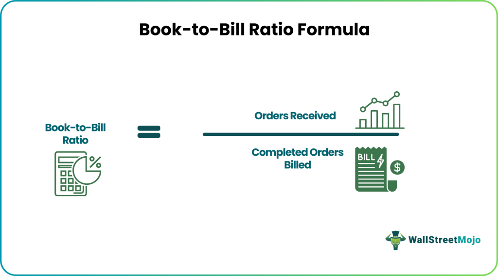

## Table of Contents

## What is the Book-to-Bill Ratio?

The Book-to-Bill Ratio is a simple way to measure how much business a company is getting compared to how much it is selling. It is mostly used in industries like manufacturing and technology. The ratio is calculated by dividing the total amount of orders received (bookings) by the total amount of products or services sold (billings) in a certain period, usually a quarter or a year. If the ratio is more than 1, it means the company is getting more orders than it is selling, which is a good sign for future growth.

This ratio helps investors and company leaders understand if the business is doing well. For example, if a company has a Book-to-Bill Ratio of 1.5, it means they are getting 50% more orders than they are selling. This can show that the company might grow in the future because it has a lot of work coming in. On the other hand, if the ratio is less than 1, it might mean the company is not getting enough new orders, which could be a warning sign. It's a useful tool to see how healthy a company's future might be.

## Why is the Book-to-Bill Ratio important in business?

The Book-to-Bill Ratio is important in business because it shows how well a company is doing in terms of new orders compared to what it's selling. If the ratio is more than 1, it means the company is getting more orders than it's selling, which is a good sign. It tells investors and business leaders that the company might grow in the future because it has a lot of work coming in. This can make people feel more confident about the company's future.

On the other hand, if the ratio is less than 1, it can be a warning sign. It means the company is not getting enough new orders, which could lead to problems down the road. By keeping an eye on the Book-to-Bill Ratio, companies can make better plans and decisions. It helps them understand if they need to work harder to get more orders or if they are doing well and can keep growing.

## How do you calculate the Book-to-Bill Ratio?

The Book-to-Bill Ratio is calculated by dividing the total amount of orders a company receives (bookings) by the total amount of products or services it sells (billings) in a certain period. This period is usually a quarter or a year. For example, if a company gets orders worth $150 million and sells products worth $100 million in a quarter, the Book-to-Bill Ratio would be $150 million divided by $100 million, which equals 1.5.

This ratio helps businesses understand if they are getting more orders than they are selling. A ratio of more than 1 means the company is doing well because it has more work coming in than it's currently selling. If the ratio is less than 1, it might mean the company needs to work harder to get more orders. Keeping track of this ratio helps companies plan for the future and make smart decisions about their business.

## What does a Book-to-Bill Ratio above 1 indicate?

A Book-to-Bill Ratio above 1 means that a company is getting more orders than it is selling. This is a good sign because it shows that the company has a lot of work coming in. When a company has more orders than it's selling, it can mean that the business might grow in the future. This makes people feel more confident about the company because it looks like it's doing well.

For example, if a company has a Book-to-Bill Ratio of 1.5, it means they are getting 50% more orders than they are selling. This tells investors and business leaders that the company is doing a good job at getting new business. It's a useful number to look at because it helps everyone understand how healthy the company's future might be.

## What does a Book-to-Bill Ratio below 1 indicate?

A Book-to-Bill Ratio below 1 means that a company is selling more than it is getting in new orders. This can be a warning sign because it shows that the company might not have enough work coming in to keep growing. If a company keeps selling more than it gets in new orders, it might run out of work in the future.

For example, if a company has a Book-to-Bill Ratio of 0.8, it means they are only getting 80% of the orders compared to what they are selling. This tells investors and business leaders that the company needs to work harder to get more orders. It's an important number to watch because it helps everyone understand if the company might have problems in the future.

## Can the Book-to-Bill Ratio be used in industries other than technology?

Yes, the Book-to-Bill Ratio can be used in many industries, not just technology. It is helpful in any industry where companies take orders for products or services. For example, in manufacturing, construction, and even service industries like consulting, the Book-to-Bill Ratio can show if a company is getting more orders than it is selling. This helps business leaders and investors see if the company is doing well and might grow in the future.

The ratio is calculated the same way in all industries: by dividing the total orders received by the total sales in a certain period. If the ratio is above 1, it means the company is getting more orders than it is selling, which is a good sign. If it's below 1, it means the company is not getting enough new orders, which might be a warning sign. Using the Book-to-Bill Ratio in different industries helps everyone understand how healthy a company's future might be, no matter what kind of business it is.

## How frequently should the Book-to-Bill Ratio be calculated?

The Book-to-Bill Ratio can be calculated as often as a company wants, but it's usually done every quarter or every year. A quarter is three months, so if a company calculates the ratio every quarter, they can see how they are doing every few months. This helps them keep an eye on their business and make changes if they need to.

Calculating the ratio every year is good for seeing how the company did over a longer time. It can show if the company is growing or if it needs to work on getting more orders. No matter how often a company calculates the Book-to-Bill Ratio, it helps them understand if they are doing well and what they might need to do next.

## What are the limitations of using the Book-to-Bill Ratio?

The Book-to-Bill Ratio is a helpful number, but it has some problems. One big problem is that it only looks at orders and sales. It doesn't tell you about other important things like how much money the company is making or how much it's spending. If a company has a lot of orders but is losing money, the Book-to-Bill Ratio won't show that. Also, the ratio can change a lot from one time to another. If a company gets a big order one quarter and nothing the next, the ratio can look very different even if the company is doing okay overall.

Another problem is that the Book-to-Bill Ratio can be different for different industries. What's a good ratio in one industry might not be good in another. For example, a ratio of 1.2 might be great for a tech company but not so good for a construction company. Also, the ratio doesn't say anything about how long it takes to finish the orders. If it takes a long time to make the products, the company might look like it's doing well, but it could have problems later. So, while the Book-to-Bill Ratio is useful, it's important to look at other numbers too to really understand how a company is doing.

## How does seasonality affect the Book-to-Bill Ratio?

Seasonality can change the Book-to-Bill Ratio a lot. Some businesses get more orders at certain times of the year. For example, a toy company might get a lot more orders around Christmas. If they calculate their Book-to-Bill Ratio during this time, it might look really good because they have so many orders coming in. But if they look at the ratio in a quieter time, like the summer, it might look much lower because they aren't getting as many orders.

This can make it hard to understand if the company is really doing well or if it's just because of the time of year. To get a better picture, companies should look at their Book-to-Bill Ratio over a whole year. This way, they can see how the ratio changes with the seasons and get a more accurate idea of how their business is doing overall.

## What are common misinterpretations of the Book-to-Bill Ratio?

One common mistake people make with the Book-to-Bill Ratio is thinking it tells the whole story about a company's health. The ratio only shows how many orders a company gets compared to what it sells. It doesn't say anything about how much money the company is making or spending. A company might have a high Book-to-Bill Ratio but still be losing money. So, it's important to look at other numbers too, like profit and costs, to really understand how a company is doing.

Another mistake is not thinking about seasonality. The Book-to-Bill Ratio can change a lot depending on the time of year. For example, a company might get a lot more orders during holiday seasons, making the ratio look good, but in quieter times, the ratio might be lower. If someone only looks at the ratio during busy times, they might think the company is doing better than it really is. To get a better idea, it's good to look at the ratio over a whole year to see how it changes with the seasons.

## How can the Book-to-Bill Ratio be used in forecasting?

The Book-to-Bill Ratio can help companies guess what might happen in the future. If the ratio is above 1, it means the company is getting more orders than it's selling. This can tell the company that they might have more work and maybe more money coming in later. By looking at the ratio, a company can plan better. They can see if they need to hire more people or buy more materials to keep up with the orders.

But, the Book-to-Bill Ratio isn't perfect for guessing the future. It doesn't tell everything about how the company is doing. For example, it doesn't show if the company is making money or losing it. Also, the ratio can change a lot because of the time of year. So, when using the Book-to-Bill Ratio to plan for the future, it's smart to look at other numbers too. This way, the company can get a fuller picture of what might happen next.

## What advanced metrics can be paired with the Book-to-Bill Ratio for deeper analysis?

To get a better understanding of how a company is doing, you can use other numbers along with the Book-to-Bill Ratio. One important number is the profit margin, which shows how much money the company keeps after paying for everything it needs to make its products or services. If a company has a high Book-to-Bill Ratio but a low profit margin, it might mean they're getting a lot of orders but not making much money from them. Another useful number is the inventory turnover ratio, which tells you how fast the company is selling and replacing its stock. A high inventory turnover can mean the company is good at managing its products, which can help keep the business healthy.

Another helpful metric is the cash flow statement, which shows how much money is coming in and going out of the company. Even if the Book-to-Bill Ratio is high, if the cash flow is negative, the company might have trouble paying its bills. The return on investment (ROI) is also important because it shows how well the company is using its money to make more money. By looking at these numbers together with the Book-to-Bill Ratio, you can get a clearer picture of the company's health and future growth.

## What is the Book-to-Bill Ratio and How Can It Be Understood?

The book-to-bill ratio is a key financial metric that indicates the relationship between the orders a company [books](/wiki/algo-trading-books) and the orders it ships over a specified period, usually a month or quarter. This ratio is calculated by dividing the value of orders received by the value of orders fulfilled during the same timeframe. Mathematically, it can be expressed as:

$$
\text{Book-to-Bill Ratio} = \frac{\text{Orders Received}}{\text{Orders Shipped}}
$$

In the business world, the book-to-bill ratio is significant as it serves as a leading indicator of a company's future revenue and production capacity utilization. A ratio of 1 indicates a balance between incoming and outgoing orders, suggesting stable demand. A ratio greater than 1 suggests that demand is exceeding supply, which is often a positive sign indicating potential growth and increased future revenues. Conversely, a ratio below 1 might signal declining demand or overcapacity, potentially indicating a need for strategic adjustments.

The significance of the book-to-bill ratio varies across industries. In manufacturing, particularly in sectors like semiconductors and electronics, the ratio is crucial due to the high capital intensity and long production cycles involved. For instance, a high book-to-bill ratio in this sector can suggest upcoming expansions and increased investments in production capabilities to meet future demand. In the technology sector, the ratio also plays a vital role, as it helps companies manage inventories and production schedules in fast-evolving markets where product lifecycle is a critical [factor](/wiki/factor-investing).

Understanding the book-to-bill ratio also involves recognizing its strategic implications. A ratio above 1 can signal a company to scale up production or increase pricing due to strong demand. However, it can also indicate potential supply chain constraints if not managed adeptly. Conversely, a ratio below 1 may prompt a company to analyze market conditions, optimize operational efficiency, or adjust its sales strategies to align with current demand. 

In summary, the book-to-bill ratio is a valuable tool that provides insights into both operational performance and market conditions. It enables companies to make informed decisions about production, inventory management, and resource allocation, ultimately contributing to strategic planning and competitive advantage.

## What is the Role of Financial Metrics in Business Analysis?

Financial metrics are essential tools for evaluating a company's health and potential, providing insights into its operational efficiency, profitability, and overall financial stability. These metrics allow stakeholders, including investors, managers, and analysts, to make informed decisions regarding business strategies, investments, and resource allocations.

The book-to-bill ratio, a key performance indicator, is an important component of financial analytics. It measures the ratio of orders received (bookings) to products shipped and billed (billings) over a specific period. This ratio is especially significant in industries like manufacturing and technology, where order backlogs and delivery timelines are critical.

$$
\text{Book-to-Bill Ratio} = \frac{\text{Bookings}}{\text{Billings}}
$$

A book-to-bill ratio greater than 1 implies that new orders are being received at a faster rate than existing orders are being fulfilled, suggesting business expansion and future revenue growth. Conversely, a ratio below 1 indicates a potential slowdown, as orders are not keeping pace with deliveries, possibly forecasting decreased future revenue.

Examples of businesses effectively utilizing financial metrics include those that have adjusted production schedules, optimized inventory levels, and refined sales strategies based on these insights. For instance, a tech company noticing a consistent book-to-bill ratio above 1 might increase production capacity to meet anticipated demand, whereas a manufacturing firm with a declining ratio might streamline operations to maintain profitability.

However, tracking and interpreting financial metrics accurately presents challenges. Data inconsistencies, timing issues, and external economic factors can distort these metrics, leading to potentially misleading conclusions. Businesses must ensure reliable data collection and adjust analyses for seasonal variations, market cycles, and industry trends to derive meaningful insights from their financial metrics. By combining the book-to-bill ratio with other financial indicators such as cash flow, profit margins, and revenue growth, companies can achieve a more holistic understanding of their operational dynamics and financial health.

## References & Further Reading

[1]: ["Financial Intelligence: A Manager's Guide to Knowing What the Numbers Really Mean"](https://www.amazon.com/Financial-Intelligence-Revised-Managers-Knowing/dp/1422144119) by Karen Berman and Joe Knight.

[2]: Chan, E. (2009). ["Algorithmic Trading: Winning Strategies and Their Rationale."](https://github.com/ftvision/quant_trading_echan_book) John Wiley & Sons.

[3]: ["Quantitative Trading: How to Build Your Own Algorithmic Trading Business"](https://www.amazon.com/Quantitative-Trading-Build-Algorithmic-Business/dp/0470284889) by Ernest P. Chan.

[4]: Anand, S. (2015). ["Techniques of Algorithmic Trading"](https://www.sciencedirect.com/science/article/pii/S1319157824001046). CreateSpace Independent Publishing Platform.

[5]: ["The Essentials of Financial Analysis"](https://www.amazon.com/Essentials-Financial-Analysis-Samuel-Weaver/dp/007176836X) by Samuel Weaver.