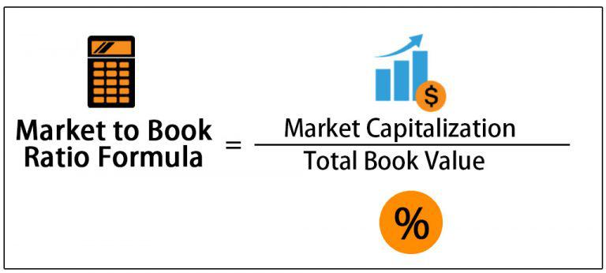

In financial analysis, the book-to-market ratio is a key indicator for assessing company value. It serves as a tool in investment strategies, especially within algorithmic trading environments. By charting the relationship between a company's book value and its market value, this metric offers a simple yet effective method for evaluating stock valuation.

Understanding financial metrics such as the book-to-market ratio can give investors and traders a competitive advantage. It measures whether a stock is potentially undervalued or overvalued by comparing the company's intrinsic value with its present market status. This ability is vital for making informed investment decisions, particularly in the fast-paced world of algorithmic trading, where rapid decision-making is essential.



This guide will provide insights into calculating the book-to-market ratio, exploring its significance in financial analysis, and understanding its application in algorithmic trading. Through this exploration, we aim to equip investors and traders with the knowledge needed to leverage this metric effectively, enhancing their ability to make strategic investment decisions.

## Table of Contents

## Understanding the Book-to-Market Ratio

The book-to-market ratio is a key financial metric used to assess a company's valuation. It provides a comparison between a company's book value and its market value, yielding insights into whether the company may be undervalued or overvalued by the market. The book value refers to the net asset value of a company as recorded on financial statements. It represents the company's assets minus liabilities and is typically based on historical costs. This contrasts with the market value, which is determined by multiplying the current share price by the total number of outstanding shares, encompassing investor perceptions and market conditions.

The mathematical expression for the book-to-market ratio is given by:

$$
\text{Book-to-Market Ratio} = \frac{\text{Book Value of Equity}}{\text{Market Value of Equity}}
$$

Where:
- The Book Value of Equity is calculated from the company's balance sheet and represents its net assets (total assets minus total liabilities).
- The Market Value of Equity is determined by the current trading price of the company's stock multiplied by the outstanding shares.

This ratio serves as a crucial indicator of a company's financial health. A higher book-to-market ratio suggests that the company may be undervalued, meaning the market price may not fully reflect the company’s intrinsic value as indicated by its net assets. Conversely, a lower ratio may imply that the company's market price is high relative to its book value, indicating potential overvaluation.

Understanding this ratio offers investors and analysts an edge in evaluating company valuations. It aids in distinguishing between perceived and actual value, thereby informing better investment decisions. Consequently, the book-to-market ratio remains a staple in [fundamental analysis](/wiki/fundamental-analysis) and value investing strategies. It prompts a closer examination of whether a company's stock price aligns with its tangible asset base, which is an important consideration irrespective of the market's sometimes irrational fluctuations.

## Significance in Financial Analysis

Financial analysts utilize the book-to-market ratio as a tool to discern between market speculation and the intrinsic value of a company's stock. This ratio serves as an indicator of how much a company's equity is potentially undervalued or overvalued by the market compared to its book value. Essentially, it provides a snapshot of investors' perceptions versus the firm's tangible asset base.

A high book-to-market ratio suggests that a company's market value is low relative to its book value, which might indicate that the stock is undervalued, making it a potential target for value investors. Conversely, a low ratio implies that the company's market value exceeds its book value, often perceived as overvaluation. However, such a low ratio might also signal investor confidence in the future growth potential of the company, attributing more to its market price than its current real assets suggest.

The book-to-market ratio is expressed mathematically as:

$$
\text{Book-to-Market Ratio} = \frac{\text{Book Value of Equity}}{\text{Market Value of Equity}}
$$

Where the book value of equity is derived from the company's financial statements, reflecting the net asset value, while the market value of equity is the current stock price multiplied by the outstanding shares.

In financial analysis, this ratio acts as an essential tool for interpreting investor sentiment and market trends. It helps analysts and investors gauge whether market prices are aligned with a company's actual financial health and potential, based on historical accounting measures. When combined with other financial metrics and qualitative factors, it can aid in constructing a clearer picture of a stock's long-term value proposition.

Furthermore, during volatile market conditions, the book-to-market ratio becomes even more critical as it can expose discrepancies between market prices driven by speculation versus those grounded in concrete financial performance. Thus, while not flawless on its own, the ratio is indispensable in the process of evaluating the nuanced interactions between perceived market value and factual company worth.

## Book-to-Market Ratio vs. Other Valuation Metrics

The book-to-market ratio, defined as the book value of equity divided by its market value, serves as a critical tool for investors keen on identifying undervalued stocks. However, it is often compared and contrasted with other valuation metrics, such as the price-to-book (P/B) ratio, which is the inverse of the book-to-market ratio, calculated by dividing the market value by the book value of equity. Both ratios aim to provide insights into stock valuation but cater to different analytical perspectives.

The book-to-market ratio is particularly favored in identifying value stocks. A high book-to-market ratio indicates that a company’s book value is high relative to its market value, suggesting potential undervaluation in the eyes of investors. Conversely, a low book-to-market ratio generally signals an overvalued stock relative to its assets on the balance sheet.

In contrast, the price-to-book ratio, being the inverse, is more commonly cited in financial literature and investor presentations. It is especially useful in comparing companies within the same industry. A low P/B ratio may suggest undervaluation or a fundamental problem with the company, whereas a high P/B could indicate overvaluation or reflect the company's strong fundamentals justifying a higher market valuation.

Both the book-to-market ratio and the price-to-book ratio can complement each other when performing comprehensive investment analyses. While the book-to-market ratio highlights undervaluation by focusing on discrepancies between market perception and actual book value, the price-to-book ratio provides a perspective on how much investors are willing to pay per dollar of net assets. Together, they offer a dual lens for evaluating financial and market positions.

In scenarios where one metric might be favored over the other, context is crucial. For instance, in industries known for rapid asset turnover or intangible asset prominence, such as technology or pharmaceuticals, the price-to-book ratio might provide a clearer depiction, since these companies might have significant intangible assets not fully captured by book value. Conversely, in industries where tangible assets are the primary value drivers, such as manufacturing or utilities, the book-to-market ratio might more accurately reflect inherent value. 

Ultimately, a well-rounded analysis often incorporates both metrics, along with others like the price-to-earnings (P/E) ratio and return on equity (ROE), facilitating a robust valuation framework. This multi-faceted approach aids investors in balancing inherent business value assessments against market sentiment and expectations.

## Uses in Investment Strategies

Value investors prioritize companies whose market values might not fully appreciate their intrinsic worth, often indicated by a high book-to-market ratio. This financial metric helps pinpoint stocks that may be undervalued relative to their book value, providing these investors with opportunities to achieve returns when the market eventually recognizes the company's true value.

The book-to-market ratio plays a central role in investment strategies focused on long-term value. Unlike short-term trading tactics that may chase market trends, value investing based on the book-to-market ratio seeks to capitalize on significant price corrections over time. This approach assumes that the market will eventually align stock prices with the company’s intrinsic value, allowing patient investors to benefit from this revaluation.

Incorporating the book-to-market ratio into diversified investment plans enhances risk management by balancing potential gains with exposure to overvalued stocks. For example, an investor might allocate a portion of a portfolio to stocks identified as undervalued by the book-to-market ratio, counterbalancing more speculative investments. This strategic allocation helps mitigate risks associated with market fluctuations, as undervalued stocks provide a cushion against losses in more volatile segments.

Consider a practical example: a value investor calculates the book-to-market ratio using the formula:

$$
\text{Book-to-Market Ratio} = \frac{\text{Book Value per Share}}{\text{Market Price per Share}}
$$

Utilizing this metric, the investor identifies a stock with a high ratio, indicating that its market price is low compared to its book value. By incorporating this stock into a diversified portfolio, the investor positions themselves for potential market corrections, thereby enhancing the portfolio's resilience against [volatility](/wiki/volatility-trading-strategies).

The book-to-market ratio's utility in investment strategies is further supported by its ability to identify stocks with inherent financial stability due to their strong book values, even if current market perceptions do not reflect this. By focusing on such stocks, investors decrease reliance on market timing and trends, emphasizing instead the underlying financial fundamentals that sustain long-term growth and stability.

## Application in Algorithmic Trading

Algorithmic trading systems increasingly rely on quantitative metrics to identify profitable trades, and the book-to-market ratio is frequently employed in selecting value stocks. This ratio aids in distinguishing undervalued stocks by comparing a company's book value to its market value, which can be a crucial [factor](/wiki/factor-investing) in [algorithmic trading](/wiki/algorithmic-trading) strategies.

### Coding Strategies Integrating the Book-to-Market Ratio

To integrate the book-to-market ratio into algorithmic trading, a straightforward approach is to automate the selection of stocks that exhibit favorable ratio characteristics. Consider using Python, a popular programming language for quant traders, combined with libraries like pandas for data manipulation and NumPy for mathematical operations. Here's a simplified example of how this can be done:

```python
import pandas as pd

# Sample dataset containing financial data
data = {
    'Ticker': ['AAPL', 'GOOGL', 'MSFT'],
    'Book Value': [500000000, 400000000, 300000000],  # in dollars
    'Market Value': [1500000000, 900000000, 700000000]  # in dollars
}

# Creating a DataFrame
df = pd.DataFrame(data)

# Calculating the Book-to-Market Ratio
df['Book-to-Market'] = df['Book Value'] / df['Market Value']

# Selecting stocks with high Book-to-Market ratio (e.g., > 0.5)
value_stocks = df[df['Book-to-Market'] > 0.5]

print(value_stocks)
```

This code calculates the book-to-market ratio for a set of stocks and selects those that appear undervalued based on a specified threshold. The key in effective algorithmic strategies lies in defining appropriate thresholds, which can be adjusted based on historical data and market conditions.

### Leveraging the Ratio in Volatile Markets

In volatile or uncertain market conditions, the book-to-market ratio can serve as a stabilizing factor. Expert traders often use this ratio to filter stocks that are inherently stable but temporarily undervalued due to market fluctuations.

The integration of the book-to-market ratio into trading algorithms can help in constructing robust portfolios by focusing on fundamentally strong stocks that offer a margin of safety thanks to their undervaluation. By building automated systems that monitor this ratio, traders can quickly capitalize on transient market inefficiencies.

Python's flexibility allows for more sophisticated implementations, including dynamic threshold adjustments, real-time data feeds integration, and [machine learning](/wiki/machine-learning) models that refine the use of the book-to-market ratio in trading decisions. For instance, developing an adaptive trading algorithm that learns and adjusts to market volatility patterns over time can significantly enhance trading performance. By combining the book-to-market ratio with other financial indicators and machine learning techniques, traders can develop a comprehensive trading system that is both reactive to market shifts and predictive in nature.

In conclusion, while the book-to-market ratio is a fundamental tool in algorithmic trading, it should be used alongside other financial metrics and techniques to optimize stock selection and trading strategies effectively.

## Limitations of the Book-to-Market Ratio

The book-to-market ratio, while a valuable tool for assessing company value, has notable limitations when used in isolation. One major limitation is its inability to account for future growth potential. The ratio is fundamentally based on historical financial data and the current market value, which means it does not incorporate forward-looking data or growth projections. This can be particularly problematic for companies in high-growth industries where the present book value may not reflect the company's potential for expansion and increased earnings. 

Additionally, the book-to-market ratio is sensitive to accounting practices and market conditions. Different industries may have varying levels of book assets relative to market value due to their unique business models and asset structures. For instance, tech companies often have significant intangible assets that may not be fully captured in the book value. This discrepancy can lead to misleading interpretations of a company's actual financial health and investment potential.

Scenarios where investors might rely too heavily on the book-to-market ratio include markets with rapidly changing dynamics or where companies have significant intangible or off-balance sheet assets. In such cases, the ratio can skew low, falsely suggesting undervaluation, or high, implying overvaluation, without considering the company's strategic position or competitive advantages.

To mitigate these issues, it is crucial to use the book-to-market ratio alongside other financial metrics and qualitative factors. Financial analyses such as the price-to-earnings ratio, cash flow assessments, and industry trend analyses provide a more comprehensive understanding of a company's value. Moreover, qualitative factors such as management quality, market positioning, and innovation capacity further contribute to robust investment decisions. 

In summary, while the book-to-market ratio offers important insights into stock valuation, relying on it exclusively can be misleading. For well-rounded investment analysis, integrating multiple financial tools and perspectives is essential, ensuring that decisions account for both the current state and future potential of a company.

## Conclusion

The book-to-market ratio continues to serve as a vital tool for evaluating a company's equity value and gauging investor sentiment. By comparing the book value and market value of a company, this metric provides investors with insights that can illuminate potential discrepancies between a company's accounting value and its market valuation. However, while the book-to-market ratio can be immensely informative, relying on it exclusively may not yield the full picture needed for sound investment decisions. 

A more holistic investment approach benefits from integrating the book-to-market ratio with other financial metrics and analyses. For instance, combining it with metrics like the price-to-book ratio, price-to-earnings ratio, or cash flow analysis can offer a more nuanced understanding of a company's financial standing and growth potential. This comprehensive perspective allows investors to better assess risk, identify undervalued securities, and make more informed decisions regarding their investment portfolios.

This article underscores the importance of harnessing these financial tools judiciously. Both novice and seasoned investors are encouraged to employ a blend of metrics rather than relying solely on one, such as the book-to-market ratio, to navigate the complex landscape of investment analysis effectively. Embracing a diversified analytical approach helps ensure robust investment strategies and potential for successful outcomes in varied market conditions.

## FAQs

### What is the book-to-market ratio, and how does it impact investment analysis?

The book-to-market ratio is a financial metric used to compare a company's book value to its market value. Expressed mathematically, it is the ratio of the company's total book value to its total market capitalization. The book value reflects the recorded net asset value of the company from its financial statements, essentially its assets minus liabilities. The market value is determined by the current share price multiplied by the total number of outstanding shares. A higher book-to-market ratio may indicate that a stock is potentially undervalued, while a lower ratio might suggest overvaluation. This ratio helps investors and analysts identify investment opportunities by assessing whether a stock is trading for less than its book value, which can inform sound investment analysis and decisions.

### How do I calculate the book-to-market ratio, and what does it indicate?

To calculate the book-to-market ratio, use the formula:

$$
\text{Book-to-Market Ratio} = \frac{\text{Book Value of the Company}}{\text{Market Value of the Company}}
$$

- **Book Value:** This is derived from the balance sheet as the difference between total assets and total liabilities.
- **Market Value:** Calculated by multiplying the current stock price by the number of outstanding shares.

The resulting ratio is a measure of how the market values the company's actual book value. A book-to-market ratio greater than 1 indicates that the company’s book value exceeds its market valuation, which might suggest that the stock is undervalued. Conversely, a ratio less than 1 could imply overvaluation. This metric is particularly useful for value investors seeking stocks which the market has potentially underpriced, offering the opportunity for capital appreciation.

### Are there risks in relying solely on the book-to-market ratio for investment decisions?

While the book-to-market ratio can signal undervaluation, relying solely on it presents several risks:

1. **Growth Potential:** It does not account for future growth prospects or intangible assets, which might undervalue companies with high potential.
2. **Market Fluctuations:** The ratio can be influenced by short-term market volatility, which may not reflect a company's long-term value.
3. **Industry Variations:** Different industries have varying benchmarks for what constitutes a ‘good’ book-to-market ratio, leading to potential misinterpretations.
4. **Asset Misvaluation:** Book values can be based on historical costs and may not reflect current market conditions or inflationary changes.

To mitigate these risks, investors should use the book-to-market ratio alongside other financial metrics, like the price-to-earnings ratio, to form a comprehensive analysis of a company’s financial health and true market value.

### How does the book-to-market ratio enhance algorithmic trading strategies?

In algorithmic trading, the book-to-market ratio can play a vital role in formulating quantitative strategies aimed at identifying value stocks. By coding algorithms to incorporate this ratio, traders can automate the selection process for stocks that exhibit favorable valuation characteristics. Here is a simple Python example of how the book-to-market ratio might be integrated into an algorithmic trading strategy:

```python
import pandas as pd

def calculate_book_to_market(data):
    data['Book-to-Market'] = data['Book Value'] / (data['Price'] * data['Shares Outstanding'])
    return data

def select_value_stocks(data, threshold=1.0):
    # Filter stocks with a book-to-market ratio above the threshold
    return data[data['Book-to-Market'] > threshold]

# Sample data for stock analysis
data = pd.DataFrame({
    'Company': ['A', 'B', 'C'],
    'Book Value': [500, 300, 400],
    'Price': [10, 15, 20],
    'Shares Outstanding': [50, 25, 10]
})

# Calculate and filter value stocks
data = calculate_book_to_market(data)
value_stocks = select_value_stocks(data)

print(value_stocks)
```

By filtering stocks based on the book-to-market ratio within algorithmic systems, traders can efficiently target and automate trades for stocks identified as undervalued, optimizing their portfolios to capitalize on potential pricing inefficiencies in the market.

## References & Further Reading

[1]: Fama, E. F., & French, K. R. (1993). ["Common risk factors in the returns on stocks and bonds."](https://www.sciencedirect.com/science/article/pii/0304405X93900235) Journal of Financial Economics, 33(1), 3-56.

[2]: Penman, S. H. (1996). ["The articulation of price-earnings ratios and market-to-book ratios and the evaluation of growth."](https://www.jstor.org/stable/2491501) Journal of Accounting Research, 34(2), 235-259.

[3]: ["Value Investing: From Graham to Buffett and Beyond"](https://www.amazon.com/Value-Investing-Graham-Buffett-Beyond/dp/0471463396) by Bruce C. N. Greenwald, Judd Kahn, Paul D. Sonkin, and Michael van Biema

[4]: ["Financial Modeling"](https://en.wikipedia.org/wiki/Financial_modeling) by Simon Benninga

[5]: Chan, L. K., Hamao, Y., & Lakonishok, J. (1991). ["Fundamentals and stock returns in Japan."](https://ja.wikipedia.org/wiki/%E8%B3%87%E6%9C%AC%E8%B3%87%E7%94%A3%E4%BE%A1%E6%A0%BC%E3%83%A2%E3%83%87%E3%83%AB) Journal of Finance, 46(5), 1739-1764.