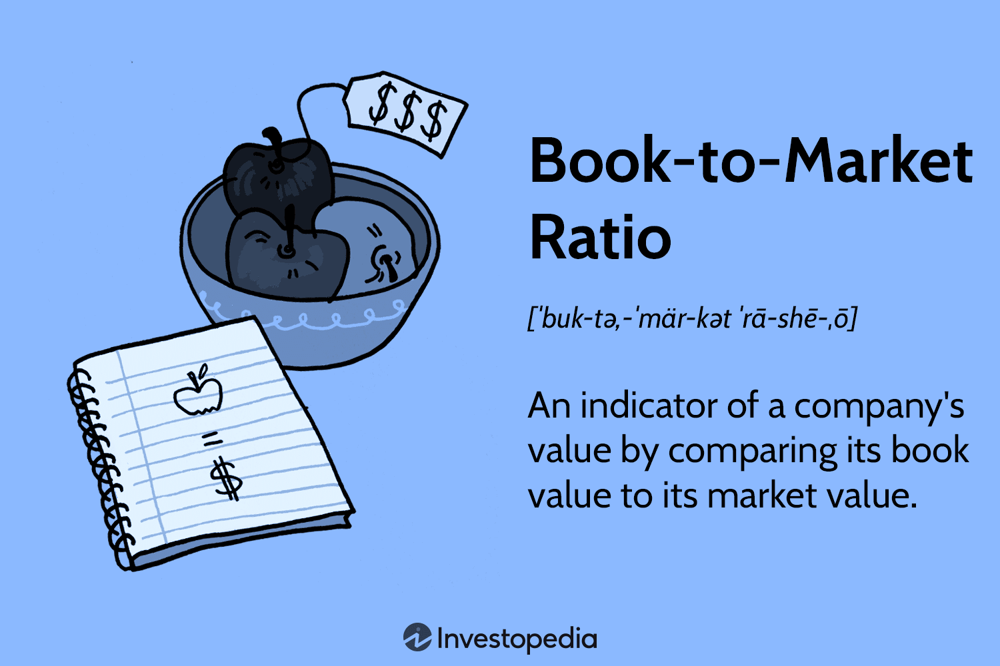

## Table of Contents

## What is the Book-to-Market Ratio?

The Book-to-Market Ratio is a financial measure that compares the book value of a company to its market value. Book value is what the company's assets are worth according to its financial statements, after subtracting any debts. Market value, on the other hand, is what investors think the company is worth, based on its stock price.

This ratio is often used by investors to find stocks that might be undervalued. If the Book-to-Market Ratio is high, it means the market value is low compared to the book value, suggesting the stock might be a good buy. A low ratio could mean the stock is overvalued. However, this ratio should not be the only tool used to make investment decisions, as other factors also need to be considered.

## How is the Book-to-Market Ratio calculated?

The Book-to-Market Ratio is calculated by dividing a company's book value by its market value. The book value is found by taking the total assets of the company and subtracting its total liabilities. This gives you the net worth of the company according to its financial statements. The market value is simply the total value of the company's outstanding shares, which you can find by multiplying the current stock price by the number of shares.

Once you have both the book value and the market value, you divide the book value by the market value to get the Book-to-Market Ratio. For example, if a company has a book value of $50 million and a market value of $100 million, the Book-to-Market Ratio would be 0.5. This ratio helps investors see if a company's stock might be undervalued or overvalued. A higher ratio can mean the stock is undervalued, while a lower ratio might mean it's overvalued.

## Why is the Book-to-Market Ratio important for investors?

The Book-to-Market Ratio is important for investors because it helps them find stocks that might be a good deal. It compares what a company is really worth, according to its [books](/wiki/algo-trading-books), to what people are willing to pay for it in the stock market. If the ratio is high, it means the stock might be undervalued, which could be a good time to buy. Investors like to find these undervalued stocks because they believe the price will go up in the future.

However, the Book-to-Market Ratio isn't perfect and should be used with other tools. It's just one piece of the puzzle when deciding whether to buy a stock. Sometimes a high ratio might mean the company is struggling, not that it's a good investment. So, investors need to look at other things like the company's earnings, future growth, and the overall market to make smart choices.

## What does a high Book-to-Market Ratio indicate?

A high Book-to-Market Ratio means that a company's book value is much higher than its market value. This usually suggests that the stock might be undervalued, which means it could be a good buy. Investors often look for stocks with high Book-to-Market Ratios because they think the stock price might go up in the future as the market realizes the company's true worth.

However, a high Book-to-Market Ratio isn't always a sure sign of a good investment. Sometimes, it can mean the company is having problems, and the market is not willing to pay much for its stock. So, investors need to look at other things like the company's earnings, its future plans, and what's happening in the market before deciding to buy the stock.

## What does a low Book-to-Market Ratio suggest?

A low Book-to-Market Ratio means that a company's market value is much higher than its book value. This can suggest that the stock might be overvalued, meaning people are paying more for the stock than what the company's books say it's worth. Investors might see a low ratio as a warning sign that the stock price could be too high and might drop in the future.

However, a low Book-to-Market Ratio doesn't always mean the stock is a bad investment. Sometimes, it can mean the company is doing really well and has a bright future, so investors are willing to pay more for it. It's important for investors to look at other things like the company's earnings, its growth plans, and what's happening in the market to make a good decision.

## How does the Book-to-Market Ratio differ from the Price-to-Book Ratio?

The Book-to-Market Ratio and the Price-to-Book Ratio are two ways to look at a company's value, but they are opposite sides of the same coin. The Book-to-Market Ratio is found by dividing the book value of a company by its market value. It helps investors see if a stock might be undervalued or overvalued. A high Book-to-Market Ratio means the stock could be a good buy because the market value is low compared to what the company is worth on paper.

On the other hand, the Price-to-Book Ratio is calculated by dividing the market value by the book value. This ratio tells investors how much they are paying for the company's net assets. A high Price-to-Book Ratio might mean the stock is overvalued, while a low ratio could suggest it's undervalued. Both ratios help investors make decisions, but they are used in different ways to understand if a stock is a good deal or not.

## Can the Book-to-Market Ratio be used to predict stock returns?

The Book-to-Market Ratio can sometimes help predict how well a stock might do in the future. Studies have shown that stocks with high Book-to-Market Ratios often do better than stocks with low ratios. This is because high ratios usually mean the stock is undervalued, and investors think the price will go up as more people realize how good the company is.

However, the Book-to-Market Ratio is not a magic tool that always works. It's just one piece of the puzzle. Other things like the company's earnings, what's happening in the economy, and how people feel about the market can also affect stock returns. So, while it can give you a clue about future stock performance, it's best to use it with other tools to make smarter investment choices.

## What are the limitations of using the Book-to-Market Ratio as an investment tool?

Using the Book-to-Market Ratio as an investment tool has some limits. One big problem is that the book value might not show the true value of a company. For example, things like a company's brand or how good its team is don't show up on the books, but they can make the company worth a lot more. Also, the book value can be out of date because it's based on what the company was worth in the past, not what it's worth now.

Another issue is that a high Book-to-Market Ratio doesn't always mean a stock is a good buy. Sometimes, a high ratio can mean the company is in trouble, and the market doesn't want to pay much for its stock. So, investors need to look at other things like the company's earnings, its plans for the future, and what's happening in the market to make smart choices. The Book-to-Market Ratio is just one piece of the puzzle, not the whole picture.

## How has the Book-to-Market Ratio been used in financial models like the Fama-French Three-Factor Model?

The Book-to-Market Ratio is a key part of the Fama-French Three-Factor Model, which is used to explain why some stocks do better than others. In this model, Eugene Fama and Kenneth French added two new factors to the old way of thinking about stock returns. One of these factors is the Book-to-Market Ratio. They found that stocks with high Book-to-Market Ratios, meaning the stock's price is low compared to what the company is worth on paper, tend to do better than stocks with low ratios. This helps investors see which stocks might be a good buy.

The Fama-French model uses the Book-to-Market Ratio to help explain why some stocks do better than others. It shows that companies with high Book-to-Market Ratios often have higher returns. This is because these stocks are usually seen as undervalued, and investors think the price will go up as more people realize how good the company is. But, the Book-to-Market Ratio is just one part of the model. It also looks at the size of the company and how the whole market is doing to give a fuller picture of what might happen with stock returns.

## What industries typically have higher Book-to-Market Ratios?

Industries that usually have higher Book-to-Market Ratios are often those that have a lot of physical stuff, like buildings or machines. These are called asset-heavy industries. Examples include manufacturing, where companies make things like cars or steel, and utilities, which provide services like electricity or water. These industries have high book values because their assets are worth a lot on paper, but their market values might be lower if people think the companies won't make much money in the future.

Another type of industry with high Book-to-Market Ratios can be those that are going through tough times. For example, if a whole industry is struggling, like what sometimes happens in the oil and gas sector, the market might not want to pay much for the companies in that industry. This makes the market value go down, even if the book value stays the same or goes up. So, even though these companies might have a lot of valuable stuff, their stocks can still look undervalued to investors.

## How can changes in accounting standards affect the Book-to-Market Ratio?

Changes in accounting standards can mess with the Book-to-Market Ratio because they change how a company's book value is figured out. If new rules make companies write down their assets for less, the book value goes down. This makes the Book-to-Market Ratio lower, even if the market value stays the same. On the other hand, if new rules let companies count their assets for more, the book value goes up, making the Book-to-Market Ratio higher.

For example, if a new rule says companies have to count their buildings at what they're worth now instead of what they paid for them years ago, the book value could go way up. This would make the Book-to-Market Ratio higher, making it look like the stock is a better deal than it was before. Investors need to keep an eye on these changes to understand if a high or low Book-to-Market Ratio is really telling them something important about the stock or if it's just because of new accounting rules.

## What advanced statistical methods can be applied to enhance the predictive power of the Book-to-Market Ratio?

To make the Book-to-Market Ratio better at guessing how stocks will do, you can use fancy math tools like regression analysis. Regression analysis helps you see how the Book-to-Market Ratio, along with other things like how big the company is or how well it's doing, can help predict stock returns. By using regression, you can figure out how much the Book-to-Market Ratio matters compared to other factors. This way, you can make a smarter guess about which stocks might go up in value.

Another cool math trick is [machine learning](/wiki/machine-learning). Machine learning can look at tons of data, including the Book-to-Market Ratio, and find patterns that are hard for people to see. It can learn from past stock prices and other information to make better predictions about the future. By using machine learning, investors can get a clearer picture of how the Book-to-Market Ratio and other stuff work together to affect stock returns. This can help them pick stocks that are more likely to do well.

## What is the Book-to-Market Ratio and How Can We Understand It?

The book-to-market ratio is a key financial metric used to assess a company's valuation. It provides a comparison between a company's book value and its market value, yielding insights into whether the company may be undervalued or overvalued by the market. The book value refers to the net asset value of a company as recorded on financial statements. It represents the company's assets minus liabilities and is typically based on historical costs. This contrasts with the market value, which is determined by multiplying the current share price by the total number of outstanding shares, encompassing investor perceptions and market conditions.

The mathematical expression for the book-to-market ratio is given by:

$$
\text{Book-to-Market Ratio} = \frac{\text{Book Value of Equity}}{\text{Market Value of Equity}}
$$

Where:
- The Book Value of Equity is calculated from the company's balance sheet and represents its net assets (total assets minus total liabilities).
- The Market Value of Equity is determined by the current trading price of the company's stock multiplied by the outstanding shares.

This ratio serves as a crucial indicator of a company's financial health. A higher book-to-market ratio suggests that the company may be undervalued, meaning the market price may not fully reflect the company’s intrinsic value as indicated by its net assets. Conversely, a lower ratio may imply that the company's market price is high relative to its book value, indicating potential overvaluation.

Understanding this ratio offers investors and analysts an edge in evaluating company valuations. It aids in distinguishing between perceived and actual value, thereby informing better investment decisions. Consequently, the book-to-market ratio remains a staple in [fundamental analysis](/wiki/fundamental-analysis) and value investing strategies. It prompts a closer examination of whether a company's stock price aligns with its tangible asset base, which is an important consideration irrespective of the market's sometimes irrational fluctuations.

## What is the significance in financial analysis?

Financial analysts utilize the book-to-market ratio as a tool to discern between market speculation and the intrinsic value of a company's stock. This ratio serves as an indicator of how much a company's equity is potentially undervalued or overvalued by the market compared to its book value. Essentially, it provides a snapshot of investors' perceptions versus the firm's tangible asset base.

A high book-to-market ratio suggests that a company's market value is low relative to its book value, which might indicate that the stock is undervalued, making it a potential target for value investors. Conversely, a low ratio implies that the company's market value exceeds its book value, often perceived as overvaluation. However, such a low ratio might also signal investor confidence in the future growth potential of the company, attributing more to its market price than its current real assets suggest.

The book-to-market ratio is expressed mathematically as:

$$
\text{Book-to-Market Ratio} = \frac{\text{Book Value of Equity}}{\text{Market Value of Equity}}
$$

Where the book value of equity is derived from the company's financial statements, reflecting the net asset value, while the market value of equity is the current stock price multiplied by the outstanding shares.

In financial analysis, this ratio acts as an essential tool for interpreting investor sentiment and market trends. It helps analysts and investors gauge whether market prices are aligned with a company's actual financial health and potential, based on historical accounting measures. When combined with other financial metrics and qualitative factors, it can aid in constructing a clearer picture of a stock's long-term value proposition.

Furthermore, during volatile market conditions, the book-to-market ratio becomes even more critical as it can expose discrepancies between market prices driven by speculation versus those grounded in concrete financial performance. Thus, while not flawless on its own, the ratio is indispensable in the process of evaluating the nuanced interactions between perceived market value and factual company worth.

## What are the uses in investment strategies?

Value investors prioritize companies whose market values might not fully appreciate their intrinsic worth, often indicated by a high book-to-market ratio. This financial metric helps pinpoint stocks that may be undervalued relative to their book value, providing these investors with opportunities to achieve returns when the market eventually recognizes the company's true value.

The book-to-market ratio plays a central role in investment strategies focused on long-term value. Unlike short-term trading tactics that may chase market trends, value investing based on the book-to-market ratio seeks to capitalize on significant price corrections over time. This approach assumes that the market will eventually align stock prices with the company’s intrinsic value, allowing patient investors to benefit from this revaluation.

Incorporating the book-to-market ratio into diversified investment plans enhances risk management by balancing potential gains with exposure to overvalued stocks. For example, an investor might allocate a portion of a portfolio to stocks identified as undervalued by the book-to-market ratio, counterbalancing more speculative investments. This strategic allocation helps mitigate risks associated with market fluctuations, as undervalued stocks provide a cushion against losses in more volatile segments.

Consider a practical example: a value investor calculates the book-to-market ratio using the formula:

$$
\text{Book-to-Market Ratio} = \frac{\text{Book Value per Share}}{\text{Market Price per Share}}
$$

Utilizing this metric, the investor identifies a stock with a high ratio, indicating that its market price is low compared to its book value. By incorporating this stock into a diversified portfolio, the investor positions themselves for potential market corrections, thereby enhancing the portfolio's resilience against [volatility](/wiki/volatility-trading-strategies).

The book-to-market ratio's utility in investment strategies is further supported by its ability to identify stocks with inherent financial stability due to their strong book values, even if current market perceptions do not reflect this. By focusing on such stocks, investors decrease reliance on market timing and trends, emphasizing instead the underlying financial fundamentals that sustain long-term growth and stability.

## What are the frequently asked questions?

### What is the book-to-market ratio, and how does it impact investment analysis?

The book-to-market ratio is a financial metric used to compare a company's book value to its market value. Expressed mathematically, it is the ratio of the company's total book value to its total market capitalization. The book value reflects the recorded net asset value of the company from its financial statements, essentially its assets minus liabilities. The market value is determined by the current share price multiplied by the total number of outstanding shares. A higher book-to-market ratio may indicate that a stock is potentially undervalued, while a lower ratio might suggest overvaluation. This ratio helps investors and analysts identify investment opportunities by assessing whether a stock is trading for less than its book value, which can inform sound investment analysis and decisions.

### How do I calculate the book-to-market ratio, and what does it indicate?

To calculate the book-to-market ratio, use the formula:

$$
\text{Book-to-Market Ratio} = \frac{\text{Book Value of the Company}}{\text{Market Value of the Company}}
$$

- **Book Value:** This is derived from the balance sheet as the difference between total assets and total liabilities.
- **Market Value:** Calculated by multiplying the current stock price by the number of outstanding shares.

The resulting ratio is a measure of how the market values the company's actual book value. A book-to-market ratio greater than 1 indicates that the company’s book value exceeds its market valuation, which might suggest that the stock is undervalued. Conversely, a ratio less than 1 could imply overvaluation. This metric is particularly useful for value investors seeking stocks which the market has potentially underpriced, offering the opportunity for capital appreciation.

### Are there risks in relying solely on the book-to-market ratio for investment decisions?

While the book-to-market ratio can signal undervaluation, relying solely on it presents several risks:

1. **Growth Potential:** It does not account for future growth prospects or intangible assets, which might undervalue companies with high potential.
2. **Market Fluctuations:** The ratio can be influenced by short-term market volatility, which may not reflect a company's long-term value.
3. **Industry Variations:** Different industries have varying benchmarks for what constitutes a ‘good’ book-to-market ratio, leading to potential misinterpretations.
4. **Asset Misvaluation:** Book values can be based on historical costs and may not reflect current market conditions or inflationary changes.

To mitigate these risks, investors should use the book-to-market ratio alongside other financial metrics, like the price-to-earnings ratio, to form a comprehensive analysis of a company’s financial health and true market value.

### How does the book-to-market ratio enhance algorithmic trading strategies?

In [algorithmic trading](/wiki/algorithmic-trading), the book-to-market ratio can play a vital role in formulating quantitative strategies aimed at identifying value stocks. By coding algorithms to incorporate this ratio, traders can automate the selection process for stocks that exhibit favorable valuation characteristics. Here is a simple Python example of how the book-to-market ratio might be integrated into an algorithmic trading strategy:

```python
import pandas as pd

def calculate_book_to_market(data):
    data['Book-to-Market'] = data['Book Value'] / (data['Price'] * data['Shares Outstanding'])
    return data

def select_value_stocks(data, threshold=1.0):
    # Filter stocks with a book-to-market ratio above the threshold
    return data[data['Book-to-Market'] > threshold]

# Sample data for stock analysis
data = pd.DataFrame({
    'Company': ['A', 'B', 'C'],
    'Book Value': [500, 300, 400],
    'Price': [10, 15, 20],
    'Shares Outstanding': [50, 25, 10]
})

# Calculate and filter value stocks
data = calculate_book_to_market(data)
value_stocks = select_value_stocks(data)

print(value_stocks)
```

By filtering stocks based on the book-to-market ratio within algorithmic systems, traders can efficiently target and automate trades for stocks identified as undervalued, optimizing their portfolios to capitalize on potential pricing inefficiencies in the market.

## References & Further Reading

[1]: Fama, E. F., & French, K. R. (1993). ["Common risk factors in the returns on stocks and bonds."](https://www.sciencedirect.com/science/article/pii/0304405X93900235) Journal of Financial Economics, 33(1), 3-56.

[2]: Penman, S. H. (1996). ["The articulation of price-earnings ratios and market-to-book ratios and the evaluation of growth."](https://www.jstor.org/stable/2491501) Journal of Accounting Research, 34(2), 235-259.

[3]: ["Value Investing: From Graham to Buffett and Beyond"](https://www.amazon.com/Value-Investing-Graham-Buffett-Beyond/dp/0471463396) by Bruce C. N. Greenwald, Judd Kahn, Paul D. Sonkin, and Michael van Biema

[4]: ["Financial Modeling"](https://en.wikipedia.org/wiki/Financial_modeling) by Simon Benninga

[5]: Chan, L. K., Hamao, Y., & Lakonishok, J. (1991). ["Fundamentals and stock returns in Japan."](https://ja.wikipedia.org/wiki/%E8%B3%87%E6%9C%AC%E8%B3%87%E7%94%A3%E4%BE%A1%E6%A0%BC%E3%83%A2%E3%83%87%E3%83%AB) Journal of Finance, 46(5), 1739-1764.