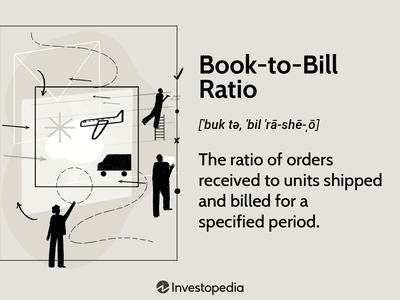

In today’s competitive business landscape, efficient supply chain management is crucial for success. Companies are constantly seeking ways to optimize their operations to remain competitive and responsive to customer demands. A pivotal aspect of this optimization is the effective management of inventory, where key metrics play an essential role. Among these metrics, the book-to-ship ratio stands out as one of the most critical.

The book-to-ship ratio measures the efficiency with which companies fulfill customer orders. It compares the number of orders shipped to those received, highlighting discrepancies that may point to inefficiencies in the supply chain. This ratio provides valuable insights into order fulfillment processes, allowing businesses to pinpoint areas that require improvement.



This article will explore the significance of the book-to-ship ratio in supply chain optimization and its critical role in modern inventory management strategies. Additionally, as industries turn towards data-driven solutions, the interplay between this metric and algorithmic trading strategies becomes increasingly relevant, offering new opportunities for enhancing order management. 

Finally, we will discuss how the integration of supply chain metrics with emerging technologies, such as artificial intelligence and machine learning, holds the potential to revolutionize supply chain processes. By leveraging these technological advancements, companies can achieve greater efficiency, reduce waste, and improve customer satisfaction, ultimately positioning themselves for long-term success.

## Table of Contents

## Understanding Supply Chain Metrics

Supply chain metrics are vital tools for evaluating how efficiently and effectively an organization manages its supply chain processes. These metrics provide quantitative data that aid in diagnosing the health of the supply chain, guiding strategic decisions, and driving continuous improvement. Common supply chain metrics include inventory turnover, order accuracy, and fill rates. Each of these metrics serves a specific purpose and provides particular insights into different aspects of supply chain performance.

Inventory turnover is a measure of how often a company sells and replaces its inventory over a certain period. It indicates how efficiently inventory is managed, with higher turnover rates generally reflecting effective inventory management and strong sales. The formula for inventory turnover is:

$$
\text{Inventory Turnover} = \frac{\text{Cost of Goods Sold (COGS)}}{\text{Average Inventory}}
$$

Order accuracy refers to the percentage of orders shipped without any discrepancies in terms of quantity, items, and delivery timelines as compared to what was ordered. High order accuracy is crucial for customer satisfaction and retention.

Fill rate is the percentage of customer orders that are fulfilled on the first shipment, indicating the ability of the supply chain to meet customer demand without delay. A higher fill rate means a higher degree of customer satisfaction and efficiency in order fulfillment.

A particularly important metric within this suite is the book-to-ship ratio. This metric highlights a company's order fulfillment efficiency by measuring the ratio of orders shipped to orders booked. A book-to-ship ratio of 1 indicates perfect synchronization between the orders received and the orders delivered. Deviations from this ideal ratio can highlight potential inefficiencies and areas for improvement within the supply chain.

By carefully monitoring and analyzing these key supply chain metrics, businesses can gain valuable insights into their operational performance and identify opportunities to optimize processes. This is crucial in ensuring the company remains competitive and responsive to market demands.

## The Book-To-Ship Ratio: A Key Inventory Management Metric

The book-to-ship ratio is a pivotal metric in inventory management, measuring the proportion of orders shipped compared to those booked. A ratio of 1 signifies a perfect balance between orders received and shipped, indicating efficient order fulfillment. Conversely, deviations from this ideal point to potential inefficiencies in the supply chain, such as delays or overstocking.

Understanding this ratio is crucial for companies seeking to optimize their supply chain and production processes. A book-to-ship ratio greater than 1 might suggest overproduction or a stockpile of inventory, while a ratio less than 1 could indicate that the company struggles to meet demand due to underproduction or supply chain bottlenecks. Such insights allow businesses to make informed decisions about inventory, logistics, and production scheduling.

The book-to-ship ratio thus serves as a diagnostic tool, guiding companies in their effort to align supply with demand. By tracking and analyzing this ratio regularly, businesses can fine-tune their operations, ensuring that they maintain an optimal balance between meeting customer demand and managing inventory levels efficiently. Tools and strategies to improve this ratio include demand forecasting, effective communication with suppliers, and leveraging technology to automate and streamline operations.

## How to Calculate the Book-to-Ship Ratio

Calculating the book-to-ship ratio is a straightforward process that offers valuable insights into a company's order fulfillment efficiency. This metric is calculated by dividing the monetary value of orders shipped by the value of orders received over a specific period. The formula can be expressed as follows:

$$
\text{Book-to-Ship Ratio} = \frac{\text{Total Monetary Value of Orders Shipped}}{\text{Total Monetary Value of Orders Received}}
$$

### Step-by-Step Guide

1. **Determine the Time Frame**: Choose a period for evaluation, such as a month or a quarter, to ensure consistent data.

2. **Calculate Total Orders Received**: Sum up the monetary value of all customer orders received in the selected time frame. This step involves collating data from sales and customer orders systems.

3. **Calculate Total Orders Shipped**: Sum up the monetary value of all orders shipped to customers during the same period. This data is usually available from the company's shipping or logistics records.

4. **Apply the Formula**: Use the formula provided to calculate the ratio.

5. **Interpret the Ratio**: 
   - A ratio of 1 indicates perfect alignment between orders received and orders shipped, implying optimal order fulfillment.
   - A ratio greater than 1 indicates over-shipment, which might mean reduced inventory levels or errors in shipment.
   - A ratio less than 1 indicates under-shipment, suggesting potential delays in fulfillment or over-ordering relative to shipping capacity.

### Examples and Case Studies

To better illustrate the application of the book-to-ship ratio, consider the following examples:

#### Example 1: Small Retail Business

Imagine a small retail company that received $150,000 worth of orders in June and shipped $140,000 worth of goods. The book-to-ship ratio for June would be:

$$
\text{Book-to-Ship Ratio} = \frac{140,000}{150,000} = 0.933
$$

This ratio (less than 1) indicates the potential for improvement as the company did not meet all the orders received.

#### Example 2: E-commerce Platform

An e-commerce platform received $500,000 worth of orders and shipped $550,000 worth of goods in the same quarter. Their book-to-ship ratio would be:

$$
\text{Book-to-Ship Ratio} = \frac{550,000}{500,000} = 1.1
$$

A ratio above 1 suggests potential over-shipment, possibly leading to future inventory shortages or the need for realignment of stock levels.

By understanding and applying the book-to-ship ratio correctly, businesses can identify inefficiencies, streamline their operations, and improve supply chain management practices.

## Improving Order Management with Algorithmic Trading

Algorithmic trading in the supply chain context involves using sophisticated algorithms to streamline and enhance order management and inventory processes. By leveraging these algorithms, businesses can efficiently predict demand, manage stock levels, and improve the book-to-ship ratio.

Advanced algorithms, particularly those based on [machine learning](/wiki/machine-learning) and [artificial intelligence](/wiki/ai-artificial-intelligence), are capable of analyzing large datasets to forecast demand with high accuracy. This prediction ability allows businesses to align their inventory levels more closely with actual market needs, reducing instances of overstocking or stockouts. For example, a machine learning model can be trained using historical sales data, seasonality patterns, and external factors, such as economic indicators, to predict future demand for a product.

In addition to demand forecasting, algorithms can optimize inventory management by determining the optimal replenishment cycles and safety stock levels. This involves solving complex optimization problems where the objective is to minimize costs associated with holding, ordering, and stockouts, while satisfying service level requirements. An example of such an optimization problem can be formulated and solved using Python:

```python
import numpy as np
from scipy.optimize import linprog

# Define costs
holding_cost_per_unit = 1.5
ordering_cost = 100
shortage_cost_per_unit = 2.5

# Define constraints and coefficients
A = np.array([[1, 1, 0], [0, 1, 1]])
b = np.array([200, 150])
c = np.array([holding_cost_per_unit, ordering_cost, shortage_cost_per_unit])

# Solve linear programming problem
res = linprog(c, A_ub=A, b_ub=b, bounds=(0, None))

# Output result
optimal_values = res.x
```

The result from such an optimization helps in decision-making regarding how much and when to reorder inventory, thus reducing costs and enhancing efficiency in the supply chain.

Implementation of these algorithms in logistics processes involves integrating them into existing systems such as enterprise resource planning (ERP) and warehouse management systems (WMS). This integration allows for real-time data flow and automated decision-making capabilities. By aligning algorithmic tools with operational practices, businesses ensure that fluctuations in demand and supply are addressed promptly, maintaining an optimal book-to-ship ratio.

Moreover, algorithmic approaches can facilitate dynamic pricing strategies, where prices are adjusted in real-time based on demand predictions and inventory levels, further contributing to optimized order management.

In conclusion, by employing [algorithmic trading](/wiki/algorithmic-trading) techniques within the supply chain, businesses can achieve substantial improvements in inventory management and order processing, leading to a more favorable book-to-ship ratio and better overall supply chain performance.

## Utilizing Technology for Enhanced Supply Chain Efficiency

Technological advancements have transformed supply chain operations, providing businesses with tools that significantly enhance their efficiency. Among these advancements, Artificial Intelligence (AI) and Machine Learning (ML) stand out as game-changers, helping companies adopt data-driven approaches to streamline their processes.

AI and ML algorithms can analyze vast datasets to predict demand patterns with high accuracy. This predictive capability allows companies to optimize their inventory levels, thereby improving the book-to-ship ratio—a critical indicator of supply chain performance. By forecasting demand more accurately, businesses can schedule production and align their shipping schedules to meet actual demand, reducing both overstock scenarios and missed sales opportunities due to stockouts.

A practical example of leveraging AI in inventory management is through machine learning models that utilize historical sales data, seasonal trends, and even external factors like economic indicators or weather forecasts. These models can continuously learn and adapt, providing real-time adjustments to inventory levels. Here's a simple illustration of a Python code snippet that could be used to implement a predictive algorithm:

```python
from sklearn.ensemble import RandomForestRegressor
import numpy as np

# Sample input data: historical sales
X_train = np.array([[1, 200], [2, 250], [3, 300], [4, 450]])  # [month, sales]
y_train = np.array([220, 245, 310, 430])  # predicted sales

# Train a machine learning model
model = RandomForestRegressor()
model.fit(X_train, y_train)

# Predict next month's sales
X_test = np.array([[5, 400]])
predicted_sales = model.predict(X_test)
print("Predicted sales for next month:", predicted_sales[0])
```

In addition to predictive analytics, automation tools play a critical role in enhancing supply chain efficiency. These tools automate order processing, reducing manual errors and speeding up the fulfillment cycle. For instance, using automated warehouse systems such as robotic pickers and conveyor belts can streamline [picking](/wiki/asset-class-picking) and packing operations, ensuring faster and more accurate order shipments.

Moreover, Internet of Things (IoT) technology enables enhanced visibility across the supply chain. IoT devices can monitor and relay real-time data on the status and location of inventory and shipments, allowing for proactive decision-making. For example, sensors can track temperature and humidity in storage facilities, ensuring that sensitive products are stored under optimal conditions.

Blockchain technology offers another layer of innovation by ensuring transparency and traceability. By maintaining an immutable record of transactions, blockchain can alleviate issues related to fraud and discrepancies in order fulfillment, further optimizing the book-to-ship ratio.

Incorporating these technologies not only enhances the book-to-ship ratio but also positively impacts overall supply chain performance by reducing costs, improving customer satisfaction, and enabling businesses to be more agile in responding to market demands. As more organizations embrace these technological advancements, the evolution towards more efficient, data-driven supply chain operations continues to gather pace.

## Strategies for Optimizing Book-to-Ship Ratio

To optimize the book-to-ship ratio effectively, businesses should focus on several strategic areas that enhance their supply chain operations.

### Demand Forecasting

Accurate demand forecasting is essential for predicting sales and aligning inventory levels with market demands. Companies can utilize statistical models and machine learning algorithms to analyze historical sales data, market trends, and economic indicators. For example, a simple linear regression model can help predict future demand based on past sales:

```python
from sklearn.linear_model import LinearRegression
import numpy as np

# Historical sales data
sales_data = np.array([100, 150, 200, 250, 300])
time_periods = np.array([1, 2, 3, 4, 5])

# Reshape the data for the model
time_periods = time_periods.reshape(-1, 1)

# Create and fit the model
model = LinearRegression().fit(time_periods, sales_data)

# Predict future sales
future_periods = np.array([[6], [7], [8]])
predicted_sales = model.predict(future_periods)
print(predicted_sales)
```

By understanding potential demand more accurately, companies can optimize their production schedules, reduce excess inventory, and improve the book-to-ship ratio.

### Enhancing Supplier Collaboration

Effective collaboration with suppliers is crucial to minimize lead times and ensure the availability of necessary materials. Businesses can establish strategic partnerships with key suppliers to facilitate better communication and coordination. Implementing shared forecasting models and integrated supply chain management systems allows for real-time data sharing, leading to improved synchronization between production schedules and supply deliveries.

### Optimizing Inventory Levels

Optimizing inventory levels involves maintaining a balance between overstocking and stockouts, which can impact the book-to-ship ratio. Implementing inventory management techniques like Just-In-Time (JIT) and Economic Order Quantity (EOQ) helps achieve this balance. The EOQ model can help determine the optimal order quantity that minimizes total inventory costs:

$$
EOQ = \sqrt{\frac{{2DS}}{H}}
$$

where:
- $D$ is the annual demand,
- $S$ is the ordering cost per order,
- $H$ is the holding cost per unit per year.

### Prioritizing High-Value Customers

Addressing high-value customer needs ensures that limited resources are allocated effectively. By using customer segmentation, businesses can prioritize orders from key clients, thereby improving the reliability of the book-to-ship ratio for these segments. Tailored strategies such as customized product offerings and dedicated service teams can enhance customer satisfaction and loyalty.

### Utilizing Cross-Functional Teams

Cross-functional teams comprising members from sales, production, logistics, and finance can foster enhanced communication and collaboration within an organization. These teams can address challenges holistically, align objectives across departments, and make informed decisions that optimize the book-to-ship ratio. Regular meetings and performance reviews are recommended to continuously improve processes and address any discrepancies. 

By implementing these strategies, businesses can achieve a more balanced and efficient order fulfillment process, leading to a favorable book-to-ship ratio and increased competitiveness in the market.

## Conclusion

The book-to-ship ratio stands as a crucial metric within supply chain management, directly influencing both customer satisfaction and the operational efficiency of a business. By measuring the alignment between orders received and orders fulfilled, this ratio provides invaluable insights into the effectiveness of order fulfillment processes. A well-maintained book-to-ship ratio signifies a seamless supply chain operation, which not only meets customer expectations promptly but also minimizes inventory holding costs and enhances resource allocation.

Leveraging modern technologies and data-driven strategies offers significant potential to optimize the book-to-ship ratio. Advanced analytics and artificial intelligence can forecast demand with greater accuracy, allowing businesses to better align their inventory levels with actual market needs. Automation tools streamline order processing and logistics, reducing the time from order receipt to delivery. The integration of these technologies facilitates a more responsive and agile supply chain capable of adapting to fluctuations in demand.

Companies that excel at managing their book-to-ship ratio are well-positioned to achieve long-term success. Efficient management not only leads to cost reductions but also enhances customer loyalty through reliable service delivery. As the market landscape continues to evolve, maintaining a competitive edge necessitates investing in the right tools and strategies to ensure optimal alignment between business operations and customer expectations. Businesses that prioritize their book-to-ship ratio as part of an overarching supply chain strategy are likely to thrive in the dynamic and competitive business environment.

## References & Further Reading

[1]: Christopher, M. (2016). ["Logistics & Supply Chain Management."](https://books.google.com/books/about/Logistics_Supply_Chain_Management.html?id=vWNxjgEACAAJ) Pearson.

[2]: Chopra, S., & Meindl, P. (2016). ["Supply Chain Management: Strategy, Planning, and Operation."](https://books.google.com/books/about/Supply_Chain_Management_Strategy_Plannin.html?id=gPDQCQAAQBAJ) Pearson.

[3]: Silver, E. A., Pyke, D. F., & Thomas, D. J. (2016). ["Inventory and Production Management in Supply Chains,"](https://www.taylorfrancis.com/books/mono/10.1201/9781315374406/inventory-production-management-supply-chains-edward-silver-david-pyke-douglas-thomas) CRC Press.

[4]: Montgomery, D. C., Jennings, C. L., & Kulahci, M. (2015). ["Introduction to Time Series Analysis and Forecasting."](https://onlinelibrary.wiley.com/doi/full/10.1111/jtsa.12203) Wiley.

[5]: Rushton, A., Croucher, P., & Baker, P. (2014). ["The Handbook of Logistics and Distribution Management: Understanding the Supply Chain."](https://books.google.com/books/about/The_Handbook_of_Logistics_and_Distributi.html?id=-jlUEAAAQBAJ) Kogan Page.