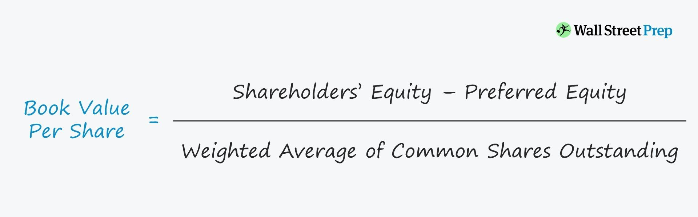

## Table of Contents

## What is book value and why is it important?

Book value is the total value of a company's assets minus its liabilities, as shown on its balance sheet. It's like figuring out how much a company would be worth if it sold all its stuff and paid off all its debts. This number is important because it gives investors a basic idea of what a company might be worth, at least on paper.

Knowing the book value helps investors see if a company's stock is a good deal. If the stock price is lower than the book value per share, it might mean the stock is undervalued, which could be a good buying opportunity. But, book value isn't perfect because it doesn't always show the true market value of assets, especially things like brand names or customer loyalty, which can be really valuable but hard to put a number on.

## How is book value calculated?

Book value is calculated by taking the total value of a company's assets and then subtracting the total value of its liabilities. Assets are things the company owns, like buildings, equipment, and money in the bank. Liabilities are what the company owes, like loans and bills. So, if a company has assets worth $10 million and liabilities of $4 million, its book value would be $6 million.

This calculation gives you the book value of the whole company. To find the book value per share, you divide the total book value by the number of outstanding shares of the company's stock. For example, if the book value is $6 million and there are 1 million shares, the book value per share would be $6. This number helps investors see if the stock might be a good buy compared to its market price.

## What is the difference between book value and market value?

Book value and market value are two different ways to figure out how much a company is worth. Book value is what you get when you take all the stuff a company owns, like buildings and money, and subtract all the money it owes, like loans. It's like looking at the company's balance sheet to see what's left if everything was sold and all debts were paid. This number is important because it gives a basic idea of the company's worth on paper.

Market value, on the other hand, is what people are willing to pay for the company's stock right now. It's based on what's happening in the stock market and can change a lot from day to day. Market value takes into account not just the company's assets and liabilities, but also things like how well the company is doing, what people think about its future, and even the overall mood of the market. So, market value can be much higher or lower than the book value, depending on what investors think the company is really worth.

## Can you provide a simple example of how to calculate book value for a company?

Let's say we have a small company called "Bike Shop Inc." Bike Shop Inc. owns a store building worth $200,000, has $50,000 in the bank, and has inventory of bikes and parts worth $100,000. So, the total assets of Bike Shop Inc. are $350,000. But, Bike Shop Inc. also has a loan of $150,000 that it needs to pay back. The total liabilities are $150,000.

To find the book value of Bike Shop Inc., we subtract the total liabilities from the total assets. So, $350,000 (assets) minus $150,000 (liabilities) equals $200,000. This means the book value of Bike Shop Inc. is $200,000. This number tells us what the company would be worth if it sold all its stuff and paid off all its debts.

## What are the components that make up the book value of a company?

The book value of a company is made up of two main parts: assets and liabilities. Assets are all the things the company owns that have value. This includes things like buildings, equipment, money in the bank, and inventory. For example, if a company owns a factory, that factory is an asset. If it has cash in the bank, that's also an asset. All these assets together make up the total value of what the company owns.

Liabilities, on the other hand, are all the money the company owes. This can include loans, bills, and any other debts. For instance, if the company took out a loan to buy that factory, the loan is a liability. To find the book value, you take the total value of all the assets and subtract the total value of all the liabilities. So, if a company has assets worth $500,000 and liabilities of $300,000, its book value would be $200,000. This number shows what the company would be worth if it sold everything and paid off all its debts.

## How does depreciation affect the book value of assets?

Depreciation is like a way to show that things a company owns, like machines or buildings, get old and less valuable over time. When a company buys something big, it doesn't count the whole cost as an expense right away. Instead, it spreads the cost over the years the thing will be used. This is called depreciation. As the value of these things goes down each year because of depreciation, the total value of the company's assets also goes down.

This drop in the value of assets because of depreciation directly affects the book value of the company. Book value is what you get when you take all the company's assets and subtract all its debts. So, if the value of the assets goes down due to depreciation, the book value goes down too. For example, if a company bought a machine for $10,000 and it depreciates by $2,000 each year, after one year, the value of the machine on the books would be $8,000. If that's the only asset, and there are no liabilities, the book value of the company would drop from $10,000 to $8,000 after one year.

## What role does book value play in financial analysis and investment decisions?

Book value is a key number that people who analyze companies and investors look at. It helps them see if a company's stock might be a good deal. When you know the book value, you can compare it to the stock's current price. If the stock price is less than the book value per share, it might mean the stock is undervalued. This could be a sign that it's a good time to buy the stock. But, book value isn't perfect because it doesn't always show the true value of things like a company's brand or how happy its customers are, which can be really important but hard to put a number on.

Investors also use book value to understand a company's financial health. If a company's book value is going up over time, it might mean the company is doing well and growing. But if the book value is going down, it could be a warning sign that the company is not doing so great. This can help investors decide if they want to keep their money in the company or if it's time to sell. So, while book value is just one piece of the puzzle, it's an important one that helps people make smarter choices about where to put their money.

## How can book value be used to assess a company's financial health?

Book value is a useful tool for checking a company's financial health because it shows what the company would be worth if it sold everything and paid off all its debts. By looking at the book value, you can see if the company has more stuff than it owes, which is a good sign. If the book value is going up over time, it might mean the company is doing well and getting stronger financially. On the other hand, if the book value is going down, it could be a warning that the company is not doing so great and might be struggling.

Investors often compare the book value to the stock's market price to see if the stock might be a good deal. If the stock price is lower than the book value per share, it might mean the stock is undervalued and could be a good buy. But, book value doesn't tell the whole story because it doesn't include things like how strong the company's brand is or how happy its customers are, which can be really important but hard to put a number on. So, while book value is helpful for understanding a company's financial health, it's just one piece of the puzzle that investors should look at.

## What are the limitations of using book value as a metric?

Book value is a helpful number, but it has some limits. One big problem is that it doesn't show the real value of things like a company's brand or how happy its customers are. These things can be really important and valuable, but they're hard to put a number on. So, book value might make a company look less valuable than it really is because it doesn't count these "intangible" things.

Another issue is that book value is based on what a company paid for its stuff, not what that stuff is worth now. For example, if a company bought a building a long time ago, the book value might still show what they paid back then, even if the building is worth a lot more now. This can make the book value seem too low compared to what the company is really worth. So, while book value is useful, it's important to look at other things too when deciding if a company is a good investment.

## How do different accounting methods impact the calculation of book value?

Different accounting methods can change how a company's book value is calculated. One big difference is how a company handles depreciation. If a company uses the straight-line method, it spreads the cost of an asset evenly over its life. But if it uses an accelerated method, it takes bigger depreciation expenses in the early years. This can make the book value of the company's assets, and therefore its overall book value, go down faster.

Another way accounting methods affect book value is through inventory valuation. If a company uses the First In, First Out (FIFO) method, it might show a higher book value because it counts the cost of the older, cheaper inventory. But if it uses the Last In, First Out (LIFO) method, the book value might be lower because it counts the cost of the newer, more expensive inventory. These different methods can make the book value look different even if the company's actual stuff hasn't changed.

## Can book value be negative, and if so, what does it indicate?

Yes, book value can be negative. It happens when a company's liabilities are more than its assets. Think of it like this: if a company owes more money than what all its stuff is worth, the book value will be less than zero. This is a big warning sign that the company might be in trouble because it means they would still owe money even if they sold everything they own.

A negative book value tells investors and analysts that the company is not doing well financially. It might mean the company has a lot of debt or that the value of its assets has gone down a lot. When a company has a negative book value, it's a red flag that it could be at risk of going bankrupt if it can't turn things around. So, it's really important for people looking at the company to pay close attention to this number.

## How do intangible assets and goodwill affect the book value of a company?

Intangible assets and goodwill can make the book value of a company go up. Intangible assets are things like patents, trademarks, and software that you can't touch but still have value. When a company buys these things, it adds them to its assets, which makes the book value higher. Goodwill is a bit different. It's what a company pays extra when it buys another company, over and above what the other company's stuff is worth. This extra amount is added to the company's assets too, so it also makes the book value go up.

But, it's not always that simple. Sometimes, the value of intangible assets and goodwill can go down. For example, if a company's brand gets a bad reputation, the value of its trademark might drop. Or if the company it bought isn't doing as well as expected, the goodwill might be worth less. When this happens, the company has to lower the value of these assets on its books, which can make the book value go down. So, while intangible assets and goodwill can boost a company's book value, they can also make it go down if their value decreases.

## What is Book Value and How Do We Understand It?

Book value represents the net asset value of a company, essentially calculated as the difference between total assets and total liabilities. This measure provides an intrinsic snapshot of a company's worth as displayed on its balance sheet. The formula for calculating book value is:

$$
\text{Book Value} = \text{Total Assets} - \text{Total Liabilities}
$$

This valuation method is a vital tool for investors striving to determine whether a stock is undervalued or overvalued. By comparing book value with market price, investors can decide if a company's stock is trading above or below its perceived worth. For instance, a stock trading below its book value might suggest it is undervalued, assuming the company's assets are accurately recorded and its liabilities fully recognized.

Understanding the difference between book value and market value is pivotal. Market value refers to the current price at which an asset or service can be bought or sold. While book value is based on historical costs recorded in the financial statements, market value is susceptible to fluctuations due to market dynamics and investor perceptions. 

In value investing, the price-to-book (P/B) ratio is frequently analyzed:

$$
\text{Price-to-Book Ratio} = \frac{\text{Market Price per Share}}{\text{Book Value per Share}}
$$

A P/B ratio less than one typically indicates that the stock is undervalued, as the market price is less than the book value. However, relying solely on book value for investment decisions can be misleading, as it does not account for intangible assets, future [earning](/wiki/earning-announcement) potentials, or economic conditions that may impact the company's valuations. 

Therefore, while book value remains a fundamental metric in assessing stock value, it should be complemented by other financial analyses and metrics for a comprehensive evaluation.

## What is the Role of Book Value in Valuation?

Book value is an essential metric for evaluating a company’s financial health and assessing its potential for growth. It serves as a benchmark by which investors, particularly value investors, can gauge whether a company’s stock is undervalued. The formula for calculating book value is:

$$
\text{Book Value} = \text{Total Assets} - \text{Total Liabilities}
$$

This value is then often compared to the company's market value to determine the price-to-book (P/B) ratio:

$$
\text{P/B Ratio} = \frac{\text{Market Price per Share}}{\text{Book Value per Share}}
$$

A low P/B ratio might indicate that a stock is undervalued, presenting a potentially lucrative investment opportunity. Historically, investors like Benjamin Graham and Warren Buffett have utilized this ratio to identify undervalued stocks that provide good returns over time. For instance, during market downturns, many stocks may be priced below their book value, offering a margin of safety for investors.

Case studies illustrate the effectiveness of book value in valuation practices. Consider Company A, whose P/B ratio dropped significantly during a market correction. Value investors who purchased shares based on the lower ratio might have profited as the market corrected itself and the stock's price rose toward its intrinsic value. Historical data supports instances where companies with low P/B ratios outperformed the market when corrections were made.

Nevertheless, relying solely on book value has its challenges and limitations. Book value does not account for intangible assets like brand reputation, intellectual property, or human capital, which can significantly contribute to a company's actual market valuation. Additionally, book value is based on historical cost and does not always reflect current market realities, especially for companies with significant depreciable assets. Financial manipulation through conservative or aggressive accounting practices may also impact book value, making it less reliable.

Thus, while book value is a useful starting point for investors, it should be considered alongside other factors and metrics. Investors should analyze a comprehensive range of financial indicators to form a well-rounded picture of a company’s true value.

## What are the financial formulas for calculating book value?

Book value is a fundamental metric used in financial analysis to assess the net asset value of a company. It is derived from specific components of the company’s balance sheet, and understanding the formulas involved in calculating book value and its related metrics is essential for investors and analysts.

### Calculating Book Value

The basic formula for book value is:

$$
\text{Book Value} = \text{Total Assets} - \text{Total Liabilities}
$$

This formula provides the intrinsic value of a company’s equity as it reflects on the balance sheet. Total assets encompass all resources owned by the company, while total liabilities include all financial obligations. The difference represents the net value available to equity holders.

### Components of the Balance Sheet

1. **Assets**: These are divided into current and non-current assets. Current assets include cash, accounts receivable, and inventory, while non-current assets comprise property, plant, equipment, and intangible assets.

2. **Liabilities**: Similar to assets, liabilities are categorized into current and non-current. Current liabilities include accounts payable and short-term debt, while non-current liabilities consist of long-term debt and other obligations due beyond one year.

### Price-to-Book Ratio

The price-to-book (P/B) ratio is an extension of the book value calculation, offering a comparison between the market valuation of equity and its book value:

$$
\text{P/B Ratio} = \frac{\text{Market Price per Share}}{\text{Book Value per Share}}
$$

Where:

$$
\text{Book Value per Share} = \frac{\text{Book Value}}{\text{Total Number of Outstanding Shares}}
$$

A P/B ratio below 1 could indicate that a stock is undervalued, as the market price is less than the book value per share, while a ratio above 1 could suggest overvaluation.

### Practical Example

Consider a company with the following balance sheet components:

- Total Assets: \$500,000
- Total Liabilities: \$300,000
- Market Price per Share: \$50
- Total Number of Outstanding Shares: 5,000

First, compute the book value:

$$
\text{Book Value} = \$500,000 - \$300,000 = \$200,000
$$

Next, determine the book value per share:

$$
\text{Book Value per Share} = \frac{\$200,000}{5,000} = \$40
$$

Finally, calculate the P/B ratio:

$$
\text{P/B Ratio} = \frac{\$50}{\$40} = 1.25
$$

The P/B ratio of 1.25 suggests the stock is priced above its book value, which could imply potential overvaluation or market anticipation of future growth.

### Interpreting Book Value Calculations

Accurate computation and interpretation of book value require careful analysis of the balance sheet components. Book value offers insight into a firm’s financial stability and residual equity value. However, it should be used in conjunction with other financial metrics and qualitative factors to make informed investment decisions.

Incorporating book value analysis into broader financial models can improve valuation accuracy. For example, developing a Python script to automate these calculations could assist analysts in quickly evaluating multiple stocks. Here is a simple Python snippet to calculate book value and P/B ratio:

```python
def calculate_book_value(total_assets, total_liabilities):
    return total_assets - total_liabilities

def calculate_book_value_per_share(book_value, total_shares):
    return book_value / total_shares

def calculate_pb_ratio(market_price_per_share, book_value_per_share):
    return market_price_per_share / book_value_per_share

# Example inputs
total_assets = 500000
total_liabilities = 300000
market_price_per_share = 50
total_shares = 5000

# Calculations
book_value = calculate_book_value(total_assets, total_liabilities)
book_value_per_share = calculate_book_value_per_share(book_value, total_shares)
pb_ratio = calculate_pb_ratio(market_price_per_share, book_value_per_share)

print(f"Book Value: ${book_value}")
print(f"Book Value per Share: ${book_value_per_share}")
print(f"P/B Ratio: {pb_ratio}")
```

Understanding these financial formulas is crucial in harnessing book value as a tool for valuation and investment analysis, contributing to more robust financial decision-making.

## References & Further Reading

[1]: Graham, B. (2003). ["The Intelligent Investor: The Definitive Book on Value Investing."](https://www.amazon.com/Intelligent-Investor-Definitive-Investing-Essentials/dp/0060555661) Harper Business.

[2]: Damodaran, A. (2002). ["Investment Valuation: Tools and Techniques for Determining the Value of Any Asset."](https://books.google.com/books/about/Investment_Valuation.html?id=5SRHAAAAQBAJ) Wiley Finance.

[3]: Chan, E. (2009). ["Quantitative Trading: How to Build Your Own Algorithmic Trading Business."](https://github.com/ftvision/quant_trading_echan_book) Wiley Trading.

[4]: De Prado, M. L. (2018). ["Advances in Financial Machine Learning."](https://www.amazon.com/Advances-Financial-Machine-Learning-Marcos/dp/1119482089) Wiley.

[5]: Aronson, D. R. (2007). ["Evidence-Based Technical Analysis: Applying the Scientific Method and Statistical Inference to Trading Signals."](https://onlinelibrary.wiley.com/doi/book/10.1002/9781118268315) Wiley.

[6]: Berk, J., & DeMarzo, P. (2019). ["Corporate Finance."](https://www.pearson.com/en-us/subject-catalog/p/corporate-finance/P200000005829/9780135635926) Pearson.

[7]: Fabozzi, F. J. (2003). ["Financial Modeling of the Equity Market: From CAPM to Cointegration."](https://onlinelibrary.wiley.com/doi/book/10.1002/9781119201236) Wiley Finance.