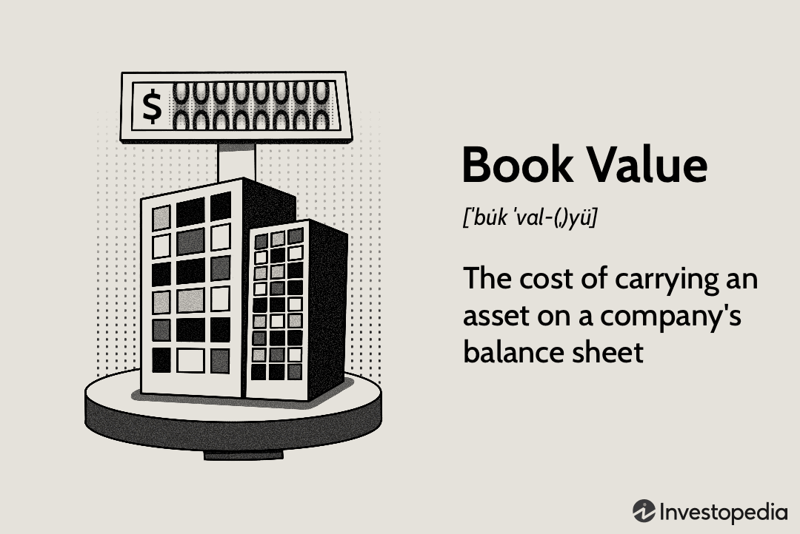

In the world of finance and investment, understanding a company's true worth is paramount for making informed decisions. Book value, a core financial metric, plays a significant role in this evaluation by offering a snapshot of a company's net asset value, which is calculated by subtracting total liabilities from total assets. This article examines the concept of book value, its significance in valuation, and its application in modern financial strategies.

The valuation of a company through book value provides insights into whether a stock is undervalued or overvalued, helping investors make strategic choices. Book value's importance is underscored by its role in traditional valuation methods like value investing, where it serves as a benchmark. Despite the emergence of complex market dynamics and advanced trading technologies, book value remains a foundation in financial analysis.



With the rise of algorithmic trading, integrating book value into sophisticated trading strategies has become increasingly viable. Through mathematical formulas and computational technologies, traders can craft algorithms that assess book value as part of their decision-making processes. This convergence of traditional and modern techniques underscores the evolving landscape of investment strategies.

Whether you are an experienced investor or a new algorithmic trader, this article aims to provide a comprehensive understanding of book value and its integration into financial methodologies. By bridging classic valuation approaches with algorithmic innovations, investors can enhance their decision-making capabilities and optimize their trading strategies.

## Table of Contents

## Understanding Book Value

Book value represents the net asset value of a company, essentially calculated as the difference between total assets and total liabilities. This measure provides an intrinsic snapshot of a company's worth as displayed on its balance sheet. The formula for calculating book value is:

$$
\text{Book Value} = \text{Total Assets} - \text{Total Liabilities}
$$

This valuation method is a vital tool for investors striving to determine whether a stock is undervalued or overvalued. By comparing book value with market price, investors can decide if a company's stock is trading above or below its perceived worth. For instance, a stock trading below its book value might suggest it is undervalued, assuming the company's assets are accurately recorded and its liabilities fully recognized.

Understanding the difference between book value and market value is pivotal. Market value refers to the current price at which an asset or service can be bought or sold. While book value is based on historical costs recorded in the financial statements, market value is susceptible to fluctuations due to market dynamics and investor perceptions. 

In value investing, the price-to-book (P/B) ratio is frequently analyzed:

$$
\text{Price-to-Book Ratio} = \frac{\text{Market Price per Share}}{\text{Book Value per Share}}
$$

A P/B ratio less than one typically indicates that the stock is undervalued, as the market price is less than the book value. However, relying solely on book value for investment decisions can be misleading, as it does not account for intangible assets, future [earning](/wiki/earning-announcement) potentials, or economic conditions that may impact the company's valuations. 

Therefore, while book value remains a fundamental metric in assessing stock value, it should be complemented by other financial analyses and metrics for a comprehensive evaluation.

## The Role of Book Value in Valuation

Book value is an essential metric for evaluating a company’s financial health and assessing its potential for growth. It serves as a benchmark by which investors, particularly value investors, can gauge whether a company’s stock is undervalued. The formula for calculating book value is:

$$
\text{Book Value} = \text{Total Assets} - \text{Total Liabilities}
$$

This value is then often compared to the company's market value to determine the price-to-book (P/B) ratio:

$$
\text{P/B Ratio} = \frac{\text{Market Price per Share}}{\text{Book Value per Share}}
$$

A low P/B ratio might indicate that a stock is undervalued, presenting a potentially lucrative investment opportunity. Historically, investors like Benjamin Graham and Warren Buffett have utilized this ratio to identify undervalued stocks that provide good returns over time. For instance, during market downturns, many stocks may be priced below their book value, offering a margin of safety for investors.

Case studies illustrate the effectiveness of book value in valuation practices. Consider Company A, whose P/B ratio dropped significantly during a market correction. Value investors who purchased shares based on the lower ratio might have profited as the market corrected itself and the stock's price rose toward its intrinsic value. Historical data supports instances where companies with low P/B ratios outperformed the market when corrections were made.

Nevertheless, relying solely on book value has its challenges and limitations. Book value does not account for intangible assets like brand reputation, intellectual property, or human capital, which can significantly contribute to a company's actual market valuation. Additionally, book value is based on historical cost and does not always reflect current market realities, especially for companies with significant depreciable assets. Financial manipulation through conservative or aggressive accounting practices may also impact book value, making it less reliable.

Thus, while book value is a useful starting point for investors, it should be considered alongside other factors and metrics. Investors should analyze a comprehensive range of financial indicators to form a well-rounded picture of a company’s true value.

## Financial Formulas for Calculating Book Value

Book value is a fundamental metric used in financial analysis to assess the net asset value of a company. It is derived from specific components of the company’s balance sheet, and understanding the formulas involved in calculating book value and its related metrics is essential for investors and analysts.

### Calculating Book Value

The basic formula for book value is:

$$
\text{Book Value} = \text{Total Assets} - \text{Total Liabilities}
$$

This formula provides the intrinsic value of a company’s equity as it reflects on the balance sheet. Total assets encompass all resources owned by the company, while total liabilities include all financial obligations. The difference represents the net value available to equity holders.

### Components of the Balance Sheet

1. **Assets**: These are divided into current and non-current assets. Current assets include cash, accounts receivable, and inventory, while non-current assets comprise property, plant, equipment, and intangible assets.

2. **Liabilities**: Similar to assets, liabilities are categorized into current and non-current. Current liabilities include accounts payable and short-term debt, while non-current liabilities consist of long-term debt and other obligations due beyond one year.

### Price-to-Book Ratio

The price-to-book (P/B) ratio is an extension of the book value calculation, offering a comparison between the market valuation of equity and its book value:

$$
\text{P/B Ratio} = \frac{\text{Market Price per Share}}{\text{Book Value per Share}}
$$

Where:

$$
\text{Book Value per Share} = \frac{\text{Book Value}}{\text{Total Number of Outstanding Shares}}
$$

A P/B ratio below 1 could indicate that a stock is undervalued, as the market price is less than the book value per share, while a ratio above 1 could suggest overvaluation.

### Practical Example

Consider a company with the following balance sheet components:

- Total Assets: \$500,000
- Total Liabilities: \$300,000
- Market Price per Share: \$50
- Total Number of Outstanding Shares: 5,000

First, compute the book value:

$$
\text{Book Value} = \$500,000 - \$300,000 = \$200,000
$$

Next, determine the book value per share:

$$
\text{Book Value per Share} = \frac{\$200,000}{5,000} = \$40
$$

Finally, calculate the P/B ratio:

$$
\text{P/B Ratio} = \frac{\$50}{\$40} = 1.25
$$

The P/B ratio of 1.25 suggests the stock is priced above its book value, which could imply potential overvaluation or market anticipation of future growth.

### Interpreting Book Value Calculations

Accurate computation and interpretation of book value require careful analysis of the balance sheet components. Book value offers insight into a firm’s financial stability and residual equity value. However, it should be used in conjunction with other financial metrics and qualitative factors to make informed investment decisions.

Incorporating book value analysis into broader financial models can improve valuation accuracy. For example, developing a Python script to automate these calculations could assist analysts in quickly evaluating multiple stocks. Here is a simple Python snippet to calculate book value and P/B ratio:

```python
def calculate_book_value(total_assets, total_liabilities):
    return total_assets - total_liabilities

def calculate_book_value_per_share(book_value, total_shares):
    return book_value / total_shares

def calculate_pb_ratio(market_price_per_share, book_value_per_share):
    return market_price_per_share / book_value_per_share

# Example inputs
total_assets = 500000
total_liabilities = 300000
market_price_per_share = 50
total_shares = 5000

# Calculations
book_value = calculate_book_value(total_assets, total_liabilities)
book_value_per_share = calculate_book_value_per_share(book_value, total_shares)
pb_ratio = calculate_pb_ratio(market_price_per_share, book_value_per_share)

print(f"Book Value: ${book_value}")
print(f"Book Value per Share: ${book_value_per_share}")
print(f"P/B Ratio: {pb_ratio}")
```

Understanding these financial formulas is crucial in harnessing book value as a tool for valuation and investment analysis, contributing to more robust financial decision-making.

## Incorporating Book Value in Algo Trading

Algorithmic trading has revolutionized the financial markets by automating the trading process through the use of computer algorithms that operate on predefined criteria. In this context, incorporating book value as a component of an [algorithmic trading](/wiki/algorithmic-trading) strategy offers a distinctive edge by integrating fundamental financial insights with quantitative techniques. 

Book value, typically defined as the net asset value of a company—calculated by subtracting total liabilities from total assets—provides a crucial metric that reflects a company's intrinsic worth based on its balance sheet. When algorithmic trading strategies utilize book value, they can gain an understanding of a stock's potential mispricing relative to its intrinsic value.

**Utilizing Book Value in Algorithmic Strategies**

The incorporation of book value into algorithmic trading can be approached through building models that assess a company's price-to-book (P/B) ratio over time, among other fundamental metrics. A low P/B ratio can indicate that a stock is undervalued, suggesting a potential buying opportunity. By programming an algorithm to trigger buy and sell orders based on P/B ratio thresholds, traders can systematically exploit market inefficiencies.

For instance, a simple rule-based algorithm could be:

```python
def evaluate_trade(stock):
    pb_ratio = stock['market_cap'] / stock['book_value']
    if pb_ratio < threshold_buy:
        return "BUY"
    elif pb_ratio > threshold_sell:
        return "SELL"
    return "HOLD"
```

**Machine Learning Models**

Machine learning offers sophisticated methods to predict stock movements using historical book value data. Techniques such as regression, classification algorithms, or even neural networks can be deployed to understand patterns related to book value changes and their impact on stock prices.

For example, a [machine learning](/wiki/machine-learning) model can be trained to predict price changes based on features such as historical book value, market trends, and trading volumes. This predictive capability gives traders a data-driven basis to design trading strategies that can outperform naive or purely technical approaches.

**Backtesting with Historical Data**

To ensure the robustness of algorithms that utilize book value, [backtesting](/wiki/backtesting) them using historical financial data is crucial. Backtesting allows traders to simulate their strategies against past market conditions, analyzing performance metrics and understanding potential risks and returns. Python libraries such as `[backtrader](/wiki/backtrader)` or `Zipline` can be instrumental in this process by providing frameworks to structure and execute backtests.

An example backtesting setup might involve:

```python
import backtrader as bt

class BookValueStrategy(bt.Strategy):
    def __init__(self):
        self.pbr = self.datas[0].price_to_book_ratio

    def next(self):
        if self.pbr[0] < threshold_buy:
            self.buy()
        elif self.pbr[0] > threshold_sell:
            self.sell()

# Load data and run backtest
```

**Integrating with Technical Indicators**

It is beneficial to combine book value analysis with technical indicators to enhance trading strategies. Technical indicators like moving averages, Bollinger Bands, or Relative Strength Index (RSI) provide additional layers of market insights, enabling traders to refine entry and [exit](/wiki/exit-strategy) points and manage risk effectively.

In the rapidly evolving landscape of financial markets, integrating book value within algorithmic trading not only empowers traders with a deeper understanding of fundamental financial metrics but also complements quantitative strategies, optimizing trading performance. This approach aligns [fundamental analysis](/wiki/fundamental-analysis) with technological advancements, offering a balanced foundation to navigate complex trading environments.

## Tools and Software for Book Value Analysis

In the modern financial landscape, leveraging the right tools and software for book value analysis can significantly enhance investment strategies. A variety of platforms and technologies are available to facilitate the computation and integration of book value data within trading systems.

**Software Platforms and Tools**

1. **Bloomberg Terminal**: Widely utilized by financial professionals, the Bloomberg Terminal provides comprehensive access to real-time financial data, including book value metrics. Its powerful analytics tools allow traders to develop and test algorithmic strategies seamlessly.

2. **Thomson Reuters Eikon**: Similar to Bloomberg, Eikon provides real-time data and analytical capabilities. It covers a broad spectrum of financial information, such as balance sheets and other key components necessary for calculating book value.

3. **Morningstar Direct**: This platform offers a strong focus on equity analysis with detailed financial data, including book value components. Morningstar Direct is useful for traders and analysts who require robust data integration for their strategies.

4. **Yahoo Finance and Google Finance APIs**: For developers and algorithmic traders, these APIs provide convenient access to historical and real-time financial data, including book value data. They are ideal for custom application development and integration into trading systems.

**Popular Financial Databases and APIs**

1. **Alpha Vantage**: This free API service delivers a wide array of financial data, including balance sheets necessary for book value analysis. Its straightforward integration and frequency of data updates make it a popular choice for algorithmic traders.

2. **Quandl**: Known for its vast dataset, Quandl provides direct access to financial statements and other crucial metrics. It supports a large number of datasets across various financial markets, facilitating comprehensive analysis efforts.

3. **EDGAR Database (SEC.gov)**: The Electronic Data Gathering, Analysis, and Retrieval system provided by the U.S. Securities and Exchange Commission offers public access to corporate financial filings, including essential information for book value calculation.

**Utilizing Technology for a Competitive Edge**

Utilizing these resources can provide traders with a competitive edge. For example, Python can be employed to access and manipulate these data sources effectively. Consider the following Python snippet using the Alpha Vantage API:

```python
import requests

def get_book_value(symbol, api_key):
    base_url = 'https://www.alphavantage.co/query'
    params = {
        'function': 'BALANCE_SHEET',
        'symbol': symbol,
        'apikey': api_key
    }
    response = requests.get(base_url, params=params)
    data = response.json()

    # Extracting book value from the latest annual balance sheet
    book_value = float(data['annualReports'][0]['totalAssets']) - float(data['annualReports'][0]['totalLiabilities'])
    return book_value

api_key = 'YOUR_API_KEY'
symbol = 'AAPL'
print(f'The book value for {symbol} is {get_book_value(symbol, api_key)}')
```

By integrating real-time and historical book value data into their analysis, traders can develop sophisticated algorithmic strategies that incorporate both fundamental and technical elements. This blend of analysis helps ensure more informed and potentially profitable trading decisions.

## Conclusion

Book value is a fundamental component in financial analysis and valuation, serving as a reliable measure of a company's net asset value. Throughout this article, we have underscored its significance, the essential formulas used to compute it, and its integration into modern algorithmic trading methodologies. By equipping investors with a nuanced understanding of book value, combined with the power of technology, individuals and institutions can engage in strategic financial decision-making.

Whether applied within the context of traditional value investing or incorporated into advanced algorithmic strategies, book value remains an indispensable tool. Its ability to act as a benchmark for assessing a company's intrinsic worth or financial stability makes it a vital element in an investor’s toolkit. By analyzing a stock's price-to-book ratio, for instance, investors can discern potential investment opportunities, identifying stocks that may be undervalued by the market.

As we continue to witness the rise of algorithmic trading, the utility of book value within these automated systems should not be underestimated. It offers a tangible metric that can be used to augment quantitative models, providing a foundation for blending fundamental and technical analysis. This synthesis can be particularly potent when fleshed out with machine learning techniques to predict stock movements or optimize trading algorithms.

We encourage readers to integrate book value into their investment analyses, leveraging its potential to enhance both traditional and algorithmic trading outcomes. With access to a variety of tools and software that facilitate book value analysis, investors and traders alike can gain a competitive edge, crafting data-driven strategies that are both robust and insightful.

## References & Further Reading

[1]: Graham, B. (2003). ["The Intelligent Investor: The Definitive Book on Value Investing."](https://www.amazon.com/Intelligent-Investor-Definitive-Investing-Essentials/dp/0060555661) Harper Business.

[2]: Damodaran, A. (2002). ["Investment Valuation: Tools and Techniques for Determining the Value of Any Asset."](https://books.google.com/books/about/Investment_Valuation.html?id=5SRHAAAAQBAJ) Wiley Finance.

[3]: Chan, E. (2009). ["Quantitative Trading: How to Build Your Own Algorithmic Trading Business."](https://github.com/ftvision/quant_trading_echan_book) Wiley Trading.

[4]: De Prado, M. L. (2018). ["Advances in Financial Machine Learning."](https://www.amazon.com/Advances-Financial-Machine-Learning-Marcos/dp/1119482089) Wiley.

[5]: Aronson, D. R. (2007). ["Evidence-Based Technical Analysis: Applying the Scientific Method and Statistical Inference to Trading Signals."](https://onlinelibrary.wiley.com/doi/book/10.1002/9781118268315) Wiley.

[6]: Berk, J., & DeMarzo, P. (2019). ["Corporate Finance."](https://www.pearson.com/en-us/subject-catalog/p/corporate-finance/P200000005829/9780135635926) Pearson.

[7]: Fabozzi, F. J. (2003). ["Financial Modeling of the Equity Market: From CAPM to Cointegration."](https://onlinelibrary.wiley.com/doi/book/10.1002/9781119201236) Wiley Finance.