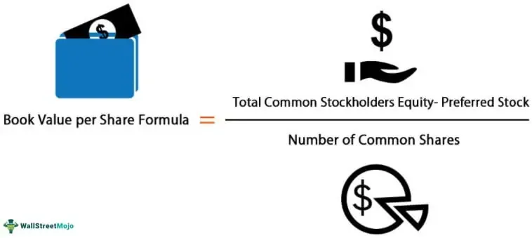

Book Value Per Common Share (BVPS) is a critical metric for evaluating a company's financial health. It represents the equity value available to common shareholders divided by the number of outstanding common shares. BVPS is particularly essential as it offers insight into a company's inherent value on a per-share basis, independent of market fluctuations. By comparing a company's BVPS to its current market price, investors can make informed decisions about whether a stock is potentially undervalued or overvalued.

When a company's market price per share is lower than its BVPS, it may indicate that the stock is undervalued, suggesting that the company's assets are worth more than what the stock market currently reflects. This scenario often attracts value investors who seek to capitalize on market inefficiencies, purchasing undervalued stocks with the expectation that their market prices will eventually align with or exceed their intrinsic value. Thus, BVPS serves as a foundational tool in value investing, enabling investors to identify opportunities in the market. 



In the context of algorithmic trading, BVPS can be a vital component in the development of trading strategies. Algorithmic trading systems can be designed to automatically identify stocks with significant discrepancies between their market price and BVPS, enabling traders to capitalize on short-term market inefficiencies. By integrating BVPS into trading algorithms, automated systems can execute trades based on pre-defined financial thresholds, thus potentially enhancing trading efficiency and profitability.

Overall, BVPS offers a noteworthy approach for assessing the fundamental value of a company's equity, aiding both individual and institutional investors in making informed investment decisions. In tandem with other financial metrics, BVPS can provide a comprehensive view of a company's financial standing and market position.

## Table of Contents

## Understanding Book Value and BVPS

Book value is a fundamental measure of a company’s intrinsic worth, calculated as the difference between total assets and total liabilities on a company's balance sheet. It provides a snapshot of the net asset value attributed to shareholders if the company were liquidated. The components that comprise book value include:

1. **Total Assets**: These are resources owned by the company, encompassing both current assets like cash and inventory and non-current assets such as property, plant, equipment, and intangible assets.

2. **Total Liabilities**: These are the company’s financial obligations, which include short-term liabilities like accounts payable and long-term liabilities such as bonds payable.

3. **Shareholder Equity**: This represents the residual interest in the assets of the company after deducting liabilities. It is the book value from the perspective of shareholders and is calculated as Total Assets minus Total Liabilities.

Common shares refer to the equity ownership in a corporation, granting shareholders voting rights and potential dividends. These differ from preferred shares, which usually do not provide voting rights but offer a fixed dividend and have higher claim on assets than common shares in the event of liquidation.

Book Value Per Common Share (BVPS) is a measure of the per-share value of a company's equity available to common shareholders. It is calculated using the formula:

$$
\text{BVPS} = \frac{\text{Total Shareholder Equity} - \text{Preferred Equity}}{\text{Total Outstanding Common Shares}}
$$

This metric is significant for common shareholders as it indicates the book value associated with each share, offering insight into the financial foundation of the stock. A higher BVPS suggests a potentially undervalued stock, making it attractive for investors seeking tangible asset backing relative to the current market price.

BVPS is relevant because it serves as a benchmark for evaluating stock price versus the company's actual equity value. It is a critical part of [fundamental analysis](/wiki/fundamental-analysis), helping investors make informed decisions based on the company's balance sheet strength rather than speculative movements in stock price.

## Calculating BVPS

To calculate the Book Value Per Common Share (BVPS), use the following formula:

$$
\text{BVPS} = \frac{\text{Total Shareholder Equity} - \text{Preferred Equity}}{\text{Total Outstanding Shares}}
$$

### Example Calculation

Consider a hypothetical company with the following financial data for a given fiscal year:

- Total Shareholder Equity: $500 million
- Preferred Equity: $50 million
- Total Outstanding Shares: 10 million shares

Applying the formula:

$$
\text{BVPS} = \frac{\$500\, \text{million} - \$50\, \text{million}}{10\, \text{million shares}} = \frac{\$450\, \text{million}}{10\, \text{million shares}} = \$45 \text{ per share}
$$

In this example, the BVPS of $45 suggests that if the company’s assets were liquidated and liabilities settled, each common share would theoretically be worth $45.

### Considerations: Impact of Stock Buybacks

Stock buybacks can significantly impact BVPS. When a company buys back its shares, it reduces the total number of outstanding shares, which can increase the BVPS if the buyback is done below book value. For instance, if our hypothetical company were to buy back 1 million shares, the new BVPS would be calculated as:

Total Outstanding Shares after buyback = 10 million shares - 1 million shares = 9 million shares

$$
\text{New BVPS} = \frac{\$450\, \text{million}}{9\, \text{million shares}} \approx \$50 \text{ per share}
$$

Thus, the buyback increases BVPS from $45 to approximately $50 per share, illustrating how share repurchases can enhance shareholder value by boosting the per-share book value.

This calculation demonstrates the critical nature of considering stock buybacks when evaluating BVPS, as they directly affect the numerator and denominator of the formula. This enhances the understanding of a company's financial standing and the potential impacts of management decisions on shareholder value.

## BVPS in the Context of Market Value

Book Value Per Common Share (BVPS) and market value per share are important metrics when analyzing the valuation of a company. While BVPS represents the accounting value of a company's tangible assets remaining after liabilities are paid, market value per share reflects the price investors are willing to pay for a company's stock in the open market.

The potential undervaluation of a stock can be assessed by comparing BVPS with its market value per share. When the market value per share is significantly higher than the BVPS, it might suggest that investors are optimistic about the company's future prospects, potentially due to expected growth or strong future earnings. Conversely, if the market value per share is below the BVPS, this could indicate undervaluation, possibly providing an investment opportunity, especially if the market has overlooked the company's true asset value.

There are several factors that can cause discrepancies between BVPS and market value per share:

1. **Market Perceptions**: Investor sentiment and market perceptions of a company's potential can heavily influence its market value. Positive news, such as strategic partnerships, new product launches, or management changes, can drive market value above BVPS. Conversely, negative news can suppress market value below its book value.

2. **Future Earnings Potential**: Expectations of future earnings play a role in determining market value. Companies with strong anticipated earnings growth may trade at higher market values relative to their BVPS, as investors are willing to pay a premium for future profitability.

3. **Intangible Assets and Brand Value**: BVPS typically does not account for intangible assets like brand value, patents, or intellectual property, which can be substantial for companies in industries like technology or pharmaceuticals. These intangibles might cause the market value to far exceed the BVPS.

4. **Economic Conditions**: Broader economic conditions and industry trends can impact market valuations. For example, during economic downturns, market values might fall below book values due to reduced investor confidence, irrespective of a company’s book value.

5. **Company-Specific Factors**: Internal factors, including management effectiveness, operational efficiency, and financial health, can influence market perception. A company demonstrating strong internal performance might justify a higher market value.

Understanding the interplay between BVPS and market value per share allows investors to make informed decisions by considering both the tangible asset base of a company and the market’s projection of its future potential. While a disparity between these metrics could indicate an investment opportunity, it is crucial to conduct further analysis to understand the underlying reasons for such a difference.

## BVPS vs. Other Valuation Metrics

Book Value Per Common Share (BVPS) and Net Asset Value (NAV) are two crucial metrics used to gauge a company's financial standing, yet they serve different purposes and are derived differently. BVPS signifies the equity value attributable to each common share of a company, calculated by dividing shareholder equity minus preferred equity by the total number of outstanding common shares. 

In contrast, Net Asset Value (NAV) is predominantly used in the context of investment funds and reflects the per-share value of the fund, computed as the total value of the fund's assets minus its liabilities.

$$
\text{BVPS} = \frac{\text{Total Shareholder Equity} - \text{Preferred Equity}}{\text{Total Outstanding Common Shares}}
$$

$$
\text{NAV} = \frac{\text{Total Assets} - \text{Total Liabilities}}{\text{Number of Shares Outstanding}}
$$

While both metrics are integral to financial analysis, BVPS might not fully capture a company's intangible assets, which include brand reputation, intellectual property, and human capital. Since BVPS is grounded in accounting book values, it inherently omits these intangible assets that, although not directly reflected in financial statements, can contribute significantly to a company's market valuation. This limitation makes BVPS less reflective of the true market scenario, especially for companies heavily reliant on intangible assets.

Complementary metrics like Earnings Per Share (EPS) are vital for a more comprehensive understanding of a company's financial health. EPS measures the profitability of a company by indicating how much profit is allocated to each outstanding share of common stock. Unlike BVPS, which is strictly balance-sheet oriented, EPS provides insights into the company's operational efficiency and potential for generating profits.

$$
\text{EPS} = \frac{\text{Net Income} - \text{Dividends on Preferred Stock}}{\text{Average Outstanding Shares}}
$$

EPS, when used alongside BVPS, offers a more holistic view of a company's valuation by combining both profitability and asset-based metrics. For instance, a company might have low BVPS but high EPS, suggesting efficient profit generation despite lower tangible asset value. This multifaceted approach enables investors to make more informed decisions by considering both the intrinsic value through BVPS and the company's earnings capability via EPS.

## Algorithmic Trading Using BVPS

### Algorithmic Trading Using BVPS

Algorithmic trading employs computer algorithms to execute trading decisions based on predefined criteria. In this context, Book Value Per Common Share (BVPS) serves as a key metric to identify potential trading opportunities. BVPS, calculated as $\text{BVPS} = \frac{\text{Total Shareholder Equity} - \text{Preferred Equity}}{\text{Total Outstanding Shares}}$, is a fundamental measure that represents the equity available to common shareholders.

#### Leveraging BVPS for Strategy Development

Algorithmic traders can leverage BVPS by developing strategies that capitalize on discrepancies between BVPS and market prices. When the market price of a stock significantly deviates from its BVPS, it could indicate possible undervaluation or overvaluation. For instance:

- **Undervaluation Detection**: If the market price is below BVPS, the stock might be undervalued. An algorithmic strategy could be programmed to flag such stocks for potential long positions.

- **Overvaluation Detection**: Conversely, if the market price is significantly higher than the BVPS, the stock might be overvalued. This could trigger short-selling strategies.

The rationale behind these strategies is rooted in the expectation that market prices will eventually align more closely with the intrinsic value indicated by BVPS. 

#### Automating BVPS-Based Trading

Automated trading systems can be programmed to continuously monitor the BVPS and compare it with real-time market data. Here is a simplistic example of how this can be implemented in Python:

```python
import yfinance as yf  # For more datasets, visit: https://paperswithbacktest.com/datasets

def fetch_data(ticker):
    stock = yf.Ticker(ticker)
    bs = stock.balance_sheet
    equity = bs.loc['Total Stockholder Equity']
    pref_equity = bs.loc.get('Preferred Stock', 0)  # Handle when no preferred stock
    shares_outstanding = stock.info['sharesOutstanding']
    bvps = (equity - pref_equity) / shares_outstanding
    return bvps

def detect_trading_opportunity(ticker):
    bvps = fetch_data(ticker)
    current_price = yf.Ticker(ticker).history(period='1d')['Close'].iloc[-1]

    if current_price < bvps:
        return "Buy Signal"
    elif current_price > bvps:
        return "Sell Signal"
    else:
        return "Hold"

# Example usage:
trading_signal = detect_trading_opportunity('AAPL')
print(trading_signal)
```

This code retrieves financial data using the `yfinance` library and calculates the BVPS for a given stock symbol. The function `detect_trading_opportunity()` compares the current market price with the BVPS and returns a trading signal based on the identified discrepancy.

#### Identifying Deviation Patterns

By continuously tracking the BVPS and market prices, algorithms can also identify patterns or trends where such discrepancies historically lead to specific market behaviors. Machine learning models can be incorporated into these systems to refine and predict future price movements based on past data.

In conclusion, incorporating BVPS into [algorithmic trading](/wiki/algorithmic-trading) allows for data-driven decisions that can identify mispriced securities, offering potential trading advantages. Given that BVPS reflects the book value tied directly to common shares, aligning trading strategies with this metric enables traders to establish positions grounded in fundamental analysis, thus enhancing the robustness of trading algorithms.

## Limitations of BVPS

Book Value Per Common Share (BVPS) is a widely used metric in financial analysis, offering insights into a company’s financial stability. However, its application is not without limitations. A primary limitation of BVPS is its inability to reflect current market conditions. The metric relies heavily on historical cost accounting, capturing asset and liability values as recorded in financial statements instead of their present market value. This reliance can result in significant discrepancies during periods of market [volatility](/wiki/volatility-trading-strategies) or when substantial changes in asset value occur. As a result, BVPS might be outdated, leading to skewed valuations in current market terms.

Additionally, BVPS does not account for intangible assets, which can represent a substantial portion of a company's worth. Brand reputation, intellectual property, and goodwill, while pivotal to a company's future earnings potential and competitive advantage, are typically excluded from BVPS calculations. Companies with strong intangible assets could appear undervalued based on BVPS alone, which may lead investors to overlook promising opportunities.

Moreover, BVPS might not accurately reflect scenarios where companies engage in aggressive financial tactics such as stock repurchases—or buybacks. While buybacks can reduce the number of outstanding shares, potentially boosting BVPS, they do not necessarily indicate improved financial health or performance.

In contexts such as technology or pharmaceutical sectors, where companies often invest heavily in R&D leading to significant intangible assets, BVPS might not provide an adequate picture of corporate potential. Similarly, for startups and companies experiencing rapid growth or undergoing significant restructuring, BVPS could miss critical aspects of long-term value and performance.

In conclusion, while BVPS is a useful tool in financial analysis, its limitations necessitate a careful and considered approach. It should be used alongside other metrics to form a comprehensive evaluation of a company's financial health and market positioning.

## Conclusion

Book Value Per Common Share (BVPS) serves as a cornerstone in assessing a company's financial standing and potential investment value. As an essential metric, BVPS provides insight into the intrinsic value of a common shareholder's stake, calculated by dividing the total shareholder equity minus preferred equity by the total outstanding common shares. This calculation helps investors discern whether a stock is undervalued compared to its market valuation. 

While BVPS is a vital tool, it is most effective when used in concert with other financial metrics. Indicators such as Earnings Per Share (EPS), price-to-earnings (P/E) ratios, and Net Asset Value (NAV) can offer complementary perspectives, addressing aspects of corporate health and profitability that BVPS might overlook. For instance, intangible assets and future [earning](/wiki/earning-announcement) potentials, often not reflected in BVPS, can significantly impact evaluations.

In algorithmic trading, BVPS analysis can fortify trading strategies by pinpointing discrepancies between market prices and calculated book values. Automated systems can flag stocks where market prices significantly differ from BVPS, suggesting potential trading opportunities rooted in fundamental analysis. However, it's essential to integrate other quantitative metrics to capture a comprehensive market outlook. This multifaceted approach ensures a more robust and resilient trading strategy, capable of adapting to varying market conditions and evaluations.

BVPS remains a useful metric in the toolkit of investors and traders. Its judicious application, alongside other analyses, can lead to more informed investment decisions and strategic trading opportunities, mitigating some of its inherent limitations by accounting for broader economic and company-specific factors.

## References & Further Reading

[1]: Damodaran, A. (2006). ["Damodaran on Valuation: Security Analysis for Investment and Corporate Finance."](https://onlinelibrary.wiley.com/doi/book/10.1002/9781119201786) Wiley Finance.

[2]: Penman, S. H. (2013). ["Financial Statement Analysis and Security Valuation."](https://archive.org/details/financialstateme0000penm_m9z7_5thed) McGraw-Hill Education.

[3]: Bodie, Z., Kane, A., & Marcus, A. J. (2014). ["Investments."](https://books.google.com/books/about/EBOOK_Investments_Global_edition.html?id=BMsvEAAAQBAJ) McGraw-Hill Education.

[4]: ["Value Investing: From Graham to Buffett and Beyond"](https://www.amazon.com/Value-Investing-Graham-Buffett-Finance/dp/0470116730) by Bruce C. N. Greenwald, Judd Kahn, Paul D. Sonkin, and Michael van Biema.

[5]: Damodaran, A. (2002). ["Investment Valuation: Tools and Techniques for Determining the Value of Any Asset."](https://archive.org/details/investmentvaluat0000damo_n6k9) Wiley Finance.