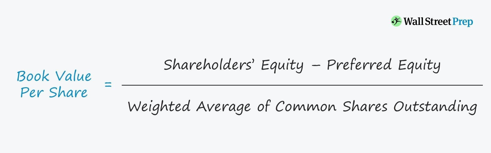

## Table of Contents

## What is the definition of Book Value Per Common Share?

Book Value Per Common Share is a way to figure out how much each share of a company's stock is worth, based on the company's financial records. It's calculated by taking the total value of the company's assets and subtracting all its debts and other obligations. What's left is called the "book value" or "net asset value." You then divide this number by the total number of common shares the company has issued. This gives investors an idea of what they would get back per share if the company were to liquidate all its assets and pay off all its debts.

This measure is useful for investors because it provides a snapshot of the company's financial health from its balance sheet. It can be compared to the market value of the stock to see if the stock is overvalued or undervalued. For example, if the book value per share is higher than the market price per share, it might suggest that the stock is undervalued. However, book value doesn't always tell the whole story, as it doesn't account for intangible assets like brand value or intellectual property, which can be very valuable to a company.

## How is Book Value Per Common Share calculated?

To find the Book Value Per Common Share, you start with the company's total assets. These are all the things the company owns, like buildings, equipment, and money in the bank. Next, you subtract all the company's liabilities, which are all the debts and other obligations the company has to pay. What you're left with is called the "book value" or "net asset value" of the company. Then, you divide this number by the total number of common shares that the company has issued. This gives you the Book Value Per Common Share.

This calculation helps investors understand the value of each share based on the company's financial records. It's a way to see if a stock might be a good buy. If the Book Value Per Common Share is more than the price people are paying for the stock on the market, it might mean the stock is a good deal. But, it's important to remember that this number doesn't include everything that might be valuable about a company, like its brand name or special knowledge it has. So, while it's a useful tool, it's just one part of deciding if a stock is worth buying.

## Why is Book Value Per Common Share important for investors?

Book Value Per Common Share is important for investors because it tells them how much each share of a company's stock is worth based on the company's financial records. It's like a snapshot of the company's net worth divided by the number of shares. This helps investors see if the stock might be a good deal. If the Book Value Per Common Share is higher than the price people are paying for the stock on the market, it could mean the stock is undervalued and might be a good investment.

However, investors need to remember that Book Value Per Common Share is just one piece of the puzzle. It doesn't include things like the company's brand name or special knowledge it has, which can be very valuable. So, while it's a helpful tool, investors should look at other information too, like the company's earnings, future growth plans, and the overall market conditions, to make a well-rounded decision about whether to buy the stock.

## What is the difference between Book Value Per Common Share and Market Value Per Share?

Book Value Per Common Share and Market Value Per Share are two different ways to look at how much a company's stock is worth. Book Value Per Common Share is calculated by taking all the company's assets, subtracting all its debts, and then dividing that number by the total number of common shares. It shows what shareholders would get per share if the company sold everything and paid off all its debts. This number is based on the company's financial records and doesn't change quickly.

On the other hand, Market Value Per Share is the price that people are willing to pay for the stock on the stock market at any given time. It can go up and down a lot because it's influenced by what investors think about the company's future, news, and overall market feelings. Market Value Per Share can be much higher or lower than the Book Value Per Common Share, depending on how people see the company's future and its potential to make money.

Comparing these two values can help investors decide if a stock is a good buy. If the Market Value Per Share is lower than the Book Value Per Common Share, it might mean the stock is undervalued and could be a good investment. But it's important to remember that Market Value Per Share includes things like the company's brand and future growth plans, which Book Value Per Common Share doesn't show. So, investors need to look at both numbers, along with other information, to make smart choices about buying stocks.

## Can Book Value Per Common Share be negative, and what does it indicate?

Yes, Book Value Per Common Share can be negative. This happens when a company's total debts are more than its total assets. When you subtract the bigger debts from the smaller assets, you get a negative number. Then, when you divide this negative number by the number of common shares, you end up with a negative Book Value Per Common Share.

A negative Book Value Per Common Share is a warning sign for investors. It means the company owes more money than it owns, which is not a good situation. If the company had to sell everything and pay off all its debts, there wouldn't be anything left for shareholders. This can make investors worried about the company's financial health and future.

## How does Book Value Per Common Share relate to a company's financial health?

Book Value Per Common Share gives investors a quick look at how healthy a company's finances are. It shows what each share of the company's stock would be worth if the company sold everything it owns and paid off all its debts. If this number is positive and growing, it can mean the company is doing well and getting more valuable. Investors like to see this because it suggests the company is in good shape.

But if the Book Value Per Common Share is negative, it's a red flag. This means the company owes more money than it has in assets. It's like if you had to sell everything you own but still couldn't pay off all your debts. When a company's Book Value Per Common Share is negative, investors get worried because it shows the company might be in trouble financially. So, this number is a helpful way to check on a company's financial health, but it's just one part of the bigger picture.

## What are the limitations of using Book Value Per Common Share as a valuation metric?

Book Value Per Common Share can be a helpful way to understand a company's worth, but it has some big limits. One problem is that it doesn't count things that are hard to put a price on, like a company's brand name or special knowledge. These things can be very valuable but don't show up on the company's financial records. So, if a company has a lot of these kinds of assets, the Book Value Per Common Share might make it look less valuable than it really is.

Another issue is that Book Value Per Common Share only looks at what the company has right now. It doesn't think about the future. A company might have a low Book Value Per Common Share but still be a good investment if it's expected to grow a lot in the future. Also, the value of some assets on the [books](/wiki/algo-trading-books) might not be what they're really worth today. For example, if a company owns a building, the book value might be what they paid for it years ago, not what it's worth now. So, while Book Value Per Common Share is a useful tool, it's important to use it along with other information to get a full picture of a company's value.

## How does Book Value Per Common Share vary across different industries?

Book Value Per Common Share can be very different from one industry to another. Some industries, like manufacturing or real estate, have a lot of physical things they own, like factories or buildings. These things are counted in the company's assets, so these companies usually have a higher Book Value Per Common Share. On the other hand, industries like tech or services might not have as many physical things. They might be more valuable because of their ideas or the knowledge they have, which isn't counted in the Book Value Per Common Share.

Because of these differences, it's important not to compare the Book Value Per Common Share of companies from different industries directly. What might be a good number in one industry might not be good in another. For example, a tech company might have a low Book Value Per Common Share but still be a great investment because of its future growth potential. So, when looking at Book Value Per Common Share, it's helpful to compare companies within the same industry to get a better idea of their value.

## What impact do stock buybacks have on Book Value Per Common Share?

When a company buys back its own stock, it can change the Book Value Per Common Share. A stock buyback means the company uses its money to buy its own shares from the market. This reduces the total number of shares that are out there. Since Book Value Per Common Share is calculated by dividing the company's net assets by the number of shares, fewer shares can make the Book Value Per Common Share go up, even if the net assets stay the same.

But, it's not always that simple. If the company pays a lot of money to buy back its shares, it uses up some of its cash, which is part of its assets. This can make the net assets smaller. So, whether the Book Value Per Common Share goes up or down after a buyback depends on how much the company pays for the shares and how many shares it buys back. It's a balance between the smaller number of shares and the change in the company's net assets.

## How can changes in accounting policies affect Book Value Per Common Share?

Changes in accounting policies can change the Book Value Per Common Share. This happens because different ways of counting things can make the company's assets and debts look different on paper. For example, if a company decides to use a new way to figure out how much its buildings are worth, the value of those buildings on the books might go up or down. This change in the value of the assets will affect the net assets of the company, which is what you use to calculate the Book Value Per Common Share.

So, when a company changes its accounting rules, it can make the Book Value Per Common Share go up or down, even if nothing else about the company has changed. Investors need to know about these changes because they can make it hard to compare the Book Value Per Common Share from one year to the next. It's important to understand the new accounting rules to see if the change in Book Value Per Common Share is because of the new rules or because the company is actually doing better or worse.

## What are some advanced methods to adjust Book Value Per Common Share for more accurate analysis?

To get a better idea of a company's value, you can adjust the Book Value Per Common Share by thinking about things that the regular calculation might miss. One way to do this is by adding in the value of things that aren't usually counted, like the company's brand name or special knowledge. These things can be very important but don't show up on the balance sheet. To figure out their value, you might need to look at what similar companies have sold for or use other ways to guess how much they're worth. By adding these to the net assets before dividing by the number of shares, you get a more complete picture of what each share might be worth.

Another way to make the Book Value Per Common Share more accurate is by adjusting the values of the assets and debts to what they're really worth today. Sometimes, the numbers on the books are old and don't match what the assets and debts would sell for now. For example, if a company owns a building, the book value might be what they paid for it years ago, not what it's worth today. By updating these values to be more current, you can get a better idea of the company's true net worth. This can help investors see if the stock is a good buy or not, even if the regular Book Value Per Common Share looks different.

## How can Book Value Per Common Share be used in conjunction with other financial ratios for investment decisions?

Book Value Per Common Share is just one piece of the puzzle when making investment decisions. Investors often use it along with other financial ratios to get a fuller picture of a company's value and health. For example, they might look at the Price-to-Book (P/B) ratio, which compares the market price of a stock to its Book Value Per Common Share. If the P/B ratio is low, it might mean the stock is undervalued compared to what the company's books say it's worth. This can be a sign that the stock is a good buy, but investors should also check other ratios to be sure.

Another important ratio is the Return on Equity (ROE), which shows how well a company is using the money that shareholders have invested to make a profit. A high ROE can mean the company is doing well and might be a good investment. When you look at ROE along with Book Value Per Common Share, you can see if a company is not only worth a lot on paper but also good at turning that worth into earnings. By using these ratios together, investors can make smarter choices about which stocks to buy, keeping in mind that no single number tells the whole story.

## What is the understanding of Book Value and BVPS?

Book value is a fundamental measure of a company’s intrinsic worth, calculated as the difference between total assets and total liabilities on a company's balance sheet. It provides a snapshot of the net asset value attributed to shareholders if the company were liquidated. The components that comprise book value include:

1. **Total Assets**: These are resources owned by the company, encompassing both current assets like cash and inventory and non-current assets such as property, plant, equipment, and intangible assets.

2. **Total Liabilities**: These are the company’s financial obligations, which include short-term liabilities like accounts payable and long-term liabilities such as bonds payable.

3. **Shareholder Equity**: This represents the residual interest in the assets of the company after deducting liabilities. It is the book value from the perspective of shareholders and is calculated as Total Assets minus Total Liabilities.

Common shares refer to the equity ownership in a corporation, granting shareholders voting rights and potential dividends. These differ from preferred shares, which usually do not provide voting rights but offer a fixed dividend and have higher claim on assets than common shares in the event of liquidation.

Book Value Per Common Share (BVPS) is a measure of the per-share value of a company's equity available to common shareholders. It is calculated using the formula:

$$
\text{BVPS} = \frac{\text{Total Shareholder Equity} - \text{Preferred Equity}}{\text{Total Outstanding Common Shares}}
$$

This metric is significant for common shareholders as it indicates the book value associated with each share, offering insight into the financial foundation of the stock. A higher BVPS suggests a potentially undervalued stock, making it attractive for investors seeking tangible asset backing relative to the current market price.

BVPS is relevant because it serves as a benchmark for evaluating stock price versus the company's actual equity value. It is a critical part of [fundamental analysis](/wiki/fundamental-analysis), helping investors make informed decisions based on the company's balance sheet strength rather than speculative movements in stock price.

## How do you calculate BVPS?

To calculate the Book Value Per Common Share (BVPS), use the following formula:

$$
\text{BVPS} = \frac{\text{Total Shareholder Equity} - \text{Preferred Equity}}{\text{Total Outstanding Shares}}
$$

### Example Calculation

Consider a hypothetical company with the following financial data for a given fiscal year:

- Total Shareholder Equity: $500 million
- Preferred Equity: $50 million
- Total Outstanding Shares: 10 million shares

Applying the formula:

$$
\text{BVPS} = \frac{\$500\, \text{million} - \$50\, \text{million}}{10\, \text{million shares}} = \frac{\$450\, \text{million}}{10\, \text{million shares}} = \$45 \text{ per share}
$$

In this example, the BVPS of $45 suggests that if the company’s assets were liquidated and liabilities settled, each common share would theoretically be worth $45.

### Considerations: Impact of Stock Buybacks

Stock buybacks can significantly impact BVPS. When a company buys back its shares, it reduces the total number of outstanding shares, which can increase the BVPS if the buyback is done below book value. For instance, if our hypothetical company were to buy back 1 million shares, the new BVPS would be calculated as:

Total Outstanding Shares after buyback = 10 million shares - 1 million shares = 9 million shares

$$
\text{New BVPS} = \frac{\$450\, \text{million}}{9\, \text{million shares}} \approx \$50 \text{ per share}
$$

Thus, the buyback increases BVPS from $45 to approximately $50 per share, illustrating how share repurchases can enhance shareholder value by boosting the per-share book value.

This calculation demonstrates the critical nature of considering stock buybacks when evaluating BVPS, as they directly affect the numerator and denominator of the formula. This enhances the understanding of a company's financial standing and the potential impacts of management decisions on shareholder value.

## What is the comparison between BVPS and other valuation metrics?

Book Value Per Common Share (BVPS) and Net Asset Value (NAV) are two crucial metrics used to gauge a company's financial standing, yet they serve different purposes and are derived differently. BVPS signifies the equity value attributable to each common share of a company, calculated by dividing shareholder equity minus preferred equity by the total number of outstanding common shares. 

In contrast, Net Asset Value (NAV) is predominantly used in the context of investment funds and reflects the per-share value of the fund, computed as the total value of the fund's assets minus its liabilities.

$$
\text{BVPS} = \frac{\text{Total Shareholder Equity} - \text{Preferred Equity}}{\text{Total Outstanding Common Shares}}
$$

$$
\text{NAV} = \frac{\text{Total Assets} - \text{Total Liabilities}}{\text{Number of Shares Outstanding}}
$$

While both metrics are integral to financial analysis, BVPS might not fully capture a company's intangible assets, which include brand reputation, intellectual property, and human capital. Since BVPS is grounded in accounting book values, it inherently omits these intangible assets that, although not directly reflected in financial statements, can contribute significantly to a company's market valuation. This limitation makes BVPS less reflective of the true market scenario, especially for companies heavily reliant on intangible assets.

Complementary metrics like Earnings Per Share (EPS) are vital for a more comprehensive understanding of a company's financial health. EPS measures the profitability of a company by indicating how much profit is allocated to each outstanding share of common stock. Unlike BVPS, which is strictly balance-sheet oriented, EPS provides insights into the company's operational efficiency and potential for generating profits.

$$
\text{EPS} = \frac{\text{Net Income} - \text{Dividends on Preferred Stock}}{\text{Average Outstanding Shares}}
$$

EPS, when used alongside BVPS, offers a more holistic view of a company's valuation by combining both profitability and asset-based metrics. For instance, a company might have low BVPS but high EPS, suggesting efficient profit generation despite lower tangible asset value. This multifaceted approach enables investors to make more informed decisions by considering both the intrinsic value through BVPS and the company's earnings capability via EPS.

## References & Further Reading

[1]: Damodaran, A. (2006). ["Damodaran on Valuation: Security Analysis for Investment and Corporate Finance."](https://onlinelibrary.wiley.com/doi/book/10.1002/9781119201786) Wiley Finance.

[2]: Penman, S. H. (2013). ["Financial Statement Analysis and Security Valuation."](https://archive.org/details/financialstateme0000penm_m9z7_5thed) McGraw-Hill Education.

[3]: Bodie, Z., Kane, A., & Marcus, A. J. (2014). ["Investments."](https://books.google.com/books/about/EBOOK_Investments_Global_edition.html?id=BMsvEAAAQBAJ) McGraw-Hill Education.

[4]: ["Value Investing: From Graham to Buffett and Beyond"](https://www.amazon.com/Value-Investing-Graham-Buffett-Finance/dp/0470116730) by Bruce C. N. Greenwald, Judd Kahn, Paul D. Sonkin, and Michael van Biema.

[5]: Damodaran, A. (2002). ["Investment Valuation: Tools and Techniques for Determining the Value of Any Asset."](https://archive.org/details/investmentvaluat0000damo_n6k9) Wiley Finance.