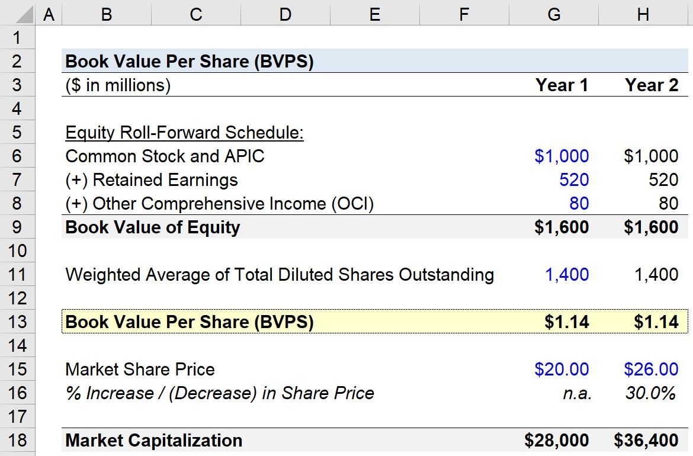

In today's fast-paced financial markets, understanding key financial metrics is essential for evaluating company performance and assessing investment potential. Among these metrics, Book Value and Book Value per Share (BVPS) are particularly significant as they offer insights into a company's intrinsic worth, independent of market fluctuations. Book Value is calculated by subtracting total liabilities from total assets, providing a measure of the net asset value of a company. Mathematically, it is expressed as:

$$
\text{Book Value} = \text{Total Assets} - \text{Total Liabilities}
$$



Book Value per Share, on the other hand, is the book value divided by the number of outstanding shares, providing a per-share assessment of the company's value:

$$
\text{BVPS} = \frac{\text{Book Value}}{\text{Number of Outstanding Shares}}
$$

This article investigates the uses of Book Value and BVPS, particularly in the context of algorithmic trading. Combining traditional financial metrics with advanced trading strategies can enrich decision-making processes and potentially yield better returns. Algorithmic trading, which often emphasizes technical indicators and market data, can benefit greatly from incorporating these fundamental financial metrics. By doing so, traders can more effectively identify stocks that are undervalued or overvalued.

The objective is to integrate traditional financial analysis with modern trading techniques. This approach aims to provide readers with insights on how Book Value and BVPS can influence investment strategies, enabling a more comprehensive evaluation of stock potential. Emphasizing these metrics in algorithmic trading strategies offers a balanced perspective, aligning with both technical and fundamental analyses to improve the robustness of trading decisions.

## Table of Contents

## Understanding Book Value and BVPS

Book Value is a fundamental financial metric that provides an assessment of a company's net asset value. It is calculated by subtracting total liabilities from total assets. This calculation results in a figure that represents what shareholders would theoretically receive if a company were to be liquidated. Mathematically, this can be expressed as:

$$
\text{Book Value} = \text{Total Assets} - \text{Total Liabilities}
$$

Book Value per Share (BVPS) further refines this concept by distributing the Book Value across each outstanding share of the company, offering a per-share valuation of the company’s intrinsic worth. The formula for BVPS is given by:

$$
\text{BVPS} = \frac{\text{Book Value}}{\text{Total Outstanding Shares}}
$$

These metrics are crucial for providing investors with insights into a company's financial stability. They assist in determining whether a stock is overvalued or undervalued relative to its intrinsic value. Unlike market prices, which are influenced by external conditions such as investor sentiments and market dynamics, Book Value and BVPS are rooted in the company's balance sheet, focusing on the asset-to-liability ratio. This clarity helps investors make more informed decisions, particularly when seeking to uncover undervalued stocks or assess the long-term viability of their investments. 

In summary, Book Value and BVPS serve as critical assessment tools for investors wishing to evaluate a company's financial health independent of short-term market [volatility](/wiki/volatility-trading-strategies). By focusing on tangible assets and liabilities, these metrics contribute to a more stable and accurate understanding of a company’s intrinsic worth.

## The Importance of Book Value and BVPS in Financial Analysis

Book Value and Book Value per Share (BVPS) play a crucial role in financial analysis by serving as benchmarks for evaluating financial performance among companies within the same industry. These metrics provide an insight into a company's core financial health by assessing the intrinsic value of its assets relative to its liabilities. 

The utility of Book Value and BVPS is particularly pronounced in asset-heavy industries. In these sectors, substantial tangible resources such as machinery, real estate, and equipment form a significant part of the company's total assets. Metrics like Book Value enable analysts and investors to gauge how effectively a company manages and utilizes its physical assets. Moreover, these metrics offer clarity on a company's debt management by reflecting its ability to cover liabilities with its asset base, crucial for assessing solvency and creditworthiness.

By examining trends in Book Value and BVPS over time, analysts can identify patterns that suggest potential growth or highlight financial risks. For instance, a steadily increasing Book Value might indicate ongoing asset accumulation or effective debt reduction—both promising signs for a company's future prospects. Conversely, a declining trend could signal asset erosion, possibly due to inadequate asset management or increasing liabilities.

While Book Value and BVPS are integral to [fundamental analysis](/wiki/fundamental-analysis), they should not be evaluated in isolation. Market conditions and other financial indicators must be considered to obtain a comprehensive understanding of a company's financial health. Market conditions, such as [interest rate](/wiki/interest-rate-trading-strategies) fluctuations, inflation, and economic cycles, can impact asset valuations and, consequently, the Book Value. Therefore, analysts often integrate these metrics with market-based indicators, such as stock price or earnings per share, to form a well-rounded assessment. This integrated approach helps discern whether the current stock price accurately reflects the company's intrinsic value or if discrepancies point to undervaluation or overvaluation, thereby informing more strategic investment decisions.

## Incorporating Book Value and BVPS into Algorithmic Trading

Algorithmic trading, which predominantly uses technical indicators and statistical models, can benefit from integrating fundamental financial metrics such as Book Value (BV) and Book Value per Share (BVPS). By doing so, traders can obtain a comprehensive view of a stock's potential by combining the quantitative prowess of algorithmic strategies with qualitative insights derived from fundamental analysis. 

Incorporating BV and BVPS into [algorithmic trading](/wiki/algorithmic-trading) algorithms enhances the decision-making process. These metrics provide a foundational assessment of a company's intrinsic value, which can be pivotal when seeking to identify undervalued stocks in the market. This integration allows traders to embed evaluations of book value data into their trading algorithms, which can automatically assess whether a stock is trading at a discount or premium relative to its book value. The calculation of BVPS, defined as:

$$

BVPS = \frac{\text{Total Assets} - \text{Total Liabilities}}{\text{Number of Outstanding Shares}} 
$$

can be incorporated into algorithmic scripts to routinely monitor the valuation dynamics of target stocks.

Utilizing Python, one could script the process of integrating these metrics into a trading algorithm. For illustrative purposes, a simple model might look like this:

```python
import pandas as pd

# Sample data for Book Value and market prices
data = pd.DataFrame({
    'Symbol': ['AAPL', 'MSFT', 'GOOG'],
    'Total_Assets': [500000, 600000, 700000],
    'Total_Liabilities': [100000, 150000, 200000],
    'Outstanding_Shares': [1000, 1200, 1500],
    'Market_Price': [150, 200, 250]
})

# Calculate Book Value Per Share
data['BVPS'] = (data['Total_Assets'] - data['Total_Liabilities']) / data['Outstanding_Shares']

# Apply trading logic for undervaluation
def trading_signal(row):
    if row['Market_Price'] < row['BVPS']:
        return 'Buy'
    else:
        return 'Sell'

data['Signal'] = data.apply(trading_signal, axis=1)

print(data[['Symbol', 'BVPS', 'Market_Price', 'Signal']])
```

In this example, the algorithm evaluates whether the current market price is below the BVPS, signaling a potential buying opportunity if the stock is undervalued.

Integrating BV and BVPS into trading strategies facilitates automated and consistent application of investment criteria, allowing for a robust alignment between technical and fundamental analyses. This multidimensional approach not only enriches the depth of analysis but also enhances the potential for generating superior returns. The automated nature of algorithmic trading ensures that these criteria are applied consistently across investment decisions, reducing reliance on ad-hoc judgments and personal biases. Hence, traders can achieve a more disciplined and data-driven approach to market opportunities.

## Case Studies and Real-world Examples

Several case studies illustrate the effectiveness of integrating Book Value (BV) and Book Value per Share (BVPS) within trading algorithms, enhancing trading performance across multiple sectors. These expenditures in advanced algorithmic trading strategies leverage the stability and reliability offered by fundamental financial metrics.

In various industries, algorithms that incorporate BV and BVPS have consistently outperformed those reliant solely on technical indicators. For instance, an empirical study in the consumer goods sector demonstrated that algorithms enhanced with BV and BVPS metrics yielded better long-term returns compared to traditional, technically driven strategies. By focusing on companies with robust financial health, as evidenced by strong book values, these algorithms were more adept at identifying stocks with intrinsic value, minimizing exposure to overvalued selections influenced by temporary market trends.

Particularly during periods of market volatility, such as the consistent fluctuations observed in the technology sector, these metrics have proven invaluable. By utilizing book valuations, traders have successfully identified undervalued stocks, allowing them to capitalize on opportunities during market corrections. A notable example involved a technology firm whose market price was adversely affected by short-term speculation; however, its strong book value indicated underlying worth, leading to significant gains once market corrections occurred.

However, the practical application of BV and BVPS does require careful consideration within broader analysis frameworks to fully harness their potential. While these metrics provide a solid foundation for evaluating tangible assets, they may not always accurately reflect the value of companies concentrated in global intangible assets, such as brands and intellectual property. This is especially pertinent in industries like technology and pharmaceuticals, where intangible assets dominate balance sheets.

Therefore, while integrating BV and BVPS within algorithmic trading can indeed refine trading strategies and outcomes, it is crucial to supplement them with comprehensive analysis. This ensures a well-rounded understanding of a company's worth, beyond just its book value, thus allowing for better-informed investment decisions.

## Conclusion

Integrating Book Value and Book Value per Share (BVPS) into trading strategies offers a robust framework for analyzing a stock's intrinsic worth. These metrics provide a foundation for assessing whether a stock is potentially undervalued or overvalued, enhancing the sophistication of algorithmic trading. However, while they add significant value to trading strategies by grounding them in fundamental financial analysis, they must be part of a holistic approach to risk management.

Relying solely on Book Value and BVPS in trading algorithms might overlook other critical factors influencing stock performance, such as market sentiment and macroeconomic indicators. Traders should complement these metrics with other quantitative and qualitative tools, such as technical indicators, sentiment analysis, and economic forecasts, to develop well-rounded strategies. This multidimensional approach enables traders to adapt to the dynamic nature of global financial markets and exploit emerging trends effectively.

Achieving long-term financial goals also requires constructing diversified portfolios. A thorough understanding of Book Value and BVPS aids in selecting stocks with strong fundamental characteristics, thereby minimizing investment risks and enhancing potential returns. A balanced investment strategy that integrates Book Value and BVPS with broader market insights is more likely to withstand market volatility and achieve sustainable growth.

## References & Further Reading

References include fundamental texts such as "Investment Valuation" by Aswath Damodaran and "Financial Statement Analysis and Security Valuation" by Stephen Penman. These works provide a comprehensive understanding of valuation techniques and emphasize the role of Book Value and BVPS in assessing company worth. 

Damodaran's "Investment Valuation" is essential for understanding broad valuation frameworks, with insights on applying Book Value and BVPS to evaluate stock potential. Similarly, Penman's text dives deep into the interpretation of financial statements and offers a nuanced view of security valuation, using Book Value as a cornerstone metric.

Research articles and case studies further illustrate how these financial metrics are applied in real-world trading scenarios, especially within algorithmic trading. A significant body of research showcases the effectiveness of algorithms integrating Book Value and BVPS, often demonstrating superior performance to purely technical systems. For instance, analysis on algorithms operating in volatile market conditions, such as those seen in the technology sector, highlights how recognizing undervalued stocks through book valuations aided in capitalizing on corrections.

Practitioners interested in expanding their application of these concepts can explore a variety of resources available both online and in academic journals. The Journal of Financial Economics and the Review of Financial Studies often publish studies focusing on practical methodologies for integrating fundamental analysis into algorithmic trading models. These readings are beneficial for traders aiming to adopt a data-driven approach while fully leveraging Book Value and BVPS.

For those looking to implement these ideas into trading software or [backtesting](/wiki/backtesting) platforms, practical guides and tutorials, often using Python, are invaluable. Resources like QuantConnect and the open-source [backtrader](/wiki/backtrader) framework provide hands-on experience in coding algorithms that incorporate fundamental financial metrics.

By engaging with these texts, articles, and resources, readers can deepen their understanding of how Book Value and BVPS can be effectively melded with algorithmic trading strategies to achieve a more robust investment approach.

