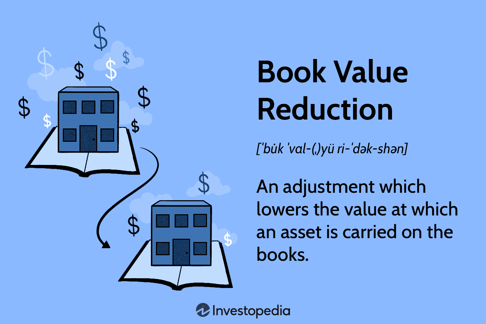

In the rapidly evolving financial landscape, mastering complex concepts and translating them into actionable strategies is crucial for success. This article examines the intricacies of financial accounting asset valuation, with a particular emphasis on book value reduction and its effects on algorithmic trading. Understanding these concepts allows investors, traders, and financial analysts to improve their decision-making processes significantly.

The article begins by exploring the foundational elements of financial accounting asset valuation. This critical practice determines the worth of an asset on a company's balance sheet, providing a snapshot of the organization's financial health. A key component of this is the book value, which is calculated as the cost of an asset minus depreciation. Regular valuation and reporting ensure the accurate reflection of a company's assets. A sound understanding of these principles underpins accurate financial reporting and asset management.



One aspect of asset valuation that warrants particular attention is book value reduction. Changes in market conditions or asset status can lead to a reduced asset value recorded on financial statements as an expense. This concept is crucial as it impacts both the net income reported by a company and its overall financial outlook. Through selected case studies and practical examples, we will illustrate scenarios that necessitate a reduction in book value.

The interaction between book value reduction and algorithmic trading opens up new avenues for market participants. Algorithmic trading uses sophisticated computer algorithms to execute trades automatically based on pre-defined criteria. By incorporating book value insights into algorithmic trading strategies, traders can identify market inefficiencies and pricing anomalies. This integration supports the development of advanced trading systems capable of enhancing profitability and minimizing risk.

To deepen this exploration, the article will highlight the tools and software available for financial analysis and trading. Various platforms offer real-time data and analytical capabilities, enabling the seamless integration of book value metrics into trading systems. We will discuss popular financial databases, such as Bloomberg Terminal and Thomson Reuters Eikon, alongside API resources for real-time data access. Additionally, practical examples will demonstrate how to use programming languages like Python to leverage these data sources effectively.

In conclusion, the convergence of book value accounting and algorithmic trading presents significant opportunities for traders and analysts aiming to gain a competitive edge. By marrying traditional financial measures with cutting-edge trading technologies, market participants are well-positioned to develop sophisticated, risk-assessed investment strategies. Embracing these concepts promises to drive innovation and growth within the financial markets, and emerging trends such as machine learning may further revolutionize these strategies.

## Table of Contents

## Understanding Financial Accounting Asset Valuation

Asset valuation is a fundamental component of financial accounting, central to determining the recorded worth of an asset on an organization's balance sheet. The valuation process influences financial reporting, offering stakeholders insights into a company's financial health and resources.

### Book Value

Book value is one of the simplest measures of an asset's value and provides a baseline for asset valuation. It is determined by taking the original cost of an asset and subtracting accumulated depreciation, amortization, or impairment costs. Mathematically, it can be represented as:

$$
\text{Book Value} = \text{Cost of Asset} - (\text{Accumulated Depreciation} + \text{Impairment})
$$

This measure assists in assessing the net value of a company’s total assets minus its liabilities and is a common metric used by investors to gauge a company’s intrinsic worth. Regular assessment ensures that asset values on the balance sheet reflect economic reality, providing a more accurate portrayal of a company's holdings.

### Regular Assessment and Recording

Continuous assessment and recording of asset values are crucial. This involves examining the useful life, residual value, and depreciation method for tangible assets, as well as amortization schedules for intangible assets. Changes in these factors necessitate adjustments to book values to mirror actual market conditions and business use. Such practices enable businesses to maintain transparency and accuracy in financial reporting.

### Accounting Principles Guiding Book Value Estimation

The estimation of book value in financial accounting is governed by several key principles, including:

1. **Cost Principle**: Assets are initially recorded at their acquisition cost. Book value recognizes this cost, adjusted over time through depreciation or amortization.

2. **Matching Principle**: This principle requires that expenses related to an asset be recorded in the same period as the revenues they help generate, supporting proper depreciation calculations.

3. **Conservatism Principle**: This involves recognizing potential losses and impairments as soon as they are foreseeable, which can necessitate reductions in book value before such value increases.

### Implications for Financial Reporting

Asset valuation significantly affects financial reporting. Accurate book valuations directly influence balance sheets, affecting insights into company solvency and managerial effectiveness. They also impact key financial ratios such as return on assets (ROA) and debt-to-equity ratios, which investors and analysts use in decision-making.

Consistent and accurate reporting builds trust with stakeholders and complies with accounting standards such as IFRS and GAAP. These standards ensure comparability and reliability of financial statements across different firms and time periods.

In conclusion, understanding the nuances of asset valuation in financial accounting through the lens of book value is essential for precise financial analysis and reporting. This foundational knowledge informs better decision-making and strategic planning within business and investment domains.

## What is Book Value Reduction?

Book value reduction is an essential concept in financial accounting, occurring when the value an asset holds on a company's balance sheet is decreased due to market conditions or intrinsic changes in the asset. This reduction must be recorded as an expense, which directly impacts the company's net income as displayed on the income statement. Book value reduction is primarily indicative of an impairment or a write-down of the asset's value in the company's [books](/wiki/algo-trading-books), often executed to ensure the financial statements reflect a more accurate depiction of the asset's current worth.

### Understanding the Process

When an asset's fair market value falls below its current book value, an impairment is recorded. This process involves several accounting steps:

1. **Assessment of Fair Value**: Regularly, companies must evaluate the fair market value of their assets. If this value has decreased substantially compared to the asset's book value, an impairment is deemed necessary.

2. **Measurement of Impairment Loss**: The impairment loss is calculated as the difference between the asset's book value and its recoverable amount, which is the higher of its fair value less costs of disposal or its value in use. 

   \[ \text{Impairment Loss} = \text{Book Value} - \max(\text{Fair Value} - \text{Disposal Costs}, \text{Value in Use})
$$

3. **Recording the Reduction**: This loss is recorded on the income statement, reducing the net income for that period. Consequently, the asset's book value on the balance sheet is adjusted downward.

### Accounting Scenarios for Book Value Reduction

Several scenarios warrant a reduction in book value:

- **Market Downturns**: Economic factors might lead to a decrease in asset values, such as a drop in real estate markets affecting property holdings.
- **Technological Obsolescence**: Rapid technological advancements can render certain tangible assets, like machinery or IT equipment, obsolete, prompting a write-down.
- **Legal and Regulatory Changes**: New laws or regulations can impair the utility or legality of certain assets, necessitating value adjustments.
- **Operational Shifts**: Changes in a company's operational focus or strategy can result in the need to reduce book values, particularly for assets not aligned with the new direction.

### Practical Applications and Case Studies

In practice, book value reductions have significant implications for businesses. For instance, during the 2008 financial crisis, many banks had to write down the value of mortgage-backed securities they held, drastically affecting their balance sheets and income statements. Similarly, the rise of digital photography forced traditional film producers to write down the value of production facilities and equipment.

### Conclusion

Through regular assessment and strategic management of book value reductions, companies can ensure their financial statements accurately reflect the economic realities and potential future benefits associated with their assets. Understanding these dynamics allows firms to maintain transparency in financial reporting and make informed decisions regarding asset management and investment.

## The Intersection of Book Value Reduction and Algo Trading

Algorithmic trading, commonly known as algo trading, involves using automated computer algorithms to execute trades based on pre-defined criteria. These algorithms can process vast amounts of data with speed and precision, allowing traders to capitalize on small price movements and perform trades at optimal times. One emerging aspect of algo trading involves the integration of book value analyses, which presents a sophisticated method for identifying market inefficiencies and mispricing opportunities.

Book value, a fundamental measure in financial accounting, represents the net asset value of a company by taking into account the initial cost of an asset and subtracting any accumulated depreciation or impairment. By incorporating book value metrics into algorithm-driven strategies, traders can identify stocks that may be undervalued or overvalued relative to their intrinsic worth.

### Methods to Incorporate Book Value Metrics

One approach to incorporate book value in [algorithmic trading](/wiki/algorithmic-trading) strategies involves screening for stocks with a price-to-book (P/B) ratio that deviates significantly from a historical norm or industry average. A low P/B ratio might indicate a possible undervaluation, making the stock a potential candidate for a buy order. Conversely, a high P/B ratio could suggest overvaluation, signaling an opportunity to sell or short the stock.

**Python Example:**

Using Python, one can employ libraries such as Pandas and NumPy to calculate the P/B ratio and make buy/sell decisions:

```python
import pandas as pd
import numpy as np

# Sample DataFrame with stock data
data = pd.DataFrame({
    'ticker': ['AAPL', 'MSFT', 'GOOG'],
    'current_price': [150, 280, 2700],
    'book_value': [30, 45, 1000]
})

# Calculate the P/B ratio
data['P/B'] = data['current_price'] / data['book_value']

# Define thresholds for trading decisions
buy_threshold = 1.0
sell_threshold = 3.0

# Decision rules
data['action'] = np.where(data['P/B'] < buy_threshold, 'buy', 
                          np.where(data['P/B'] > sell_threshold, 'sell', 'hold'))

print(data)
```

### Enhancing Profitability and Risk Reduction

Incorporating book value-based strategies in algo trading can enhance profitability by focusing on stocks that are mispriced relative to their intrinsic value. By setting up algorithms to trigger trades when specific book value conditions are met, traders can execute profitable trades efficiently and with reduced latency.

Moreover, this approach aids in risk reduction as it relies on a fundamental valuation metric, providing a buffer against market [volatility](/wiki/volatility-trading-strategies). Instead of reacting solely to price trends, such strategies ground decision-making in robust financial analysis, adding a layer of confidence in trade execution.

Additionally, in scenarios of book value reduction, where an asset's carrying amount on the books decreases due to impairment, algo trading systems can be programmed to re-evaluate positions. This is critical for adjusting portfolios in response to new financial realities, such as recognizing loss potential and realigning investment strategies accordingly.

The synergy between book value assessment and algorithmic trading not only provides a pathway to capitalize on valuation discrepancies but also promises a disciplined approach to market engagement—balancing analytical rigor and technical execution.

## Tools and Software for Financial Analysis and Trading

Numerous platforms are pivotal for financial analysis and trading, offering real-time data and analytical capabilities essential for integrating book value insights into trading systems. Among these platforms, the Bloomberg Terminal and Thomson Reuters Eikon are renowned for their comprehensive data-driven decision-making capabilities. Both provide users with a vast array of data, analytics, news, and tools necessary to remain competitive and informed in fast-paced markets.

**Bloomberg Terminal and Thomson Reuters Eikon**

The Bloomberg Terminal is a sophisticated platform that supplies financial data, news, analytics, and advanced trading tools. It enables investors and traders to monitor asset valuation changes in real time, making it easier to identify market trends and opportunities based on book value insights. Similarly, Thomson Reuters Eikon offers a robust toolkit for financial professionals, featuring analytics, trading, and risk management solutions. Both platforms support algorithmic trading efforts by offering APIs (Application Programming Interfaces) that facilitate the integration of book value and other financial metrics into trading algorithms.

**APIs for Accessing Financial Data**

Developers and algorithmic traders can access a wide array of financial data via APIs provided by platforms such as Yahoo Finance and Google Finance. These APIs deliver historical book values and other essential financial data, which are crucial for building and enhancing algorithmic trading strategies. For example, the Alpha Vantage API offers services for obtaining time series data, including historical stock prices, which can aid in calculating past and current book valuations.

**Integrating Data with Programming Languages**

Python, a preferred language for financial data integration due to its simplicity and extensive libraries, can be utilized effectively to integrate these data sources. For instance, the following Python code snippet employs the `pandas_datareader` library to retrieve historical data from Yahoo Finance:

```python
import pandas_datareader as pdr
import datetime

start = datetime.datetime(2020, 1, 1)
end = datetime.datetime(2023, 1, 1)
data = pdr.get_data_yahoo('AAPL', start=start, end=end)

print(data['Book Value'])
```

In this example, historical book values for Apple Inc. (AAPL) are acquired for a defined date range. This data helps traders analyze trends over time, integrating these insights into their algorithmic models.

Thus, leveraging platforms like Bloomberg Terminal and Thomson Reuters Eikon, combined with robust APIs and programming tools, enables financial professionals to capitalize on book value insights, enhancing the sophistication and precision of trading strategies.

## Conclusion

The convergence of book value accounting and algorithmic trading signifies a promising avenue for traders and financial analysts. By fusing traditional financial metrics with advanced trading technologies, participants are equipped with tools to secure a competitive edge in the financial markets. This synthesis facilitates the development of risk-assessed investment strategies by allowing a thorough analysis of book value in conjunction with other crucial financial metrics.

Book value, representing a company's net asset worth, serves as a fundamental indicator of intrinsic valuation. Integrating this measure with algorithmic trading can optimize strategies to exploit market inefficiencies and identify mispriced assets. The ability to systematically incorporate these insights elevates the potential for enhanced profitability and minimized risk exposure.

The future prospects of algo trading are further invigorated by advancements in [machine learning](/wiki/machine-learning). Machine learning algorithms can unveil patterns and correlations in financial data that are imperceptible to conventional models. By leveraging these technologies, traders can refine the implementation of book value insights, augmenting the precision and adaptability of strategy execution in dynamic market environments.

This integration not only signifies an advancement in financial analytics but also opens doors to vast opportunities within financial markets. As the interplay between book value accounting and algorithmic trading continues to evolve, embracing these methodologies promises substantial benefits and innovations, further pushing the boundaries of what is achievable in financial analysis and trading.

## References & Further Reading

[1]: ["Financial Accounting: Tools for Business Decision Making"](https://www.wiley.com/en-us/Financial+Accounting%3A+Tools+for+Business+Decision+Making%2C+10th+Edition-p-9781394184910) by Paul D. Kimmel, Jerry J. Weygandt, and Donald E. Kieso

[2]: ["Algorithmic Trading and DMA: An introduction to direct access trading strategies"](https://www.amazon.com/Algorithmic-Trading-DMA-introduction-strategies/dp/0956399207) by Barry Johnson

[3]: ["The Essentials of Machine Learning in Finance and Accounting"](https://www.taylorfrancis.com/books/edit/10.4324/9781003037903/essentials-machine-learning-finance-accounting-mohammad-zoynul-abedin-kabir-hassan-petr-hajek-mohammed-mohi-uddin) by Isaac Gottlieb

[4]: ["Financial Analysis with Microsoft Excel"](https://faculty.cengage.com/titles/9780357442050) by Timothy R. Mayes and Todd M. Shank

[5]: ["Python for Finance: Mastering Data-Driven Finance"](https://www.amazon.com/Python-Finance-Mastering-Data-Driven/dp/1492024333) by Yves Hilpisch